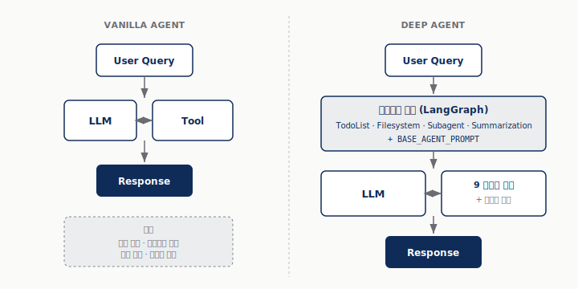
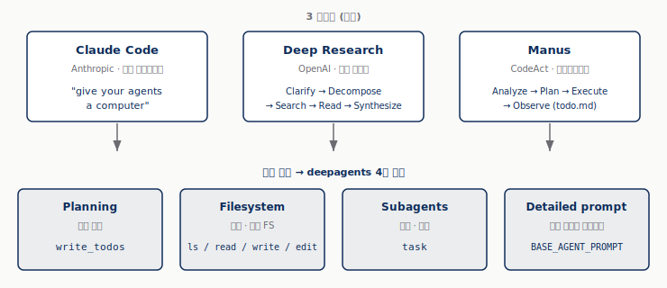
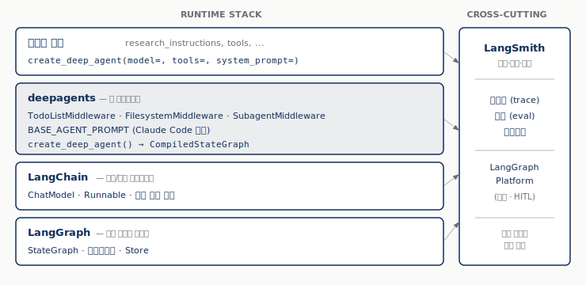
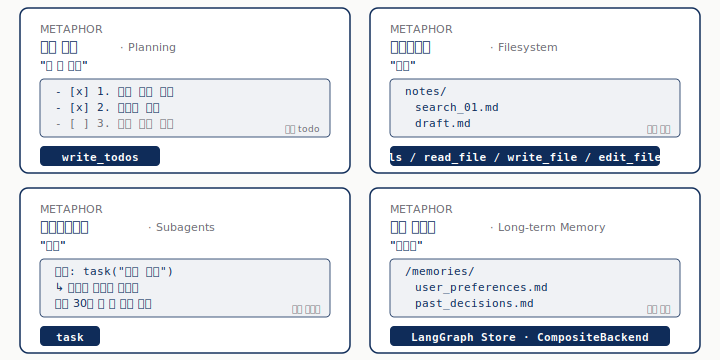
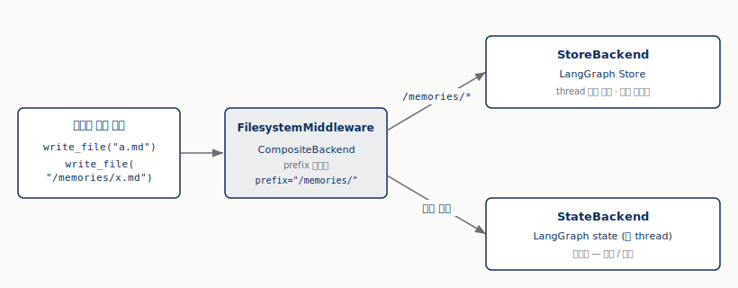
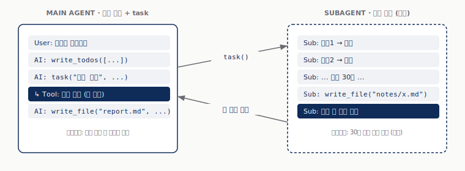
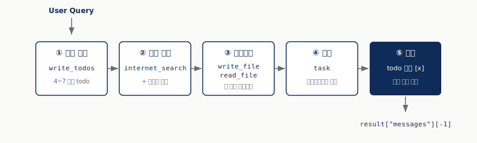
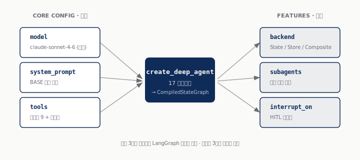
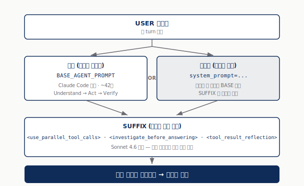

### §0. 들머리 — 이 글이 무엇을 다루나

이 글은 Deep Agents 라이브러리에 대한 **공통 지도** 한 장을 그리는 게 목표다.

지도 위에 표시할 정보는 셋이다.

1. **왜** 이 라이브러리가 따로 만들어졌나 — 단순 LLM 에이전트로 안 풀리던 문제는 무엇이었나
2. **무엇이** 들어 있나 — 4대 내장 능력과 그 도구 이름, 다섯 줄 Quickstart, 청사진(다이얼)
3. **언제** 쓰나 — `create_agent` / 직접 짠 LangGraph 워크플로 / `create_deep_agent` 결정 기준

이 글은 **지도** 만 그린다. 컨텍스트·메모리·스킬, 백엔드·샌드박스·권한, 미들웨어 깊이, HITL 패턴 같은 깊이는 별도 글로 양보한다.

이 글의 한 줄 요약:

> **Deep Agent 는 LangGraph 위에 *계획 수립 · 파일시스템 · 서브에이전트 · 장기 메모리* 4대 능력을 미들웨어로 내장한 라이브러리다. `create_deep_agent()` 한 호출로 시작하고, *Model · System Prompt · Tools* 세 다이얼로 자기 도메인에 맞춘다.**

---

### §1. 왜 Deep Agent 인가

#### §1.1. Vanilla LLM 에이전트의 한계

**한 줄**: 「LLM 한 번 + 도구 몇 개 + while 루프」 패턴은 짧은 작업에는 잘 동작하지만, 단계가 많아지면 무너진다.

LangChain `create_agent` 로 만들어 본 에이전트를 떠올려보자. 도구 호출이 가능한 모델, 도구 리스트, 시스템 프롬프트 한 장 — 이 셋만 묶으면 동작한다. 짧은 질의응답이나 함수 호출 한두 번이 끝인 작업에는 충분히 강력하다.

문제는 **작업이 길어질 때** 시작된다. Anthropic 의 엔지니어링 글은 에이전트가 "사람처럼" 일하게 하려면 다음 네 단계 루프가 반복돼야 한다고 정리한다 — **gather context → take action → verify work → repeat**[^2]. 이 루프를 단순 ReAct 한 줄로 돌리면 세 가지 지점에서 깨진다 (표.1).

**표.1**: Vanilla 에이전트가 깨지는 세 지점

| 깨지는 지점 | 무엇이 일어나는가 |
|---|---|
| 컨텍스트 오버플로 | 검색 결과·문서·대화 이력이 누적돼 모델 컨텍스트 윈도우를 잡아먹는다. 30회 검색 이후엔 시스템 프롬프트마저 잘려 나간다. |
| 계획의 부재 | 모델이 "다음 단계" 를 매 턴 즉흥으로 결정. 중간에 길을 잃거나 같은 검색을 반복한다. |
| 위임 불가 | 한 모델 인스턴스가 모든 컨텍스트를 들고 있으니, 무거운 하위 작업이 메인 흐름을 오염시킨다. |

**그림.1**: Vanilla 에이전트 vs Deep Agent — 같은 입력에 대한 두 흐름



[그림.1] 좌측은 LangChain `create_agent` 로 만든 단순 에이전트의 흐름이다. User → LLM ↔ Tool 의 한 루프가 응답을 만든다. 단계가 다섯 개 정도까지는 잘 동작하지만, 그 이상 누적되면 표.1 의 세 지점이 한꺼번에 무너진다. 우측은 `create_deep_agent` 의 흐름이다. LLM 호출 사이에 **미들웨어 체인** 한 켜가 들어가서, 매 turn 마다 (1) 계획을 갱신하고, (2) 큰 결과를 가상 파일시스템에 오프로드하고, (3) 무거운 하위 작업은 서브에이전트로 위임한다. 모델이 사용하는 도구 풀도 **빌트인 9종 + 사용자 도구** 로 두꺼워진다. 결과적으로 단계 50개를 넘는 작업도 컨텍스트를 깔끔하게 유지하며 진행할 수 있다.

Vanilla 패턴은 **컨텍스트를 외부화** 할 곳도, **계획을 명시화** 할 자리도, **컨텍스트를 격리** 할 경계도 없다. 단계 5개까지는 견디지만 50개에서는 무너진다. 이 한계를 직접 만난 세 시스템 — Claude Code, OpenAI Deep Research, Manus — 가 각자의 방식으로 같은 대답을 발견했다는 사실이 deepagents 의 출발점이다.[^1]

#### §1.2. 문제를 해결한 3가지 사례

**한 줄**: 폐쇄 시스템 셋이 같은 패턴으로 수렴했다 — 계획 파일, 가상 파일시스템, 서브에이전트.

##### Claude Code (Anthropic)

Anthropic 은 자사 코드 어시스턴트의 설계 원리를 한 문장으로 압축한다 — *"에이전트에 컴퓨터를 쥐여 주어, 사람이 일하듯 일하게 하라"*[^2] 사람이 컴퓨터에서 일할 때 쓰는 도구 카테고리를 그대로 모델에 준다는 발상이다. **파일시스템(filesystem)**, **에이전틱 검색(agentic search)**, **시맨틱 검색(semantic search)**, **서브에이전트(subagents)**, **컴팩션(compaction)**, **셸·스크립트(bash & scripts)**, **코드 생성(code generation)**, **MCP** [^2]. 이 중 파일시스템·서브에이전트·컴팩션은 deepagents 의 4대 능력 중 셋과 그대로 겹친다.

##### OpenAI Deep Research

OpenAI 의 자율 리서치 에이전트는 **5단계 프로세스** 로 한 질의를 처리한다 — Clarification → Decomposition → Iterative Search → Multi-format Reading → Synthesis with Citations[^3]. 핵심은 두 번째와 세 번째: 큰 질문을 작은 작업으로 **분해(decomposition)** 하고, 각 작업을 ReAct 루프(Plan → Act → Observe)로 돌린다. 한 작업당 평균 30\~60회 검색, 120\~150 페이지 읽기, 추론 150\~200 iteration[^3]. 이 규모에서는 컨텍스트 외부화와 계획 명시화 없이 동작 자체가 불가능하다.

##### Manus

Manus 는 Claude 3.5/3.7 + 파인튜닝된 Qwen 위에 만들어진 자율 에이전트로, **CodeAct** 패러다임을 쓴다 — 도구 호출 대신 모델이 짧은 Python 스크립트를 생성하면 샌드박스가 실행한다[^4]. 루프는 **Analyze → Plan/Select → Execute → Observe**, 진행 상황은 가상 파일시스템 안의 `todo.md` 에 기록된다[^4]. 웹 브라우징·코딩·데이터 분석은 각각 격리된 서브에이전트가 맡고, 메인 에이전트는 이벤트 스트림으로 결과만 받는다[^4]. **계획 파일 + 가상 파일시스템 + 서브에이전트** — Claude Code 와 같은 세 축이다.

> **세 시스템의 공통 분모** (Harrison Chase 의 정리)[^1]:  
> *"Deep agent 란 **계획(planning)** 을 수행하고, **서브에이전트(sub agents)** 를 사용하며, **파일시스템(file system)** 에 접근할 수 있고, **잘 다듬어진 프롬프트(detailed prompt)** 를 가진 에이전트다."*

**그림.2**: 세 시스템이 같은 디자인 축으로 수렴



[그림.2] 상단의 세 시스템은 출시 주체도 다르고(Anthropic / OpenAI / Manus 팀), 노출 방식도 다르고(코드 어시스턴트 / 자율 리서치 / 자율 에이전트), 구현 디테일도 다르다. 그러나 **무엇이 들어 있는가** 를 한 발짝 떨어져서 보면 같은 네 가지로 수렴한다 — 계획을 명시 기록하는 자리(Planning), 큰 컨텍스트를 빼두는 자리(Filesystem), 무거운 하위 작업을 격리해 위임하는 자리(Subagents), 그리고 이 모든 것을 모델이 "사용하게" 만드는 한 장의 잘 짜인 시스템 프롬프트(Detailed prompt). Harrison Chase 의 출시 발표[^1]는 이 네 축을 라이브러리화한 것이 deepagents 라고 못박는다.

#### §1.3. 패턴의 일반화 — 라이브러리화

**한 줄**: 네 축(계획·파일시스템·서브에이전트·디테일한 프롬프트)을 LangGraph 위에 미들웨어로 박아 라이브러리로 묶은 것이 deepagents 다.

Harrison Chase 가 LangChain Blog 에 올린 출시 발표[^1]는 영감의 출처를 명시한다 — Claude Code 가 1차 영감, Deep Research 와 Manus 가 추가 검증. 핵심 결정은 두 가지다.

1. **새 프레임워크가 아니라 라이브러리** 로. LangGraph 를 그대로 깔고 그 위에 미들웨어 한 켜를 올린다 — `create_deep_agent()` 의 반환 타입은 `CompiledStateGraph` 다[^5]. 즉 지금 쓰는 LangGraph 도구·관측성·배포 인프라가 그대로 쓰인다.
2. **선택을 강요하지 않는다**. 4대 능력은 모두 미들웨어 형태로 들어 있어 켜고 끌 수 있다 — to-do list 미들웨어, Filesystem 미들웨어, Subagent 미들웨어 등이 LangChain core 의 prebuilt middleware 카탈로그(16종) 안에 함께 정리돼 있다[^6].

**스택 위치** 를 한 그림으로 본다.

**그림.3**: deepagents 의 스택 위치



[그림.3] 가장 아래에는 LangGraph 가 있다 — `StateGraph`, 체크포인터(thread 상태 영속), Store(thread 횡단 영속) 같은 그래프 실행·상태 관리 인프라를 제공한다. 그 위에 LangChain 이 올라가 ChatModel · Runnable · 도구 호출 표준을 통일한다. **deepagents 는 그 위 한 켜** 다 — 4대 능력을 미들웨어 형태로 박아 넣고 BASE_AGENT_PROMPT 한 장을 합성한다. `create_deep_agent()` 가 반환하는 것이 그냥 LangGraph 의 `CompiledStateGraph` 라는 점이 결정적이다[^5] — 즉, 지금 LangGraph 로 이미 돌리고 있는 관측(LangSmith)·배포(LangGraph Platform)·체크포인터·Store 가 그대로 쓰인다. 사용자는 가장 위 칸에서 `model=`, `tools=`, `system_prompt=` 같은 인자만 채우면 된다. 이 그림이 나머지 모든 절의 좌표가 된다.

---

### §2. 4가지 내장 능력

**§2 한 줄**: 비서에게 「할 일 목록·노트·인턴·일기장」 을 쥐여 준다 — Planning · Filesystem · Subagents · Long-term Memory.

**그림.4**: 4대 내장 능력의 비유 — Deep Agent 는 잘 갖춰진 비서



[그림.4] 4대 능력을 일상 비유로 옮기면 이해가 빠르다. **계획 수립(Planning)** 은 비서의 "할 일 목록" 이다 — 큰 작업을 시작 전에 4\~7개 항목으로 쪼개 적어두고, 한 항목씩 끝낼 때마다 체크 표시를 한다. **파일시스템(Filesystem)** 은 비서의 "노트" 다 — 책상에 항상 들고 있을 수 없는 큰 자료는 노트에 적어 서랍에 넣어 두고, 필요할 때만 꺼내 본다. **서브에이전트(Subagents)** 는 "인턴" 이다 — 무거운 하위 작업은 인턴에게 통째로 맡기고, 본인은 인턴이 들고 온 한 단락 짜리 요약만 받는다. **장기 메모리(Long-term Memory)** 는 "일기장" 이다 — 매일의 책상은 비우지만, 일기장은 1년 뒤에도 남아 다음 해의 결정을 돕는다. 각 능력은 독립된 미들웨어로 구현돼 있어 켜고 끄거나 다른 패턴으로 갈아 끼울 수 있다[^6].

원문 01-overview 가 `핵심 기능` 절에서 짧게 짚고 넘어가는 4가지를 한 절씩 푼다. 각 능력의 **도구 이름** 은 `create_deep_agent` 의 빌트인 도구 리스트에서 가져온다 — `write_todos`, `ls`, `read_file`, `write_file`, `edit_file`, `glob`, `grep`, `execute`, `task`[^5].

#### §2.1. Planning — `write_todos`

**한 줄**: 모델이 "다음 단계" 를 즉흥으로 정하는 대신, 자기 계획을 파일로 적어놓고 그 파일을 보며 일한다.

내장 `write_todos` 도구는 **TodoListMiddleware** 가 제공한다[^6]. 모델이 작업 시작 시 할 일을 4\~7개 항목으로 쪼개어 todo 리스트로 기록하고, 한 항목을 끝낼 때마다 `[x]` 표시를 붙이며 진행 상황을 추적한다. 항목이 부족해 보이면 추가, 더 이상 의미 없으면 삭제 — 계획 자체를 살아 있는 문서로 다룬다.

이 발상의 뿌리는 두 곳이다.

- Claude Code 의 BASE_AGENT_PROMPT 안에 명시된 **Understand → Act → Verify** 3단 워크플로[^7] — 행동 전에 이해하고, 행동 후 검증한다.
- Manus 의 `todo.md` 패턴[^4] — 진행 상황을 파일로 외부화하면 모델이 컨텍스트 윈도우를 다 쓰고 다음 턴으로 넘어가도 계획이 살아남는다.

`write_todos` 가 만들어내는 출력은 보통 다음 모양이다 (실행 중 캡처 예시):

```text
- [x] 1. langgraph 의 핵심 추상 4가지 정의
- [x] 2. 각 추상이 LangChain 과 어떻게 다른지 정리
- [ ] 3. 코드 예제로 StateGraph + Send 패턴 시연
- [ ] 4. 보고서 초안 작성
```

이 한 장이 `agent.invoke()` 가 "백그라운드에서 일하는 동안" 의 진행 추적기 역할을 한다 — §3.4 에서 다시 본다.

**한 가지 흥미로운 사실** — `write_todos` 는 시스템에 어떤 물리적 변화도 일으키지 않는 **no-op 도구**다. Harrison Chase 의 출시 발표[^1]에 직접 언급된다:

> "Claude Code 는 Todo list 도구를 쓴다. 재미있는 사실 — 이 도구는 사실상 아무것도 하지 않는다! 거의 no-op 이다."

진짜로 어딘가에 todo list 가 저장되고 추적되는 게 아니라, 모델이 "할 일을 한 번 적어두는 행위" 자체가 컨텍스트에 계획을 남겨 다음 turn 의 모델이 자기 계획을 잊지 않게 만드는 **컨텍스트 엔지니어링 트릭**이다. 도구가 하는 일은 모델이 적은 todo 텍스트를 그대로 state 의 `todos` 슬롯에 박아두는 것뿐 — 그래도 효과가 큰 이유는, 다음 turn 의 시스템 프롬프트에 그 todo 가 다시 들어가 모델이 자기 계획을 매 turn 마주하기 때문이다.

#### §2.2. Filesystem — `ls` / `read_file` / `write_file` / `edit_file`

**한 줄**: 큰 검색 결과·중간 산출물을 모델 컨텍스트에서 빼서 가상 파일시스템에 적어두고, 필요할 때 읽는다.

`FilesystemMiddleware`[^6] 가 네 개의 핵심 도구를 추가한다 (표.2).

**표.2**: Filesystem 미들웨어가 추가하는 4개 도구

| 도구 | 역할 |
|---|---|
| `ls()` | 가상 파일시스템의 파일 일람 |
| `read_file(path, offset, limit)` | 큰 파일을 페이지 단위로 읽기 |
| `write_file(path, content)` | 새 파일 작성 |
| `edit_file(path, old_str, new_str)` | 부분 치환 (줄 단위 정확 매칭) |

여기에 `glob`, `grep` 같은 검색 도구도 함께 노출된다[^5].

이 가상 파일시스템은 **Backend** 라는 추상으로 한 단 더 깊어진다 — `StateBackend`(LangGraph state 안에 임시 보관, 기본값) / `StoreBackend`(LangGraph Store 에 영구 보관) / `CompositeBackend`(prefix 별로 다른 backend 로 라우팅, 예: `/memories/` 는 Store, 나머지는 State)[^6]. 이 한 줄이 §2.4 장기 메모리와 자연스럽게 이어진다.

**그림.5**: Filesystem Backend 라우팅 — 같은 도구, 다른 저장소



[그림.5] 모델은 `write_file` 한 도구만 알지만, 그 호출이 실제 어디에 저장되는지는 **경로(prefix)** 가 결정한다. `CompositeBackend` 가 `/memories/` 로 시작하는 경로는 `StoreBackend` (LangGraph Store, thread 횡단 영구) 로, 그 외 경로는 `StateBackend` (LangGraph state, 한 thread 안에서만) 로 라우팅한다. 단기 메모와 장기 메모가 같은 도구로 다뤄진다는 것이 이 디자인의 핵심이다 — 모델 입장에서 추상이 일관된다는 뜻이고, 미들웨어 한 켜를 갈아 끼우면 저장소 정책이 통째로 바뀐다는 뜻이기도 하다.

**왜 이게 컨텍스트 관리인가** — 검색 결과를 그대로 모델에 다 박으면 한 턴에 5\~10K 토큰이 먹힌다. 검색 결과를 `write_file("results/search_01.md", ...)` 로 빼두고, 본문에는 "결과는 search_01.md 에 저장됨" 한 줄만 남기면 모델 컨텍스트는 간결하게 유지되고, 다음 턴에 필요한 부분만 `read_file` 로 끌어올 수 있다. 이게 Anthropic 이 말한 **compaction** 의 LangGraph 버전이다[^2].

#### §2.3. Subagents — `task`

**한 줄**: 무거운 하위 작업은 격리된 서브에이전트에 위임 — 메인 컨텍스트가 깨끗해진다.

`SubagentMiddleware`[^6] 가 `task` 도구 하나를 더한다. 메인 에이전트는 `task` 를 호출해 하위 작업을 띄울 수 있고, 디폴트로 **"general-purpose"** 라는 범용 서브에이전트가 항상 존재한다[^6]. 이 디폴트 서브에이전트는 **메인 에이전트와 동일한 도구 풀**을 가진 단순 복제다 — 실질적으로 "메인의 똑같은 카피본인데 컨텍스트만 격리된 또 한 명" 인 셈이다. 사용자가 도메인 전용 서브에이전트(예: 코딩 전용·검색 전용)를 추가로 정의하면 그것도 후보에 추가된다.

API 레퍼런스는 서브에이전트를 세 형식으로 받는다고 명시한다[^5] — `SubAgent` (선언형 동기), `CompiledSubAgent` (이미 컴파일된 runnable), `AsyncSubAgent` (원격/백그라운드). 이 글에서는 가장 일반적인 `SubAgent` (선언형) 만 다루고, async/compiled 까지 확장되는 패턴은 별도 글로 양보한다.

서브에이전트가 격리해 주는 것은 두 가지다.

1. **컨텍스트** — 서브에이전트는 자기만의 메시지 히스토리·도구 로그를 가지고 일한다. 메인 에이전트에게는 최종 결과(짧은 요약 또는 문서 한 편)만 돌아온다.
2. **권한** — 서브에이전트마다 도구 풀을 다르게 줄 수 있다. 예: 코드 실행 권한은 코드 서브에이전트에만, 검색은 리서치 서브에이전트에만.

이 패턴이 곧 Claude Code 의 sub-agents[^2], Manus 의 multi-agent 구조[^4] 의 추상화다. 이 글에서는 "위임이 가능하다" 까지만 짚는다 — 서브에이전트 정의 디테일은 별도 글에서 다룬다.

**그림.6**: 서브에이전트의 컨텍스트 격리



[그림.6] 좌측 메인 에이전트는 사용자와 대화하며 `task("스펙 분석", ...)` 한 줄로 하위 작업을 위임한다. 그 한 줄 뒤에서 우측 서브에이전트가 자체 컨텍스트(자체 메시지 히스토리·자체 도구 풀·자체 권한)로 검색 30회를 돌리고 한 단락 짜리 결과만 메인에 회신한다. 메인 컨텍스트에는 `task` 호출 한 줄과 그 결과 한 단락만 남는다 — 30회 검색의 모든 turn 기록은 보이지 않는다. 이 격리가 두 가지를 동시에 해결한다. 메인 컨텍스트가 깨끗하게 유지되고(컨텍스트 격리), 서브에이전트마다 도구 풀을 다르게 줄 수 있다(권한 격리). 메인 에이전트가 코드 실행을 못 하더라도 코드 서브에이전트만 코드 실행 권한을 가지게 만들 수 있다.

#### §2.4. Long-term Memory — LangGraph Store

**한 줄**: 대화/스레드를 넘어 살아남는 기억은 LangGraph Store 가 맡는다 — Filesystem 의 `/memories/` prefix 가 그곳으로 라우팅된다.

LangGraph 에는 두 종류의 영속 계층이 있다 (표.3).

**표.3**: LangGraph 의 영속 계층 두 종류

| 계층 | 수명 | deepagents 매핑 |
|---|---|---|
| Checkpointer | 한 thread (한 대화) | 단기 메모리, `agent.invoke` 의 중간 상태 |
| Store | 모든 thread 가 공유 | **장기 메모리** |

`CompositeBackend(state_backend=..., store_backend=..., prefix="/memories/")` 한 줄로 가상 파일시스템의 `/memories/` 아래 경로는 Store 에, 나머지는 State 에 저장된다[^6]. 결과적으로 모델은 **같은 도구 (`write_file`, `read_file`)** 로 단기·장기 메모리를 다룬다 — 차이는 경로뿐이다. 모델 입장에서 추상이 일관된다는 것이 deepagents 의 디자인 우아함이다.

이 부분도 깊이는 「컨텍스트·메모리·스킬」 주제의 별도 글로 양보한다.

#### §2.5. 그 외 — `execute` (5번째 빌트인 도구)

**한 줄**: 셸 명령을 실행하는 빌트인 도구. 4대 능력 어디에도 직접 매핑되지 않으며, 적절한 sandbox 백엔드가 있을 때만 동작한다.

빌트인 도구 9종 중 5번째 카테고리에 해당하는 `execute` 는 §2.1\~§2.4 의 4대 능력 어디에도 들어가지 않는다. API 레퍼런스가 명시한다[^5]:

> "`execute` 도구는 백엔드가 `SandboxBackendProtocol` 을 구현했을 때만 셸 명령을 실행한다. 그 외 백엔드에서는 에러 메시지만 반환한다."

즉 기본 `StateBackend` 에서 `execute` 를 호출하면 모델이 받는 건 에러 메시지뿐이다. 셸을 실제로 돌리려면 sandbox 능력을 가진 백엔드(예: 컨테이너 격리)를 끼워야 한다. 이 글에서는 "있다는 사실만" 챙기고, 백엔드·샌드박스의 실제 구성은 별도 글로 양보한다.

---

### §3. 5줄로 시작하기 — Quickstart

**§3 한 줄**: 검색 도구 한 개 + 시스템 프롬프트 한 장 + `create_deep_agent` 한 줄 — Quickstart 의 코어는 정말로 다섯 줄이다.

#### §3.1. 환경 준비

`pip install deepagents tavily-python` 한 줄이 라이브러리 본체와 검색 의존성을 모두 가져온다. 모델 호출용 패키지(`langchain-openai` 또는 `langchain-anthropic` 등)는 사용할 모델에 따라 추가 설치 — 이 발표에서는 OpenAI 호환 API 를 베이스로 하므로 `langchain-openai` 가 필요하다.

발표 환경의 환경변수 설정:

```bash
# 1. 샘플을 .env 로 복사
cp .env_sample .env

# 2. 빈 값 채우기
#    OPENAI_API_KEY    : OpenAI 또는 OpenAI 호환 프록시(clipproxyapi)의 키
#    OPENAI_BASE_URL   : 비우면 OpenAI 직접 / clipproxyapi 시 http://localhost:8317/v1
#    DEEPAGENT_MODEL   : gpt-4o-mini, gpt-4o, gpt-5.5 등
#    TAVILY_API_KEY    : https://tavily.com/ 에서 발급
```

> **Note**: deepagents 는 도구 호출(tool calling)을 지원하는 모델을 요구한다. 도구 호출이 안 되는 모델을 끼우면 미들웨어가 작동하지 않는다.

#### §3.2. 검색 도구 정의

Tavily 클라이언트 한 개를 만들고 함수 하나로 감싼다. 이 함수가 그대로 LangChain 도구로 인식된다 — 시그니처와 docstring 이 자동으로 도구 스키마가 된다.

```python
import os
from typing import Literal

from dotenv import find_dotenv, load_dotenv
from tavily import TavilyClient

load_dotenv(find_dotenv())

tavily_client = TavilyClient(api_key=os.environ["TAVILY_API_KEY"])


def internet_search(
    query: str,
    max_results: int = 5,
    topic: Literal["general", "news", "finance"] = "general",
    include_raw_content: bool = False,
):
    """Run a web search"""
    return tavily_client.search(
        query,
        max_results=max_results,
        include_raw_content=include_raw_content,
        topic=topic,
    )
```

(전체 실행 가능한 형태는 `scripts/01_quickstart_research_agent.py` 와 sync.)

#### §3.3. `create_deep_agent` 호출

모델 객체와 시스템 프롬프트, 도구 한 개를 묶는다.

```python
from langchain.chat_models import init_chat_model
from deepagents import create_deep_agent

MODEL_NAME = os.environ.get("DEEPAGENT_MODEL", "gpt-4o-mini")
OPENAI_BASE_URL = os.environ.get("OPENAI_BASE_URL")

extra = {"base_url": OPENAI_BASE_URL} if OPENAI_BASE_URL else {}
model = init_chat_model(f"openai:{MODEL_NAME}", **extra)


research_instructions = """You are an expert researcher. Your job is to conduct thorough research and then write a polished report.
You have access to an internet search tool as your primary means of gathering information.

## `internet_search`

Use this to run an internet search for a given query. You can specify the max number of results to return, the topic, and whether raw content should be included.
"""

agent = create_deep_agent(
    model=model,
    tools=[internet_search],
    system_prompt=research_instructions,
)
```

이 5\~10줄이 제공하는 것:

- `internet_search` 외에 빌트인 도구 9종(`write_todos`, `ls`, `read_file`, `write_file`, `edit_file`, `glob`, `grep`, `execute`, `task`)이 자동으로 매달림[^5]
- 사용자가 넘긴 `research_instructions` 가 BASE_AGENT_PROMPT 위에 합성됨[^7]
- 반환 객체 `agent` 는 LangGraph `CompiledStateGraph` — `.invoke` / `.stream` / `.ainvoke` 가 그대로 작동[^5]

#### §3.4. `agent.invoke()` 백그라운드 5단계

호출은 한 줄이다.

```python
result = agent.invoke({
    "messages": [{"role": "user", "content": "What is langgraph?"}]
})
print(result["messages"][-1].content)
```

입력의 `{"messages": [...]}` 형식은 LangGraph 의 `AgentState` 스키마를 따른다 — 핵심 필드는 `messages` (대화 이력 누적) 이고, 같은 자리에 `files=`, `todos=` 도 넣을 수 있다. 응답에서도 같은 키로 받는다.

**4대 능력이 정말 작동했는지 들여다보기** — 위 한 줄로는 최종 메시지만 본다. 같은 `result` 안에 4대 능력의 흔적이 함께 들어 있다.

```python
print("--- 메시지 ---")
print(result["messages"][-1].content)
print("--- 가상 파일시스템 ---")
print(list(result.get("files", {}).keys()))   # write_file 로 만든 파일들
print("--- todo 리스트 ---")
print(result.get("todos", []))                # write_todos 의 흔적
```

> 단순한 질문("랭그래프가 뭐야?") 한 번으로는 todo 가 비어 있을 수 있다. "랭그래프와 랭체인의 차이를 1페이지 리포트로 써줘" 처럼 작업형 질문을 주면 4대 능력이 모두 발동되는 모습이 보인다.

이 한 줄 뒤에서 일어나는 일을 원문 02-quickstart 가 다섯 단계로 정리한다.

**그림.7**: `agent.invoke()` 백그라운드 5단계



[그림.7] 사용자 질문이 들어가면 deep agent 는 다섯 단계를 거쳐 응답을 만든다. ① 먼저 `write_todos` 로 작업을 4\~7개 항목으로 분해한다. ② 그 항목 하나씩을 `internet_search` 같은 도구로 처리한다. ③ 검색 결과가 컨텍스트를 잡아먹기 시작하면 `write_file`/`read_file` 로 오프로드한다. ④ 한 항목이 너무 무거우면 `task` 로 서브에이전트에 위임한다. ⑤ todo 의 모든 항목이 `[x]` 가 되면 결과를 종합한다. 다섯 단계가 한 turn 안에서 모두 일어나는 게 아니라, **여러 turn 에 걸쳐** 미들웨어 체인이 매번 같은 순서로 돌아간다 — 모델은 그저 도구가 거기 있다고 인식할 뿐 단계 자체는 보지 못한다.

다섯 단계가 일어나는 자리는 `create_deep_agent` 가 LangGraph 위에 깐 미들웨어 체인이다[^6]. API 레퍼런스가 명시한 base stack 의 실제 순서는 다음과 같다[^5]:

- TodoListMiddleware (계획 갱신)
- SkillsMiddleware (`skills=` 인자가 있을 때)
- FilesystemMiddleware (오프로드/로드)
- SubAgentMiddleware (선언형 서브에이전트가 있을 때)
- SummarizationMiddleware (필요 시 컨텍스트 압축)
- PatchToolCallsMiddleware
- AsyncSubAgentMiddleware (async 서브에이전트가 있을 때)

체인 안에서 모든 turn 은 위에서 아래로 흐른 뒤 모델 호출로 들어가고, 도구 실행이 끝나면 같은 순서로 다시 위로 돈다. 위 그림.7 의 5단계는 **개념적 흐름** 이며, 실제 미들웨어 chain 순서와 정확히 1:1 대응하는 것은 아니다 — 미들웨어 깊이는 별도 글에서 다룬다.

미들웨어 체인 자체는 모델에게 보이지 않는다 — 모델은 `write_todos`, `read_file`, `task` 같은 도구가 그냥 거기 있다고 인식할 뿐이다. 이 투명성이 deepagents 가 LangGraph 의 "직접 짠 워크플로" 와 다른 결정적 지점이다.

---

### §4. 청사진 — `create_deep_agent` 의 다이얼

원문 03-customization 의 첫 다이어그램이 청사진을 한 장에 담는다.

**그림.8**: `create_deep_agent` 의 두 분기 — Core Config + Features



[그림.8] `create_deep_agent` 는 17개 파라미터를 받지만[^5], 의미상 두 묶음으로 갈라진다. 좌측의 **Core Config 세 다이얼** (`model`, `system_prompt`, `tools`) 은 거의 모든 도메인에서 첫 손이 가는 자리다 — 어떤 모델로 돌릴지, 어떤 도메인 프롬프트를 한 장 더할지, 어떤 사용자 도구를 도구 풀에 추가할지. 우측의 **Features** (`backend`, `subagents`, `interrupt_on`) 는 켜고 끄는 옵션이다 — 도메인이 영속 메모리를 요구하면 `backend` 를 갈아 끼우고, 위임 패턴이 필요하면 `subagents` 를 정의하고, 사람의 승인이 필요한 도구가 있으면 `interrupt_on` 으로 HITL 을 건다. 이 글은 좌측 셋에 시간을 쓰고, 우측은 이름만 띄워둔다 — 깊이는 별도 글로 양보한다.

#### §4.1. Core Config — Model · System Prompt · Tools

**한 줄**: 17개 파라미터 중 처음 손 대는 셋이 Model · System Prompt · Tools.

`create_deep_agent` 의 시그니처는 17개 파라미터를 받는다[^5]: `model`, `tools`, `system_prompt`, `middleware`, `subagents`, `skills`, `memory`, `permissions`, `backend`, `interrupt_on`, `response_format`, `context_schema`, `checkpointer`, `store`, `debug`, `name`, `cache`. 첫 90% 사용자는 앞 셋만 만지면 된다.

**표.4**: Core Config — 세 다이얼

| 파라미터 | 기본값 | 무엇이 들어가나 |
|---|---|---|
| `model` | `claude-sonnet-4-6`[^5] | LangChain ChatModel 객체 또는 `"provider:model"` 문자열 |
| `system_prompt` | BASE_AGENT_PROMPT (Claude Code 영감)[^7] | 위에 합성될 도메인 한 장 |
| `tools` | `[]` | 빌트인 9종에 추가될 사용자 도구 리스트 |


기본값 `claude-sonnet-4-6` 은 의미가 있다 — 4대 능력의 도구를 잘 호출하는 (특히 `task` 위임 결정을 잘 내리는) 모델로 검증된 선택이다. 하지만 OpenAI 호환 API · 사내 프록시 · 로컬 Ollama 등으로 갈아 끼우는 게 일상적인 시나리오 (§4.3).

> **버전 주의**: 공식 한국어 번역본 `03-customization_ko.md` 는 한 단계 이전 식별자 `claude-sonnet-4-5-20250929` 를 적고 있다. 라이브러리 현재 디폴트는 API 레퍼런스 기준 `claude-sonnet-4-6` 이다[^5] — 두 문서를 같이 펼치면 헷갈릴 수 있어 짚어둔다.

#### §4.2. Features — Backend · Subagents · Interrupts (개요만)

**한 줄**: 켜고 끌 수 있는 기능 셋 — 1주차에서는 이름만 안다.

**표.5**: Features 3종 — 1주차에서 다루는 깊이

| Feature | 핵심 인자 | 1주차에서 다루는 깊이 |
|---|---|---|
| Backend | `backend=`, `memory=`, `store=` | "Filesystem 의 라우팅 경로를 결정한다" 까지만 (§2.2) |
| Subagents | `subagents=`, `permissions=` | "위임이 가능하다" 까지만 (§2.3) |
| Interrupts | `interrupt_on=` | 이름만 — HITL 패턴은 이 글의 범위 밖 |

이 셋의 깊이는 발표 도중 한 슬라이드 안에서 표 한 개로 닫는다.

#### §4.3. Model 바꾸기 — 문자열 vs LangChain 객체

**한 줄**: 두 가지 길이 있다 — 한 줄 문자열로 빠르게, 또는 객체로 정밀하게.

##### 길 1 — `provider:model` 문자열

`init_chat_model` 의 한 줄로 끝난다.

```python
import os

from dotenv import find_dotenv, load_dotenv
from langchain.chat_models import init_chat_model

from deepagents import create_deep_agent

load_dotenv(find_dotenv())

MODEL_NAME = os.environ.get("DEEPAGENT_MODEL", "gpt-4o-mini")
OPENAI_BASE_URL = os.environ.get("OPENAI_BASE_URL")

extra = {"base_url": OPENAI_BASE_URL} if OPENAI_BASE_URL else {}
model = init_chat_model(f"openai:{MODEL_NAME}", **extra)

agent = create_deep_agent(model=model)
```

(전체 실행 형태는 `scripts/02_model_string_swap.py` 와 sync.)

`OPENAI_BASE_URL` 을 환경변수로 두면 OpenAI 호환 프록시(이 발표 환경의 clipproxyapi 같은) 로 그대로 라우팅된다. 코드 손댈 일 없이 `.env` 만 갈아 끼우면 된다.

##### 길 2 — LangChain 모델 객체

`temperature`, `num_ctx`, `top_p` 같은 세부 다이얼을 잡고 싶거나 OpenAI 호환이 아닌 백엔드 (Ollama, Bedrock, Vertex 등) 로 갈 때 이 길로 간다.

```python
import os

from dotenv import find_dotenv, load_dotenv
from langchain.chat_models import init_chat_model

from deepagents import create_deep_agent

load_dotenv(find_dotenv())

OLLAMA_MODEL = os.environ.get("OLLAMA_MODEL", "llama3.1")

model = init_chat_model(
    model=OLLAMA_MODEL,
    model_provider="ollama",
    temperature=0,
)

agent = create_deep_agent(model=model)
```

(전체 실행 형태는 `scripts/03_model_object_ollama.py` 와 sync.)

> **Tip** (원문 03-customization): "`provider:model` 형식을 사용하여 모델 간에 빠르게 전환하세요." — 즉 길 1 이 디폴트, 길 2 는 디테일이 필요할 때.

#### §4.4. System Prompt 패턴

**한 줄**: 기본 BASE_AGENT_PROMPT 위에 도메인 한 장을 얹는다 — 사용자가 통째로 덮어쓰지 않는다.

deepagents 의 시스템 프롬프트는 3단 합성 구조다[^7].

**그림.9**: 시스템 프롬프트의 3단 합성 — `USER → (BASE 또는 CUSTOM) → SUFFIX`



[그림.9] 매 turn 마다 모델에게 전달되는 최종 시스템 프롬프트는 세 segment 의 합성이다 — `USER → (BASE 또는 CUSTOM) → SUFFIX`, 사이는 빈 줄(`\n\n`)로 결합된다.

- **USER** — 사용자가 `system_prompt=` 인자로 넘긴 도메인 한 장. 없으면 이 segment 는 비워진다.
- **BASE** — 라이브러리의 `BASE_AGENT_PROMPT` (graph.py 56\~97행). 매칭되는 `HarnessProfile` 이 등록돼 있고 그 프로필이 자체 `base_system_prompt` 를 갖고 있으면, BASE 자리가 **CUSTOM** 으로 통째 교체된다.
- **SUFFIX** — `HarnessProfile.system_prompt_suffix`. 매칭되는 모델(예: Sonnet 4.6)이면 끝에 자동 부착되는 XML 태그 묶음(`<use_parallel_tool_calls>` 등).

핵심: `system_prompt=` 인자는 BASE 를 **교체하는 게 아니라 그 앞(USER 자리)에 prepend** 된다. 사용자가 도메인 프롬프트를 넘겨도 라이브러리의 BASE 와 모델별 SUFFIX 는 그대로 살아남는다 — Understand → Act → Verify 워크플로와 도구 호출 정책이 사용자 커스텀 한 장에 의해 지워지지 않는 이유다. BASE 자체를 갈아 끼우려면 `HarnessProfile` 까지 손대야 한다.

`BASE_AGENT_PROMPT` 자체는 `langchain-ai/deepagents` 리포의 `libs/deepagents/deepagents/graph.py` 56\~97행에 있다 — 약 42줄·2,100자[^7]. 핵심 지침 세 줄:

- *"NEVER add unnecessary preamble"* (불필요한 서두는 절대 붙이지 말 것)
- **Understand → Act → Verify** 3단 워크플로를 강하게 박는다
- 빌트인 도구(`write_todos`, `read_file`, `task` 등) 사용 시점을 구체적으로 안내

README 의 Acknowledgements 가 명시한다 — *"이 프로젝트는 주로 Claude Code 에서 영감을 받았다"* (This project was primarily inspired by Claude Code)[^7]. BASE 의 톤·구조가 Claude Code 의 시스템 프롬프트와 닮은 이유다.

가장 작은 커스텀 프롬프트 적용은 다음 한 장이다:

```python
from deepagents import create_deep_agent

research_instructions = """\
You are an expert researcher. Your job is to conduct \
thorough research, and then write a polished report. \
"""

agent = create_deep_agent(
    model=model,
    system_prompt=research_instructions,
)
```

(전체 실행 형태는 `scripts/04_custom_system_prompt.py` 와 sync.)

여기서 `research_instructions` 는 **BASE 를 교체** 하는 게 아니라 그래프의 시스템 프롬프트 슬롯에 박힌다 — Quickstart 의 길고 친절한 프롬프트가 도메인을 좁히는 짧은 한 장으로 줄어든 형태일 뿐이다.

---

### §5. 언제 쓰나

#### §5.1. `create_agent` vs LangGraph workflow vs `create_deep_agent`

**한 줄**: 단계 수·컨텍스트 양·위임/메모리 필요성 — 세 축으로 결정한다.

원문 01-overview 가 deepagents 사용 시점을 네 줄로 정리한다.

> 다음과 같은 기능이 필요한 에이전트가 필요할 때 deep agents 를 사용하세요:
>
> - **복잡한 다단계 작업** 처리 (계획 수립과 분해)
> - **대량의 컨텍스트 관리** (파일시스템 도구)
> - **작업 위임** (전문화된 서브에이전트)
> - 대화/스레드 간 **메모리 유지**

뒤집으면, 위 네 가지 중 어느 것도 필요 없으면 `create_agent` 가 더 적합하다 — 미들웨어 체인의 오버헤드 없이 더 빠르게 응답한다.

`create_agent` 와 `create_deep_agent` 의 결정은 따로 보고, **직접 짠 LangGraph 워크플로** 는 또 다른 위치에 있다 — 흐름이 정해져 있고 노드 단위로 통제하고 싶을 때 (예: RAG 파이프라인, 평가 체인). 결정 표 한 장으로 정리한다.

#### §5.2. 의사결정 표

**표.6**: `create_agent` / 직접 LangGraph / `create_deep_agent` 의사결정

| 상황 | 추천 | 이유 |
|---|---|---|
| 짧은 Q&A, 단일 도구 호출 | `create_agent` | 미들웨어 오버헤드 없이 가볍게 동작 |
| 복잡한 다단계 + 큰 컨텍스트 + 위임/메모리 | `create_deep_agent` | 4대 능력이 즉시 켜짐, BASE 프롬프트로 워크플로 검증됨 |
| 흐름이 결정적이고 노드 통제 필요 | 직접 짠 LangGraph workflow | StateGraph 로 명시 모델링, 분기·병렬·HITL 자유 |
| 짧은 작업이지만 도구 호출 정책이 까다롭다 | `create_agent` + 미들웨어 직접 조립 | 필요한 미들웨어만 골라 끼움 — `create_deep_agent` 의 부분집합으로 만들 수 있음[^6] |

> 결정의 한 줄 룰: **"단계가 5개 이상이고, 컨텍스트가 모델 윈도우의 절반을 넘으며, 부분 작업을 위임할 만하다"** — 이 셋이 동시에 참이면 `create_deep_agent`. 하나만 참이면 다른 길을 검토.

---

### §6. 이 글에서 다루지 않은 것

**§6 한 줄**: 이 글은 지도. 깊이는 별도 글로 양보한다.

#### §6.1. 컨텍스트·메모리·스킬

§2.2 Filesystem 의 Backend 추상과 §2.4 Long-term Memory 가 만나는 지점. `CompositeBackend` 의 prefix 라우팅[^6], LangGraph Store 의 영속화 모델, 그리고 deepagents 가 추후 추가한 `skills` 파라미터 — 이 셋을 한 줄로 묶는 디자인은 별도 글의 재료다.

#### §6.2. 백엔드·샌드박스·권한

§2.3 Subagents 의 권한 격리, 그리고 본 글에서 언급만 한 Shell tool / Context editing[^6] 은 백엔드·샌드박스 주제의 재료다. `permissions` 파라미터[^5]가 모델·도구·서브에이전트 레벨에서 어떻게 분리되는지, sandbox 가 코드 실행을 어떻게 격리하는지는 별도 글에서 다뤄진다.

---

### 부록 A. 용어집

**표.7**: 본 교안의 핵심 용어

| 용어 | 정의 |
|---|---|
| **Deep Agent** / **Deep Agents** | LangGraph 위에 4대 능력을 미들웨어로 내장한 에이전트 (개념) / 라이브러리 |
| `deepagents` | PyPI 패키지명 (소문자 그대로) |
| `create_deep_agent()` | 라이브러리의 메인 팩토리 함수 — `CompiledStateGraph` 반환[^5] |
| BASE_AGENT_PROMPT | 기본 시스템 프롬프트 (Claude Code 영감, ~42줄)[^7] |
| 미들웨어 (middleware) | LangChain core 가 제공하는 prebuilt 16종 + Deep Agents 전용 (Filesystem, Subagent)[^6] |
| Backend | Filesystem 미들웨어의 저장 추상 — `StateBackend` / `StoreBackend` / `CompositeBackend`[^6] |
| Store | LangGraph 의 thread 횡단 영속 계층 — 장기 메모리의 기반 |
| Subagent | 격리된 컨텍스트·권한으로 일하는 하위 에이전트 — `task` 도구로 호출 |
| `general-purpose` subagent | 디폴트로 항상 존재하는 범용 서브에이전트 — 메인과 동일한 도구 풀을 가지며 컨텍스트 격리만 제공[^6] |
| HarnessProfile | 모델별 프롬프트·미들웨어 튜닝 묶음 — 매칭되는 모델일 때 `BASE_AGENT_PROMPT` 자리에 자체 `base_system_prompt` 를 넣고 `system_prompt_suffix` 를 끝에 부착[^7] |
| Tool calling | 모델이 도구 함수를 자율적으로 호출하는 능력 — deepagents 의 모든 동작이 이 위에 서 있다 (지원 안 하는 모델로는 구동 불가)[^5] |
| `CompiledStateGraph` | LangGraph 의 컴파일된 상태 그래프 — `create_deep_agent()` 의 반환 타입. `.invoke / .stream / .ainvoke` 가 모두 작동[^5] |
| Checkpointer | LangGraph 의 한 thread 내 영속 계층 — `agent.invoke` 의 중간 상태를 저장해 다음 호출에서 이어가게 한다 |
| CodeAct | 도구 호출 대신 Python 스크립트를 생성·실행하는 패러다임 (Manus)[^4] |

### 부록 B. 실행 스크립트 안내

**표.8**: `scripts/` 4종 — 교안 매핑

| 파일 | 보이는 패턴 | 교안 매핑 |
|---|---|---|
| `scripts/01_quickstart_research_agent.py` | Tavily + create_deep_agent 풀 예제 | §3.2\~§3.4 |
| `scripts/02_model_string_swap.py` | `init_chat_model("openai:<model>")` 한 줄 | §4.3 길 1 |
| `scripts/03_model_object_ollama.py` | LangChain 모델 객체 (ChatOllama) 패턴 | §4.3 길 2 |
| `scripts/04_custom_system_prompt.py` | 커스텀 system_prompt 한 장 합성 | §4.4 |

셋업·실행은 `scripts/README.md` 참조. 환경변수 컨벤션:

- `OPENAI_API_KEY` / `OPENAI_BASE_URL` (선택) / `DEEPAGENT_MODEL` — 01·02·04 공통
- `TAVILY_API_KEY` — 01 전용
- `OLLAMA_MODEL` — 03 전용

> 발표 환경(태영 노트북)에서는 clipproxyapi 를 OpenAI 호환 프록시로 사용 — `OPENAI_BASE_URL=http://localhost:8317/v1`. 키만 갈아 끼우면 동일 코드가 OpenAI 직접/사내 프록시/Bedrock 호환 프록시 모두에서 작동한다.

