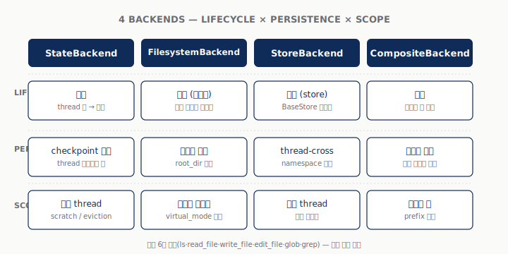

### §0. 들머리 — 이 글이 무엇을 다루나

이 글은 Deep Agents 의 **백엔드(backend)** 한 켜를 단독으로 깊게 다루는 두 번째 발표 교안이다.

1주차에서 4대 능력 중 *파일시스템* 을 잠깐 짚었지만, 그 파일이 실제로 **어디에 어떻게 살아남는지** 는 한 줄로 묻고 지나갔다. 이 글은 그 한 줄을 한 발표 분량으로 풀어 쓴 글이다.

지도 위에 표시할 정보는 셋이다.

1. **왜** 백엔드를 분리했나 — 같은 에이전트 코드를 ephemeral 데모에서 멀티 테넌트 운영까지 옮기려면 무엇이 필요했나
2. **무엇이** 들어 있나 — `BackendProtocol` 한 장 + 4종 빌트인(State / Filesystem / Store / Composite) + 정책 훅
3. **언제 어떻게** 쓰나 — 시나리오별 선택 가이드 + 가상 파일시스템 직접 구현 패턴(S3 스타일)

서브에이전트 격리(다음 발제), 샌드박스 백엔드 상세, LangSmith 트레이싱 같은 인접 주제는 별도 글에 미룬다.

이 글의 한 줄 요약:

> **백엔드는 에이전트의 가상 파일시스템 표면이며, 4종 built-in + Composite 라우팅 + Protocol 준수로 ephemeral 데모부터 멀티 테넌트 운영까지 한 코드로 확장된다.**

---

### §1. 왜 백엔드인가

#### §1.1. ephemeral 데모의 한계

**한 줄**: 1주차 데모는 `create_deep_agent()` 한 호출이면 끝나는 깔끔한 예제였지만, 그 깔끔함은 **단일 thread + 휘발성** 이라는 두 가정에 기대고 있다.

1주차 walkthrough 에서 만든 리서치 에이전트는 다섯 번 `agent.invoke()` 를 호출해도 매 turn 새 thread 였다. 같은 thread 로 재호출했더라도 노트북을 끄는 순간 모든 파일이 사라졌다. 데모에는 충분하다 — 발표 5분짜리 시연이라면 이것으로 끝이다.

문제는 그 다음 단계다. 한 발표 시연을 그대로 자기 도메인에 가져다 붙이려는 순간, 다섯 가지 요구가 한꺼번에 등장한다.

**표.1**: ephemeral 데모를 운영으로 옮길 때 부딪치는 다섯 요구

| 요구 | 무엇이 깨지는가 |
|---|---|
| **영속(persistence)** | 어제 작성한 노트가 오늘도 있어야 — thread 가 끝나면 사라지는 state 로는 안 됨 |
| **멀티 테넌트** | 사용자 A·B 의 메모리가 섞이지 않아야 — namespace 격리 필요 |
| **권한·감사** | "이 에이전트는 `/etc` 를 못 읽는다", "민감 경로 쓰기 시 감사 로그" — state 안에서는 표현 자체가 없음 |
| **외부 저장소** | 이미 S3·Postgres·LangSmith 에 자료가 있는데, 에이전트가 그것을 자기 가상 파일시스템처럼 보게 하고 싶음 |
| **혼합 표면** | 휘발성 스크래치 + 영속 메모리 + 로컬 디스크 마운트 를 **한 에이전트** 가 동시에 봄 |

다섯 요구를 단일 백엔드로 풀 수 없다. 그래서 deepagents 는 파일시스템 표면을 **선택 가능한 한 켜** 로 추상화했다.

#### §1.2. 도구 표면은 그대로, 저장 매체만 갈아 끼우기

**한 줄**: 에이전트가 보는 도구 인터페이스(`ls` / `read_file` / `write_file` / `edit_file` / `glob` / `grep`)는 6개로 고정. 그 아래 저장 매체만 백엔드가 결정한다.

`create_deep_agent()` 가 켜 주는 도구 6종은 **언어가 아니라 인터페이스** 다. 같은 도구를 호출해도 어디에 저장되는지는 `backend=` 인자로 결정된다.

```python
# 4가지가 모두 같은 에이전트 코드를 공유한다
agent = create_deep_agent()                                        # State (휘발)
agent = create_deep_agent(backend=FilesystemBackend(root_dir=...))  # 로컬 디스크
agent = create_deep_agent(backend=(lambda rt: StoreBackend(rt)))   # LangGraph Store (영속)
agent = create_deep_agent(backend=composite_factory)               # 합성 라우팅
```

원문[원문 §"Quickstart" L23-33](../original_docs/05-backends.md) 도 같은 구조의 표로 4종을 한 자리에 묶는다. 사용자 코드(시스템 프롬프트·서브에이전트·도구) 는 한 글자도 안 바뀌고, 같은 에이전트가 dev → staging → prod 환경을 옮겨 다닐 수 있다는 게 이 추상화의 핵심 이득이다.

#### §1.3. mermaid 라우팅 한 장으로 보는 전체 그림

**한 줄**: 모든 도구 호출은 `Backend` 인터페이스 한 점을 통과한다. 그 뒤로는 State / Filesystem / Store / 사용자 정의 + Composite 라우팅으로 분기한다.

원문 L7-19 의 mermaid 그래프는 본 발표 슬라이드 #5 와 그림 1 에서 4종 비교 다이어그램(`fig01_four_backends_overview.svg`)으로 다시 그린다. 좌측에서 들어온 6개 도구가 *Backend* 한 점으로 수렴했다가, 그 점이 *Composite(Routes)* 를 거치면 다시 4갈래로 분기하는 구조다. **수렴 - 분기 사이의 한 점이 본 발표 전체의 주인공** 이다.

**그림.1**: 4종 백엔드 한 장 비교 — lifecycle × persistence × scope



---

### §2. Backend 프로토콜 — 인터페이스 한 장

**한 줄**: `BackendProtocol` 은 6개 핵심 메서드를 가진 Protocol(덕 타입) 이다. 자기 백엔드를 만든다는 건 이 6개를 채운다는 뜻이다.

#### §2.1. 6개 메서드 시그니처

deepagents 패키지의 [`backends/protocol.py`](../original_docs/deepagents_backends/protocol.py) 가 852줄짜리 정식 정의를 담고 있다. 핵심은 그중 6개 메서드다.

**표.2**: BackendProtocol 핵심 메서드 (`protocol.py` 기준)

| 메서드 | 라인 | 시그니처 요약 | 도구 매핑 |
|---|---|---|---|
| `ls` | L342 | `ls(path: str) -> LsResult` | `ls` |
| `read` | L370 | `read(file_path, offset, limit) -> ReadResult` | `read_file` |
| `write` | L509 | `write(file_path, content) -> WriteResult` | `write_file` |
| `edit` | L535 | `edit(file_path, old, new, replace_all) -> EditResult` | `edit_file` |
| `glob` | L468 | `glob(pattern, path) -> GlobResult` | `glob` |
| `grep` | L400 | `grep(pattern, path, glob) -> GrepResult` | `grep` |

추가로 `ls_info` (L634) / `glob_info` (L671) / `grep_raw` (L709) 의 **info-form 변종** 이 있다. 이름이 같지만 반환 타입이 다르다 — info-form 은 `FileInfo` (path·size·modified_at) 객체 리스트를 돌려준다. Composite 가 여러 백엔드 결과를 합칠 때, `upload_files` / `download_files` 의 일괄 전송 경로에서 쓰는 라우팅용 메서드들이다.

#### §2.2. 도구 ↔ Backend 메서드 1:1 매핑

모델이 `read_file('/notes/note.md')` 를 호출하면, FilesystemMiddleware 가 그 호출을 받아 등록된 backend 의 `read('/notes/note.md', 0, 2000)` 으로 변환한다. 변환된 호출은 다음과 같이 분기한다.

```text
LLM        Tool name      Backend method            Storage medium
 |          |              |                          |
 +-> read_file  ─────┐
                     +─→ backend.read()  ─→  StateBackend     → LangGraph state
 +-> write_file ─────+                       FilesystemBackend → 로컬 디스크
 +-> edit_file  ─────+                       StoreBackend      → LangGraph BaseStore
 +-> ls         ─────+                       CompositeBackend  → 라우팅 후 위 셋 중 하나
 +-> glob       ─────+                       (사용자 정의)     → S3 / Postgres / Box / ...
 +-> grep       ─────┘
```

도구 6개 — 백엔드 메서드 6개 — 저장 매체 N개. 사용자가 만지는 다이얼은 **저장 매체** 한 곳이다.

#### §2.3. Protocol 위반을 잡는 두 안전망

`BackendProtocol` 은 `runtime_checkable` 데코레이터가 달린 `typing.Protocol` 이다. 즉 사용자가 `BackendProtocol` 을 명시적으로 상속하지 않아도 6개 메서드 시그니처만 맞으면 동작한다. 동시에 두 안전망이 잘못된 구현을 잡아낸다.

1. **타입 체커 단계** — `mypy` / `pyright` 가 시그니처 불일치를 컴파일 타임에 잡음.
2. **런타임 첫 호출** — 메서드 없는 객체를 backend 로 주입하면 첫 도구 호출에서 `AttributeError`. `runtime_checkable` 덕분에 `isinstance(obj, BackendProtocol)` 도 사용 가능하다.

#### §2.4. 미들웨어 ↔ 백엔드의 경계

여기서 한 가지 헷갈리기 쉬운 점을 짚어 둔다. *미들웨어(middleware)* 와 *백엔드(backend)* 는 다른 층이다.

- **미들웨어** = 도구 호출 자체를 가로채는 함수 체인 (`before_tool`, `wrap_tool_call`, `after_tool` 등). PII 마스킹·rate limit·승인 요청 같은 **정책** 이 여기 들어간다[^4].
- **백엔드** = 미들웨어가 *결국* 호출하는 저장 계층. "파일을 어디에 둘 것인가" 의 결정.

미들웨어가 *어떻게* 다룰지를 정하면, 백엔드가 *어디에* 둘지를 정한다. §8 에서 두 레이어를 함께 다시 본다.

---

### §3. StateBackend — thread-scoped 휘발성

**한 줄**: 가장 단순한 백엔드. 같은 thread 안에서만 파일이 살아남는다. 디폴트이자 스크래치 패드.

#### §3.1. 동작 원리

[`backends/state.py`](../original_docs/deepagents_backends/state.py) L38 의 `class StateBackend(BackendProtocol)` 가 정식 정의다. 클래스 초기화(L50)에서 LangGraph runtime 핸들을 받아 두고, 매 메서드 호출(L157 `ls`, L208 `read`, L247 `write`, L265 `edit`, L293 `grep`, L303 `glob`)은 그 runtime 의 **state** 를 읽고 쓴다.

핵심은 데이터의 *위치* 다. `StateBackend.write('/notes/note.md', 'hello')` 는 host 디스크에 파일을 만들지 않는다. LangGraph 의 thread state 에 `files: {'/notes/note.md': 'hello'}` 처럼 채널 값으로 저장된다.

#### §3.2. checkpoint 와의 관계

LangGraph 의 **checkpoint** 는 매 super-step 마다 state 스냅샷을 영속화한다[^1]. checkpointer 를 `InMemorySaver()` 로 켜면 메모리에 그대로 쌓이고, `PostgresSaver` 로 바꾸면 Postgres 에 행 단위로 들어간다. StateBackend 는 자기 데이터를 **state 채널 안에** 두므로, checkpoint 가 켜져 있는 동안엔 thread 가 죽었다 살아나도 파일이 그대로 따라온다.

즉 "휘발성" 이라는 표현은 정확히는 **thread 끝나면 휘발** 이지 **프로세스 끝나면 휘발** 이 아니다. checkpointer 종류에 따라 thread 자체가 며칠도 살 수 있다. 새 thread 를 만드는 순간 파일은 사라진다.

#### §3.3. 데모 — `01_state_backend.py`

데모 파일은 [`archives/scripts_py/01_state_backend.py`](../scripts_py/01_state_backend.py) (78줄). 핵심 호출은 다음 한 줄이다.

```python
# 01_state_backend.py L41-46
agent = create_deep_agent(
    model=model,
    system_prompt=system_prompt,
    backend=(lambda rt: StateBackend(rt)),
    checkpointer=InMemorySaver(),
)
```

`backend=` 에 람다를 넘기는 이유는 StateBackend 가 runtime 핸들을 필요로 하기 때문 — `BackendFactory = Callable[[ToolRuntime], BackendProtocol]` 패턴이다[원문 §"Specify a backend" L130-134](../original_docs/05-backends.md).

스크립트는 같은 `thread_id="demo-thread-1"` 로 두 번 invoke 한 뒤(L52-65), 세 번째에 새 `thread_id="demo-thread-2"` 로 같은 노트를 읽는다(L67-73). 결과적으로 첫 두 호출은 노트를 보고, 세 번째는 "그런 파일 없다" 를 본다 — thread-scoped 휘발의 직접 증명.

#### §3.4. 베스트 케이스 — scratch + 자동 eviction

원문 L51-57 이 정리한 두 용도가 그대로 답이다.

- **스크래치 패드**: 모델이 큰 도구 출력(예: 30페이지 PDF 텍스트)을 받았을 때, 메시지로 들고 다니지 않고 `/scratch/*.md` 에 적고 나중에 `read_file(offset=..., limit=...)` 으로 잘게 읽어 옴.
- **자동 eviction**: thread 가 끝나면 자동으로 비워지므로 cleanup 코드를 따로 쓸 일이 없음.

운영에서 *영속* 이 필요 없는 단발 작업, 데모, 짧은 대화 세션이 StateBackend 의 본업이다.

---

### §4. FilesystemBackend — 로컬 디스크 + virtual_mode

**한 줄**: 호스트 디스크의 한 디렉토리를 sandbox 로 쓰는 가장 직관적인 백엔드. `virtual_mode` 한 플래그로 경로 표면이 달라진다.

#### §4.1. 두 모드의 결정적 차이

[`backends/filesystem.py`](../original_docs/deepagents_backends/filesystem.py) 는 892줄이다. 정의 자체는 길지만, 사용자가 결정해야 할 다이얼은 두 개뿐이다.

```python
FilesystemBackend(root_dir="/some/abs/path", virtual_mode=True)
```

- **`root_dir`** (str, 필수) — 에이전트가 읽고 쓸 호스트 디렉토리. 절대경로여야 함.
- **`virtual_mode`** (bool, 기본 False) — 경로 정규화 여부.

`virtual_mode=False` (raw) 일 때 에이전트는 호스트 절대경로를 그대로 본다. `write_file('/Users/.../report.md')` 가 정확히 그 위치에 떨어진다. `virtual_mode=True` 면 에이전트가 보는 절대경로(`/report.md`)가 호스트의 `<root_dir>/report.md` 로 정규화된다 — 에이전트 입장에서는 `/` 가 root_dir 인 가짜 파일시스템.

**표.3**: 두 모드 비교

| 측면 | `virtual_mode=False` | `virtual_mode=True` |
|---|---|---|
| 에이전트가 보는 경로 | 호스트 절대경로 그대로 | `/` 시작 (sandbox 내 절대) |
| 보안 격리 | 약함 (호스트 어디든 접근 시도) | 강함 (root_dir 밖 차단) |
| 시연 가독성 | 디렉토리 일치라 직관적 | sandbox 가 한 눈에 보임 |
| symlink 처리 | 호스트 정책 따름 | 안전한 path resolution |

원문 L68-71 이 정리한 보안 특성(secure path resolution, symlink traversal 방지, ripgrep 사용 가능)은 `virtual_mode=True` 에서 더 강하게 작동한다.

#### §4.2. 데모 — `02_filesystem_backend.py`

데모 파일은 [`archives/scripts_py/02_filesystem_backend.py`](../scripts_py/02_filesystem_backend.py) (81줄). 임시 디렉토리를 root 로 잡고 두 모드를 직접 비교한다.

```python
# 02_filesystem_backend.py L43-49
def build_agent(root_dir: str, virtual_mode: bool):
    return create_deep_agent(
        model=model,
        system_prompt=system_prompt,
        backend=FilesystemBackend(root_dir=root_dir, virtual_mode=virtual_mode),
    )
```

L48-54 에서 `virtual_mode=True` 로 `/report.md` 를 쓰면 호스트의 `<tmp>/report.md` 에 떨어진다. L57-62 에서 `virtual_mode=False` 로 호스트 절대경로 그대로 쓰면 그 자리에 그대로 떨어진다 — 두 위치는 같을 수도 다를 수도 있고, 그 결정권이 사용자에게 있다는 것이 데모의 메시지다.

#### §4.3. 베스트 케이스 — 로컬 프로젝트 / CI sandbox / 마운트 볼륨

원문 L72-77 이 정리한 셋이 그대로 답이다.

- **로컬 프로젝트 작업**: 본인 머신의 한 디렉토리를 root_dir 로 잡고, 에이전트가 코드/문서를 직접 편집.
- **CI sandbox**: 빌드 컨테이너 안에서 `/workspace` 를 root_dir 로. 컨테이너 격리 + virtual_mode 이중 격리.
- **마운트된 영속 볼륨**: NFS / EBS 등을 root_dir 로 매핑해 에이전트가 한 자리에서 읽고 쓰게 함.

운영 환경에서 *호스트 디스크* 가 적절한 매체일 때 가장 단순한 답이다.

---

### §5. StoreBackend — LangGraph Store 영속

**한 줄**: thread 를 가로질러 살아남는 영속 저장소. LangGraph `BaseStore` 위에서 동작한다.

#### §5.1. BaseStore 위에 얹은 한 켜

[`backends/store.py`](../original_docs/deepagents_backends/store.py) (800줄) 의 `StoreBackend` 는 LangGraph 의 [`BaseStore`](../research/01_langgraph_persistence_concepts-docs-langchain.md) 인터페이스를 그대로 사용한다. BaseStore 는 namespace + key + value 의 3축 영속 저장소로, `InMemoryStore` (개발용) / Postgres / Redis / 클라우드 구현 등으로 자유롭게 교체된다[^1].

LangGraph 의 일반 지침은 *checkpointer 는 thread 내, store 는 thread 간* 이다[^1]. StateBackend 가 checkpointer 의 thread 영역을 빌려 쓴다면, StoreBackend 는 store 의 thread-cross 영역을 빌려 쓴다.

```python
# 03_store_backend.py L41-50
store = InMemoryStore()
checkpointer = InMemorySaver()

agent = create_deep_agent(
    model=model,
    system_prompt=system_prompt,
    backend=(lambda rt: StoreBackend(rt)),
    store=store,
    checkpointer=checkpointer,
)
```

`store=` 와 `backend=` 가 둘 다 필요한 점에 주의. `store` 는 `create_deep_agent` 가 LangGraph 그래프에 연결해 줄 인스턴스, `backend` 는 그 store 위에서 동작하는 어댑터 — 두 인자를 분리해 두면 같은 store 를 다른 백엔드(예: Composite 의 부분)와 공유할 수 있다.

#### §5.2. namespace 와 의미 기반 검색

BaseStore 의 핵심 자료구조는 **tuple namespace** 다 — 예: `(user_id, "memories")`[^1]. StoreBackend 가 노출하는 경로 `/memories/note.md` 는 내부적으로 `(<thread_user>, "memories")` 같은 namespace 키로 매핑된다.

추가로 BaseStore 는 `index={"embed": ..., "dims": ..., "fields": [...]}` 설정으로 **의미 기반 검색** 을 제공한다[^1]. `store.search(namespace, query="유저가 좋아하는 음식")` 처럼 자연어 질의가 가능하다. 본 발표 본문에서는 깊게 다루지 않지만, *장기 메모리* 의 핵심 이득이 namespace 격리에 더해 의미 기반 검색까지라는 점은 짚어 둔다.

#### §5.3. 데모 — `03_store_backend.py`

데모는 [`archives/scripts_py/03_store_backend.py`](../scripts_py/03_store_backend.py) (79줄). 두 thread 에서 같은 store 를 공유하는 것이 시연의 핵심이다.

```python
# 03_store_backend.py L57-67
cfg_a = {"configurable": {"thread_id": "session-A"}}
cfg_b = {"configurable": {"thread_id": "session-B"}}

# session-A 에서 write
agent.invoke({"messages": [...]}, config=cfg_a)

# session-B (다른 thread) 에서 같은 namespace 의 파일을 read
agent.invoke({"messages": [...]}, config=cfg_b)
```

같은 store 인스턴스를 두 invoke 가 공유하므로, A 에서 적은 `/memories/release.md` 가 B 에서 그대로 읽힌다.

#### §5.4. 베스트 케이스 — 장기 메모리 / LangSmith Deployment

원문 L93-95 이 정리한 두 시나리오.

- **이미 설정된 LangGraph store 가 있을 때**: Redis / Postgres / 클라우드 구현체가 `BaseStore` 인터페이스를 준수하므로 그대로 꽂아 씀.
- **LangSmith Deployment 로 배포할 때**: 배포 인프라가 store 를 자동 프로비저닝하므로 추가 설정 없이 영속이 동작.

운영에서 *기억* 이 필요할 때, store 인프라가 이미 있거나 LangSmith 를 쓴다면 첫 번째 후보다.

---

### §6. CompositeBackend — 라우팅 규칙

**한 줄**: 경로 prefix 로 호출을 백엔드별로 보낸다. 한 에이전트가 휘발성·영속·로컬 디스크 셋을 동시에 본다.

#### §6.1. 라우팅 규칙의 구조

[`backends/composite.py`](../original_docs/deepagents_backends/composite.py) 의 `CompositeBackend` (L118) 는 두 인자만 받는다.

```python
# composite.py 시그니처 (L140 __init__ 요약)
CompositeBackend(
    default: BackendProtocol,
    routes: dict[str, BackendProtocol],
)
```

- **`default`**: 어느 라우트에도 안 걸리는 경로의 fallback.
- **`routes`**: `{"/memories/": StoreBackend(rt), "/shared/": FilesystemBackend(...)}` 같은 prefix → backend 사전.

매 도구 호출은 `_get_backend_and_key` (L167) 가 라우팅 결정을 내린다. **longer prefix wins** — `/memories/projects/` 가 `/memories/` 보다 먼저 매치되므로, 더 구체적인 규칙을 추가해 부분 오버라이드가 가능하다[원문 §"Route to different backends" L159-161](../original_docs/05-backends.md).

#### §6.2. `ls` / `glob` / `grep` 의 결과 합치기

라우팅이 단순한 단일 호출(`read`, `write`, `edit`)은 한 백엔드로 갈라져 끝난다. 문제는 *디렉토리 횡단* 호출이다 — `ls /` 는 모든 백엔드의 루트를 봐야 하고, `glob('**/*.md', '/')` 도 마찬가지다.

Composite 는 이 경우 모든 백엔드를 호출해 결과를 합친다(`ls` L182, `glob` L405, `grep` L306). 합치는 과정에서 **원래 prefix 가 결과에 보존** 되므로[원문 §"Route to different backends" L157](../original_docs/05-backends.md), `ls /` 결과에 `/memories/note.md` 와 `/shared/draft.md` 가 한 표에 같이 보인다.

#### §6.3. 데모 — `04_composite_backend.py`

데모는 [`archives/scripts_py/04_composite_backend.py`](../scripts_py/04_composite_backend.py) (107줄). 라우팅 3개 규칙을 동시에 운영하는 것이 본 데모의 본업이다.

```python
# 04_composite_backend.py L62-68
composite = lambda rt: CompositeBackend(
    default=StateBackend(rt),
    routes={
        "/memories/": StoreBackend(rt),
        "/shared/": FilesystemBackend(root_dir=root, virtual_mode=True),
    },
)
```

세 종류의 영속성·스코프가 한 가상 파일시스템 안에 공존한다.

- `/memories/note.md` → StoreBackend → thread-cross 영속
- `/shared/draft.md` → FilesystemBackend → 호스트 디스크 (sandboxed)
- `/tmp/scratch.md` → default(StateBackend) → 휘발

L95-100 의 검증 단계가 호스트 디스크를 직접 들여다보며 `/shared/*` 만 떨어졌음을 확인한다 — Composite 가 약속대로 일했다는 직접 증거다.

#### §6.4. 베스트 케이스 — 휘발 + 영속 한 표면 / 다중 출처 통합

원문 L120-124 가 두 시나리오를 정리한다.

- **휘발 + 영속 동거**: 단기 스크래치는 state, 장기 메모리는 store — 두 백엔드를 한 에이전트가 동시에.
- **다중 정보 출처 통합**: 장기 메모리는 `/memories/` 의 store, 도큐먼트 카탈로그는 `/docs/` 의 커스텀 backend(예: 후술하는 S3) — 한 에이전트가 두 출처를 한 가상 파일시스템으로 봄.

Composite 는 *백엔드 선택* 의 문제를 *경로 설계* 의 문제로 옮긴다. 어떤 경로가 어떤 매체로 가야 하는지 결정하면, 나머지는 라우팅 표가 한다.

---

### §7. 가상 파일시스템 — S3 스타일 구현

**한 줄**: 빌트인 4종으로 안 풀리는 외부 저장소는 `BackendProtocol` 6개 메서드를 직접 채워 통합한다. S3 가 가장 흔한 사례.

#### §7.1. 왜 직접 만드나

운영에서 가장 자주 만나는 케이스 셋.

1. **이미 S3 에 자료가 있다** — 사내 위키·PDF·로그가 S3 버킷에 있고, 에이전트가 그것을 자기 가상 파일시스템처럼 봐야 함.
2. **이미 Postgres 에 자료가 있다** — `documents(path, content, created_at, modified_at)` 같은 테이블이 있고, 에이전트가 SQL 을 모르고도 `ls` / `read_file` 로 접근.
3. **사내 전용 시스템** — Box · Confluence · Notion 등 자체 SDK 가 있는 시스템을 통합.

deepagents 커뮤니티가 이미 [`box-community/deepagents-filesystem-example`](../research/03_deepagents-backends_dito97-github-readme.md) 같은 사례를 공개 중이고, 본 발표는 가장 보편적인 S3 를 1차 사례로 다룬다.

#### §7.2. S3 스타일 아웃라인 (원문 정리)

원문 §"Use a virtual filesystem" L173-210 의 S3-style outline 이 출발점이다. `BackendProtocol` 6개 메서드만 채우면 동작한다 — 다른 deepagents 코드를 한 줄도 안 건드린다.

```python
# 원문 L175-210 의 요약
from deepagents.backends.protocol import BackendProtocol, WriteResult, EditResult
from deepagents.backends.utils import FileInfo, GrepMatch

class S3Backend(BackendProtocol):
    def __init__(self, bucket: str, prefix: str = ""):
        self.bucket = bucket
        self.prefix = prefix.rstrip("/")

    def _key(self, path: str) -> str:
        # 절대경로(/foo/bar.md) → S3 key (prefix + foo/bar.md)
        return f"{self.prefix}{path}"

    def ls_info(self, path: str) -> list[FileInfo]:
        # _key(path) 아래 객체 나열 → FileInfo(path, size, modified_at)
        ...

    def read(self, file_path: str, offset: int = 0, limit: int = 2000) -> str:
        # GetObject → 번호 매긴 내용 반환 / 없으면 에러 문자열
        ...

    def write(self, file_path: str, content: str) -> WriteResult:
        # PutObject — create-only 정책 권장. WriteResult(path=..., files_update=None)
        ...

    def edit(self, file_path: str, old_string: str, new_string: str, replace_all: bool = False) -> EditResult:
        # Read → replace (uniqueness 또는 replace_all) → Write → 치환 횟수 반환
        ...

    def glob_info(self, pattern: str, path: str = "/") -> list[FileInfo]:
        # 키 목록에 glob 적용
        ...

    def grep_raw(self, pattern: str, path: str | None = None, glob: str | None = None) -> list[GrepMatch] | str:
        # 서버사이드 grep 가능하면 사용 / 아니면 read 후 라인 스캔
        ...
```

설계 가이드 네 줄 요약(원문 L168-172):

- 경로는 절대(`/x/y.txt`). 저장소 키/행과의 매핑 결정은 사용자 몫.
- `ls_info` / `glob_info` 는 가능하면 **서버사이드 listing** 사용.
- 없는 파일·잘못된 정규식은 **사람이 읽을 수 있는 에러 문자열** 반환.
- 외부 영속에는 `files_update=None` — `files_update` 사전은 state 백엔드만 채운다.

#### §7.3. production 레퍼런스 — `deepagents-backends` (커뮤니티)

원문 outline 을 production 수준으로 끌어올린 커뮤니티 패키지가 [`DiTo97/deepagents-backends`](../research/03_deepagents-backends_dito97-github-readme.md) 이다. PyPI 에 `deepagents-backends>=0.1.0` 으로 게시돼 있고, S3 와 Postgres 두 백엔드를 같은 패키지로 묶었다[^3].

본 발표는 outline 을 채우는 디테일(boto3 client 캐싱, retry, connection pool, multipart upload 임계값, S3Config 의 endpoint_url 로 MinIO 호환 등) 까지는 안 들어가지만, 사용자가 운영에 들고 가려 할 때 *바닥부터* 가 아닌 *DiTo97 패키지 fork* 에서 시작하는 게 훨씬 빠르다는 점은 강조해 둔다.

#### §7.4. Composite 와 결합 — 부분 마이그레이션 패턴

S3Backend 를 만들었다고 갑자기 전 경로를 S3 로 옮기지 않는다. Composite 와 묶어 *부분* 통합이 일반적이다.

```python
composite = lambda rt: CompositeBackend(
    default=StateBackend(rt),              # 스크래치는 휘발
    routes={
        "/memories/": StoreBackend(rt),     # 장기 메모리는 store
        "/docs/": S3Backend(bucket="internal-wiki"),  # 사내 위키는 S3
    },
)
```

기존 데모 코드(§6)에 S3 라인 하나 추가하면 위 구조가 그대로 동작한다. *작게 시작해 점진적으로 옮기는* 패턴이 가능한 것이 BackendProtocol 추상화의 큰 이득이다.

---

### §8. Policy hooks — 권한·감사·redaction

**한 줄**: 정책을 거는 자리는 두 군데 — 백엔드 서브클래싱(저장 매체 직전) 과 미들웨어(LLM 직전). 둘은 다른 일을 한다.

#### §8.1. 두 레이어 비교

§2.4 에서 미리 짚었던 두 레이어를 표로 다시 정리한다.

**표.4**: 백엔드 vs 미들웨어 정책 레이어

| 측면 | 백엔드 서브클래싱 | 미들웨어 |
|---|---|---|
| 가로채는 시점 | 도구 → 백엔드 메서드 직전 | LLM 호출 / 도구 호출 wrap |
| 알 수 있는 정보 | 경로 · 내용 · 작업 종류 | 메시지 · 도구 호출 · 결과 전체 |
| 잘 맞는 정책 | "경로별 deny", "쓰기 감사 로그" | "PII redaction", "rate limit", "human approval" |
| 영향 범위 | 한 백엔드 한정 | 에이전트 전체 |

두 레이어는 합쳐 쓸 수도 있고 하나만 쓸 수도 있다. *데이터의 위치* 가 핵심이면 백엔드 레이어가, *내용·맥락* 이 핵심이면 미들웨어가 자연스럽다.

#### §8.2. 백엔드 레이어 — `GuardedBackend` 패턴

원문 L223-244 가 보여주는 가장 단순한 패턴이 `FilesystemBackend` 서브클래싱이다.

```python
# 원문 L226-244 발췌
from deepagents.backends.filesystem import FilesystemBackend
from deepagents.backends.protocol import WriteResult, EditResult

class GuardedBackend(FilesystemBackend):
    def __init__(self, *, deny_prefixes: list[str], **kwargs):
        super().__init__(**kwargs)
        self.deny_prefixes = [p if p.endswith("/") else p + "/" for p in deny_prefixes]

    def write(self, file_path: str, content: str) -> WriteResult:
        if any(file_path.startswith(p) for p in self.deny_prefixes):
            return WriteResult(error=f"Writes are not allowed under {file_path}")
        return super().write(file_path, content)

    def edit(self, file_path: str, old_string: str, new_string: str, replace_all: bool = False) -> EditResult:
        # write 와 같은 패턴
        ...
```

원리는 단순하다 — 정책 검사 후 super 호출 / 정책 위반 시 에러 결과 반환. 같은 패턴으로 다음이 표현된다.

- **감사 로깅** — `write` / `edit` 호출 전후로 구조화 로그 출력.
- **읽기 redaction** — `read` 결과에서 정규식으로 민감 토큰 마스킹.
- **쓰기 우선순위** — 동일 경로 중복 쓰기 시 거부 (create-only 정책).

#### §8.3. 미들웨어 레이어 — LangChain prebuilt 카탈로그

LangChain core 가 [`langchain.agents.middleware`](../research/04_langchain_middleware-docs-langchain.md) 모듈로 prebuilt 미들웨어 16종을 제공한다[^4]. 본 발표에서 다룰 만한 것은 셋.

- **PII 탐지/마스킹** — `PIIMiddleware`. 모델로 들어가는 메시지·도구 결과에서 이메일·전화번호·신용카드 번호 등을 정규식 또는 별도 모델로 탐지·마스킹.
- **호출 횟수 제한** — `ModelCallLimitMiddleware`, `ToolCallLimitMiddleware`. 한 thread 의 LLM/도구 호출이 N 회를 넘으면 강제 종료. 비용 사고 방지.
- **Human-in-the-Loop** — `HumanInTheLoopMiddleware`. 도구 호출 직전 사람 승인 인터럽트.

미들웨어는 `create_agent(model=..., tools=..., middleware=[...])` 처럼 리스트로 끼워 넣는다[^4]. `create_deep_agent` 도 동일한 `middleware=` 인자를 노출한다.

#### §8.4. 어디에 무엇을 거는가 — 결정 휴리스틱

자주 헷갈리는 결정이라 한 줄 가이드.

- **경로 기반 권한** (이 폴더 쓰기 금지) → 백엔드. 미들웨어가 모르는 정보다.
- **내용 기반 마스킹** (이 메일 주소 가리기) → 미들웨어. 백엔드가 LLM 결과를 모름.
- **감사 로그** → 어디서나. 둘 다 걸어도 됨.
- **외부 API 키 보호** — 도구 호출 가로채기 → 미들웨어. 백엔드는 도구 정의를 모른다.

§9 의 선택 가이드에서 정책 요구사항이 있는 시나리오에는 *두 레이어 모두* 를 권장한다.

---

### §9. 선택 가이드 — 의사결정 표

**한 줄**: 운영 요구사항 한 줄을 입력으로, 백엔드 조합 하나를 출력으로 — 표 하나면 끝난다.

#### §9.1. 시나리오 ↔ 백엔드 조합

**표.5**: 시나리오별 추천 백엔드

| 시나리오 | 휘발성 | 영속 | 권한 | 외부 저장소 | 추천 조합 |
|---|---|---|---|---|---|
| 로컬 데모, 단일 thread | ✓ | | | | StateBackend (기본) |
| 같은 thread 안 다단계 분석 | ✓ | | | | StateBackend + checkpointer |
| 로컬 디스크 직접 작업 | | ✓ | | | FilesystemBackend (`virtual_mode=False`) |
| CI sandbox / 컨테이너 격리 | | ✓ | ✓ | | FilesystemBackend (`virtual_mode=True`) |
| 장기 메모리 (멀티 thread) | | ✓ | | | StoreBackend + InMemoryStore (개발) / Postgres (운영) |
| LangSmith Deployment | | ✓ | | | StoreBackend (자동 프로비저닝) |
| 스크래치 + 메모리 한 에이전트 | ✓ | ✓ | | | Composite (default=State, `/memories/`→Store) |
| 사내 S3 자료 활용 | | ✓ | | ✓ | Composite + 커스텀 S3Backend |
| 모든 쓰기 감사 + 일부 deny | | ✓ | ✓ | | Filesystem 서브클래싱 (GuardedBackend) |
| 위 모두 + PII 마스킹 | ✓ | ✓ | ✓ | ✓ | Composite + GuardedBackend + PIIMiddleware |

표의 마지막 행이 *운영 만렙* 의 모범 답안이다 — 라우팅으로 매체 분리, 서브클래싱으로 경로 권한, 미들웨어로 내용 정책.

#### §9.2. 결정 흐름 한 장

1. **영속이 필요한가?** — 아니오 → State. 예 → 다음.
2. **저장 매체는?** — 로컬 디스크 → Filesystem. LangGraph store → Store. 외부 시스템(S3 등) → 커스텀.
3. **여러 매체를 한 에이전트에서?** — 예 → 위 결정을 합쳐 Composite.
4. **정책 필요?** — 경로 기반 → 백엔드 서브클래싱. 내용 기반 → 미들웨어. 둘 다면 둘 다.

표 한 줄 + 4단 결정 — 발표 슬라이드 #19 가 이 두 요소를 한 화면에 박는다.

#### §9.3. 안티패턴 짧게

- **모든 경로를 Store 로** — 휘발성 스크래치까지 영속화 = checkpointer 부담 폭발. 라우팅을 써라.
- **`virtual_mode=False` 를 운영에서** — 에이전트가 호스트 어디든 접근. CI 가 아니면 권장 안 함.
- **GuardedBackend 의 deny_prefixes 를 정규식으로** — prefix 검사 단순 알고리즘이라 정규식 의도와 어긋남. 별도 미들웨어 정책으로.

---

### §10. 다음 발제와의 연결

**한 줄**: 백엔드는 *파일이 어디에 있는지* 를 다룬다. 다음 발제는 *누가 어떻게 그 파일을 쓰는지* 를 다룬다.

#### §10.1. 04-harness — 실행 모델

deepagents 의 04 번 원문은 **harness** — 에이전트가 도구를 실제로 *실행* 하는 인프라 — 를 다룬다. sandbox 백엔드, local shell 백엔드, langsmith 트레이싱 통합이 그 영역이다. 본 발표가 다룬 4종 외에 [`backends/sandbox.py`](../original_docs/deepagents_backends/sandbox.py), [`local_shell.py`](../original_docs/deepagents_backends/local_shell.py), [`langsmith.py`](../original_docs/deepagents_backends/langsmith.py) 가 그쪽 영역이다.

#### §10.2. 06-subagents — 격리된 워커

서브에이전트는 자기만의 컨텍스트와 자기만의 파일시스템 뷰를 가진다. *부모-자식 사이 파일 공유* 는 백엔드 추상화가 그대로 답을 준다 — 같은 store 를 공유하면 보이고, 다른 백엔드로 분리하면 보이지 않는다.

#### §10.3. 한 줄 다리

> 백엔드(2주차)가 파일이 *어디에* 살아남는지를 결정한다면, harness(3주차)는 그 파일을 *언제 어떻게* 만지는지를 결정하고, subagents(4주차)는 그 파일을 *누가* 만지는지를 결정한다. 셋이 합쳐 한 에이전트의 *운영체제 표면* 이 된다.

---

### 부록 A — 코드 인용 라인 표

본 교안의 코드 인용을 한 표에 모은다. 데모 스크립트 변경 시 이 표를 함께 갱신한다.

| 본문 § | 인용 파일 | 라인 | 용도 |
|---|---|---|---|
| §3.3 | `archives/scripts_py/01_state_backend.py` | L41-46 | `backend=(lambda rt: StateBackend(rt))` 패턴 |
| §3.3 | `archives/scripts_py/01_state_backend.py` | L52-73 | thread 잔존/부재 시연 |
| §4.2 | `archives/scripts_py/02_filesystem_backend.py` | L43-49 | virtual_mode 토글 함수 |
| §4.2 | `archives/scripts_py/02_filesystem_backend.py` | L57-78 | 두 모드 디스크 비교 |
| §5.1 | `archives/scripts_py/03_store_backend.py` | L41-50 | store + checkpointer 동시 주입 |
| §5.3 | `archives/scripts_py/03_store_backend.py` | L57-67 | 두 thread 간 read |
| §6.3 | `archives/scripts_py/04_composite_backend.py` | L62-68 | 3개 라우팅 규칙 |
| §6.3 | `archives/scripts_py/04_composite_backend.py` | L95-100 | 디스크 직접 확인 |
| §2.1 | `archives/original_docs/deepagents_backends/protocol.py` | L342, L370, L400, L468, L509, L535 | 6개 핵심 메서드 |
| §3.1 | `archives/original_docs/deepagents_backends/state.py` | L38, L157, L208, L247, L265 | StateBackend 정의 |
| §6.1 | `archives/original_docs/deepagents_backends/composite.py` | L118, L140, L167, L182 | CompositeBackend 라우팅 |
| §7.2 | `archives/original_docs/05-backends.md` | L173-210 | S3 outline (원문) |
| §8.2 | `archives/original_docs/05-backends.md` | L226-244 | GuardedBackend 원문 |

### 부록 B — Research 자료 인덱스

본 교안에서 인용한 보강 자료 5종은 `archives/research/INDEX.md` 에 모여 있다.

| 번호 | 파일 | 본문 인용 위치 |
|---|---|---|
| [^1] | [`01_langgraph_persistence_concepts-docs-langchain.md`](../research/01_langgraph_persistence_concepts-docs-langchain.md) | §3.2, §5.1, §5.2 |
| [^2] | [`../original_docs/deepagents_backends/protocol.py`](../original_docs/deepagents_backends/protocol.py) (로컬 스냅샷) | §2.1 |
| [^3] | [`03_deepagents-backends_dito97-github-readme.md`](../research/03_deepagents-backends_dito97-github-readme.md) | §7.1, §7.3 |
| [^4] | [`04_langchain_middleware-docs-langchain.md`](../research/04_langchain_middleware-docs-langchain.md) | §2.4, §8.1, §8.3 |
| [^5] | [`05_ollama_tool_calling-docs-ollama.md`](../research/05_ollama_tool_calling-docs-ollama.md) | (walkthrough.ipynb 사전 검증 — 본문 내 직접 인용 없음, 부록 C 참조) |

### 부록 C — 환경 사전 점검 체크리스트

본 교안의 4개 데모(`archives/scripts_py/0[1-4]_*.py`) 와 통합 노트북(`scripts/walkthrough.ipynb`) 실행 전 확인할 사항.

1. **Ollama 데몬 실행 중**: `curl -s http://localhost:11434/api/tags` 가 응답하면 OK.
2. **gemma4:31b 다운로드 완료**: `ollama list | grep gemma` 출력에 존재해야 함. 없으면 `ollama pull gemma4:31b`.
3. **도구 호출 지원 확인**: 일부 모델 변종은 tool-use 미지원. `archives/research/05_ollama_tool_calling-docs-ollama.md` 참조[^5]. 미지원 모델이면 27b 변종 또는 다른 모델로 교체.
4. **Python 의존성**: `pip install -r scripts/requirements.txt` — `langchain-ollama`, `deepagents`, `langgraph` 필수.
5. **`.env` 생성**: `cp .env_sample .env` 후 기본값 그대로 두어도 동작 (LANGSMITH 키는 선택).

---

### 참고 문헌

본 교안의 모든 인용 출처는 `archives/source/99_references.md` 에 통합돼 있다. footnote 번호는 부록 B 와 동일.

- 원문: `archives/original_docs/05-backends.md` (EN, 305L) / `_ko.md` (KO 페어)
- 패키지 소스: `archives/original_docs/deepagents_backends/` (커밋 `4421bec`)
- Research: `archives/research/INDEX.md` (5건, verbatim)
