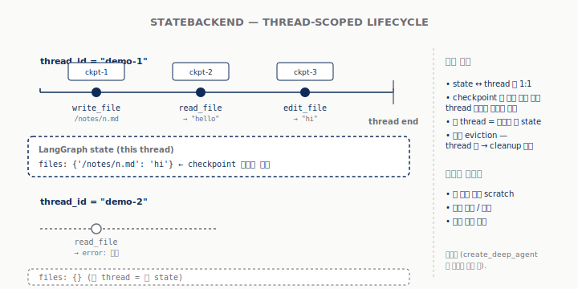
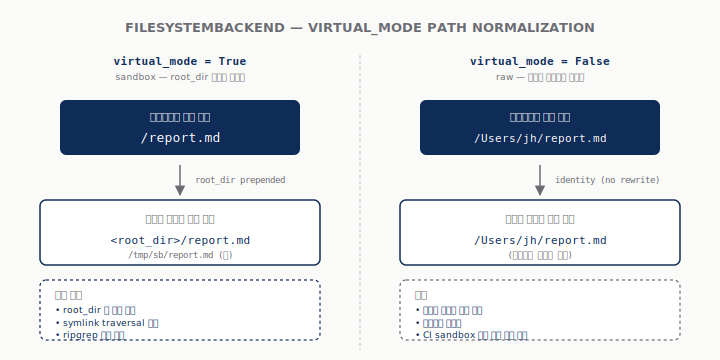
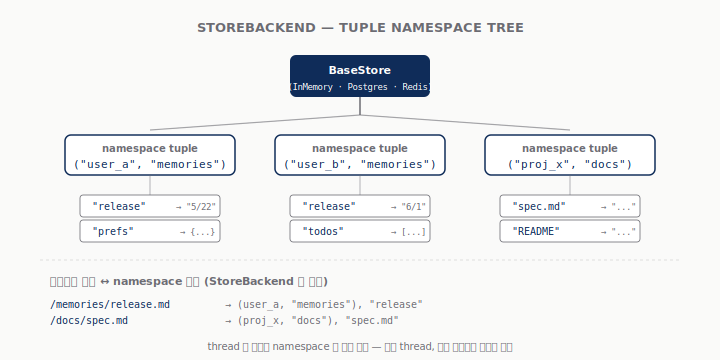
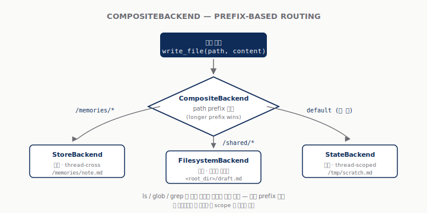

<!-- slide: variant=cover -->
# Deep Agents — Backends 심층

> 같은 에이전트 코드, 다른 저장 매체 — 한 줄 인자로 데모에서 운영까지

<!-- slide: tag="§0 · Message" -->
# 한 줄로 정리

> 백엔드 = 라우팅 가능한 가상 파일시스템 표면

- **도구는 6개로 고정** — `ls` / `read_file` / `write_file` / `edit_file` / `glob` / `grep`
- **그 아래는 가변** — State (휘발) · Filesystem (디스크) · Store (영속) · Composite (라우팅) · 사용자 정의 (S3/Postgres/Box…)
- **사용자 코드는 한 글자도 안 바뀐다** — `create_deep_agent(backend=…)` 한 인자만 교체
- **dev → staging → prod 이동이 한 줄** — ephemeral 데모와 멀티 테넌트 운영이 같은 에이전트 코드를 공유

> "도구는 그대로, 매체만 갈아 끼운다" — 본 발표 전체의 시작점이자 도착점.

<!-- slide: tag="§1 · Why" -->
# 1주차 데모의 한계

> `create_deep_agent()` 한 호출의 깔끔함은 단일 thread + 휘발성 두 가정 위에 서 있다

- **노트북을 끄면 사라진다** — thread state 위에만 살아 있음
- **새 thread 면 다시 빈 책상** — 사용자 A·B 가 같은 에이전트를 쓰면 메모리가 섞임
- **권한 표현 불가** — "이 폴더는 못 읽음" / "쓰기 시 감사 로그" — state 안에 그런 자리 없음
- **외부 자료는 사각지대** — 이미 S3·Postgres 에 있는 사내 자료는 `read_file` 로 닿지 않음

> 데모는 충분히 깔끔. 그 깔끔함을 자기 도메인에 옮기려는 순간 5개 요구가 한꺼번에 등장.

<!-- slide: tag="§1 · Why" -->
# 운영으로 옮길 때 부딪치는 다섯 요구

> 영속 · 멀티 테넌트 · 권한 · 외부 저장소 · 혼합 표면 — 단일 백엔드로 못 푼다

| 요구 | 무엇이 깨지는가 |
|---|---|
| 영속 | 어제 노트가 오늘도 있어야 — state 만으로는 안 됨 |
| 멀티 테넌트 | A·B 메모리 격리 — namespace 필요 |
| 권한·감사 | 경로별 deny / 쓰기 감사 — state 표현 없음 |
| 외부 저장소 | S3/Postgres/사내 시스템을 가상 FS 처럼 |
| 혼합 표면 | 휘발 + 영속 + 디스크를 한 에이전트가 |

> 다섯을 동시에 만족하려면 백엔드를 *선택 가능한 한 켜* 로 분리해야 함 — deepagents 의 답.

<!-- slide: tag="§2 · Compare" -->
# 4종 한 장 비교

> lifecycle × persistence × scope — 같은 인터페이스, 다른 저장 매체


| | State | Filesystem | Store | Composite |
|---|---|---|---|---|
| 생애 | 휘발 | 영속(디스크) | 영속(store) | 합성 |
| Scope | thread | 디스크 | 멀티 thread | 라우팅 |
| 케이스 | scratch | sandbox | 장기 메모리 | 혼합 |

<!-- slide: tag="§2 · Protocol" -->
# Backend Protocol — 한 장으로

> 자기 백엔드를 만든다는 건 6개 메서드를 채운다는 뜻

```python
class BackendProtocol(Protocol):
    def ls(self, path: str) -> LsResult: ...          # L342
    def read(self, file_path, offset, limit) -> ...   # L370
    def write(self, file_path, content) -> ...        # L509
    def edit(self, file_path, old, new, replace_all): # L535
    def glob(self, pattern, path) -> GlobResult: ...  # L468
    def grep(self, pattern, path, glob) -> ...        # L400
```

- **도구 6개 ↔ 메서드 6개** — 1:1 대응
- **`runtime_checkable` Protocol** — 상속 없어도 시그니처만 맞으면 동작
- **info-form 변종** (`ls_info`/`glob_info`/`grep_raw`) — Composite 라우팅·메타데이터용

> 라인 번호는 `archives/original_docs/deepagents_backends/protocol.py` (852L) 기준.

<!-- slide: tag="§3 · State" -->
# StateBackend — thread-scoped 휘발

> 가장 단순한 백엔드. 같은 thread 안에서만 파일이 산다. 디폴트.



- **저장 위치** — LangGraph state 채널 (`files: {path: content}`)
- **thread 끝 → 휘발** — 단 checkpointer 가 켜져 있으면 thread 자체는 며칠 생존
- **베스트 케이스** — 큰 도구 출력 scratch · 자동 eviction

<!-- slide: tag="§3 · State Demo" -->
# Demo 1 — StateBackend

> `archives/scripts_py/01_state_backend.py` (78L) — 같은 thread 잔존 / 다른 thread 부재

```python
# L41-46
agent = create_deep_agent(
    model=model,
    system_prompt=system_prompt,
    backend=(lambda rt: StateBackend(rt)),
    checkpointer=InMemorySaver(),
)
```

- **Turn 1** — `thread_id=demo-thread-1` 에서 노트 작성
- **Turn 2** — 같은 thread 에서 read → 노트 있음
- **Turn 3** — `thread_id=demo-thread-2` 로 변경 후 read → 노트 없음

> factory 형태(lambda)로 전달하는 이유 — `StateBackend` 가 LangGraph runtime 핸들에 의존하기 때문.

<!-- slide: tag="§4 · Filesystem" -->
# FilesystemBackend — 디스크 + virtual_mode

> 호스트의 한 디렉토리를 sandbox 로. `virtual_mode` 한 플래그가 표면을 바꾼다.



| | `virtual_mode=False` | `virtual_mode=True` |
|---|---|---|
| 보는 경로 | 호스트 절대경로 | sandbox 내 `/` 시작 |
| 격리·symlink | 약함 / 호스트 정책 | 강함 / 안전 resolution |
| 시연 | 디렉토리 일치 | sandbox 한눈에 |

> 운영 기본 `virtual_mode=True` — ripgrep + symlink traversal 방지 자동.

<!-- slide: tag="§4 · Filesystem Demo" -->
# Demo 2 — FilesystemBackend

> `archives/scripts_py/02_filesystem_backend.py` (81L) — 두 모드 디스크 결과 비교

```python
# L43-49
def build_agent(root_dir: str, virtual_mode: bool):
    return create_deep_agent(
        model=model,
        system_prompt=system_prompt,
        backend=FilesystemBackend(root_dir=root_dir, virtual_mode=virtual_mode),
    )
```

- **virtual_mode=True** + `write_file('/report.md')` → 호스트 `<tmp>/report.md`
- **virtual_mode=False** + 호스트 절대경로 그대로 → 그 위치에 그대로
- 호스트 디스크를 직접 들여다보며 두 결과 비교

> 같은 에이전트 코드, 모드 한 플래그 차이로 호스트 디스크 결과가 갈린다 — 결정권은 사용자에게.

<!-- slide: tag="§5 · Store" -->
# StoreBackend — 영속 (thread-cross)

> LangGraph `BaseStore` 위에 얹은 한 켜. thread 가 끝나도 같은 파일을 본다.



- **BaseStore** = namespace + key + value 3축 영속 (InMemory / Postgres / Redis)
- **tuple namespace** + 의미 기반 검색 (`index={"embed":..., "fields":[...]}`)
- **LangSmith Deployment** 시 자동 프로비저닝

> *checkpointer 는 thread 내, store 는 thread 간* — LangGraph 영속의 두 축.

<!-- slide: tag="§5 · Store Demo" -->
# Demo 3 — StoreBackend

> `archives/scripts_py/03_store_backend.py` (79L) — 다른 thread 에서 같은 노트가 읽힌다

```python
# L41-50
store = InMemoryStore()
checkpointer = InMemorySaver()
agent = create_deep_agent(
    model=model,
    system_prompt=system_prompt,
    backend=(lambda rt: StoreBackend(rt)),
    store=store,
    checkpointer=checkpointer,
)
```

- **session-A** 에서 `/memories/release.md` 작성
- **session-B** (다른 thread) 에서 같은 파일 read → 같은 내용
- `store=` 와 `backend=` 두 인자가 분리 — Composite 부분 공유 가능

> 운영 환경에선 InMemoryStore → PostgresStore 한 줄 교체로 진짜 영속.

<!-- slide: tag="§6 · Composite" -->
# CompositeBackend — 라우팅 규칙

> 한 에이전트, 세 매체 — 경로 prefix 가 결정한다



```python
CompositeBackend(default=StateBackend(rt),
    routes={"/memories/": StoreBackend(rt),
            "/shared/":   FilesystemBackend(root_dir=...)})
```

- **longer prefix wins** · `ls/glob/grep` 결과 합쳐 반환 (prefix 보존)
- **부분 마이그레이션** — 한 경로씩 점진 운영화

<!-- slide: tag="§6 · Composite Demo" -->
# Demo 4 — CompositeBackend

> `archives/scripts_py/04_composite_backend.py` (107L) — 3개 규칙 동시 운영

```python
# L62-68
composite = lambda rt: CompositeBackend(
    default=StateBackend(rt),
    routes={
        "/memories/": StoreBackend(rt),
        "/shared/":   FilesystemBackend(root_dir=root, virtual_mode=True),
    },
)
```

- `/memories/note.md` → Store (영속)
- `/shared/draft.md` → Filesystem (호스트 디스크)
- `/tmp/scratch.md` → default=State (휘발)
- L95-100 호스트 디스크 직접 확인 → `/shared/*` 만 떨어졌음

> 세 영속성·세 scope 이 한 가상 FS 안에 공존. 사용자 코드는 한 인자.

<!-- slide: tag="§7 · Virtual FS" -->
# 직접 만들기 — 왜?

> 빌트인 4종으로 안 풀리는 외부 저장소 — `BackendProtocol` 6개를 채우면 끝

- **이미 S3 에 자료** — 사내 위키·PDF·로그 → `read_file('/docs/wiki.md')` 로 닿게
- **이미 Postgres 에 자료** — `documents` 테이블을 가상 FS 로 노출
- **사내 SDK 시스템** — Box·Confluence·Notion 등을 한 인터페이스 뒤로

> 커뮤니티가 이미 시작: `DiTo97/deepagents-backends` (S3+Postgres) · `box-community/deepagents-filesystem-example`.

<!-- slide: tag="§7 · S3 Pattern" -->
# S3 스타일 — 6개 메서드만 채우기

> 원문 §"Use a virtual filesystem" L173-210 outline + DiTo97 production 패키지

```python
class S3Backend(BackendProtocol):
    def __init__(self, bucket, prefix=""):
        self.bucket, self.prefix = bucket, prefix.rstrip("/")

    def _key(self, path):  # /foo/bar.md → <prefix>/foo/bar.md
        return f"{self.prefix}{path}"

    def ls_info(self, path):      # 서버사이드 listing
    def read(self, path, ...):    # GetObject
    def write(self, path, ...):   # PutObject (create-only)
    def edit(self, path, ...):    # Read → replace → Write
    def glob_info(self, ...):     # key 목록에 glob
    def grep_raw(self, ...):      # 서버사이드 grep 또는 read+스캔
```

- **경로 ↔ 키 매핑** 결정이 핵심
- **`files_update=None`** — 외부 영속은 state 업데이트 안 함
- **production**: boto3 client 캐싱·retry·pool·MinIO 호환은 `DiTo97/deepagents-backends` 에서 fork

> 바닥부터 짤지, 패키지 fork 후 커스터마이즈할지 — 보통 후자가 훨씬 빠르다.

<!-- slide: tag="§8 · Policy Layers" -->
# Policy hooks — 두 레이어

> 정책 거는 자리는 두 군데, 다른 일을 한다

| | 백엔드 서브클래싱 | 미들웨어 |
|---|---|---|
| 가로채는 시점 | 도구 → 백엔드 메서드 직전 | LLM 호출 / 도구 wrap |
| 알 수 있는 정보 | 경로·내용·작업 종류 | 메시지·도구 호출·결과 전체 |
| 잘 맞는 정책 | 경로별 deny, 쓰기 감사 | PII redaction, rate limit, HITL |
| 영향 범위 | 한 백엔드 한정 | 에이전트 전체 |

- **데이터 위치가 핵심** → 백엔드 레이어
- **내용·맥락이 핵심** → 미들웨어 레이어
- 합쳐 쓰면 가장 안전 (예: GuardedBackend + PIIMiddleware)

> 헷갈리지 말 것 — *어떻게* 다룰지(미들웨어) vs *어디에* 둘지(백엔드). 둘은 직교한다.

<!-- slide: tag="§8 · GuardedBackend" -->
# `GuardedBackend` — 한 클래스 패턴

> `FilesystemBackend` 서브클래싱으로 경로별 권한·감사·redaction

```python
class GuardedBackend(FilesystemBackend):
    def __init__(self, *, deny_prefixes, **kwargs):
        super().__init__(**kwargs)
        self.deny_prefixes = [p if p.endswith("/") else p+"/" for p in deny_prefixes]

    def write(self, file_path, content):
        if any(file_path.startswith(p) for p in self.deny_prefixes):
            return WriteResult(error=f"Writes not allowed under {file_path}")
        return super().write(file_path, content)
    # edit 도 같은 패턴
```

- **같은 패턴으로 가능** — 감사 로깅 / 읽기 redaction / 쓰기 우선순위
- **미들웨어 보완** — `PIIMiddleware` · `ModelCallLimitMiddleware` · `HumanInTheLoopMiddleware` 가 LangChain prebuilt 카탈로그에 16종 존재

> 정책을 한 줄에 — *어디에* 거는지가 *무엇* 보다 먼저 결정된다.

<!-- slide: tag="§9 · Guide" -->
# 선택 가이드 — 시나리오 → 백엔드

> 운영 요구사항 한 줄 → 추천 조합 한 줄

| 시나리오 | 추천 조합 |
|---|---|
| 로컬 데모 / 단일 thread | StateBackend (기본) |
| CI sandbox · 컨테이너 격리 | FilesystemBackend (`virtual_mode=True`) |
| 장기 메모리 (멀티 thread) | StoreBackend + InMemoryStore (dev) / Postgres (prod) |
| LangSmith Deployment | StoreBackend (자동 프로비저닝) |
| 스크래치 + 메모리 혼합 | Composite (default=State, `/memories/`→Store) |
| 사내 S3 자료 활용 | Composite + 커스텀 S3Backend |
| 감사·deny + PII 마스킹 | Composite + GuardedBackend + PIIMiddleware |

> 결정 흐름 4단: **(1) 영속 필요? (2) 매체? (3) 여러 매체 한 에이전트? (4) 정책 필요?**

<!-- slide: tag="§10 · Bridge" -->
# 다음 발제로의 다리

> 백엔드(2주차)는 *어디에* 살아남는지를, 다음은 *누가 어떻게* 만지는지를 다룬다

- **04-harness (3주차?)** — sandbox / local_shell / langsmith 백엔드의 실행 모델
- **06-subagents (4주차?)** — 격리된 워커별 자기만의 컨텍스트·파일시스템 뷰
- 셋이 합쳐 에이전트의 *운영체제 표면*

> "백엔드는 파일이 어디 있는지. harness 는 언제 어떻게 만지는지. subagents 는 누가 만지는지."

<!-- slide: variant=qa -->
# Q&A

> 질문 / 운영 사례 공유 / 정책 디자인 토론

- 본 발표 자료: `deep-agents/week2-backend-jh-lee/`
- 데모 실행: `python archives/scripts_py/0[1-4]_*.py` (Ollama gemma4:31b 필요)
- 원문: `archives/original_docs/05-backends.md`
- 보강자료: `archives/research/INDEX.md` (5건)

> 끝까지 들어주신 분께 — 다음 주는 harness 또는 subagents 둘 중 사용자가 정하는 대로.

<!-- slide: variant=backup tag="§Appendix · Protocol Full" -->
# (백업) Backend Protocol — 풀 시그니처

> 시간이 남을 때만 — `protocol.py` 852L 핵심 메서드

| 메서드 | 시그니처 |
|---|---|
| `ls` | `ls(path) -> LsResult` |
| `read` | `read(file_path, offset=0, limit=2000) -> ReadResult` |
| `write` | `write(file_path, content) -> WriteResult` |
| `edit` | `edit(file_path, old, new, replace_all=False) -> EditResult` |
| `glob` | `glob(pattern, path="/") -> GlobResult` |
| `grep` | `grep(pattern, path=None, glob=None) -> GrepResult` |
| `ls_info` / `glob_info` | `-> list[FileInfo]` (Composite 메타 라우팅) |
| `grep_raw` | `-> list[GrepMatch] \| str` |

> info-form 셋 = Composite 가 메타데이터(path/size/modified_at) 합칠 때 사용.
