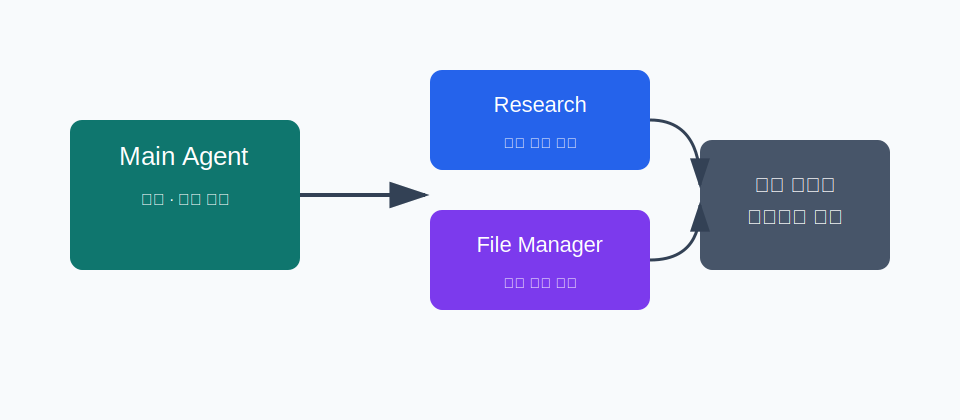
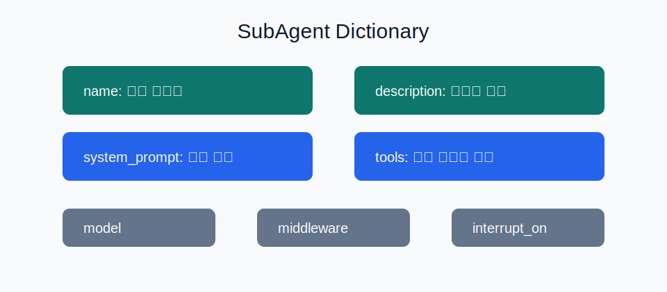
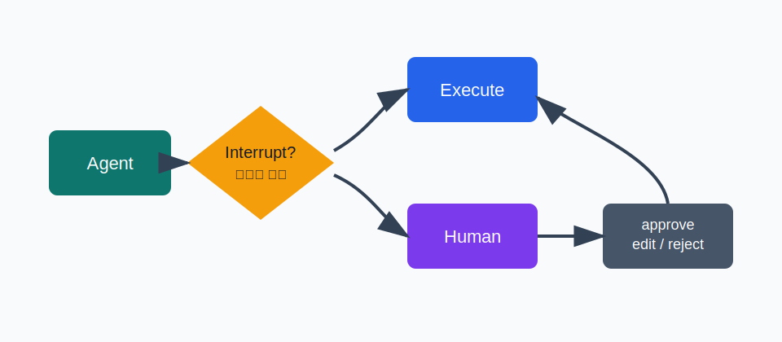
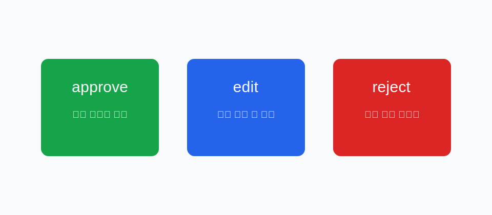
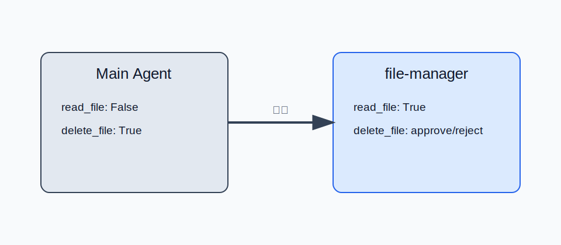

<!-- slide: variant=cover -->
# Subagents & Human-in-the-loop

> 컨텍스트는 격리하고, 위험한 실행은 사람에게 묻는다

<!-- slide: tag="§0 · Bridge" -->
# 1주차에서 2주차로

| 1주차 | 2주차 |
|---|---|
| Deep Agents 전체 지도 | 서브에이전트와 승인 흐름 심화 |
| `create_deep_agent()` 시작점 | `subagents=`와 `interrupt_on=` 실전 |
| 네 가지 능력 개요 | 위임과 제어를 실제 코드로 연결 |

> 오늘의 한 문장: 서브에이전트는 컨텍스트를 격리하고, HITL은 위험한 실행을 사람 승인으로 제어한다.

<!-- slide: tag="§1 · Why" -->
# 단일 컨텍스트가 커지는 순간

| 작업 | 컨텍스트에 쌓이는 것 |
|---|---|
| 웹 검색 | 검색 결과, raw content, 중간 판단 |
| 파일 읽기 | 긴 파일 본문, 줄 번호, 비교 결과 |
| 데이터 분석 | 표, 로그, 오류, 재시도 기록 |

> 메인 에이전트가 모든 중간 결과를 직접 들면 최종 판단에 필요한 정보가 뒤로 밀린다.

<!-- slide: tag="§1 · Isolation" -->
# 서브에이전트는 격리된 작업방



> 메인은 하위 작업을 맡기고, 서브에이전트는 자체 컨텍스트에서 일한 뒤 짧은 결과만 반환한다.

<!-- slide: tag="§2 · Fields" -->
# SubAgent 필드



> `description`은 라우팅 힌트, `system_prompt`는 작업 품질, `tools`는 행동 범위를 결정한다.

<!-- slide: tag="§2 · Code" -->
# 기본 SubAgent 코드

```python
research_subagent = {
    "name": "research-agent",
    "description": "Deep Agents 개념을 짧게 조사하고 핵심만 요약한다.",
    "system_prompt": "도구 결과를 길게 복사하지 말고 5문장 이하 요약만 반환한다.",
    "tools": [summarize_notes],
}
```

<!-- slide: tag="§3 · Patterns" -->
# 범용 vs 전문 서브에이전트

| 패턴 | 사용 시점 |
|---|---|
| `general-purpose` | 전문 지침 없이 컨텍스트 격리만 필요 |
| 전문 SubAgent | 도구, 모델, 출력 형식이 달라야 함 |
| `CompiledSubAgent` | 이미 만든 LangGraph 워크플로우를 꽂아야 함 |

> 처음에는 딕셔너리 기반 전문 서브에이전트로 충분하다.

<!-- slide: tag="§3 · Best" -->
# 좋은 설명이 라우팅을 만든다

| 나쁜 설명 | 좋은 설명 |
|---|---|
| Does finance stuff | 재무 데이터를 분석하고 신뢰도 점수와 함께 투자 인사이트를 반환한다 |
| Handles files | 파일 읽기·삭제 요청을 처리하고 민감 작업은 승인 요청을 반환한다 |

> 메인 에이전트는 `description`을 보고 누구에게 맡길지 결정한다.

<!-- slide: tag="§4 · HITL" -->
# HITL이 필요한 순간

| 도구 | 위험 |
|---|---|
| `delete_file` | 되돌리기 어려운 삭제 |
| `send_email` | 잘못된 수신자와 외부 전송 |
| `write_file` | 기존 데이터 덮어쓰기 |
| `deploy` | 운영 환경 변경 |

> 모델이 할 수 있어도, 바로 해도 되는 것은 아니다.

<!-- slide: tag="§4 · Flow" -->
# Human-in-the-loop 흐름



> 도구 호출 직전에 멈추고, 사람의 결정을 받아 같은 상태에서 재개한다.

<!-- slide: tag="§4 · Config" -->
# `interrupt_on` 기본 구성

```python
agent = create_deep_agent(
    tools=[delete_file, read_file, send_email],
    interrupt_on={
        "delete_file": True,
        "read_file": False,
        "send_email": {"allowed_decisions": ["approve", "reject"]},
    },
    checkpointer=MemorySaver(),
)
```

> 체크포인터와 같은 `thread_id`가 있어야 멈춘 지점에서 이어갈 수 있다.

<!-- slide: tag="§5 · Decisions" -->
# 승인 결정 3종



> `approve`는 그대로 실행, `edit`은 인자 수정 후 실행, `reject`는 호출을 건너뛴다.

<!-- slide: tag="§5 · Resume" -->
# 인터럽트 처리 루프

```python
result = agent.invoke(input, config=config)

if result.get("__interrupt__"):
    interrupts = result["__interrupt__"][0].value
    decisions = [{"type": "approve"}]
    result = agent.invoke(
        Command(resume={"decisions": decisions}),
        config=config,
    )
```

> 재개 호출에는 첫 호출과 같은 `config`를 넘긴다.

<!-- slide: tag="§5 · Multiple" -->
# 여러 도구 호출

| 규칙 | 설명 |
|---|---|
| 한 번에 묶임 | 여러 승인 요청이 단일 인터럽트로 반환될 수 있음 |
| 순서 보존 | `action_requests`와 같은 순서로 decision 제공 |
| 정책 확인 | 도구별 `allowed_decisions`를 UI에 표시 |

> 여러 개가 멈추면 결정도 여러 개다.

<!-- slide: tag="§5 · Edit" -->
# 도구 인자 편집

```python
decisions = [{
    "type": "edit",
    "edited_action": {
        "name": action["name"],
        "args": {
            "to": "team@company.com",
            "subject": "2주차 자료 공유",
            "body": "발표 자료를 공유합니다.",
        },
    },
}]
```

> `edit`은 모델의 의도는 살리되, 실행 인자를 사람이 바로잡는 선택지다.

<!-- slide: tag="§6 · Subagent HITL" -->
# 서브에이전트별 승인 정책



> 메인에서는 안전한 읽기라도 파일 관리 서브에이전트에서는 승인 대상으로 바꿀 수 있다.

<!-- slide: variant=closing -->
# 마무리

| 기능 | 한 줄 역할 |
|---|---|
| Subagents | 무거운 하위 작업을 격리해 메인 컨텍스트를 지킨다 |
| Human-in-the-loop | 위험한 도구 호출 앞에서 사람의 결정을 받는다 |
| 둘의 결합 | 전문 에이전트마다 다른 위험 정책을 적용한다 |

> 위임은 컨텍스트를 줄이고, 승인은 사고를 줄인다.
