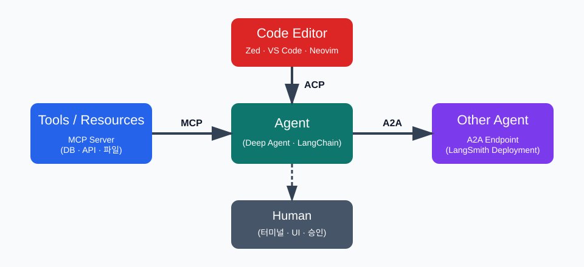
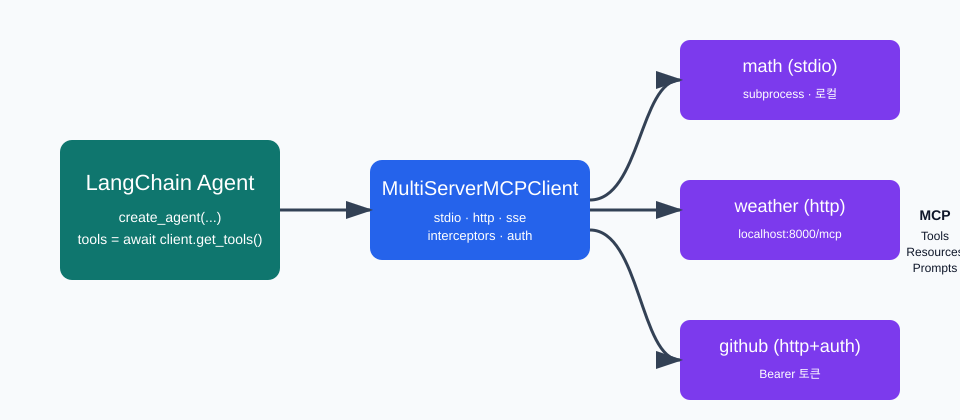
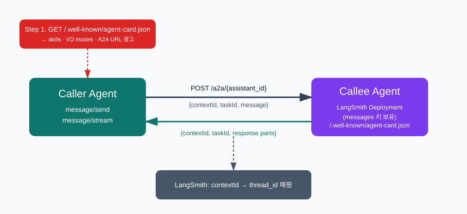
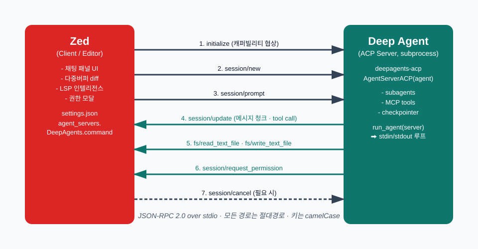
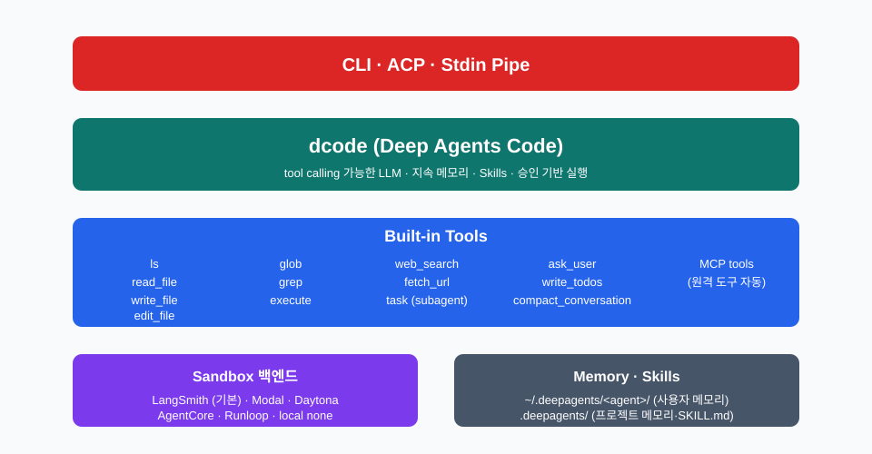

### §0. 3주차 목표와 큰 그림

1주차에서는 Deep Agents의 전체 지도를 그렸고, 2주차에서는 서브에이전트와 Human-in-the-loop으로 메인 에이전트의 컨텍스트와 안전을 다뤘다. 3주차는 같은 에이전트가 **자기 프로세스 바깥**과 어떻게 대화하는지를 본다. 외부 도구, 다른 에이전트, 그리고 사람의 코딩 에디터.

이 글의 한 줄 요약은 다음과 같다.

> **MCP는 도구를, A2A는 에이전트를, ACP는 에디터를 표준 인터페이스로 묶는다. 그리고 Deep Agents Code는 그 위에서 동작하는 LangChain의 코딩 에이전트다.**

세 프로토콜은 한자리에 두면 헷갈리지만, 누가 누구와 말하는지를 먼저 정리하면 명확해진다.



| 프로토콜 | 누가 ↔ 누가 | 한 줄 정의 |
|---|---|---|
| **MCP** | 에이전트 ↔ 도구·리소스·프롬프트 서버 | 모델에 도구·컨텍스트를 표준 방식으로 제공 |
| **A2A** | 에이전트 ↔ 다른 에이전트 | 에이전트 간 대화·작업 위임을 위한 표준 메시지 채널 |
| **ACP** | 에이전트 ↔ 코딩 에디터(IDE) | 에디터가 외부 코딩 에이전트와 통신하는 표준 |

발표는 이 순서를 그대로 따라간다. 먼저 MCP로 도구 연결의 기본기를 잡고, A2A로 에이전트 간 호출을 확장한 뒤, ACP로 에디터 통합까지 간다. 마지막으로 Zed 사례를 보고, LangChain이 그 위에 얹은 코딩 에이전트(`dcode`)로 마무리한다.

---

### §1. MCP — 도구·리소스·프롬프트의 표준화

#### §1.1 왜 MCP인가

모델 자체는 도구를 직접 호출할 수 없다. 호출 형식이 모델마다 달랐고, 같은 도구를 여러 에이전트에 연결하려면 매번 어댑터를 다시 짰다. **Model Context Protocol(MCP)** 은 이 어댑터 코드를 **표준 클라이언트–서버 프로토콜**로 끌어올린다[^1][^10].

MCP 서버는 세 가지를 노출한다.

| 항목 | 의미 |
|---|---|
| **Tools** | 모델이 호출할 수 있는 함수 (DB 쿼리, API 호출 등) |
| **Resources** | 모델이 읽을 수 있는 데이터 (파일, 레코드, API 응답) |
| **Prompts** | 재사용 가능한 프롬프트 템플릿 |

LangChain은 `langchain-mcp-adapters` 라이브러리로 MCP 서버의 Tool을 LangChain Tool로 변환한다. 즉 한 번 MCP 서버를 만들어두면, LangChain Agent든 Deep Agent든 Claude Desktop이든 같은 정의를 쓴다.

#### §1.2 빠른 시작

설치는 한 줄이다.

```bash
pip install langchain-mcp-adapters
```

`MultiServerMCPClient` 가 여러 MCP 서버를 한꺼번에 다룬다. **기본은 stateless** — 도구 호출마다 새 세션을 열고 닫는다.

```python
from langchain_mcp_adapters.client import MultiServerMCPClient
from langchain.agents import create_agent

client = MultiServerMCPClient({
    "math": {
        "transport": "stdio",
        "command": "python",
        "args": ["/abs/path/to/math_server.py"],
    },
    "weather": {
        "transport": "http",
        "url": "http://localhost:8000/mcp",
    },
})

tools = await client.get_tools()
agent = create_agent("claude-sonnet-4-6", tools)
```



#### §1.3 전송 — stdio vs HTTP

| 전송 | 언제 쓰나 | 특성 |
|---|---|---|
| `stdio` | 로컬 도구·서버를 서브프로세스로 띄울 때 | 본질적으로 stateful, 단순 |
| `http` (Streamable HTTP) | 원격 MCP 서버 | 헤더로 인증, 멀티 클라이언트 가능 |
| `sse` | 구버전 호환 | MCP 사양에서는 deprecated |

stdio는 클라이언트 수명 동안 서브프로세스가 살아 있다. 그러나 `MultiServerMCPClient`는 명시적 세션 관리가 없으면 각 도구 호출마다 새 세션을 만든다. 진짜로 세션을 이어가려면 `client.session()`을 직접 연다.

```python
async with client.session("math") as session:
    tools = await load_mcp_tools(session)
    agent = create_agent("claude-sonnet-4-6", tools)
```

#### §1.4 인증과 인터셉터

원격 MCP에는 Bearer 토큰을 헤더로 넘기는 게 가장 흔하다.

```python
client = MultiServerMCPClient({
    "weather": {
        "transport": "http",
        "url": "http://localhost:8000/mcp",
        "headers": {"Authorization": "Bearer YOUR_TOKEN"},
    }
})
```

더 정교한 흐름이 필요하면 `httpx.Auth`를 구현해 `auth=` 로 넘기거나, MCP SDK 의 OAuth 흐름을 쓴다.

진짜 강력한 기능은 **Tool 인터셉터**다. MCP 서버는 별도 프로세스이므로 LangGraph 런타임(스토어, 상태, 사용자 컨텍스트)에 닿을 수 없다. 인터셉터는 그 간극을 메우는 미들웨어다.

```python
from langchain_mcp_adapters.interceptors import MCPToolCallRequest

async def inject_user_context(request: MCPToolCallRequest, handler):
    runtime = request.runtime
    modified = request.override(
        args={**request.args, "user_id": runtime.context.user_id}
    )
    return await handler(modified)

client = MultiServerMCPClient({...}, tool_interceptors=[inject_user_context])
```

인터셉터는 **양파 순서**로 합성된다. 리스트의 첫 번째가 가장 바깥쪽 레이어 — 인증 → 속도 제한 → 로깅 → 실제 호출.

> **요점.** MCP는 도구 호출의 와이어 프로토콜이다. 한 번 MCP 서버로 노출하면 어느 에이전트에서도 같은 도구를 쓸 수 있고, LangChain 측은 인터셉터로 런타임 맥락을 주입한다.

---

### §2. A2A — 에이전트 간 통신 표준

#### §2.1 왜 A2A인가

MCP가 "에이전트 → 도구"의 표준이라면, **Agent-to-Agent(A2A)** 는 "에이전트 → 에이전트"의 표준이다[^2][^9]. Google이 제안하고 여러 벤더가 채택한 프로토콜로, 한 에이전트가 다른 에이전트를 마치 외부 서비스처럼 호출할 수 있게 한다.

LangSmith Deployment(= LangGraph 서버)는 `langgraph-api>=0.4.21` 부터 A2A를 **기본 활성**으로 노출한다. 즉 별도 코드 없이도 배포된 그래프가 A2A 엔드포인트를 갖는다 — 단, 그래프 상태에 `messages` 키가 있어야 한다(A2A의 text part 스펙 때문).



#### §2.2 노출되는 엔드포인트

배포된 에이전트마다 두 엔드포인트가 자동으로 열린다.

| 메소드 | 경로 | 역할 |
|---|---|---|
| `GET` | `/.well-known/agent-card.json?assistant_id={id}` | Agent Card — 이름·설명·스킬·입출력 모드 광고 |
| `POST` | `/a2a/{assistant_id}` | JSON-RPC 본체 |

Agent Card 는 클라이언트가 "이 에이전트가 무엇을 할 수 있는지" 미리 파악하기 위한 디스커버리 문서다. JSON-RPC 본체는 다음 세 메소드를 받는다.

| RPC 메소드 | 설명 |
|---|---|
| `message/send` | 메시지 보내고 완료 응답 받음 |
| `message/stream` | SSE 로 토큰·이벤트 스트림 수신 |
| `tasks/get` | 이전에 만든 task 상태·결과 조회 |

#### §2.3 대화 이어가기 — contextId · taskId

A2A 는 두 식별자로 대화의 연속성을 유지한다.

| 식별자 | 의미 |
|---|---|
| `contextId` | 대화 스레드(세션) — 같은 contextId 메시지는 같은 thread 로 묶임 |
| `taskId` | 단일 요청 식별자 |

**첫 호출에는 둘 다 비워서 보낸다.** 서버가 값을 생성해 응답에 넣어 돌려준다. 이후 호출은 반드시 그 값을 그대로 다시 넘겨야 같은 스레드로 이어진다. LangSmith는 `contextId` 를 자동으로 `thread_id` 로 매핑해 트레이스에 한 묶음으로 보여준다.

#### §2.4 끄고 켜기

기본은 활성. 끄려면 `langgraph.json` 에 한 줄 추가한다.

```json
{
  "$schema": "https://langgra.ph/schema.json",
  "http": { "disable_a2a": true }
}
```

#### §2.5 MCP 와 A2A 가 같이 산다

MCP 서버는 "도구"이고 A2A 엔드포인트는 "에이전트"다. 한 에이전트가 다음을 동시에 한다는 게 자연스러운 그림이다.

1. 자기 도구는 MCP 로 받아쓴다 (`langchain-mcp-adapters`).
2. 자기 자신을 A2A 로 노출해 상위 오케스트레이터가 호출하게 둔다.
3. 같이 일해야 할 다른 에이전트에는 A2A 클라이언트로 접근한다.

> **요점.** A2A 는 LangSmith 에 배포된 그래프가 자동으로 얻는 표준 인터페이스다. `messages` 키만 갖추면, 다른 에이전트가 우리 에이전트를 외부 서비스처럼 호출할 수 있다.

---

### §3. ACP — 에이전트와 코딩 에디터의 표준 통신

#### §3.1 왜 또 다른 프로토콜인가

MCP 와 A2A 가 있는데 왜 또 하나? 답은 **타깃이 다르다**[^3][^6][^7].

| 프로토콜 | 타깃 상대 | 목적 |
|---|---|---|
| MCP | 도구 서버 | 모델에 도구·자원·프롬프트 공급 |
| A2A | 다른 에이전트 | 에이전트 간 작업 위임 |
| **ACP** | **코딩 에디터(IDE)** | **에디터가 외부 코딩 에이전트를 사용** |

LSP(Language Server Protocol) 가 "언어 지능을 모놀리식 IDE 에서 풀어냈듯", ACP 는 "코딩 에이전트를 모놀리식 IDE 에서 풀어내는" 것을 목표로 한다[^5]. 즉 **에디터를 바꾸지 않고 에이전트를 갈아끼우는** 게 ACP 의 존재 이유다.

ACP 는 LSP 의 정신을, MCP 의 JSON 스키마를 빌려와서 코딩 UX 에 필요한 타입(diff, 권한 요청, 파일 읽기·쓰기)을 추가한다.

#### §3.2 와이어 프로토콜 — JSON-RPC over stdio

ACP 의 기본 배포 모델은 단순하다.

- **로컬 모델**: 에디터가 에이전트를 **서브프로세스**로 띄우고 **stdin/stdout** 위에서 **JSON-RPC 2.0** 으로 대화한다.
- **원격 모델**: HTTP/WebSocket 위에서도 동작 가능(WIP).

JSON-RPC 답게 메시지는 두 종류다.

| 종류 | 설명 |
|---|---|
| **Methods** | 요청-응답 쌍 |
| **Notifications** | 일방향 알림 (응답 없음) |

#### §3.3 라이프사이클 — 5단계로 요약



| # | 메소드 | 방향 | 역할 |
|---|---|---|---|
| 1 | `initialize` | Client → Agent | 프로토콜 버전·capabilities 교환 |
| 2 | `authenticate` | Client → Agent | (선택) 인증 흐름 |
| 3 | `session/new` | Client → Agent | 새 대화 세션 생성 |
| 4 | `session/prompt` | Client → Agent | 사용자 프롬프트 전송 |
| 5 | `session/update` | Agent → Client | 메시지 청크·도구 호출·플랜 진행 알림 |

세션을 재개하려면 `session/load`, 진행 중인 작업을 중단하려면 `session/cancel` 을 쓴다.

#### §3.4 도구 호출과 권한 — 에디터가 게이트키퍼

ACP 에서 핵심은 "에이전트가 자기 호스트의 파일을 만지지 않고, **에디터에 부탁**한다" 는 설계다.

| 메소드 | 방향 | 의미 |
|---|---|---|
| `fs/read_text_file` | Agent → Client | 파일 내용 요청 (절대경로) |
| `fs/write_text_file` | Agent → Client | 파일 수정 요청 |
| `session/request_permission` | Agent → Client | 도구 호출 사용자 승인 요청 |
| `terminal/*` | Agent → Client | (capability) 터미널 생성·실행 |

이 구조 덕에 에디터가 항상 **게이트키퍼** 역할을 한다. 에이전트가 `rm -rf` 같은 위험한 명령을 직접 실행할 수 없고, 사용자가 보는 UI 에서 승인이 떨어진 뒤에야 동작한다. 이는 2주차에서 본 Deep Agents 의 HITL 사상과 그대로 맞물린다.

#### §3.5 Capabilities — 기능 협상

`initialize` 단계에서 양쪽이 자기 능력을 광고한다.

| 캐퍼빌리티 | 의미 |
|---|---|
| `loadSession` | `session/load` 지원 |
| `fs.readTextFile` / `fs.writeTextFile` | 파일 작업 가능 |
| `terminal` | 터미널 명령 실행 가능 |
| `auth.logout` | 로그아웃 메소드 지원 |

규칙 두 가지만 기억하자. **키는 camelCase**, **파일 경로는 항상 절대경로**.

#### §3.6 Deep Agents 의 ACP 어댑터

LangChain 측에서는 `deepagents-acp` 패키지가 Deep Agent 를 ACP 서버로 감싸준다.

```bash
pip install deepagents-acp
```

```python
import asyncio
from acp import run_agent
from deepagents import create_deep_agent
from langgraph.checkpoint.memory import MemorySaver
from deepagents_acp.server import AgentServerACP


async def main() -> None:
    agent = create_deep_agent(
        model="google_genai:gemini-3.5-flash",
        system_prompt="You are a helpful coding assistant",
        checkpointer=MemorySaver(),
    )
    server = AgentServerACP(agent)
    await run_agent(server)


if __name__ == "__main__":
    asyncio.run(main())
```

`run_agent(server)` 가 stdin 을 읽고 stdout 에 응답을 적는 ACP 루프를 돌린다. 이게 우리가 Zed 같은 에디터에 등록할 "에이전트 실행파일" 이다.

> **요점.** ACP 는 "에디터 ↔ 에이전트" 사이의 LSP 다. JSON-RPC over stdio 로 시작·세션·프롬프트·도구·권한을 표준화하고, 에디터를 게이트키퍼로 두어 코딩 작업의 안전성을 보장한다.

---

### §4. Zed + ACP — 코딩 에디터와 에이전트의 결합

#### §4.1 Zed 가 ACP 를 만든 이유

Zed 는 Rust 로 만든 협업 코드 에디터로, 처음부터 AI 워크플로우를 1급 시민으로 다뤘다. ACP 는 **Zed Industries** 가 주도해 공개한 프로토콜이다[^5][^8].

> "Just as the Language Server Protocol unbundled language intelligence from monolithic IDEs, our goal with the Agent Client Protocol is to enable you to switch between multiple agents without switching your editor." — Nathan Sobo, Zed

발단은 실용적이었다. Google Gemini CLI 팀이 자기네 에이전트를 Zed 터미널에서 쓰는 걸 선호한다는 사실을 알게 되었고, "터미널 이스케이프 코드 위에" 만드는 통합이 너무 빈약하다는 결론이 났다. 답은 "에이전트가 말할 JSON-RPC 엔드포인트를 정의하자" 였다.

#### §4.2 Zed 의 통합 아키텍처

Zed 는 자기 자신의 인하우스 에이전트도 동일한 ACP 코드 경로로 정렬했다. 즉 **외부 에이전트와 내장 에이전트가 같은 UI 프리미티브를 공유**한다. 그래서 새 UI 컴포넌트(예: 다중 버퍼 코드 리뷰, 실시간 diff)는 만들면 자동으로 외부 에이전트에서도 쓸 수 있다.

ACP 통합으로 Zed 가 외부 에이전트에 제공하는 것들:

| 기능 | 무엇이 좋아지나 |
|---|---|
| 실시간 edit 시각화 | 에이전트가 작업하는 동안 diff 가 라이브로 보임 |
| Multi-buffer 코드 리뷰 | 여러 파일 변경을 한 화면에 묶어 검토 |
| Language Server 통합 | 에이전트의 편집 결과에 LSP 인텔리전스 적용 |
| Tool · MCP 접근 제어 | 어떤 도구·MCP 서버를 허용할지 정책 |
| 데이터 안전 | 에이전트 호출이 Zed 서버를 거치지 않음 |

#### §4.3 Zed 에 외부 에이전트 등록하기

Zed 의 `settings.json` 에 `agent_servers` 항목을 더한다. 우리가 §3.6 에서 만든 `deepagents-acp` 서버를 그대로 꽂는 예시는 이렇다.

```json
{
  "agent_servers": {
    "DeepAgents": {
      "type": "custom",
      "command": "/abs/path/to/deepagents/libs/acp/run_demo_agent.sh"
    }
  }
}
```

Zed 는 이 명령을 서브프로세스로 띄우고 stdio 로 ACP JSON-RPC 를 주고받는다. 사용자에겐 그냥 채팅 패널에 "DeepAgents" 가 하나 더 떠 있는 것처럼 보인다.

#### §4.4 ACP 가 만든 생태계 — 클라이언트와 에이전트

ACP 가 짧은 기간에 만든 흥미로운 사실은, **에디터/에이전트 둘 다 다대다 매칭**이 가능해졌다는 점이다.

| 카테고리 | 사례 |
|---|---|
| **클라이언트 (에디터/도구)** | Zed, VS Code (ACP Client 확장), JetBrains, Neovim (CodeCompanion·avante.nvim·agentic.nvim), Emacs (`agent-shell.el`), Obsidian, Chrome ACP, Unity, CLI/TUI (Toad, acpx, Nori), 모바일(Happy, Mobvibe 등) |
| **에이전트** | Claude Agent (Zed SDK 어댑터), Gemini CLI, Codex CLI, Cursor, Cline, OpenHands, GitHub Copilot(public preview), Junie by JetBrains, Goose, **Deep Agents (`deepagents-acp`)**, 외 다수 |

언어별 공식 SDK 도 다섯 개가 있다 — Rust crate `agent-client-protocol`, npm `@agentclientprotocol/sdk`, Python `python-sdk`, Java `java-sdk`, Kotlin `acp-kotlin`. 라이선스는 Apache 2.0[^8].

> **요점.** Zed 는 ACP 의 레퍼런스 구현체이자 가장 적극적인 클라이언트다. ACP 덕에 "에디터는 그대로 두고 에이전트만 바꾸기"가 가능해졌고, Deep Agents 도 그 생태계의 일원이다.

---

### §5. Deep Agents Code — LangChain 의 코딩 에이전트

#### §5.1 dcode 는 무엇인가

여기까지가 프로토콜 이야기였다면, **Deep Agents Code(`dcode`)** 는 그 위에서 동작하는 LangChain 의 **오픈소스 코딩 에이전트**다[^4]. Claude Code, Cursor 같은 도구의 LangChain 판이라고 보면 된다.

dcode 의 특징은 네 가지다.

| 특징 | 설명 |
|---|---|
| 임의 LLM 지원 | Tool calling 만 되면 어떤 모델이든 (Anthropic, OpenAI, Gemini, Fireworks, NVIDIA …) |
| 대화 간 지속 메모리 | 세션을 넘어 학습한 내용을 유지 |
| Skills 시스템 | 필요할 때만 불러오는 전문 지식 (`SKILL.md`) |
| 승인 기반 실행 | 파괴적 작업은 기본 사람의 OK 를 받음 |

#### §5.2 기본 도구 세트

`create_deep_agent` 로 직접 조립하지 않아도, dcode 는 다음 도구들을 **빌트인**으로 제공한다.



| 도구 | 역할 |
|---|---|
| `ls` | 파일·디렉토리 나열 |
| `read_file` | 파일 읽기 (일부 모델은 멀티모달) |
| `write_file` | 새 파일 만들기·덮어쓰기 |
| `edit_file` | 기존 파일 부분 수정 |
| `glob` | 패턴 매칭으로 파일 찾기 |
| `grep` | 텍스트 패턴 검색 |
| `execute` | 셸 명령 실행 (로컬·원격) |
| `web_search` | Tavily 기반 웹 검색 |
| `fetch_url` | 웹페이지를 마크다운으로 가져오기 |
| `task` | 서브에이전트에 위임 |
| `ask_user` | 사용자에게 자유·객관식 질문 |
| `compact_conversation` | 메시지 요약·오프로드 |
| `write_todos` | 작업 리스트 관리 |

2주차의 `task` 와 HITL 흐름이 그대로 들어와 있다는 점에 주목하자. dcode 는 "Deep Agents 의 모범 답안" 같은 자리다.

#### §5.3 설치와 첫 실행

설치는 한 줄.

```bash
curl -LsSf https://langch.in/dcode | bash
```

선택 의존성이 필요하면 `DEEPAGENTS_EXTRAS` 를 주거나 `uv tool` 로 깐다.

```bash
DEEPAGENTS_EXTRAS="fireworks,nvidia" curl -LsSf https://langch.in/dcode | bash
uv tool install 'deepagents-code[fireworks,nvidia]'
```

기본 실행은 그냥 `dcode`. 자주 쓰는 옵션은 다음과 같다.

```bash
dcode --agent mybot
dcode --model anthropic:claude-opus-4-7
dcode -y                                   # 모든 승인 자동 통과
dcode --startup-cmd "ls -la" -m "Summarize this directory"
dcode -n "Write a Python script that prints hello world"   # 비대화
echo "Explain this code" | dcode                            # 파이프 입력
dcode -n "fix tests" --max-turns 10 --timeout 120
```

#### §5.4 설정 위치

dcode 는 두 단계의 설정 폴더를 본다.

| 위치 | 용도 |
|---|---|
| `~/.deepagents/config.toml` | 모델·에이전트 디폴트 |
| `~/.deepagents/.env` | API 키·시크릿 |
| `~/.deepagents/hooks.json` | 라이프사이클 훅 |
| `~/.deepagents/<agent_name>/` | 에이전트별 메모리·스레드 |
| `.deepagents/` (프로젝트 루트) | 프로젝트 전용 메모리·Skills |

`~/.deepagents/<agent>/` 와 `.deepagents/` 분리가 핵심이다. 사용자 차원의 기본 메모리와 **이 프로젝트에서만** 통하는 메모리를 같은 모델이 분리해서 활용한다.

#### §5.5 샌드박스 — 코드 실행을 격리하기

`execute` 가 위험할 수 있으니, dcode 는 여러 원격 백엔드를 옵션으로 받는다.

| 백엔드 | 비고 |
|---|---|
| **LangSmith** | 기본 포함 |
| **AgentCore** | extras 필요 |
| **Modal** | extras 필요 |
| **Daytona** | extras 필요 |
| **Runloop** | extras 필요 |

별도 지정이 없으면 `--sandbox none` 으로 로컬 실행이다. 운영 환경이라면 Modal 이나 Daytona 같은 원격 샌드박스로 격리하는 게 안전하다.

#### §5.6 권한 모델 — 위험한 작업은 사람에게

기본적으로 다음 도구들은 **사용자 승인 후에만** 실행된다.

| 카테고리 | 도구 |
|---|---|
| 파일 쓰기 | `write_file`, `edit_file` |
| 셸 실행 | `execute` |
| 웹 작업 | `web_search`, `fetch_url` |
| 위임 | `task` |
| 컨텍스트 압축 | `compact_conversation` |

승인 동작은 두 방식으로 끌 수 있다.

```bash
dcode -y                # 모든 승인 통과
dcode --auto-approve    # 동의
# 또는 대화 중 Shift+Tab 로 토글
```

비대화 모드(`-n`)에서는 셸 명령에 화이트리스트도 줄 수 있다.

```bash
dcode -n "fix tests" -S "pytest,git,make"
dcode -n "build" -S recommended   # 안전 디폴트
dcode -n "fix" -S all             # 어떤 명령이든
```

#### §5.7 dcode 가 일반 Deep Agent 와 다른 점

핵심 차이는 **개발 워크플로우 특화**다.

| 항목 | 일반 Deep Agent | Deep Agents Code |
|---|---|---|
| 도구 구성 | 사용자가 직접 조립 | 코딩 도구 빌트인 |
| 메모리 | 세션 단위 | 세션 간 지속, 프로젝트별 분리 |
| HITL | `interrupt_on` 직접 설정 | 위험 도구는 기본 승인 |
| 실행 환경 | 사용자 정의 | LangSmith 샌드박스 기본 + 다수 옵션 |
| 관측성 | 옵션 | LangSmith 트레이싱 기본 |

#### §5.8 어떻게 한 그림이 되나

이번 주의 네 주제는 한 무대 위에 있다.

1. **MCP** 로 외부 도구를 끌어온다. — dcode 는 MCP 서버를 자동 인식.
2. 그 위의 에이전트가 작업을 한다. — `dcode` 자체.
3. 다른 에이전트와 협력해야 하면 **A2A** 로 호출한다. — LangSmith 에 배포된 다른 그래프.
4. 사람과의 접점은 터미널 또는 **ACP** 를 통한 에디터다. — Zed, VS Code, Neovim.

> **요점.** Deep Agents Code 는 "프로토콜의 소비자" 다. MCP 로 도구를 받고, A2A 로 동료 에이전트와 말하며, ACP 를 통해 에디터에 들어간다. 세 프로토콜은 따로 외울 게 아니라 한 에이전트의 입·출구다.

---

### 부록 A. 세 프로토콜 빠른 비교

| 항목 | MCP | A2A | ACP |
|---|---|---|---|
| 표준화 대상 | 에이전트 ↔ 도구 | 에이전트 ↔ 에이전트 | 에이전트 ↔ 에디터 |
| 메시지 형식 | JSON-RPC (HTTP·stdio) | JSON-RPC (HTTP) | JSON-RPC (stdio 기본) |
| 디스커버리 | 서버가 tools/resources/prompts 광고 | `/.well-known/agent-card.json` | `initialize` 시 capabilities 교환 |
| 인증 | 헤더·`httpx.Auth`·OAuth | 서버 정책 | `authenticate` 메소드(선택) |
| 세션 식별자 | 기본 stateless, `session()` 으로 stateful | `contextId` + `taskId` | `sessionId` (`session/new` 응답) |
| 대표 구현 | langchain-mcp-adapters | langgraph-api ≥ 0.4.21 | deepagents-acp, Zed |

### 부록 B. 트러블슈팅

| 증상 | 원인 / 해결 |
|---|---|
| MCP stdio 서버가 매 호출마다 다시 뜨는 듯 | `MultiServerMCPClient` 기본은 stateless. `async with client.session(...)` 로 명시 |
| A2A 가 404 로 응답 | 그래프 상태에 `messages` 키가 없거나 `langgraph-api` 가 0.4.21 미만 |
| A2A 두 번째 호출이 새 스레드로 잡힘 | 첫 응답의 `contextId`·`taskId` 를 다시 넣지 않음 |
| Zed 에서 외부 에이전트가 안 보임 | `settings.json` 의 `agent_servers.<name>.command` 가 절대경로가 아니거나 실행 권한 없음 |
| ACP `fs/*` 호출이 거부됨 | `initialize` 단계에서 클라이언트가 해당 capability 를 광고하지 않음 |
| dcode 가 매번 승인을 묻는다 | `-y` 또는 `--auto-approve`, 또는 대화 중 Shift+Tab |

### 부록 C. 실행 스크립트

실행 스크립트는 `scripts/README.md` 에 정리되어 있다.

- `01`, `02` 는 **MCP** 클라이언트 패턴 (기본 / 인터셉터).
- `03` 은 **A2A** Agent Card 디스커버리.
- `04` 는 **ACP** Deep Agents 서버.
- `05` 는 **Deep Agents Code 스타일**의 빌트인 코딩 도구 데모.
