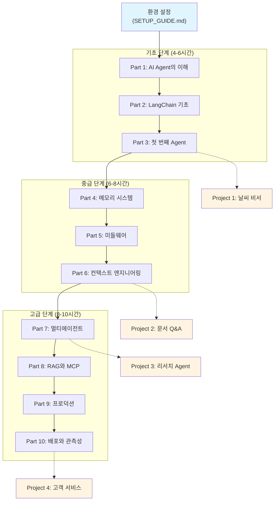
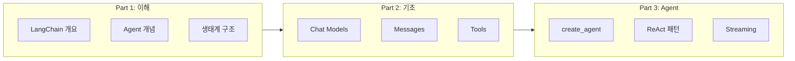
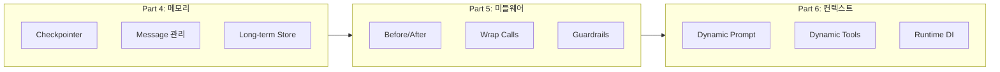
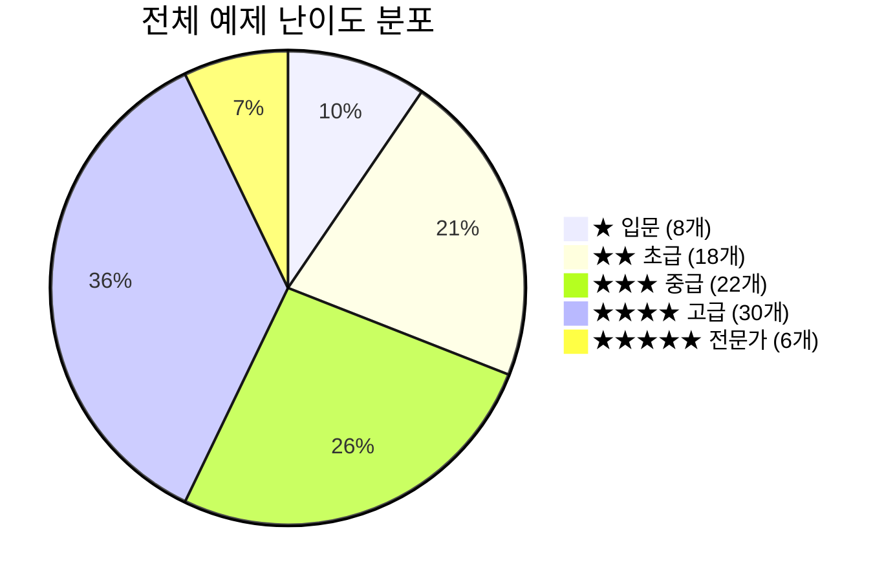
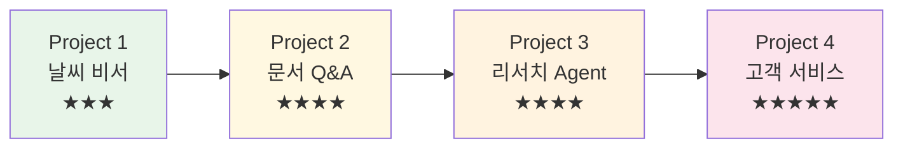
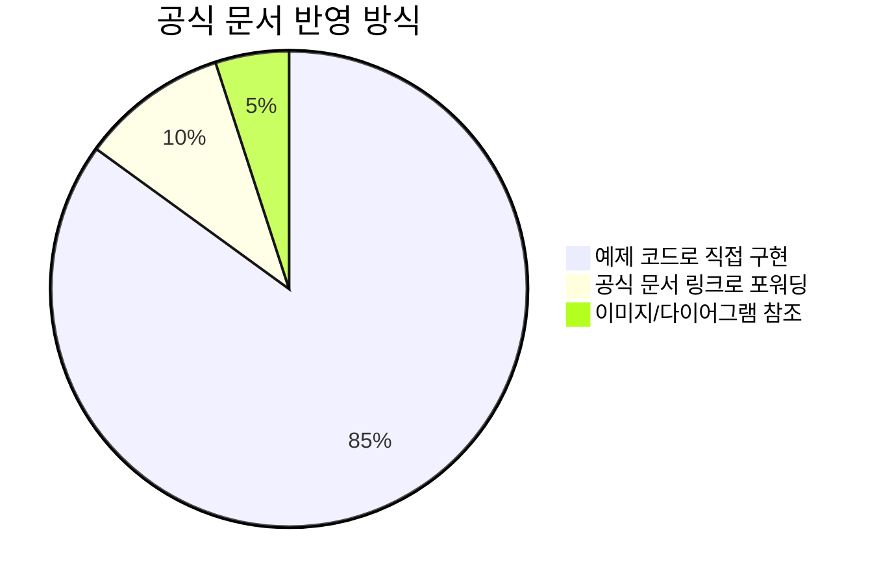

# LangChain AI Agent 마스터 교안

> LangChain 1.0 기반 AI Agent 개발 완벽 가이드 (한국어)

기초부터 프로덕션 배포까지, AI Agent 개발의 전 과정을 다루는 체계적인 한국어 교육 자료입니다.
LangChain 공식 문서(34개)를 기반으로 10개 파트의 교안, 132개의 예제 코드, 4개의 실전 프로젝트를 제공합니다.

### 핵심 특징

| 항목 | 내용 |
|------|------|
| 공식 문서 커버리지 | 34개 문서, ~120개 섹션 **100% 반영** |
| 실행 가능한 코드 | 132개 Python 예제 전체 실행 가능 |
| 난이도 시스템 | 모든 예제에 1~5단계 난이도 표시 |
| 한국어 품질 | 자연스럽고 기술적으로 정확한 한국어 교안 |
| 실전 프로젝트 | 4개 미니 프로젝트 (테스트 코드 포함) |

---

## 목차

1. [학습 로드맵](#학습-로드맵)
2. [프로젝트 구조](#프로젝트-구조)
3. [교안 구성](#교안-구성)
4. [난이도 시스템](#난이도-시스템)
5. [빠른 시작](#빠른-시작)
6. [학습 경로](#학습-경로)
7. [미니 프로젝트](#미니-프로젝트)
8. [데이터셋](#데이터셋)
9. [공식 문서 커버리지](#공식-문서-커버리지)
10. [요구사항 및 설치](#요구사항-및-설치)
11. [라이선스](#라이선스)

---

## 학습 로드맵



> 실선 화살표는 학습 순서, 점선 화살표는 해당 파트 완료 후 도전 가능한 프로젝트를 나타냅니다.

---

## 프로젝트 구조

```
langchain/
├── docs/                           # 교안 본문 (10개 파트 + 부록)
│   ├── part01_introduction.md          # Part 1: AI Agent의 이해
│   ├── part02_fundamentals.md          # Part 2: LangChain 기초
│   ├── part03_first_agent.md           # Part 3: 첫 번째 Agent
│   ├── part04_memory.md                # Part 4: 메모리 시스템
│   ├── part05_middleware.md            # Part 5: 미들웨어
│   ├── part06_context.md               # Part 6: 컨텍스트와 런타임
│   ├── part07_multi_agent.md           # Part 7: 멀티에이전트
│   ├── part08_rag_mcp.md               # Part 8: RAG와 MCP
│   ├── part09_production.md            # Part 9: 프로덕션
│   ├── part10_deployment.md            # Part 10: 배포와 관측성
│   └── appendix/                       # 부록 (용어집, 리소스, FAQ 등)
│
├── src/                            # 예제 소스코드 (96개 .py 파일)
│   ├── part01_introduction/            # 예제 4개 + 솔루션 2개
│   ├── part02_fundamentals/            # 예제 8개 + 솔루션 3개
│   ├── part03_first_agent/             # 예제 8개 + 솔루션 3개
│   ├── part04_memory/                  # 예제 9개 + 솔루션 3개
│   ├── part05_middleware/              # 예제 10개 + 솔루션 3개
│   ├── part06_context/                 # 예제 9개 + 솔루션 3개
│   ├── part07_multi_agent/             # 예제 10개 + 솔루션 3개
│   ├── part08_rag_mcp/                 # 예제 9개 + 솔루션 3개
│   ├── part09_production/              # 예제 10개 + 솔루션 3개
│   ├── part10_deployment/              # 예제 9개 + 솔루션 3개
│   └── requirements.txt                # Python 의존성
│
├── projects/                       # 미니 프로젝트 (36개 .py 파일)
│   ├── 01_weather_assistant/           # 날씨 조회 Agent
│   ├── 02_document_qa/                 # 문서 기반 Q&A (RAG)
│   ├── 03_research_agent/              # 리서치 Agent
│   └── 04_customer_service/            # 고객 서비스 멀티에이전트
│
├── datasets/                       # 실습 데이터셋 (14개 파일)
│   ├── sample_documents/               # RAG용 마크다운 문서 7개
│   ├── test_conversations/             # Agent 테스트 대화 3개
│   └── evaluation_sets/                # 평가 벤치마크 3개
│
├── official/                       # LangChain 공식 문서 원본/번역
│   ├── *_ko.md                         # 한국어 번역 34개
│   └── *.md                            # 영문 원본 35개
│
├── assets/                         # 다이어그램, 이미지
│   └── diagrams/                       # Mermaid 다이어그램 5개
│
├── exercises/                      # 인터랙티브 연습 문제
│   └── part01/                         # Part 1 웹 기반 연습
│
├── presentations/                  # 발표 자료
│   └── Part01_AI_Agent의_이해.pptx
│
├── SETUP_GUIDE.md                  # 환경 설정 상세 가이드
├── CURRICULUM_PLAN.md              # 전체 커리큘럼 설계 문서
└── IMPLEMENTATION_CHECKLIST.md     # 구현 체크리스트
```

### 콘텐츠 규모

| 항목 | 수량 |
|------|------|
| 교안 문서 | 10개 파트 + 부록 4개 |
| Python 예제 | 96개 (src/) + 36개 (projects/) = **132개** |
| 실습 솔루션 | 30개 (파트당 3개) |
| 미니 프로젝트 | 4개 |
| 실습 데이터셋 | 14개 파일 (64개 레코드) |
| 공식 문서 번역 | 34개 (한국어) |

---

## 교안 구성

### 10개 파트 개요

| 파트 | 제목 | 교안 | 예제 코드 | 난이도 | 학습 시간 |
|-----|------|------|----------|-------|---------|
| Part 1 | AI Agent의 이해 | [교안](docs/part01_introduction.md) | [코드](src/part01_introduction/) | 입문 | 2-3시간 |
| Part 2 | LangChain 기초 | [교안](docs/part02_fundamentals.md) | [코드](src/part02_fundamentals/) | 입문 | 3-4시간 |
| Part 3 | 첫 번째 Agent | [교안](docs/part03_first_agent.md) | [코드](src/part03_first_agent/) | 초급 | 3-4시간 |
| Part 4 | 메모리 시스템 | [교안](docs/part04_memory.md) | [코드](src/part04_memory/) | 초급 | 4-5시간 |
| Part 5 | 미들웨어 | [교안](docs/part05_middleware.md) | [코드](src/part05_middleware/) | 중급 | 4-5시간 |
| Part 6 | 컨텍스트와 런타임 | [교안](docs/part06_context.md) | [코드](src/part06_context/) | 중급 | 3-4시간 |
| Part 7 | 멀티에이전트 시스템 | [교안](docs/part07_multi_agent.md) | [코드](src/part07_multi_agent/) | 중급 | 5-6시간 |
| Part 8 | RAG와 MCP | [교안](docs/part08_rag_mcp.md) | [코드](src/part08_rag_mcp/) | 중급 | 5-6시간 |
| Part 9 | 프로덕션 | [교안](docs/part09_production.md) | [코드](src/part09_production/) | 고급 | 4-5시간 |
| Part 10 | 배포와 관측성 | [교안](docs/part10_deployment.md) | [코드](src/part10_deployment/) | 고급 | 4-5시간 |

**총 학습 시간**: 약 38-47시간

### 파트별 핵심 내용

**기초 (Part 1-3)** -- LangChain / LangGraph 생태계, Tool 정의와 Function Calling, ReAct 패턴 Agent



**심화 (Part 4-6)** -- 메모리(In-memory, PostgreSQL, Long-term), 미들웨어(Hooks, Retry, Guardrails), 컨텍스트(Runtime 주입, 동적 프롬프트)



**응용 (Part 7-8)** -- 멀티에이전트(Subagents, Handoffs, Router, Supervisor), RAG(Vector Store, Agentic RAG), MCP 통합

**프로덕션 (Part 9-10)** -- 스트리밍, Human-in-the-Loop, 테스트 전략, LangSmith 관측성, 배포 아키텍처

### 각 파트 구성

모든 파트는 동일한 구조를 따릅니다:

```
docs/partXX_*.md          교안 본문 (개념 설명, 코드 해설, 실습 과제)
src/partXX_*/
├── 01_*.py ~ 0N_*.py     단계별 예제 코드 (실행 가능)
├── README.md             예제 코드 가이드
└── solutions/
    └── exercise_01~03.py 실습 과제 솔루션
```

---

## 난이도 시스템

모든 예제 코드와 프로젝트에는 난이도가 표시되어 있습니다.

### 난이도 기준

| 레벨 | 표시 | 설명 | 예상 소요 시간 |
|------|------|------|--------------|
| 1 | ★☆☆☆☆ | **입문** - Python 기초만 있으면 가능 | 10-15분 |
| 2 | ★★☆☆☆ | **초급** - LangChain 기본 개념 이해 필요 | 15-30분 |
| 3 | ★★★☆☆ | **중급** - Agent 동작 원리 이해 필요 | 30-60분 |
| 4 | ★★★★☆ | **고급** - 복잡한 시스템 설계 능력 필요 | 1-2시간 |
| 5 | ★★★★★ | **전문가** - 프로덕션 수준 구현 능력 필요 | 2-4시간 |

### 난이도 분포



> 입문~초급 예제로 기초를 다진 후, 중급~고급 예제로 실전 역량을 키울 수 있도록 구성했습니다.

---

## 빠른 시작

### 1. 환경 설정

```bash
# 프로젝트 디렉토리로 이동
cd langchain

# Python 가상환경 생성 (3.10 이상, 3.11 권장)
python -m venv venv
source venv/bin/activate  # Windows: venv\Scripts\activate

# 의존성 설치
pip install -r src/requirements.txt
```

환경변수 설정 - `.env` 파일 생성:

```bash
# OpenAI (필수 - 하나 이상의 LLM 프로바이더 필요)
OPENAI_API_KEY=sk-proj-...

# Anthropic (선택)
ANTHROPIC_API_KEY=sk-ant-...

# Google (선택)
GOOGLE_API_KEY=AI...

# LangSmith (선택, Part 9-10에서 필요)
LANGSMITH_API_KEY=lsv2_pt_...
LANGSMITH_TRACING=true
```

상세 가이드: [SETUP_GUIDE.md](SETUP_GUIDE.md)

### 2. 첫 Agent 실행

```python
from langchain.tools import tool
from langchain.agents import create_agent
from langchain_openai import ChatOpenAI
from dotenv import load_dotenv

load_dotenv()

@tool
def get_weather(city: str) -> str:
    """주어진 도시의 날씨를 알려줍니다."""
    return f"{city}의 날씨는 맑고 기온은 22도입니다."

model = ChatOpenAI(model="gpt-4o-mini")
agent = create_agent(
    model=model,
    tools=[get_weather],
    prompt="당신은 친절한 날씨 도우미입니다."
)

result = agent.invoke(
    {"messages": [{"role": "user", "content": "서울 날씨 어때?"}]}
)
print(result["messages"][-1].content)
```

### 3. 교안 순서대로 학습

```bash
# Part 1부터 시작
# 1) 교안 읽기: docs/part01_introduction.md
# 2) 예제 실행:
python src/part01_introduction/01_what_is_agent.py

# Part 2로 넘어가기
python src/part02_fundamentals/01_models_basic.py
```

---

## 학습 경로

### 입문자 (2-3주)

LLM을 처음 접하는 경우:

```
Week 1: 기초
  Part 1 (Introduction) → Part 2 (Fundamentals) → Part 3 (First Agent)

Week 2: 핵심 기능
  Part 4 (Memory) → Project 1 (Weather Assistant)

Week 3: RAG
  Part 8 (RAG 기초 부분) → Project 2 (Document QA)
```

### 중급자 (3-4주)

Python과 LLM 기본 이해가 있는 경우:

```
Week 1-2: Part 1-6 전체 + Project 1-2
Week 3:   Part 7 (Multi-Agent) + Part 8 (RAG & MCP) + Project 3
Week 4:   Part 9-10 (Production) + Project 4
```

### 고급자 (1-2주)

프로덕션 배포 경험이 있는 경우:

```
Week 1: Part 5-7 (Middleware, Context, Multi-Agent)
Week 2: Part 9-10 (Production) + 자체 프로젝트
```

---

## 미니 프로젝트

각 프로젝트는 독립 실행 가능하며, 테스트 코드를 포함합니다.

| # | 프로젝트 | 난이도 | 핵심 기술 | 소요 시간 |
|---|---------|-------|----------|---------|
| 1 | [Weather Assistant](projects/01_weather_assistant/) | ★★★☆☆ | Tool calling, 외부 API 연동 | 2-3시간 |
| 2 | [Document QA](projects/02_document_qa/) | ★★★★☆ | RAG pipeline, Vector Store, 문서 검색 | 4-6시간 |
| 3 | [Research Agent](projects/03_research_agent/) | ★★★★☆ | 멀티 도구, 에이전트 워크플로우 | 6-8시간 |
| 4 | [Customer Service](projects/04_customer_service/) | ★★★★★ | 멀티에이전트, 라우팅, 배포 | 8-12시간 |



각 프로젝트에 README가 포함되어 있으며, 프로젝트 전체 요약은 [projects/README.md](projects/README.md)를 참고하세요.

---

## 데이터셋

`datasets/` 디렉토리에 실습용 데이터를 제공합니다.

| 디렉토리 | 파일 수 | 용도 | 관련 파트 |
|---------|---------|------|----------|
| `sample_documents/` | 7개 (.md) | RAG Vector Store 구축, 문서 검색 | Part 8 |
| `test_conversations/` | 3개 (.json) | Agent 테스트, 멀티턴 대화 | Part 3, 4 |
| `evaluation_sets/` | 3개 (.json) | Agent 성능 평가 벤치마크 (41개 항목) | Part 10 |

상세 내용은 [datasets/README.md](datasets/README.md)를 참고하세요.

---

## 공식 문서 커버리지

본 교안은 LangChain 1.0 공식 문서 **34개를 100% 커버** 합니다.



### 주요 공식 문서 매핑

| 공식 문서 | 교안 파트 | 비고 |
|---------|----------|------|
| 01-overview, 05-philosophy | Part 1 | LangChain 개요, 설계 철학 |
| 02-install, 03-quickstart | Part 1-3, SETUP_GUIDE | 설치, 빠른 시작 |
| 06-agents | Part 3 | create_agent, ReAct, Streaming |
| 07-models | Part 2, 9 | Chat Models, Structured Output |
| 08-messages, 09-tools | Part 2 | 메시지 타입, Tool 정의 |
| 10-short-term-memory, 29-long-term-memory | Part 4 | Checkpointer, Store |
| 11-streaming, 12-streaming-frontend | Part 9 | Stream Modes, React UI |
| 13-structured-output | Part 9 | Pydantic, Provider/Tool Strategy |
| 14~17 (middleware, guardrails) | Part 5 | 미들웨어, 가드레일 |
| 18-runtime, 19-context-engineering | Part 6 | 런타임 DI, 컨텍스트 |
| 20-model-context-protocol | Part 8 | MCP 클라이언트/서버 |
| 21-human-in-the-loop | Part 9 | HITL, Interrupt |
| 22~27 (multi-agent) | Part 7 | Subagents, Handoffs, Router |
| 28-retrieval | Part 8 | RAG, Vector Store |
| 30-langsmith-studio, 31-test | Part 10 | LangSmith, 테스트 |
| 33-deployment, 34-observability | Part 10 | 배포, 관측성 |
| 04-changelog | 부록 | 버전 변경사항 |

> 전체 섹션별 상세 매핑은 [CURRICULUM_PLAN.md](CURRICULUM_PLAN.md)를 참고하세요.

---

## 요구사항 및 설치

### 필수

- **Python** 3.10+ (3.11 권장)
- **API 키**: OpenAI, Anthropic, Google AI 중 하나 이상
- **디스크**: 2GB 여유 공간

### 주요 의존성

```
langchain>=0.3.14
langchain-core>=0.3.0
langchain-openai>=0.3.0
langgraph>=0.2.0
langsmith>=0.1.0
langchain-chroma>=0.1.0
fastapi>=0.115.0
python-dotenv>=1.0.0
pydantic>=2.9.0
```

전체 목록: [src/requirements.txt](src/requirements.txt)

### 권장 환경

- **에디터**: VS Code, PyCharm, Cursor
- **Docker**: Part 4 이후 PostgreSQL 연동 시 필요
- **OS**: macOS, Linux, Windows (WSL2)

---

## 부록

| 문서 | 내용 |
|------|------|
| [용어 사전](docs/appendix/glossary.md) | Agent, RAG, MCP, ReAct 등 핵심 용어 정의 |
| [문제 해결](docs/appendix/troubleshooting.md) | 설치, API 키, Agent 동작, 성능 관련 FAQ |
| [추가 학습 자료](docs/appendix/resources.md) | 논문, 블로그, 강의, 커뮤니티 링크 |
| [버전 변경사항](docs/appendix/changelog.md) | LangChain 버전별 변경사항 및 마이그레이션 가이드 |

---

## 공식 문서 참조

`official/` 디렉토리에 LangChain 공식 문서 원본과 한국어 번역(34개)을 포함합니다.
교안의 각 파트는 관련 공식 문서를 직접 참조하며, 교안 상단에 출처가 명시되어 있습니다.

예시 (Part 1 교안 헤더):
```
> 공식 문서: 01-overview_ko.md, 05-philosophy_ko.md
> 예제 코드: part01_introduction 디렉토리
```

---

## 기여 방법

1. **이슈 제기**: 오류 발견 시 GitHub Issues에 보고
2. **Pull Request**: 개선 사항 제출
3. **예제 추가**: 새로운 예제 코드 기여

코드 기여 기준:
- 모든 코드는 실행 가능해야 함
- 한국어 주석 포함
- `python -m py_compile` 통과

---

## 파트별 리뷰어

각 파트의 교안 및 예제 코드를 리뷰해 주신 분들입니다.

| 파트 | 제목 | 리뷰어 |
|------|------|--------|
| Part 2 | LangChain 기초 | S종훈, L종훈 |
| Part 3 | 첫 번째 Agent | L종훈, S종훈 |
| Part 4 | 메모리 시스템 | 재익, 우석 |
| Part 5 | 미들웨어 | 우석, 재익 |
| Part 6 | 컨텍스트와 런타임 | 보현, 태호 |
| Part 7 | 멀티에이전트 시스템 | 태호, 보현 |
| Part 8 | RAG와 MCP | C성진, 태호 |
| Part 9 | 프로덕션 | C성진, S종훈 |
| Part 10 | 배포와 관측성 | L종훈 |

<!-- 리뷰어 기입 예시: @github-id 또는 이름 (복수인 경우 쉼표로 구분) -->

---

## 라이선스

이 프로젝트는 **MIT 라이선스**로 제공됩니다.

- 공식 LangChain 문서 및 이미지는 별도 라이선스 적용
- 교육 목적 Fair Use 원칙 준수

---

## 관련 링크

- [LangChain 공식 문서](https://python.langchain.com/docs/introduction/)
- [LangGraph 문서](https://langchain-ai.github.io/langgraph/)
- [LangSmith](https://smith.langchain.com/)
- [LangChain GitHub](https://github.com/langchain-ai/langchain)

---

*마지막 업데이트: 2025-02-21*
