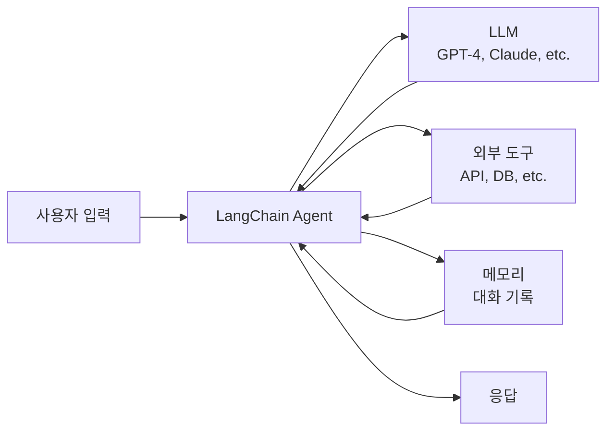
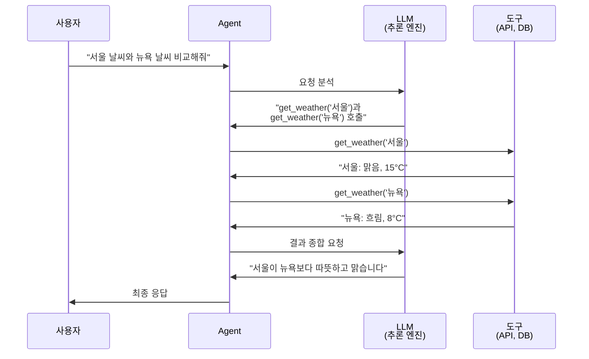
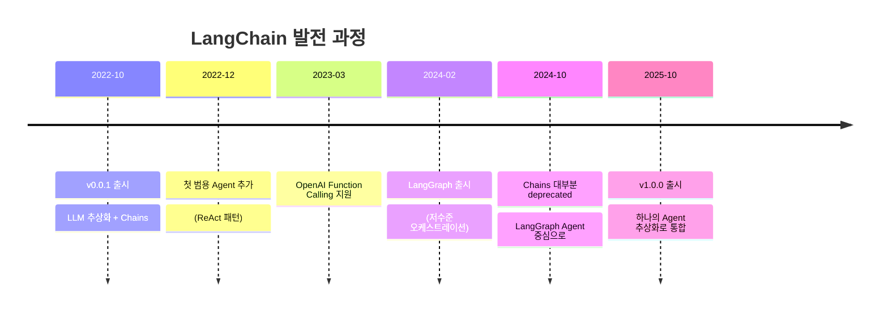
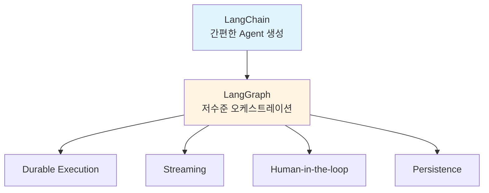

# Part 1: AI Agent의 이해

> 📚 **학습 시간**: 약 2-3시간
> 🎯 **난이도**: ⭐☆☆☆☆ (입문)
> 📖 **공식 문서**: [01-overview.md](../official/01-overview_ko.md), [05-philosophy.md](../official/05-philosophy_ko.md)
> 💻 **예제 코드**: [part01_introduction 디렉토리](../src/part01_introduction/)

---

## 📋 학습 목표

이 파트를 완료하면 다음을 할 수 있습니다:

- [x] LangChain이 무엇이고 왜 사용하는지 설명할 수 있다
- [x] AI Agent의 개념과 동작 원리를 이해한다
- [x] LangChain의 핵심 철학과 설계 원칙을 이해한다
- [x] LangChain vs. LangGraph의 차이를 이해한다
- [x] 개발 환경을 설정하고 첫 번째 예제를 실행할 수 있다

---

## 📚 개요

이 파트에서는 **LangChain과 AI Agent의 기초**를 학습합니다. LangChain이 무엇인지, 왜 필요한지, 그리고 AI Agent가 어떻게 동작하는지 이해하는 것이 목표입니다.

### 왜 중요한가?

- **LLM의 한계 극복**: 단순한 텍스트 생성을 넘어 외부 도구를 사용하고 복잡한 작업을 수행할 수 있습니다
- **프로덕션 준비**: 프로토타입을 넘어 실제 서비스로 배포 가능한 Agent를 만들 수 있습니다
- **생태계 이해**: LangChain, LangGraph, LangSmith의 관계를 이해하고 적절히 활용할 수 있습니다

### 실무 활용 사례

- **고객 서비스 Agent**: 고객 질문에 답변하고 데이터베이스를 조회하는 Agent
- **리서치 Agent**: 웹에서 정보를 검색하고 요약하는 Agent
- **데이터 분석 Agent**: SQL 쿼리를 실행하고 시각화를 생성하는 Agent
- **워크플로우 자동화**: 복잡한 업무 프로세스를 자동화하는 Agent

---

## 1. LangChain이란?

### 1.1 LangChain 개요

**LangChain**은 LLM(Large Language Model) 기반 애플리케이션을 쉽게 개발할 수 있도록 돕는 오픈소스 프레임워크입니다.



> 📖 **공식 문서**: [01-overview.md](../official/01-overview_ko.md#langchain-개요)

#### 핵심 특징

1. **10줄 이하의 코드로 Agent 생성**
   - 복잡한 설정 없이 빠르게 프로토타입 제작
   - 다양한 LLM 프로바이더 지원 (OpenAI, Anthropic, Google 등)

2. **표준화된 모델 인터페이스**
   - 프로바이더마다 다른 API를 통일된 방식으로 사용
   - 벤더 종속성(lock-in) 방지

3. **LangGraph 기반 아키텍처**
   - 지속 실행(durable execution)
   - 스트리밍 지원
   - Human-in-the-loop
   - 상태 관리(persistence)

4. **LangSmith로 디버깅**
   - 실행 경로 시각화
   - 상태 전환 추적
   - 런타임 메트릭

### 1.2 빠른 예제

```python
# pip install -qU langchain langchain-openai python-dotenv
from langchain.agents import create_agent
from langchain_core.tools import tool

@tool
def get_weather(city: str) -> str:
    """주어진 도시의 날씨를 알려줍니다."""
    weather_data = {
        "서울": "맑음, 15°C",
        "샌프란시스코": "화창함, 18°C",
    }
    return weather_data.get(city, f"{city}의 날씨 정보를 찾을 수 없습니다.")

agent = create_agent(
    model="openai:gpt-4.1-nano",
    tools=[get_weather],
    system_prompt="당신은 친절한 도우미입니다",
)

# Agent 실행
agent.invoke(
    {"messages": [{"role": "user", "content": "샌프란시스코 날씨는?"}]}
)
```

**실행 결과**:
```
샌프란시스코의 현재 날씨는 화창하며 온도는 약 18°C입니다.
```

> 💻 **실습**: [src/part01_introduction/01_hello_langchain.py](../src/part01_introduction/01_hello_langchain.py)

---

## 2. LangChain의 철학

### 2.1 핵심 신념

LangChain은 다음과 같은 핵심 신념을 바탕으로 설계되었습니다:

1. **LLM은 강력한 새로운 기술이다**
   - 자연어 이해와 생성 능력
   - 추론(reasoning) 능력

2. **LLM은 외부 데이터와 결합할 때 더 강력하다**
   - RAG (Retrieval Augmented Generation)
   - 도구 사용 (Tool calling)
   - 데이터베이스 연동

3. **미래의 애플리케이션은 점점 더 "Agentic" 해질 것이다**
   - 단순한 질의응답을 넘어 복잡한 작업 수행
   - 자율적 의사결정

4. **프로토타입은 쉽지만, 프로덕션은 여전히 어렵다**
   - 신뢰성 확보
   - 오류 처리
   - 모니터링과 관측성

> 📖 **공식 문서**: [05-philosophy.md](../official/05-philosophy_ko.md#철학)

### 2.2 LangChain의 두 가지 핵심 목표

#### 목표 1: 최고의 모델로 개발할 수 있도록 지원

```python
# OpenAI 사용
from langchain_openai import ChatOpenAI
model = ChatOpenAI(model="gpt-4.1-nano")

# Anthropic으로 교체 (코드 한 줄만 변경)
from langchain_anthropic import ChatAnthropic
model = ChatAnthropic(model="claude-sonnet-4-5-20250929")

# Google로 교체 (코드 한 줄만 변경)
from langchain_google_genai import ChatGoogleGenerativeAI
model = ChatGoogleGenerativeAI(model="gemini-2.0-flash")

# create_agent에서도 문자열로 간단히 전환 가능
# agent = create_agent(model="openai:gpt-4.1-nano", ...)
# agent = create_agent(model="anthropic:claude-sonnet-4-5-20250929", ...)
```

**장점**:
- 최신 모델로 쉽게 전환
- 벤더 종속성 방지
- 모델 간 성능 비교 용이

#### 목표 2: 복잡한 플로우 오케스트레이션

LLM은 단순한 텍스트 생성을 넘어:
- **도구 호출**: API 호출, 데이터베이스 쿼리 등
- **데이터 접근**: 비구조화 데이터(문서, 이미지) 처리
- **워크플로우**: 여러 단계를 거치는 복잡한 작업

---

## 3. AI Agent란?

### 3.1 Agent의 정의

**Agent**는 LLM을 "추론 엔진(reasoning engine)"으로 사용하여:
1. 사용자 요청을 분석하고
2. 어떤 도구를 사용할지 결정하고
3. 도구를 호출하고
4. 결과를 종합하여 응답하는

**자율적인 시스템**입니다.



### 3.2 Agent vs. 단순 LLM 호출

| 구분 | 단순 LLM 호출 | Agent |
|-----|------------|-------|
| **동작** | 입력 → 출력 (1회) | 입력 → 추론 → 도구 호출 → 재추론 → 출력 (반복) |
| **외부 데이터** | 불가능 | 가능 (API, DB 등) |
| **복잡한 작업** | 불가능 | 가능 (다단계 추론) |
| **실시간 정보** | 불가능 (학습 데이터만) | 가능 (도구로 조회) |

### 3.3 ReAct 패턴

Agent는 보통 **ReAct (Reasoning + Acting)** 패턴을 사용합니다:

1. **Reasoning (추론)**: "무엇을 해야 하는가?"
2. **Acting (행동)**: 도구 호출
3. **Observation (관찰)**: 결과 확인
4. 반복 또는 최종 응답

```python
# ReAct 예제 (Part 3에서 자세히 다룸)
Thought: 서울 날씨를 알아야 합니다
Action: get_weather
Action Input: "서울"
Observation: 서울은 맑고 15도입니다

Thought: 이제 답변할 수 있습니다
Final Answer: 서울의 날씨는 맑고 15도입니다.
```

> 📄 **논문**: [ReAct: Synergizing Reasoning and Acting](https://arxiv.org/abs/2210.03629)

---

## 4. LangChain의 역사

### 주요 마일스톤



> 📖 **공식 문서**: [05-philosophy.md](../official/05-philosophy_ko.md#역사)

### LangChain 1.0의 주요 변경사항

1. **모든 Chains와 Agents를 하나의 추상화로 통합**
   - 이전: `AgentExecutor`, `ConversationalRetrievalChain`, `SequentialChain` 등 여러 개
   - 현재: `create_agent()` 하나로 통일

2. **표준 메시지 포맷**
   - Reasoning 블록, 인용(citations), 서버 측 도구 호출 등 지원
   - 프로바이더 간 표준화

---

## 5. LangChain vs. LangGraph

초보자가 자주 혼동하는 부분입니다:

| | LangChain | LangGraph |
|---|----------|-----------|
| **수준** | 고수준 (High-level) | 저수준 (Low-level) |
| **사용 시기** | 빠르게 Agent 구축 | 고급 커스터마이징 필요 |
| **코드량** | 10줄 이하 | 50줄 이상 |
| **제어** | 적음 (간단함) | 많음 (복잡함) |
| **권장 대상** | 입문자, 빠른 프로토타입 | 고급 사용자, 복잡한 워크플로우 |



**결론**:
- ✅ **LangChain으로 시작**: 대부분의 경우 충분
- 🚀 **LangGraph로 확장**: 고급 기능이 필요할 때만

> 💡 **이 교안은 LangChain 중심**이지만, LangGraph의 개념도 함께 다룹니다.

---

## 6. 환경 설정

### 6.1 시스템 요구사항

- **Python**: 3.10 이상 (3.11 권장)
- **메모리**: 최소 8GB RAM
- **운영체제**: macOS, Linux, Windows (WSL2)

### 6.2 설치

상세한 설치 방법은 [SETUP_GUIDE.md](../SETUP_GUIDE.md)를 참고하세요.

> 📖 **공식 문서**: [02-install.md](../official/02-install_ko.md)

**기본 설치** (pip 사용):

```bash
# LangChain 설치 (Python 3.10+ 필요)
pip install -U langchain

# 프로바이더 패키지 설치
pip install -U langchain-openai      # OpenAI 사용 시
pip install -U langchain-anthropic   # Anthropic 사용 시
```

**uv 사용** (빠른 패키지 매니저):

```bash
# LangChain 설치
uv add langchain

# 프로바이더 패키지 설치
uv add langchain-openai
uv add langchain-anthropic
```

**가상환경 설정**:

```bash
# 가상환경 생성
python -m venv .venv
source .venv/bin/activate  # Windows: .venv\Scripts\activate

# 환경변수 설정
export OPENAI_API_KEY="your-api-key-here"
```

> 💡 **Tip**: uv는 pip보다 10-100배 빠른 Rust 기반 패키지 매니저입니다. 자세한 내용은 공식 문서를 참조하세요.

### 6.3 환경 확인

```bash
python src/part01_introduction/02_environment_check.py
```

**예상 출력**:
```
✅ Python 버전: 3.10+
✅ LangChain 설치됨: 1.2.x
✅ OPENAI_API_KEY 설정됨
🎉 모든 환경이 정상입니다!
```

> 💻 **실습**: [src/part01_introduction/02_environment_check.py](../src/part01_introduction/02_environment_check.py)

---

## 🎓 실습 과제

### 과제 1: 환경 설정 및 확인 (⭐☆☆)

**목표**: 개발 환경을 설정하고 정상 작동을 확인합니다.

**요구사항**:
1. Python 3.10 이상 설치
2. LangChain 설치
3. API 키 설정 (OpenAI, Anthropic, 또는 Google 중 하나)
4. `02_environment_check.py` 실행

**체크리스트**:
- [ ] Python 버전 확인
- [ ] LangChain 설치 완료
- [ ] API 키 환경변수 설정
- [ ] 예제 코드 정상 실행

### 과제 2: 첫 번째 Agent 실행 (⭐☆☆)

**목표**: Hello World Agent를 실행해봅니다.

**요구사항**:
1. `01_hello_langchain.py` 읽고 이해하기
2. 코드 실행하기
3. 질문을 바꿔서 다시 실행해보기

**추가 도전**:
- 도구 설명(docstring)을 변경하면 Agent 응답이 어떻게 달라지는지 관찰
- `system_prompt`를 변경하여 Agent의 성격 바꾸기

---

## 💡 실전 팁

### Tip 1: API 키 관리

```bash
# .env 파일 사용 (권장)
# src/.env 파일 생성
OPENAI_API_KEY=sk-...
ANTHROPIC_API_KEY=sk-ant-...

# Python에서 로드
from dotenv import load_dotenv
load_dotenv()
```

**주의**:
- ⚠️ `.env` 파일은 절대 Git에 커밋하지 마세요
- ✅ `.env.example`을 템플릿으로 제공하세요

### Tip 2: 비용 절약

초보 단계에서는 저렴한 모델 사용:
- OpenAI: `gpt-4.1-nano` (최저가, $0.10/1M input tokens)
- Anthropic: `claude-haiku-4-5-20251001`
- Google: `gemini-2.0-flash`

### Tip 3: 로컬 모델 사용

완전 무료로 실습하려면:
```bash
# Ollama 설치
brew install ollama

# 모델 다운로드
ollama pull llama3.2

# LangChain에서 사용
from langchain_ollama import ChatOllama
model = ChatOllama(model="llama3.2")
```

---

## ❓ 자주 묻는 질문

<details>
<summary><strong>Q1: LangChain vs. LlamaIndex, 어떤 걸 써야 하나요?</strong></summary>

**A**:
- **LangChain**: Agent와 도구 호출 중심, 범용적
- **LlamaIndex**: RAG(검색 증강 생성) 중심, 데이터 인덱싱에 특화

둘 다 좋은 프레임워크이며, **Agent 중심**이라면 LangChain, **RAG 중심**이라면 LlamaIndex를 추천합니다. (두 프레임워크는 함께 사용 가능)
</details>

<details>
<summary><strong>Q2: LangGraph를 따로 배워야 하나요?</strong></summary>

**A**:
- **입문 단계**: 불필요. LangChain의 `create_agent()`만으로 충분
- **중급 이상**: 복잡한 워크플로우가 필요하면 LangGraph 학습 권장

이 교안은 LangChain 중심이지만, Part 7(멀티에이전트)에서 LangGraph의 기본 개념을 다룹니다.
</details>

<details>
<summary><strong>Q3: 어떤 LLM 프로바이더를 사용해야 하나요?</strong></summary>

**A**:
- **학습/프로토타입**: OpenAI gpt-4.1-nano (최저가, 빠름, 안정적)
- **프로덕션**: Claude Sonnet 4.5 (정확, 긴 컨텍스트)
- **무료 실습**: Ollama + Llama 3.2 (완전 무료, 오프라인 가능)

> 📖 자세한 비교: [SETUP_GUIDE.md](../SETUP_GUIDE.md#-llm-프로바이더-설정)
</details>

<details>
<summary><strong>Q4: Python 3.9에서도 작동하나요?</strong></summary>

**A**:
일부 작동하지만, Python 3.10 이상 권장합니다. LangChain의 최신 기능은 3.10+를 요구합니다.
</details>

---

## 🔗 심화 학습

이 파트의 기초를 마스터했다면:

### 1. 공식 문서
- [LangChain 공식 문서](https://docs.langchain.com/oss/python/langchain/overview)
- [LangGraph 소개](https://docs.langchain.com/oss/python/langgraph/overview)
- [LangSmith](https://docs.langchain.com/langsmith)

### 2. 관련 논문
- [ReAct: Synergizing Reasoning and Acting](https://arxiv.org/abs/2210.03629) - Agent의 핵심 패턴
- [Toolformer](https://arxiv.org/abs/2302.04761) - LLM이 도구를 사용하는 방법

### 3. 커뮤니티
- [LangChain Discord](https://discord.gg/langchain) - 실시간 Q&A
- [LangChain Blog](https://blog.langchain.com) - 최신 기능 소개

### 4. 동영상 강의
- [LangChain Crash Course (freeCodeCamp)](https://www.youtube.com/watch?v=LbT1yp6quS8)
- [Building LLM Apps (DeepLearning.AI)](https://www.deeplearning.ai/short-courses/langchain-for-llm-application-development/)

> 📚 **전체 학습 자료**: [docs/appendix/resources.md](./appendix/resources.md)

---

## ✅ 체크리스트

Part 1을 완료하기 전에 확인하세요:

- [ ] LangChain이 무엇인지 설명할 수 있다
- [ ] AI Agent의 동작 원리를 이해했다
- [ ] LangChain의 핵심 철학을 이해했다
- [ ] LangChain vs. LangGraph의 차이를 안다
- [ ] 개발 환경이 정상적으로 설정되었다
- [ ] `01_hello_langchain.py`를 실행해봤다
- [ ] `02_environment_check.py`가 정상 작동한다
- [ ] FAQ를 읽어봤다

---

## 다음 단계

✅ **Part 1 완료!**
➡️ [Part 2: LangChain 기초로 이동](./part02_fundamentals.md)

Part 2에서는:
- Chat Models 사용법
- Messages와 Content Blocks
- Tools 정의하기
- Tool Calling 이해하기

를 배웁니다.

---

**학습 진도**: ▓░░░░░░░░░ 10% (Part 1/10 완료)

*마지막 업데이트: 2026-02-16*
*LangChain 버전: 1.2*
