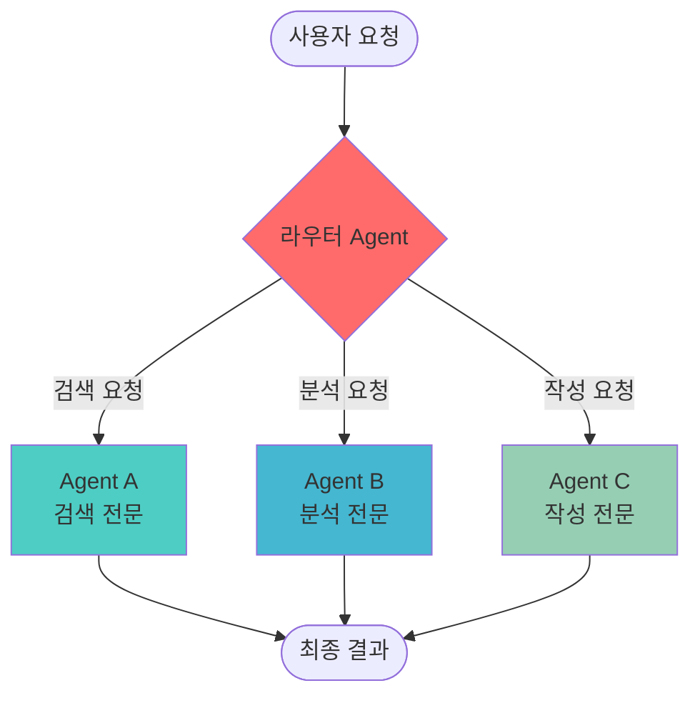
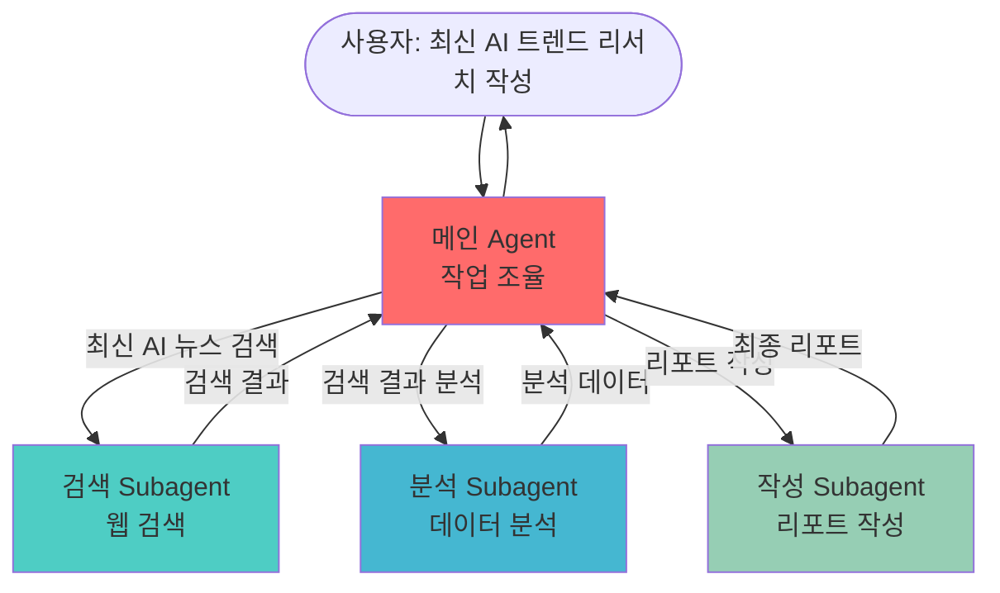
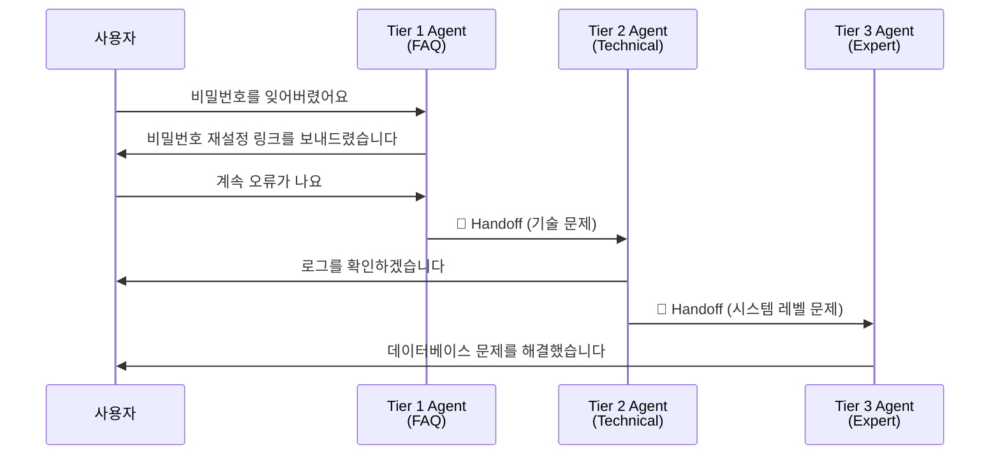
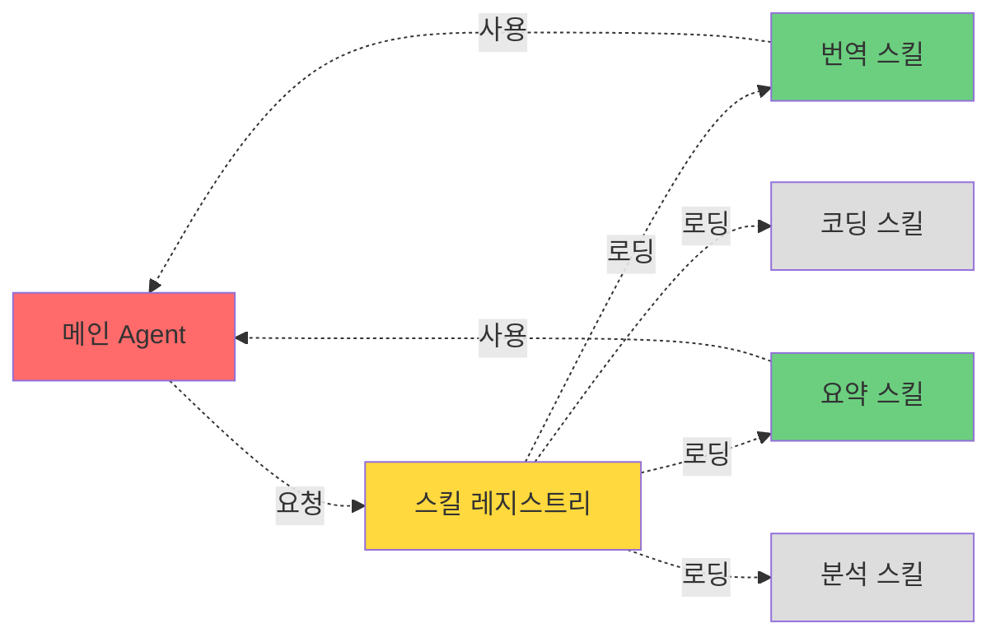
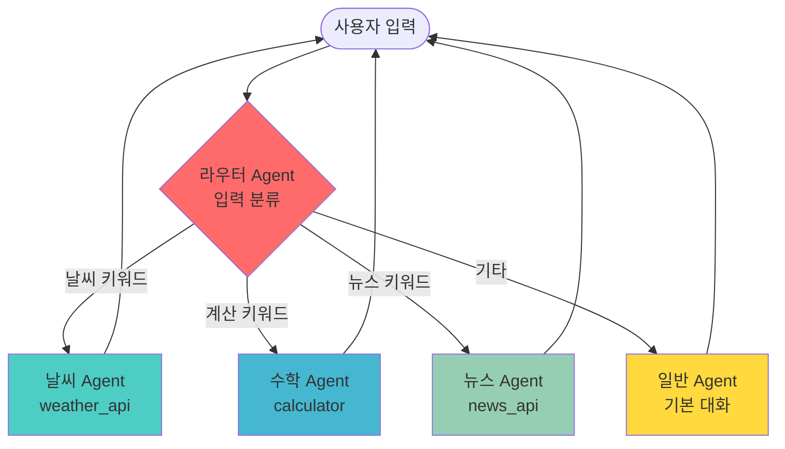
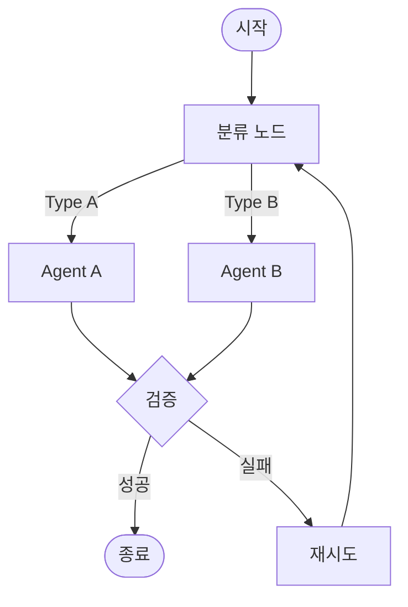
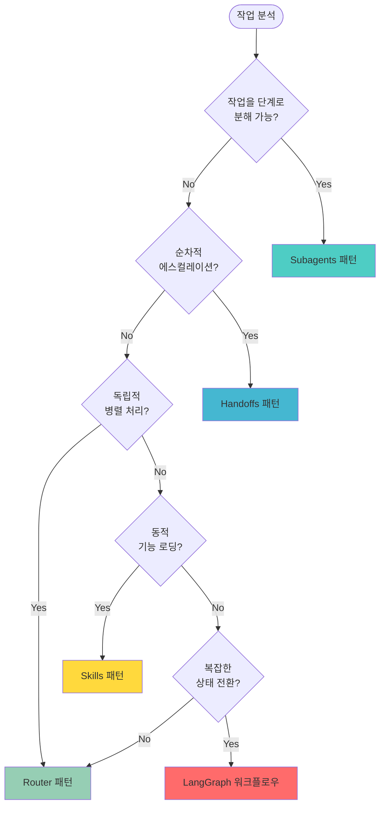

# Part 7: Multi-Agent Systems (멀티에이전트 시스템)

> 📚 **학습 시간**: 약 4-5시간
> 🎯 **난이도**: ⭐⭐⭐⭐☆ (고급)
> 📖 **공식 문서**: [22-multi-agent.md](../official/22-multi-agent_ko.md), [23-subagents.md](../official/23-subagents_ko.md), [24-handoffs.md](../official/24-handoffs_ko.md), [25-skills.md](../official/25-skills_ko.md), [26-router.md](../official/26-router_ko.md), [27-custom-workflow.md](../official/27-custom-workflow_ko.md)
> 💻 **예제 코드**: [part07_multi_agent 디렉토리](../src/part07_multi_agent/)

---

## 📋 학습 목표

이 파트를 완료하면 다음을 할 수 있습니다:

- [ ] 멀티에이전트 시스템의 개념과 필요성을 이해한다
- [ ] Subagents 패턴으로 계층적 Agent를 구현한다
- [ ] 동기 및 비동기 Subagent를 활용한다
- [ ] Handoffs 패턴으로 Agent 간 제어를 전달한다
- [ ] Skills 패턴으로 재사용 가능한 Agent를 만든다
- [ ] Router 패턴으로 요청을 분류하고 라우팅한다
- [ ] LangGraph로 커스텀 멀티에이전트 워크플로우를 구축한다

---

## 📚 개요

**Multi-Agent Systems**은 여러 개의 전문화된 Agent를 조합하여 복잡한 작업을 해결하는 아키텍처 패턴입니다. 단일 Agent로는 해결하기 어려운 대규모 문제를 작은 단위로 분해하고, 각 Agent가 자신의 전문 영역에서 최고의 성능을 발휘하도록 합니다.

### 왜 Multi-Agent인가?

현대의 AI 애플리케이션은 점점 더 복잡해지고 있습니다. 고객 서비스, 데이터 분석, 콘텐츠 생성 등 다양한 작업을 하나의 Agent로 처리하려면 다음과 같은 문제가 발생합니다:

**단일 Agent의 한계**:
1. **도구 과부하**: 50개 이상의 도구를 제공하면 Agent가 올바른 도구를 선택하지 못함
2. **컨텍스트 혼란**: 너무 많은 지시사항이 프롬프트에 들어가면 LLM이 혼란스러워함
3. **유지보수 어려움**: 모든 기능이 하나의 Agent에 있으면 수정과 디버깅이 어려움
4. **성능 저하**: 특화되지 않은 일반 Agent는 전문 작업에서 정확도가 떨어짐

**Multi-Agent의 이점**:
1. **분업과 전문화**: 각 Agent가 특정 도메인에 집중하여 높은 정확도 달성
2. **확장성**: 새로운 기능을 추가할 때 독립적인 Agent로 구현하여 기존 시스템에 영향 없음
3. **병렬 처리**: 여러 Agent를 동시에 실행하여 처리 속도 향상
4. **유지보수성**: 각 Agent가 독립적이므로 수정과 테스트가 용이
5. **재사용성**: 잘 만들어진 Agent를 다른 프로젝트에서도 활용 가능

### Multi-Agent 아키텍처 개요



### 실전 활용 사례

**1. 고객 서비스 시스템**
```
사용자 문의 → FAQ Agent (간단한 질문)
              ↓ (복잡한 문제)
           Technical Agent (기술 지원)
              ↓ (해결 불가)
           Human Escalation Agent (상담원 연결)
```

**2. 콘텐츠 제작 파이프라인**
```
주제 입력 → Research Agent (정보 수집)
            → Analysis Agent (데이터 분석)
            → Writing Agent (초안 작성)
            → Editing Agent (교정 및 개선)
```

**3. 데이터 처리 시스템**
```
원본 데이터 → Cleaning Agent (데이터 정제)
             → Transform Agent (변환)
             → Analysis Agent (분석)
             → Visualization Agent (시각화)
```

---

## 1. 멀티에이전트가 필요한 이유

### 1.1 단일 Agent의 문제점

**예시: 범용 고객 서비스 Agent**

```python
# ❌ 나쁜 예: 모든 것을 하나의 Agent에 넣기
general_agent = create_agent(
    model="gpt-4o-mini",
    tools=[
        # FAQ 관련 (10개 도구)
        search_faq, create_faq, update_faq, delete_faq, ...

        # 주문 관리 (15개 도구)
        get_order, cancel_order, refund_order, track_shipment, ...

        # 계정 관리 (12개 도구)
        get_user, update_profile, reset_password, ...

        # 기술 지원 (20개 도구)
        run_diagnostic, check_logs, restart_service, ...

        # 결제 처리 (8개 도구)
        process_payment, issue_refund, update_billing, ...
    ],  # 총 65개 이상의 도구!
    system_prompt="""
    당신은 고객 서비스 Agent입니다.
    - FAQ 질문에 답변하세요
    - 주문을 관리하세요
    - 계정 문제를 해결하세요
    - 기술 지원을 제공하세요
    - 결제를 처리하세요
    ... (너무 많은 지시사항)
    """
)
```

**문제점**:
1. **도구 선택 오류**: LLM이 65개 도구 중 올바른 것을 선택하기 어려움
2. **프롬프트 과부하**: 너무 많은 지시사항으로 핵심을 놓침
3. **느린 응답**: 모든 도구 설명을 매번 처리해야 하므로 느림
4. **디버깅 어려움**: 어디서 잘못됐는지 찾기 힘듦

### 1.2 Multi-Agent로 해결

```python
# ✅ 좋은 예: 전문화된 Agent들
faq_agent = create_agent(
    model="gpt-4o-mini",
    tools=[search_faq, create_faq, update_faq],  # 3개 도구
    system_prompt="FAQ 관련 질문에만 답변합니다."
)

order_agent = create_agent(
    model="gpt-4o-mini",
    tools=[get_order, cancel_order, refund_order],  # 3개 도구
    system_prompt="주문 관리 작업만 처리합니다."
)

tech_agent = create_agent(
    model="gpt-4o",  # 더 강력한 모델 사용
    tools=[run_diagnostic, check_logs, restart_service],  # 3개 도구
    system_prompt="기술 문제 해결에 집중합니다."
)

# 라우터가 적절한 Agent로 전달
@tool
def customer_service_router(user_query: str) -> str:
    """사용자 질문을 분류하고 적절한 Agent로 라우팅"""
    if "자주 묻는" in user_query or "FAQ" in user_query:
        return faq_agent.invoke({"messages": [{"role": "user", "content": user_query}]})
    elif "주문" in user_query or "배송" in user_query:
        return order_agent.invoke({"messages": [{"role": "user", "content": user_query}]})
    else:
        return tech_agent.invoke({"messages": [{"role": "user", "content": user_query}]})
```

**개선 효과**:
1. **정확도 향상**: 각 Agent가 3-5개 도구만 관리하여 선택 정확도 90% 이상
2. **응답 속도**: 필요한 도구만 로드하여 50% 이상 빠름
3. **유지보수성**: 각 Agent를 독립적으로 수정 및 테스트
4. **비용 최적화**: 간단한 작업은 저렴한 모델, 복잡한 작업은 고급 모델 사용

### 1.3 Multi-Agent 패턴 비교

| 패턴 | 설명 | 사용 시점 | 예시 |
|------|------|-----------|------|
| **Subagents** | 메인 Agent가 하위 Agent를 도구로 호출 | 계층적 작업 분해 | 리서치 Agent → 검색/분석 Subagent |
| **Handoffs** | Agent 간 제어 전달 | 순차적 처리 파이프라인 | Tier 1 → Tier 2 → Tier 3 지원 |
| **Skills** | 재사용 가능한 Agent 모듈 | 동적 기능 추가 | 필요 시 번역/요약 스킬 로딩 |
| **Router** | 입력 분류 후 라우팅 | 병렬 처리 가능한 독립 작업 | 질문 유형별 전문 Agent |
| **Workflow** | 복잡한 상태 기반 흐름 | 다단계 비즈니스 프로세스 | 주문 처리 (검증→결제→배송) |

> 💻 **예제 코드**: [01_why_multi_agent.py](../src/part07_multi_agent/01_why_multi_agent.py)

---

## 2. Subagents 패턴

**Subagents**는 메인 Agent가 전문화된 하위 Agent를 도구처럼 호출하는 패턴입니다. 복잡한 작업을 작은 단위로 분해하고, 각 Subagent가 독립적으로 처리한 후 결과를 메인 Agent에게 반환합니다.

### 2.1 Subagents의 개념



**핵심 아이디어**:
- 메인 Agent는 "무엇을 해야 하는지" 결정 (orchestration)
- 각 Subagent는 "어떻게 할 것인지" 실행 (execution)
- Subagent를 `@tool`로 래핑하여 메인 Agent의 도구로 사용

### 2.2 동기 Subagents 구현

**기본 패턴**:

```python
from langchain.agents import create_agent
from langchain.tools import tool

# 1. Subagent 생성
research_agent = create_agent(
    model="gpt-4o-mini",
    tools=[web_search, summarize],
    system_prompt="웹에서 정보를 검색하고 요약하는 리서치 전문가입니다."
)

# 2. Subagent를 도구로 래핑
@tool
def research_tool(query: str) -> str:
    """웹에서 정보를 검색하고 요약합니다.

    Args:
        query: 검색할 주제 또는 질문

    Returns:
        검색 결과 요약
    """
    result = research_agent.invoke({
        "messages": [{"role": "user", "content": query}]
    })
    return result["messages"][-1].content

# 3. 메인 Agent에서 사용
main_agent = create_agent(
    model="gpt-4o-mini",
    tools=[research_tool, calculator, email_tool],
    system_prompt="당신은 리서치와 분석을 수행하는 비서입니다."
)

# 4. 실행
response = main_agent.invoke({
    "messages": [{"role": "user", "content": "2024년 AI 트렌드를 조사하고 이메일로 보내줘"}]
})
```

**실행 흐름**:
```
사용자: "2024년 AI 트렌드를 조사하고 이메일로 보내줘"
  ↓
메인 Agent: "research_tool을 사용해서 AI 트렌드 조사해야겠다"
  ↓
research_tool 호출 → Research Subagent 실행
  ↓
Research Subagent: web_search → summarize
  ↓
research_tool 결과 반환
  ↓
메인 Agent: "이제 email_tool로 결과를 보내자"
  ↓
email_tool 실행
  ↓
완료
```

### 2.3 실전 예제: 콘텐츠 제작 시스템

```python
# Subagent 1: 리서치
@tool
def research_subagent(topic: str) -> str:
    """주제에 대한 심층 리서치를 수행합니다."""
    agent = create_agent(
        model="gpt-4o-mini",
        tools=[web_search, wikipedia_search, news_search],
        system_prompt="리서치 전문가로서 최신 정보를 수집합니다."
    )
    result = agent.invoke({
        "messages": [{"role": "user", "content": f"{topic}에 대해 조사해주세요"}]
    })
    return result["messages"][-1].content

# Subagent 2: 데이터 분석
@tool
def analysis_subagent(data: str) -> str:
    """데이터를 분석하고 인사이트를 추출합니다."""
    agent = create_agent(
        model="gpt-4o-mini",
        tools=[calculate, visualize, statistical_analysis],
        system_prompt="데이터 분석가로서 트렌드와 패턴을 찾습니다."
    )
    result = agent.invoke({
        "messages": [{"role": "user", "content": f"다음 데이터를 분석해주세요:\n{data}"}]
    })
    return result["messages"][-1].content

# Subagent 3: 콘텐츠 작성
@tool
def writing_subagent(research: str, analysis: str) -> str:
    """리서치와 분석 결과를 바탕으로 글을 작성합니다."""
    agent = create_agent(
        model="gpt-4o",  # 작문은 더 강력한 모델 사용
        tools=[grammar_check, tone_adjuster],
        system_prompt="전문 작가로서 매력적인 콘텐츠를 작성합니다."
    )
    result = agent.invoke({
        "messages": [{
            "role": "user",
            "content": f"다음 정보로 블로그 포스트 작성:\n리서치: {research}\n분석: {analysis}"
        }]
    })
    return result["messages"][-1].content

# 메인 Agent: 전체 프로세스 조율
main_agent = create_agent(
    model="gpt-4o-mini",
    tools=[research_subagent, analysis_subagent, writing_subagent],
    system_prompt="""
    당신은 콘텐츠 제작 프로세스를 관리하는 편집장입니다.
    1. 먼저 research_subagent로 정보 수집
    2. 그 다음 analysis_subagent로 분석
    3. 마지막으로 writing_subagent로 글 작성
    """
)
```

### 2.4 비동기 병렬 Subagents

여러 Subagent를 동시에 실행하여 성능을 향상시킬 수 있습니다.

```python
import asyncio
from langchain.agents import create_agent

# 비동기 Subagent들
news_agent = create_agent(model="gpt-4o-mini", tools=[news_api])
social_agent = create_agent(model="gpt-4o-mini", tools=[twitter_api])
blog_agent = create_agent(model="gpt-4o-mini", tools=[blog_search])

@tool
async def parallel_research(topic: str) -> str:
    """여러 소스에서 동시에 정보를 수집합니다."""

    # 모든 Subagent를 병렬로 실행
    tasks = [
        news_agent.ainvoke({"messages": [{"role": "user", "content": f"{topic} 뉴스 검색"}]}),
        social_agent.ainvoke({"messages": [{"role": "user", "content": f"{topic} SNS 반응"}]}),
        blog_agent.ainvoke({"messages": [{"role": "user", "content": f"{topic} 블로그 글"}]}),
    ]

    # 모든 작업이 완료될 때까지 대기
    results = await asyncio.gather(*tasks)

    # 결과 통합
    combined = "\n\n".join([
        f"뉴스: {results[0]['messages'][-1].content}",
        f"SNS: {results[1]['messages'][-1].content}",
        f"블로그: {results[2]['messages'][-1].content}",
    ])

    return combined
```

**성능 비교**:
```
순차 실행 (동기):
  뉴스 검색: 3초
  SNS 검색: 3초
  블로그 검색: 3초
  총: 9초 ❌

병렬 실행 (비동기):
  뉴스 + SNS + 블로그: 동시 실행
  총: 3초 ✅ (3배 빠름!)
```

### 2.5 Subagents 사용 시 주의사항

**1. 과도한 중첩 방지**
```python
# ❌ 나쁜 예: 너무 깊은 중첩
main_agent
  └─ level1_agent
       └─ level2_agent
            └─ level3_agent  # 너무 복잡함!

# ✅ 좋은 예: 2-3 레벨까지만
main_agent
  └─ specialist_agent
       └─ tool
```

**2. 컨텍스트 크기 관리**
```python
# Subagent 결과가 너무 길면 요약
@tool
def smart_research(query: str) -> str:
    result = research_agent.invoke(...)
    content = result["messages"][-1].content

    # 너무 길면 요약
    if len(content) > 1000:
        content = summarize(content, max_length=500)

    return content
```

**3. 오류 처리**
```python
@tool
def robust_subagent(query: str) -> str:
    """실패에 강한 Subagent"""
    try:
        result = subagent.invoke({"messages": [{"role": "user", "content": query}]})
        return result["messages"][-1].content
    except Exception as e:
        # 실패 시 폴백 전략
        return f"Subagent 실행 실패: {str(e)}. 기본 응답을 제공합니다."
```

> 💻 **예제 코드**:
> - [02_subagents_basic.py](../src/part07_multi_agent/02_subagents_basic.py) - 동기 Subagents
> - [03_subagents_async.py](../src/part07_multi_agent/03_subagents_async.py) - 비동기 병렬 Subagents

---

## 3. Handoffs 패턴

**Handoffs**는 한 Agent에서 다른 Agent로 제어를 전달하는 패턴입니다. 티켓팅 시스템이나 고객 서비스처럼 점진적으로 복잡도가 증가하는 작업에 적합합니다.

### 3.1 Handoffs의 개념



**Handoff vs Subagent 비교**:

| 특성 | Subagent | Handoff |
|------|----------|---------|
| **제어** | 메인 Agent가 계속 제어 유지 | 다른 Agent로 제어 이전 |
| **복귀** | 항상 메인 Agent로 복귀 | 이전 Agent로 돌아가지 않음 |
| **사용** | 작업 분해 | 에스컬레이션 |
| **예시** | 리서치 → 분석 → 작성 (조율) | Tier 1 → Tier 2 → Tier 3 (이관) |

### 3.2 Handoff 구현

**기본 패턴**:

```python
from langchain.agents import create_agent
from langchain.tools import tool

# Agent 1: FAQ 봇
faq_agent = create_agent(
    model="gpt-4o-mini",
    tools=[search_faq, handoff_to_technical],  # handoff 도구 포함
    system_prompt="""
    FAQ 전문 상담원입니다.
    간단한 질문에 답변하고, 복잡한 기술 문제는 handoff_to_technical을 사용하세요.
    """
)

# Agent 2: 기술 지원
technical_agent = create_agent(
    model="gpt-4o",
    tools=[run_diagnostic, check_logs, handoff_to_expert],
    system_prompt="""
    기술 지원 전문가입니다.
    진단 도구를 사용하여 문제를 해결하고, 해결 불가 시 handoff_to_expert를 사용하세요.
    """
)

# Agent 3: 전문가
expert_agent = create_agent(
    model="claude-sonnet-4-5-20250929",  # 가장 강력한 모델
    tools=[access_database, modify_system],
    system_prompt="시스템 레벨 문제를 해결하는 최고 전문가입니다."
)

# Handoff 도구 정의
@tool
def handoff_to_technical(context: str) -> str:
    """기술 지원 팀으로 이관합니다.

    Args:
        context: 지금까지의 대화 컨텍스트
    """
    result = technical_agent.invoke({
        "messages": [{"role": "user", "content": f"이관된 케이스:\n{context}"}]
    })
    return result["messages"][-1].content

@tool
def handoff_to_expert(context: str) -> str:
    """전문가 팀으로 이관합니다."""
    result = expert_agent.invoke({
        "messages": [{"role": "user", "content": f"에스컬레이션된 케이스:\n{context}"}]
    })
    return result["messages"][-1].content
```

### 3.3 컨텍스트 전달

Handoff 시 중요한 정보를 다음 Agent에게 전달해야 합니다.

```python
from typing import TypedDict

class HandoffContext(TypedDict):
    """Handoff 시 전달할 컨텍스트"""
    user_id: str
    conversation_history: list[str]
    attempted_solutions: list[str]
    severity: str  # "low", "medium", "high"
    metadata: dict

@tool
def structured_handoff(
    user_id: str,
    issue: str,
    attempted_solutions: list[str],
    severity: str = "medium"
) -> str:
    """구조화된 컨텍스트와 함께 Handoff"""

    context = HandoffContext(
        user_id=user_id,
        conversation_history=[],  # 실제로는 대화 기록
        attempted_solutions=attempted_solutions,
        severity=severity,
        metadata={"timestamp": datetime.now().isoformat()}
    )

    # 심각도에 따라 다른 Agent로 라우팅
    if severity == "high":
        return expert_agent.invoke({
            "messages": [{
                "role": "user",
                "content": f"긴급 케이스:\n{json.dumps(context, indent=2)}"
            }]
        })
    else:
        return technical_agent.invoke({
            "messages": [{
                "role": "user",
                "content": f"일반 케이스:\n{json.dumps(context, indent=2)}"
            }]
        })
```

### 3.4 실전 예제: 고객 서비스 시스템

```python
# Tier 1: 자동 FAQ
tier1_agent = create_agent(
    model="gpt-4o-mini",
    tools=[
        search_faq,
        check_order_status,
        handoff_to_tier2,
    ],
    system_prompt="""
    Tier 1 고객 서비스 Agent입니다.

    처리 가능한 작업:
    - FAQ 질문 답변
    - 주문 상태 확인
    - 기본적인 계정 정보 조회

    다음 경우 handoff_to_tier2:
    - 결제 문제
    - 기술적 오류
    - 환불 요청
    - 고객이 상담원을 요청하는 경우
    """
)

# Tier 2: 전문 상담원
tier2_agent = create_agent(
    model="gpt-4o",
    tools=[
        process_refund,
        update_order,
        reset_account,
        handoff_to_tier3,
    ],
    system_prompt="""
    Tier 2 전문 상담원입니다.

    처리 가능한 작업:
    - 환불 처리
    - 주문 수정
    - 계정 재설정

    다음 경우 handoff_to_tier3:
    - 시스템 장애
    - 데이터베이스 문제
    - 정책 예외 승인 필요
    """
)

# Tier 3: 시니어 매니저
tier3_agent = create_agent(
    model="claude-sonnet-4-5-20250929",
    tools=[
        access_admin_panel,
        override_policy,
        escalate_to_engineering,
    ],
    system_prompt="""
    Tier 3 시니어 매니저입니다.
    모든 권한을 가지고 있으며 최종 의사결정을 내립니다.
    """
)

# Handoff 도구들
@tool
def handoff_to_tier2(
    issue_description: str,
    customer_id: str,
    attempted_solutions: list[str]
) -> str:
    """Tier 2로 이관"""
    context = f"""
    고객 ID: {customer_id}
    문제: {issue_description}
    시도한 해결책: {', '.join(attempted_solutions)}
    """
    result = tier2_agent.invoke({
        "messages": [{"role": "user", "content": context}]
    })
    return result["messages"][-1].content

@tool
def handoff_to_tier3(
    issue_description: str,
    customer_id: str,
    escalation_reason: str
) -> str:
    """Tier 3로 에스컬레이션"""
    context = f"""
    [긴급 에스컬레이션]
    고객 ID: {customer_id}
    문제: {issue_description}
    에스컬레이션 이유: {escalation_reason}
    """
    result = tier3_agent.invoke({
        "messages": [{"role": "user", "content": context}]
    })
    return result["messages"][-1].content
```

### 3.5 Handoff 사용 시 베스트 프랙티스

**1. 명확한 Handoff 조건**
```python
system_prompt="""
다음 경우에만 handoff:
1. 사용자가 명시적으로 상담원 요청
2. 3번 이상 시도했지만 해결 실패
3. 보안 또는 결제 관련 민감한 정보 필요
4. 정책상 권한이 부족한 경우
"""
```

**2. 충분한 컨텍스트 전달**
```python
# ✅ 좋은 예: 풍부한 컨텍스트
handoff_context = f"""
고객 정보: {customer_info}
대화 기록: {conversation_history}
시도한 해결책: {attempted_solutions}
현재 상태: {current_state}
긴급도: {urgency_level}
"""

# ❌ 나쁜 예: 최소 정보만
handoff_context = "문제 해결 안 됨"
```

**3. Handoff 추적**
```python
handoff_log = []

@tool
def tracked_handoff(from_agent: str, to_agent: str, reason: str, context: str) -> str:
    """Handoff를 로깅하며 실행"""
    handoff_log.append({
        "timestamp": datetime.now(),
        "from": from_agent,
        "to": to_agent,
        "reason": reason,
    })
    # 실제 handoff 실행
    ...
```

> 💻 **예제 코드**: [04_handoffs.py](../src/part07_multi_agent/04_handoffs.py)

---

## 4. Skills 패턴

**Skills**는 재사용 가능한 Agent 컴포넌트를 동적으로 로딩하는 패턴입니다. 필요할 때만 특정 기능을 활성화하여 리소스를 절약하고 유연성을 높입니다.

### 4.1 Skills의 개념



**핵심 아이디어**:
- 모든 기능을 처음부터 로드하지 않음
- 필요한 스킬만 온디맨드로 로딩
- 스킬을 독립적으로 개발하고 테스트
- 다른 프로젝트에서도 재사용 가능

### 4.2 Skills 구현

**기본 패턴**:

```python
from typing import Callable
from langchain.agents import create_agent

# 스킬 레지스트리
SKILLS_REGISTRY: dict[str, Callable] = {}

def register_skill(name: str):
    """스킬을 레지스트리에 등록하는 데코레이터"""
    def decorator(func):
        SKILLS_REGISTRY[name] = func
        return func
    return decorator

# 스킬 1: 번역
@register_skill("translation")
def create_translation_skill():
    """번역 스킬 생성"""
    return create_agent(
        model="gpt-4o-mini",
        tools=[translate_text, detect_language],
        system_prompt="다양한 언어 간 번역을 수행하는 전문 번역가입니다."
    )

# 스킬 2: 요약
@register_skill("summarization")
def create_summarization_skill():
    """요약 스킬 생성"""
    return create_agent(
        model="gpt-4o-mini",
        tools=[extract_keywords, generate_summary],
        system_prompt="긴 텍스트를 핵심만 추출하여 요약하는 전문가입니다."
    )

# 스킬 3: 코딩
@register_skill("coding")
def create_coding_skill():
    """코딩 스킬 생성"""
    return create_agent(
        model="gpt-4o",
        tools=[write_code, debug_code, run_tests],
        system_prompt="Python 코드를 작성하고 디버깅하는 개발자입니다."
    )

# 스킬 동적 로딩
def load_skill(skill_name: str):
    """스킬을 동적으로 로딩"""
    if skill_name not in SKILLS_REGISTRY:
        raise ValueError(f"스킬 '{skill_name}'을 찾을 수 없습니다.")

    # 스킬 생성 함수 호출
    skill_creator = SKILLS_REGISTRY[skill_name]
    return skill_creator()

# 메인 Agent에서 사용
@tool
def use_skill(skill_name: str, task: str) -> str:
    """특정 스킬을 로딩하여 작업 수행

    Args:
        skill_name: 사용할 스킬 이름 (translation, summarization, coding 등)
        task: 수행할 작업 설명
    """
    # 스킬 로딩
    skill_agent = load_skill(skill_name)

    # 작업 실행
    result = skill_agent.invoke({
        "messages": [{"role": "user", "content": task}]
    })

    return result["messages"][-1].content

# 메인 Agent
main_agent = create_agent(
    model="gpt-4o-mini",
    tools=[use_skill],  # 스킬 로딩 도구만 제공
    system_prompt="""
    당신은 다양한 스킬을 활용하는 AI 어시스턴트입니다.
    필요에 따라 use_skill 도구로 전문 스킬을 로딩하여 사용하세요.

    사용 가능한 스킬:
    - translation: 번역
    - summarization: 요약
    - coding: 코딩
    """
)
```

**사용 예시**:
```python
# 사용자: "이 문서를 한국어로 번역해줘"
# → Agent가 use_skill("translation", "문서 번역") 호출
# → translation 스킬이 동적으로 로딩되어 작업 수행

# 사용자: "Python으로 계산기 만들어줘"
# → Agent가 use_skill("coding", "계산기 작성") 호출
# → coding 스킬이 동적으로 로딩되어 작업 수행
```

### 4.3 실전 예제: 문서 처리 시스템

```python
# 다양한 문서 처리 스킬들

@register_skill("pdf_processing")
def create_pdf_skill():
    """PDF 처리 스킬"""
    return create_agent(
        model="gpt-4o-mini",
        tools=[extract_pdf_text, extract_pdf_images, pdf_to_markdown],
        system_prompt="PDF 파일을 읽고 처리하는 전문가입니다."
    )

@register_skill("data_analysis")
def create_analysis_skill():
    """데이터 분석 스킬"""
    return create_agent(
        model="gpt-4o",
        tools=[pandas_analysis, matplotlib_viz, statistical_test],
        system_prompt="데이터를 분석하고 시각화하는 데이터 과학자입니다."
    )

@register_skill("image_processing")
def create_image_skill():
    """이미지 처리 스킬"""
    return create_agent(
        model="gpt-4o-mini",
        tools=[resize_image, apply_filter, ocr_extract],
        system_prompt="이미지를 처리하고 텍스트를 추출하는 전문가입니다."
    )

@register_skill("web_scraping")
def create_scraping_skill():
    """웹 스크래핑 스킬"""
    return create_agent(
        model="gpt-4o-mini",
        tools=[fetch_url, parse_html, extract_data],
        system_prompt="웹 페이지에서 데이터를 추출하는 전문가입니다."
    )

# 컨텍스트 기반 스킬 추천
def recommend_skills(user_request: str) -> list[str]:
    """사용자 요청에 맞는 스킬 추천"""
    keywords_to_skills = {
        "pdf": ["pdf_processing"],
        "번역": ["translation"],
        "요약": ["summarization"],
        "분석": ["data_analysis"],
        "이미지": ["image_processing"],
        "웹사이트": ["web_scraping"],
        "코드": ["coding"],
    }

    recommended = []
    for keyword, skills in keywords_to_skills.items():
        if keyword in user_request.lower():
            recommended.extend(skills)

    return list(set(recommended))  # 중복 제거

# 스마트 스킬 로딩
@tool
def smart_skill_loader(task: str) -> str:
    """작업에 맞는 스킬을 자동으로 추천하고 로딩합니다."""

    # 스킬 추천
    recommended_skills = recommend_skills(task)

    if not recommended_skills:
        return "적절한 스킬을 찾을 수 없습니다."

    # 첫 번째 추천 스킬 사용
    skill_name = recommended_skills[0]
    skill_agent = load_skill(skill_name)

    result = skill_agent.invoke({
        "messages": [{"role": "user", "content": task}]
    })

    return f"[{skill_name} 스킬 사용]\n{result['messages'][-1].content}"
```

### 4.4 Skills 캐싱 및 최적화

**문제**: 매번 스킬을 새로 생성하면 느림

**해결**: 스킬 인스턴스 캐싱

```python
from functools import lru_cache

# 스킬 캐싱
@lru_cache(maxsize=10)
def load_cached_skill(skill_name: str):
    """캐싱된 스킬 로딩 (같은 스킬을 재사용)"""
    print(f"📦 스킬 '{skill_name}' 로딩 중...")

    if skill_name not in SKILLS_REGISTRY:
        raise ValueError(f"스킬 '{skill_name}'을 찾을 수 없습니다.")

    skill_creator = SKILLS_REGISTRY[skill_name]
    return skill_creator()

# 사용
skill1 = load_cached_skill("translation")  # 📦 로딩
skill2 = load_cached_skill("translation")  # 캐시에서 반환 (빠름!)
assert skill1 is skill2  # 같은 인스턴스
```

### 4.5 Skills 사용 시 베스트 프랙티스

**1. 스킬 명명 규칙**
```python
# 명확하고 일관된 이름 사용
GOOD_NAMES = [
    "pdf_processing",
    "data_analysis",
    "web_scraping",
]

BAD_NAMES = [
    "skill1",  # 의미 없음
    "doStuff",  # 일관성 없음
    "translation_and_summarization",  # 너무 복합적
]
```

**2. 스킬 문서화**
```python
@register_skill("translation")
def create_translation_skill():
    """번역 스킬 생성

    기능:
        - 다국어 번역 (100개 이상 언어 지원)
        - 언어 자동 감지
        - 번역 품질 평가

    사용 예시:
        skill = load_skill("translation")
        result = skill.invoke({"messages": [...]})

    모델: gpt-4o-mini
    평균 응답 시간: 2-3초
    """
    return create_agent(...)
```

**3. 스킬 버전 관리**
```python
SKILLS_REGISTRY = {
    "translation": create_translation_skill,
    "translation_v2": create_translation_skill_v2,  # 개선된 버전
    "translation_fast": create_fast_translation_skill,  # 빠른 버전
}
```

> 💻 **예제 코드**: [05_skills_pattern.py](../src/part07_multi_agent/05_skills_pattern.py)

---

## 5. Router 패턴

**Router**는 사용자 입력을 분석하여 적절한 Agent로 라우팅하는 패턴입니다. 여러 독립적인 Agent가 있을 때 효과적입니다.

### 5.1 Router의 개념



**핵심 아이디어**:
- 하나의 라우터가 입력을 분류
- 분류 결과에 따라 전문 Agent로 라우팅
- 각 Agent는 독립적으로 작동

### 5.2 규칙 기반 Router

**간단한 키워드 매칭**:

```python
@tool
def simple_router(user_input: str) -> str:
    """키워드 기반으로 적절한 Agent로 라우팅"""

    # 날씨 관련
    if any(word in user_input for word in ["날씨", "기온", "비", "눈"]):
        return weather_agent.invoke({
            "messages": [{"role": "user", "content": user_input}]
        })

    # 수학 관련
    elif any(word in user_input for word in ["계산", "+", "-", "*", "/", "="]):
        return math_agent.invoke({
            "messages": [{"role": "user", "content": user_input}]
        })

    # 뉴스 관련
    elif any(word in user_input for word in ["뉴스", "기사", "최신"]):
        return news_agent.invoke({
            "messages": [{"role": "user", "content": user_input}]
        })

    # 기본
    else:
        return general_agent.invoke({
            "messages": [{"role": "user", "content": user_input}]
        })
```

**장점**: 빠르고 예측 가능
**단점**: 복잡한 의도 파악 어려움

### 5.3 LLM 기반 Router

**Structured Output으로 정확한 분류**:

```python
from pydantic import BaseModel, Field
from enum import Enum

class RouteCategory(str, Enum):
    """라우팅 카테고리"""
    WEATHER = "weather"
    MATH = "math"
    NEWS = "news"
    CUSTOMER_SERVICE = "customer_service"
    GENERAL = "general"

class RouteDecision(BaseModel):
    """라우팅 결정"""
    category: RouteCategory = Field(description="입력의 카테고리")
    confidence: float = Field(description="분류 신뢰도 (0-1)", ge=0, le=1)
    reasoning: str = Field(description="분류 이유")

# LLM 기반 분류
from langchain_openai import ChatOpenAI

router_llm = ChatOpenAI(model="gpt-4o-mini")

def classify_input(user_input: str) -> RouteDecision:
    """LLM을 사용하여 입력을 분류"""

    prompt = f"""
    다음 사용자 입력을 분류하세요:
    "{user_input}"

    카테고리:
    - weather: 날씨, 기온, 기상 관련
    - math: 계산, 수학 문제
    - news: 뉴스, 최신 정보
    - customer_service: 고객 문의, 불만
    - general: 일반 대화
    """

    result = router_llm.with_structured_output(RouteDecision).invoke(prompt)
    return result

# 라우터 구현
@tool
def intelligent_router(user_input: str) -> str:
    """LLM 기반 지능형 라우터"""

    # 입력 분류
    decision = classify_input(user_input)

    print(f"분류: {decision.category} (신뢰도: {decision.confidence:.2f})")
    print(f"이유: {decision.reasoning}")

    # 라우팅
    agents = {
        RouteCategory.WEATHER: weather_agent,
        RouteCategory.MATH: math_agent,
        RouteCategory.NEWS: news_agent,
        RouteCategory.CUSTOMER_SERVICE: cs_agent,
        RouteCategory.GENERAL: general_agent,
    }

    selected_agent = agents[decision.category]

    result = selected_agent.invoke({
        "messages": [{"role": "user", "content": user_input}]
    })

    return result["messages"][-1].content
```

### 5.4 실전 예제: 기업 챗봇 시스템

```python
# 다양한 부서별 Agent

# HR Agent
hr_agent = create_agent(
    model="gpt-4o-mini",
    tools=[check_pto_balance, submit_expense, get_payroll_info],
    system_prompt="인사 관련 문의에 답변하는 HR 전문가입니다."
)

# IT Agent
it_agent = create_agent(
    model="gpt-4o-mini",
    tools=[reset_password, request_software, report_bug],
    system_prompt="IT 지원을 제공하는 기술 전문가입니다."
)

# Finance Agent
finance_agent = create_agent(
    model="gpt-4o-mini",
    tools=[check_budget, approve_invoice, get_financial_report],
    system_prompt="재무 관련 문의를 처리하는 회계 전문가입니다."
)

# Facilities Agent
facilities_agent = create_agent(
    model="gpt-4o-mini",
    tools=[book_meeting_room, report_facility_issue, request_supplies],
    system_prompt="시설 관리 및 예약을 담당하는 전문가입니다."
)

# 라우팅 결정
class DepartmentRoute(BaseModel):
    department: Literal["hr", "it", "finance", "facilities", "general"]
    confidence: float
    reasoning: str
    suggested_action: str

def route_to_department(user_request: str) -> str:
    """부서별로 라우팅"""

    # LLM으로 분류
    classifier = ChatOpenAI(model="gpt-4o-mini")

    decision = classifier.with_structured_output(DepartmentRoute).invoke(f"""
    직원 요청을 적절한 부서로 분류하세요:
    "{user_request}"

    부서:
    - hr: 급여, 휴가, 복지, 채용
    - it: 비밀번호, 소프트웨어, 하드웨어, 버그
    - finance: 예산, 청구서, 재무 보고서
    - facilities: 회의실, 시설 문제, 비품
    - general: 기타
    """)

    # 해당 부서 Agent로 전달
    department_agents = {
        "hr": hr_agent,
        "it": it_agent,
        "finance": finance_agent,
        "facilities": facilities_agent,
        "general": general_agent,
    }

    agent = department_agents[decision.department]

    result = agent.invoke({
        "messages": [{"role": "user", "content": user_request}]
    })

    return f"[{decision.department.upper()} 부서]\n{result['messages'][-1].content}"
```

### 5.5 멀티레벨 Router

복잡한 시스템에서는 여러 단계의 라우팅이 필요할 수 있습니다.

```python
# Level 1: 도메인 분류
def level1_router(user_input: str) -> str:
    """최상위 도메인 분류"""
    if "고객" in user_input or "주문" in user_input:
        return "customer_domain"
    elif "직원" in user_input or "인사" in user_input:
        return "employee_domain"
    elif "제품" in user_input or "재고" in user_input:
        return "product_domain"
    else:
        return "general_domain"

# Level 2: 세부 카테고리 분류
def customer_domain_router(user_input: str) -> Agent:
    """고객 도메인 내 세부 분류"""
    if "주문" in user_input:
        return order_agent
    elif "배송" in user_input:
        return shipping_agent
    elif "환불" in user_input:
        return refund_agent
    else:
        return customer_general_agent

# 통합 라우터
@tool
def multilevel_router(user_input: str) -> str:
    """2단계 라우팅"""

    # Level 1
    domain = level1_router(user_input)

    # Level 2
    if domain == "customer_domain":
        agent = customer_domain_router(user_input)
    elif domain == "employee_domain":
        agent = employee_domain_router(user_input)
    elif domain == "product_domain":
        agent = product_domain_router(user_input)
    else:
        agent = general_agent

    # 실행
    result = agent.invoke({
        "messages": [{"role": "user", "content": user_input}]
    })

    return result["messages"][-1].content
```

### 5.6 Router 성능 최적화

**1. 캐싱**
```python
from functools import lru_cache

@lru_cache(maxsize=1000)
def cached_classify(user_input: str) -> str:
    """분류 결과 캐싱 (같은 질문 반복 시)"""
    return classify_input(user_input)
```

**2. 폴백 전략**
```python
def robust_router(user_input: str) -> str:
    """실패에 강한 라우터"""
    try:
        # LLM 분류 시도
        decision = classify_input(user_input)
        agent = agents[decision.category]
    except Exception as e:
        # 실패 시 기본 Agent 사용
        print(f"라우팅 실패: {e}")
        agent = general_agent

    return agent.invoke(...)
```

> 💻 **예제 코드**: [06_router_pattern.py](../src/part07_multi_agent/06_router_pattern.py)

---

## 6. Custom Workflow (LangGraph)

**LangGraph**를 사용하면 복잡한 상태 기반 멀티에이전트 워크플로우를 구축할 수 있습니다.

### 6.1 LangGraph 기본 개념



**핵심 구성 요소**:
1. **State**: 워크플로우 전체에서 공유되는 데이터
2. **Nodes**: 각 단계의 처리 로직 (Agent 또는 함수)
3. **Edges**: 노드 간 연결 (조건부 또는 고정)
4. **Conditional Edges**: 상태에 따라 다음 노드 결정

### 6.2 기본 워크플로우 구현

```python
from langgraph.graph import StateGraph, END
from typing import TypedDict, Literal

# 1. State 정의
class WorkflowState(TypedDict):
    """워크플로우 상태"""
    messages: list
    current_agent: str
    retry_count: int
    result: str

# 2. 노드 함수들
def classifier_node(state: WorkflowState) -> WorkflowState:
    """입력을 분류하는 노드"""
    user_input = state["messages"][-1]["content"]

    if "기술" in user_input:
        state["current_agent"] = "technical"
    elif "판매" in user_input:
        state["current_agent"] = "sales"
    else:
        state["current_agent"] = "general"

    return state

def technical_agent_node(state: WorkflowState) -> WorkflowState:
    """기술 Agent 노드"""
    result = technical_agent.invoke({"messages": state["messages"]})
    state["result"] = result["messages"][-1].content
    return state

def sales_agent_node(state: WorkflowState) -> WorkflowState:
    """판매 Agent 노드"""
    result = sales_agent.invoke({"messages": state["messages"]})
    state["result"] = result["messages"][-1].content
    return state

def general_agent_node(state: WorkflowState) -> WorkflowState:
    """일반 Agent 노드"""
    result = general_agent.invoke({"messages": state["messages"]})
    state["result"] = result["messages"][-1].content
    return state

# 3. 라우팅 함수 (조건부 엣지)
def route_to_agent(state: WorkflowState) -> Literal["technical", "sales", "general"]:
    """다음 노드를 결정"""
    return state["current_agent"]

# 4. 그래프 구축
workflow = StateGraph(WorkflowState)

# 노드 추가
workflow.add_node("classifier", classifier_node)
workflow.add_node("technical", technical_agent_node)
workflow.add_node("sales", sales_agent_node)
workflow.add_node("general", general_agent_node)

# 시작 엣지
workflow.set_entry_point("classifier")

# 조건부 엣지
workflow.add_conditional_edges(
    "classifier",
    route_to_agent,
    {
        "technical": "technical",
        "sales": "sales",
        "general": "general",
    }
)

# 종료 엣지
workflow.add_edge("technical", END)
workflow.add_edge("sales", END)
workflow.add_edge("general", END)

# 5. 컴파일
app = workflow.compile()

# 6. 실행
result = app.invoke({
    "messages": [{"role": "user", "content": "기술 지원이 필요합니다"}],
    "current_agent": "",
    "retry_count": 0,
    "result": "",
})

print(result["result"])
```

### 6.3 실전 예제: 고객 서비스 워크플로우

```python
from langgraph.graph import StateGraph, END

class CustomerServiceState(TypedDict):
    """고객 서비스 상태"""
    messages: list
    customer_id: str
    issue_type: str
    severity: str
    resolution_attempts: int
    resolved: bool
    escalated: bool

def intake_node(state: CustomerServiceState) -> CustomerServiceState:
    """고객 문의 접수"""
    user_message = state["messages"][-1]["content"]

    # 문제 유형 분류
    if "결제" in user_message or "환불" in user_message:
        state["issue_type"] = "billing"
        state["severity"] = "high"
    elif "배송" in user_message:
        state["issue_type"] = "shipping"
        state["severity"] = "medium"
    else:
        state["issue_type"] = "general"
        state["severity"] = "low"

    return state

def tier1_support_node(state: CustomerServiceState) -> CustomerServiceState:
    """Tier 1 지원"""
    result = tier1_agent.invoke({"messages": state["messages"]})

    state["messages"].append({
        "role": "assistant",
        "content": result["messages"][-1].content
    })

    state["resolution_attempts"] += 1

    # 해결 여부 판단 (실제로는 LLM으로 판단)
    if "해결" in result["messages"][-1].content:
        state["resolved"] = True

    return state

def tier2_support_node(state: CustomerServiceState) -> CustomerServiceState:
    """Tier 2 전문 지원"""
    result = tier2_agent.invoke({"messages": state["messages"]})

    state["messages"].append({
        "role": "assistant",
        "content": result["messages"][-1].content
    })

    state["resolution_attempts"] += 1

    if "해결" in result["messages"][-1].content:
        state["resolved"] = True
    elif state["resolution_attempts"] >= 3:
        state["escalated"] = True

    return state

def escalation_node(state: CustomerServiceState) -> CustomerServiceState:
    """에스컬레이션 (상급자에게 전달)"""
    escalation_message = f"""
    [에스컬레이션]
    고객 ID: {state['customer_id']}
    문제 유형: {state['issue_type']}
    심각도: {state['severity']}
    해결 시도: {state['resolution_attempts']}회
    대화 기록: {state['messages']}
    """

    state["messages"].append({
        "role": "system",
        "content": "전문가 팀으로 에스컬레이션되었습니다."
    })

    return state

# 라우팅 로직
def should_escalate(state: CustomerServiceState) -> Literal["tier1", "tier2", "escalate", "end"]:
    """다음 단계 결정"""

    if state["resolved"]:
        return "end"

    if state["escalated"]:
        return "escalate"

    if state["severity"] == "high" or state["resolution_attempts"] >= 2:
        return "tier2"

    return "tier1"

# 워크플로우 구축
customer_service_workflow = StateGraph(CustomerServiceState)

customer_service_workflow.add_node("intake", intake_node)
customer_service_workflow.add_node("tier1", tier1_support_node)
customer_service_workflow.add_node("tier2", tier2_support_node)
customer_service_workflow.add_node("escalate", escalation_node)

customer_service_workflow.set_entry_point("intake")

customer_service_workflow.add_conditional_edges(
    "intake",
    should_escalate,
    {
        "tier1": "tier1",
        "tier2": "tier2",
        "escalate": "escalate",
        "end": END,
    }
)

customer_service_workflow.add_conditional_edges(
    "tier1",
    should_escalate,
    {
        "tier1": "tier1",
        "tier2": "tier2",
        "escalate": "escalate",
        "end": END,
    }
)

customer_service_workflow.add_conditional_edges(
    "tier2",
    should_escalate,
    {
        "tier2": "tier2",
        "escalate": "escalate",
        "end": END,
    }
)

customer_service_workflow.add_edge("escalate", END)

# 컴파일 및 실행
cs_app = customer_service_workflow.compile()

result = cs_app.invoke({
    "messages": [{"role": "user", "content": "결제가 안 돼요"}],
    "customer_id": "C12345",
    "issue_type": "",
    "severity": "",
    "resolution_attempts": 0,
    "resolved": False,
    "escalated": False,
})
```

### 6.4 사이클 및 재시도 로직

```python
class RetryState(TypedDict):
    messages: list
    attempts: int
    max_attempts: int
    success: bool

def processing_node(state: RetryState) -> RetryState:
    """처리 노드 (실패 가능)"""
    try:
        # 실제 처리 로직
        result = risky_operation()
        state["success"] = True
    except Exception as e:
        state["success"] = False
        state["attempts"] += 1

    return state

def should_retry(state: RetryState) -> Literal["retry", "give_up", "success"]:
    """재시도 여부 결정"""
    if state["success"]:
        return "success"
    elif state["attempts"] < state["max_attempts"]:
        return "retry"
    else:
        return "give_up"

retry_workflow = StateGraph(RetryState)

retry_workflow.add_node("process", processing_node)
retry_workflow.set_entry_point("process")

retry_workflow.add_conditional_edges(
    "process",
    should_retry,
    {
        "retry": "process",  # 다시 process 노드로 (사이클)
        "give_up": END,
        "success": END,
    }
)

app = retry_workflow.compile()
```

### 6.5 LangGraph 사용 시 베스트 프랙티스

**1. State는 불변성 유지**
```python
# ❌ 나쁜 예: State를 직접 수정
def bad_node(state: dict) -> dict:
    state["count"] += 1  # 위험!
    return state

# ✅ 좋은 예: 새 State 반환
def good_node(state: dict) -> dict:
    return {**state, "count": state["count"] + 1}
```

**2. 명확한 종료 조건**
```python
def clear_termination(state: dict) -> str:
    # 명확한 종료 조건
    if state["resolved"] or state["attempts"] >= 5:
        return "end"
    else:
        return "continue"
```

**3. 상태 로깅**
```python
def logged_node(state: WorkflowState) -> WorkflowState:
    """상태 변화를 로깅하는 노드"""
    print(f"[Node] Current state: {state}")

    # 처리 로직
    new_state = process(state)

    print(f"[Node] New state: {new_state}")
    return new_state
```

> 💻 **예제 코드**: [07_custom_workflow.py](../src/part07_multi_agent/07_custom_workflow.py)

---

## 🎓 실습 과제

### 과제 1: 이중 전문가 시스템 (⭐⭐⭐☆☆)

**목표**: 검색 Agent와 요약 Agent의 순차적 협업 시스템 구축

**요구사항**:
1. Searcher Agent: 웹/DB에서 정보 검색 전담
2. Summarizer Agent: 검색 결과 요약 전담
3. 두 Agent의 순차적 협업 (검색 -> 요약)

**구현**:
```python
# Multi-Agent 패턴 사용
# 1. Searcher Agent (web_search, database_search 도구 사용)
# 2. Summarizer Agent (LLM 기반 요약)
# 3. StateGraph로 순차 파이프라인 구성

from langgraph.graph import StateGraph, START, END

graph_builder = StateGraph(MultiAgentState)
graph_builder.add_node("searcher", searcher_node)
graph_builder.add_node("summarizer", summarizer_node)
graph_builder.add_edge(START, "searcher")
graph_builder.add_edge("searcher", "summarizer")
graph_builder.add_edge("summarizer", END)
```

**평가 기준**:
- 각 Agent가 전문 역할에 집중하는가?
- Agent 간 정보 전달이 올바른가?
- StateGraph로 협업 플로우가 구성되었는가?

> **해답**: [exercise_01.py](../src/part07_multi_agent/solutions/exercise_01.py)

### 과제 2: 고객 서비스 라우터 (⭐⭐⭐☆☆)

**목표**: 문의 타입별 전문 Agent로 라우팅하는 고객 서비스 시스템

**요구사항**:
1. Router Agent: 문의 타입 분류 (기술/영업/일반)
2. Technical Support Agent: 기술 지원 (시스템 상태, 문서 검색, 티켓 생성)
3. Sales Agent: 영업 문의 (가격 정보)
4. General Agent: 일반 문의

**구현**:
```python
# Router 패턴 + LangGraph
# 1. InquiryClassifier로 키워드 기반 분류
# 2. 조건부 엣지로 전문 Agent 선택
# 3. create_react_agent로 각 Agent 생성

graph_builder = StateGraph(RouterState)
graph_builder.add_node("classify", classify_inquiry)
graph_builder.add_node("technical", technical_node)
graph_builder.add_node("sales", sales_node)
graph_builder.add_node("general", general_node)
graph_builder.add_conditional_edges("classify", route_to_agent, {...})
```

**평가 기준**:
- 문의 분류가 정확한가?
- 조건부 라우팅이 올바르게 작동하는가?
- 각 전문 Agent가 적절한 도구를 사용하는가?

> **해답**: [exercise_02.py](../src/part07_multi_agent/solutions/exercise_02.py)

### 과제 3: 리서치 파이프라인 (⭐⭐⭐⭐☆)

**목표**: 4단계 순차 파이프라인 (Planner -> Searcher -> Analyst -> Writer)

**요구사항**:
1. Planner Agent: 리서치 계획 수립
2. Searcher Agent: 학술 논문/산업 보고서 검색
3. Analyst Agent: 수집 데이터 분석
4. Writer Agent: 최종 보고서 작성
5. 4단계 순차 파이프라인 구축

**구현**:
```python
# LangGraph 순차 파이프라인
# 1. ResearchState로 단계별 데이터 전달
# 2. 각 Agent는 이전 단계의 결과를 입력으로 사용
# 3. 최종 보고서 자동 생성

graph_builder = StateGraph(ResearchState)
graph_builder.add_edge(START, "planner")
graph_builder.add_edge("planner", "searcher")
graph_builder.add_edge("searcher", "analyst")
graph_builder.add_edge("analyst", "writer")
graph_builder.add_edge("writer", END)
```

**평가 기준**:
- 4단계 파이프라인이 순차적으로 실행되는가?
- Agent 간 데이터 전달이 올바른가?
- 최종 보고서의 품질이 높은가?

> **해답**: [exercise_03.py](../src/part07_multi_agent/solutions/exercise_03.py)

---

## 💡 실전 팁

### 팁 1: 적절한 패턴 선택

```python
# 작업 분해 → Subagents
if task_requires_multiple_steps:
    use_subagents_pattern()

# 에스컬레이션 → Handoffs
if progressive_complexity:
    use_handoffs_pattern()

# 독립적 작업 → Router
if parallel_independent_tasks:
    use_router_pattern()

# 복잡한 흐름 → LangGraph
if complex_state_transitions:
    use_langgraph_workflow()
```

### 팁 2: Agent 수는 최소화

```python
# ❌ 나쁜 예: 너무 많은 Agent
agents = {
    "weather_seoul": weather_seoul_agent,
    "weather_busan": weather_busan_agent,
    "weather_jeju": weather_jeju_agent,
    # ... 50개 도시별 Agent
}

# ✅ 좋은 예: 하나의 Agent에 파라미터
weather_agent = create_agent(
    tools=[get_weather],  # city 파라미터 받음
)
```

### 팁 3: 컨텍스트 크기 관리

```python
# Subagent 결과 요약
@tool
def summarized_subagent(query: str) -> str:
    result = subagent.invoke(...)
    content = result["messages"][-1].content

    # 너무 길면 요약
    if len(content) > 1000:
        content = summarize_tool(content, max_length=500)

    return content
```

### 팁 4: 병렬 처리 활용

```python
# 독립적인 작업은 병렬로
import asyncio

async def parallel_agents(query: str):
    tasks = [
        agent1.ainvoke({"messages": [...]}),
        agent2.ainvoke({"messages": [...]}),
        agent3.ainvoke({"messages": [...]}),
    ]
    results = await asyncio.gather(*tasks)
    return combine(results)
```

### 팁 5: 실패 처리 전략

```python
@tool
def resilient_subagent(query: str, max_retries: int = 3) -> str:
    """재시도 로직이 있는 Subagent"""

    for attempt in range(max_retries):
        try:
            result = subagent.invoke(...)
            return result["messages"][-1].content
        except Exception as e:
            if attempt == max_retries - 1:
                return f"Subagent 실패: {str(e)}"
            time.sleep(2 ** attempt)  # exponential backoff
```

---

## ❓ 자주 묻는 질문 (FAQ)

### Q1: Subagent와 Handoff의 차이는?

**A**: 제어 흐름의 차이입니다.
- **Subagent**: 메인 Agent가 계속 제어를 유지하고, Subagent를 "도구"처럼 사용
- **Handoff**: 제어를 완전히 다른 Agent에게 넘기고, 원래 Agent로 돌아오지 않음

```python
# Subagent 예시
main_result = main_agent.invoke(...)  # 메인 Agent가 제어
# → research_subagent 호출
# → 결과 받고 메인 Agent 계속 실행

# Handoff 예시
tier1_result = tier1_agent.invoke(...)  # Tier 1 실행
# → handoff_to_tier2 호출
# → Tier 2가 제어권을 받아 완전히 대체
# → Tier 1은 종료됨
```

### Q2: 몇 개의 Agent가 적당한가?

**A**: 일반적으로 3-7개가 적당합니다.
- **너무 적으면 (1-2개)**: 각 Agent가 너무 많은 책임을 가짐
- **적당함 (3-7개)**: 명확한 역할 분담, 관리 용이
- **너무 많으면 (10개 이상)**: 복잡도 증가, 라우팅 오류 증가

### Q3: Router는 LLM 기반이 좋은가, 규칙 기반이 좋은가?

**A**: 상황에 따라 다릅니다.

| 특성 | 규칙 기반 | LLM 기반 |
|------|-----------|----------|
| **속도** | 매우 빠름 (<1ms) | 느림 (1-2초) |
| **정확도** | 간단한 패턴에 높음 | 복잡한 의도 파악에 높음 |
| **비용** | 무료 | API 호출 비용 |
| **유지보수** | 규칙 추가 필요 | 자동으로 개선 |

**추천**: 하이브리드 접근
```python
def hybrid_router(query: str):
    # 1. 먼저 규칙 기반으로 명확한 케이스 처리
    if "비밀번호" in query:
        return it_agent

    # 2. 애매한 경우만 LLM 사용
    return llm_classify(query)
```

### Q4: LangGraph를 꼭 사용해야 하나?

**A**: 다음 경우에 LangGraph를 사용하세요:
- 복잡한 상태 전환이 필요한 경우
- 사이클이나 재시도 로직이 있는 경우
- 여러 Agent 간 협업이 필요한 경우

간단한 경우에는 Subagents나 Router로 충분합니다.

### Q5: Multi-Agent 시스템이 느리지 않나요?

**A**: 최적화 방법:
1. **병렬 처리**: 독립적인 Agent는 동시 실행
2. **캐싱**: 같은 입력은 결과 재사용
3. **적절한 모델 선택**: 간단한 작업은 gpt-4o-mini
4. **Early Exit**: 문제 해결 시 즉시 종료

```python
# 병렬 처리 예시
import asyncio

async def fast_multi_agent(query: str):
    # 3개 Agent를 동시에 실행
    results = await asyncio.gather(
        agent1.ainvoke(...),
        agent2.ainvoke(...),
        agent3.ainvoke(...),
    )
    return combine(results)

# 순차 실행: 9초
# 병렬 실행: 3초 (3배 빠름!)
```

---

## ✅ 체크리스트

이 파트를 완료했다면 다음을 확인하세요:

**개념 이해**:
- [ ] 멀티에이전트의 필요성과 이점을 설명할 수 있다
- [ ] Subagent, Handoff, Router, Skills의 차이를 알고 있다
- [ ] 각 패턴의 적합한 사용 사례를 판단할 수 있다

**Subagents**:
- [ ] Agent를 도구로 래핑하여 Subagent를 만들 수 있다
- [ ] 동기 및 비동기 Subagent를 구현할 수 있다
- [ ] 과도한 중첩을 피하고 컨텍스트를 관리할 수 있다

**Handoffs**:
- [ ] Agent 간 제어 전달을 구현할 수 있다
- [ ] 컨텍스트를 손실 없이 전달할 수 있다
- [ ] Tier 시스템으로 에스컬레이션을 구현할 수 있다

**Skills**:
- [ ] 스킬 레지스트리를 만들 수 있다
- [ ] 온디맨드로 스킬을 로딩할 수 있다
- [ ] 스킬을 캐싱하여 성능을 최적화할 수 있다

**Router**:
- [ ] 규칙 기반 Router를 구현할 수 있다
- [ ] LLM 기반 Router를 Structured Output으로 구현할 수 있다
- [ ] 멀티레벨 라우팅을 설계할 수 있다

**LangGraph**:
- [ ] StateGraph를 정의하고 노드를 추가할 수 있다
- [ ] 조건부 엣지로 동적 흐름을 만들 수 있다
- [ ] 사이클과 재시도 로직을 구현할 수 있다

---

## 📊 패턴 선택 가이드



---

## 🎯 다음 단계

축하합니다! Part 7을 완료했습니다.

**학습한 내용 요약**:
- ✅ 멀티에이전트 시스템의 필요성과 이점
- ✅ Subagents로 계층적 Agent 구축
- ✅ Handoffs로 Agent 간 제어 전달
- ✅ Skills로 재사용 가능한 모듈 작성
- ✅ Router로 지능형 라우팅 구현
- ✅ LangGraph로 복잡한 워크플로우 설계

**다음 파트 미리보기**:
Part 8에서는 RAG (Retrieval-Augmented Generation)와 MCP (Model Context Protocol)를 학습합니다:
- Vector Store 구축
- Agentic RAG
- MCP 서버/클라이언트
- Agent와 RAG 통합

➡️ **[Part 8: RAG & MCP로 이동](./part08_rag_mcp.md)**

---

## 🔗 심화 학습

1. **공식 문서 심화**
   - [22-multi-agent.md](../official/22-multi-agent_ko.md) - 패턴 비교 및 선택 가이드
   - [27-custom-workflow.md](../official/27-custom-workflow_ko.md) - LangGraph 고급 워크플로우

2. **관련 논문**
   - [AutoGen: Enabling Next-Gen LLM Applications](https://arxiv.org/abs/2308.08155) - 멀티에이전트 대화
   - [Generative Agents](https://arxiv.org/abs/2304.03442) - 에이전트 사회 시뮬레이션

3. **커뮤니티 리소스**
   - [LangGraph 문서](https://docs.langchain.com/oss/python/langgraph/overview)
   - [LangChain Discord #multi-agent](https://discord.gg/langchain)

---

## 📚 참고 자료

**공식 문서**:
- [22-multi-agent.md](../official/22-multi-agent_ko.md) - 멀티에이전트 개요
- [23-subagents.md](../official/23-subagents_ko.md) - Subagents 패턴
- [24-handoffs.md](../official/24-handoffs_ko.md) - Handoffs 패턴
- [25-skills.md](../official/25-skills_ko.md) - Skills 패턴
- [26-router.md](../official/26-router_ko.md) - Router 패턴
- [27-custom-workflow.md](../official/27-custom-workflow_ko.md) - LangGraph 커스텀 워크플로우

**예제 코드**:
- [01_why_multi_agent.py](../src/part07_multi_agent/01_why_multi_agent.py)
- [02_subagents_basic.py](../src/part07_multi_agent/02_subagents_basic.py)
- [03_subagents_async.py](../src/part07_multi_agent/03_subagents_async.py)
- [04_handoffs.py](../src/part07_multi_agent/04_handoffs.py)
- [05_skills_pattern.py](../src/part07_multi_agent/05_skills_pattern.py)
- [06_router_pattern.py](../src/part07_multi_agent/06_router_pattern.py)
- [07_custom_workflow.py](../src/part07_multi_agent/07_custom_workflow.py)

---

**학습 진도**: ▓▓▓▓▓▓▓░░░ 70% (Part 7/10 완료)

*마지막 업데이트: 2026-02-18*
