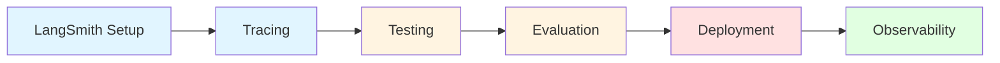
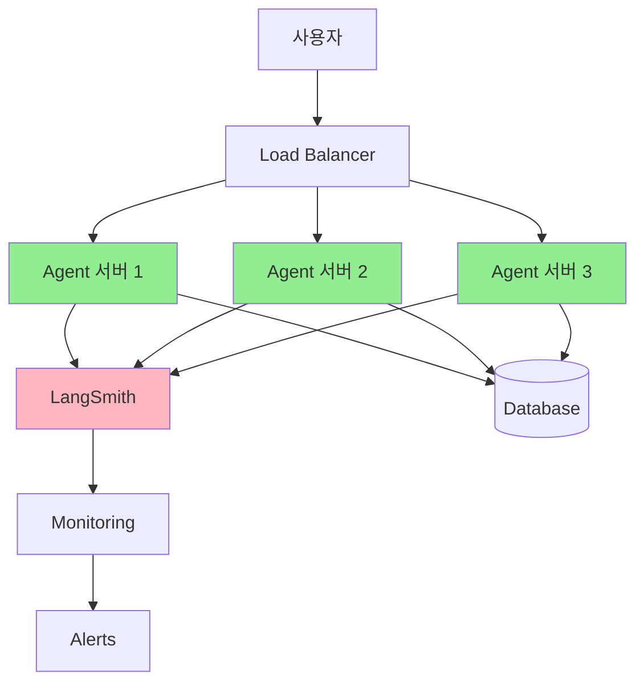
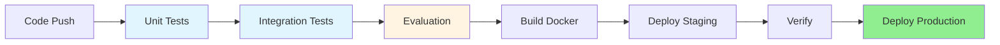

# Part 10: Deployment (배포와 관측성)

> 📚 **학습 시간**: 약 3-4시간
> 🎯 **난이도**: ⭐⭐⭐⭐☆ (고급)
> 📖 **공식 문서**: [30-langsmith-studio.md](../official/30-langsmith-studio_ko.md), [31-test.md](../official/31-test_ko.md), [33-deployment.md](../official/33-deployment_ko.md), [34-observability.md](../official/34-observability_ko.md)
> 💻 **예제 코드**: [part10_deployment 디렉토리](../src/part10_deployment/)

---

## 📋 학습 목표

이 파트를 완료하면 다음을 할 수 있습니다:

- [ ] LangSmith를 설정하고 Agent를 추적한다
- [ ] Tracing으로 실행 과정을 시각화한다
- [ ] Unit Test와 Integration Test를 작성한다
- [ ] LLM-as-judge로 Agent를 평가한다
- [ ] LangServe로 API 서버를 배포한다
- [ ] Logging과 Monitoring으로 프로덕션을 관리한다

---

## 📚 개요

Agent를 **개발**하는 것과 **운영**하는 것은 완전히 다른 문제입니다. Part 10에서는 개발한 Agent를 실제 프로덕션 환경에 배포하고, 안정적으로 운영하는 방법을 배웁니다.

### 왜 배포와 관측성이 중요한가?

**개발 vs 프로덕션의 차이:**

| 측면 | 개발 환경 | 프로덕션 환경 |
|------|----------|-------------|
| **사용자** | 개발자 1명 | 수천~수만 명 |
| **오류** | 즉시 수정 가능 | 장애로 이어짐 |
| **성능** | 느려도 OK | 지연은 이탈 |
| **비용** | 무시 가능 | 예산 초과 가능 |
| **디버깅** | 쉬움 (로컬) | 어려움 (원격) |

**프로덕션에서 발생하는 문제들:**

**1. 디버깅 불가능**
```python
# 문제: 왜 실패했는지 알 수 없음
try:
    result = agent.invoke(input)
except Exception as e:
    print(e)  # "Error occurred" 만 출력

# 해결: LangSmith Tracing으로 모든 단계 추적
# LangSmith UI에서 각 단계, 입력, 출력, 에러 확인 가능
```

**2. 신뢰성 검증 불가**
```python
# 문제: Agent가 올바른 답변을 하는지 확신 없음
result = agent.invoke({"messages": [{"role": "user", "content": "질문"}]})
# 결과가 정확한가? 🤷

# 해결: 테스트와 평가로 검증
def test_agent_accuracy():
    result = agent.invoke(test_input)
    assert evaluate(result.output, expected_output) > 0.8
```

**3. 성능 저하**
```python
# 문제: 프로덕션에서 느려짐
# 개발: 0.5초
# 프로덕션: 5초 (10배 느림!)

# 해결: Monitoring으로 성능 추적
metrics = {
    "latency": measure_latency(),
    "tokens": count_tokens(),
    "cost": calculate_cost()
}
```

### 실전 활용 사례

**LangSmith Studio**
- 로컬 개발: Agent 실행을 실시간 시각화
- 디버깅: 각 단계의 입력/출력 확인
- 프롬프트 수정: UI에서 바로 테스트

**Testing & Evaluation**
- 회귀 테스트: 변경 후 기능 유지 확인
- 성능 평가: LLM-as-judge로 품질 측정
- 벤치마크: 다양한 입력에 대한 일관성 검증

**Deployment**
- API 서버: LangServe로 RESTful API 제공
- Docker: 컨테이너화로 일관된 환경
- LangSmith Cloud: 관리형 호스팅

**Observability**
- Tracing: 모든 실행 기록
- Metrics: 성능, 비용, 오류율 추적
- Alerts: 문제 발생 시 즉시 알림

### Part 10 학습 로드맵



**학습 순서:**
1. **LangSmith Setup** (20분): API 키 설정과 프로젝트 생성
2. **Tracing** (25분): 자동 추적과 수동 span
3. **Testing** (30분): Unit Test와 Integration Test
4. **Evaluation** (30분): LLM-as-judge와 벤치마크
5. **Deployment** (25분): LangServe와 Docker
6. **Observability** (25분): Logging, Metrics, Alerts

---

## Section 1: LangSmith 기초 (LangSmith Setup)

### 1.1 LangSmith란?

**LangSmith**는 LangChain이 제공하는 **Agent 개발 및 운영 플랫폼**입니다.

**주요 기능:**

1. **Studio**: 로컬 Agent를 브라우저에서 시각화
2. **Tracing**: 모든 실행을 자동으로 기록
3. **Testing**: 테스트 데이터셋 관리
4. **Evaluation**: LLM-as-judge로 품질 평가
5. **Deployment**: 관리형 호스팅 (선택사항)

### 1.2 계정 생성

**1단계: 가입**
- https://smith.langchain.com 방문
- 무료 계정 생성 (GitHub 연동 가능)

**2단계: API 키 발급**
- Settings → API Keys 메뉴
- "Create API Key" 클릭
- 키 복사 (한 번만 표시됨)

**3단계: 환경 변수 설정**

```bash
# .env 파일에 추가
LANGSMITH_API_KEY=lsv2_pt_...
LANGSMITH_TRACING=true
LANGSMITH_PROJECT=my-agent-project
```

**주의사항:**
- `.env` 파일을 `.gitignore`에 추가
- API 키를 코드에 직접 작성하지 말 것
- 무료 플랜은 월 5,000 trace 제한

### 1.3 프로젝트 생성

**Python 코드로 설정:**

```python
import os
from dotenv import load_dotenv

load_dotenv()

# 환경 변수 확인
if not os.getenv("LANGSMITH_API_KEY"):
    raise ValueError("LANGSMITH_API_KEY가 설정되지 않았습니다")

print(f"✅ LangSmith 프로젝트: {os.getenv('LANGSMITH_PROJECT')}")
```

**프로젝트 관리:**

```python
from langsmith import Client

client = Client()

# 현재 프로젝트 조회
projects = client.list_projects()
for project in projects:
    print(f"프로젝트: {project.name}")

# 프로젝트 생성
client.create_project(
    project_name="production-agent",
    description="프로덕션 Agent"
)
```

### 1.4 기본 Tracing

**자동 Tracing:**

```python
from langchain.agents import create_agent

# LangSmith 설정만 하면 자동으로 trace됨
agent = create_agent(model="gpt-4o-mini", tools=[])

# 실행 - 자동으로 LangSmith에 기록
result = agent.invoke({
    "messages": [{"role": "user", "content": "안녕하세요"}]
})

# LangSmith UI에서 trace 확인 가능
```

**선택적 Tracing:**

```python
import langsmith as ls

# 이 블록만 trace
with ls.tracing_context(enabled=True):
    result = agent.invoke(input)

# 이건 trace 안됨
result = agent.invoke(input)
```

---

## Section 2: Tracing (추적)

### 2.1 자동 Tracing

**LangSmith 설정 시 모든 Agent 실행이 자동으로 추적**됩니다.

**Trace에 포함되는 정보:**

1. **입력**: 사용자 메시지
2. **LLM 호출**: 프롬프트, 모델, 응답
3. **Tool 실행**: 도구 이름, 인자, 결과
4. **중간 State**: 각 단계의 State
5. **출력**: 최종 응답
6. **메타데이터**: 시간, 토큰 수, 비용

**기본 Trace 확인:**

```python
from langchain.agents import create_agent
from langchain.tools import tool

@tool
def get_weather(city: str) -> str:
    """날씨 조회"""
    return f"{city}의 날씨는 맑습니다"

agent = create_agent(
    model="gpt-4o-mini",
    tools=[get_weather]
)

# 실행 - 자동으로 LangSmith에 trace 생성
result = agent.invoke({
    "messages": [{"role": "user", "content": "서울 날씨 알려줘"}]
})

# LangSmith UI에서 확인:
# 1. User Message
# 2. LLM Call (Tool Call 생성)
# 3. Tool Execution (get_weather)
# 4. LLM Call (최종 응답)
```

### 2.2 수동 Span 추가

**Custom Span**으로 특정 작업을 추적할 수 있습니다.

**기본 Span:**

```python
from langsmith import traceable

@traceable(name="데이터 처리")
def process_data(data: list[str]) -> list[str]:
    """데이터 처리 함수"""
    # 이 함수의 실행이 별도 span으로 기록됨
    processed = [item.upper() for item in data]
    return processed

# 사용
result = process_data(["hello", "world"])
# LangSmith에 "데이터 처리" span 생성
```

**중첩 Span:**

```python
@traceable(name="전체 파이프라인")
def pipeline(input_data):
    # Step 1
    with ls.trace(name="Step 1: 검증"):
        validated = validate(input_data)

    # Step 2
    with ls.trace(name="Step 2: 변환"):
        transformed = transform(validated)

    # Step 3
    with ls.trace(name="Step 3: 저장"):
        save(transformed)

    return transformed
```

### 2.3 Trace 메타데이터

**태그와 메타데이터 추가:**

```python
# 실행 시 메타데이터 추가
result = agent.invoke(
    {"messages": [{"role": "user", "content": "질문"}]},
    config={
        "tags": ["production", "v1.0", "customer-service"],
        "metadata": {
            "user_id": "user_123",
            "session_id": "session_456",
            "environment": "prod"
        }
    }
)
```

**프로젝트별 Trace:**

```python
with ls.tracing_context(
    project_name="customer-service-agent",
    tags=["production"],
    metadata={"version": "1.0"}
):
    result = agent.invoke(input)
```

### 2.4 Trace 조회

**Python으로 Trace 조회:**

```python
from langsmith import Client

client = Client()

# 최근 trace 조회
traces = client.list_runs(
    project_name="my-project",
    limit=10
)

for trace in traces:
    print(f"Run ID: {trace.id}")
    print(f"입력: {trace.inputs}")
    print(f"출력: {trace.outputs}")
    print(f"시간: {trace.end_time - trace.start_time}")
    print(f"토큰: {trace.token_count}")
    print()
```

**필터링:**

```python
# 에러만 조회
error_traces = client.list_runs(
    project_name="my-project",
    filter='error eq true'
)

# 특정 태그로 조회
prod_traces = client.list_runs(
    project_name="my-project",
    filter='has(tags, "production")'
)
```

---

## Section 3: Testing (테스팅)

### 3.1 Unit Testing

**Unit Test**는 Agent의 **개별 구성 요소**를 테스트합니다.

**Tool 테스트:**

```python
import pytest
from langchain.tools import tool

@tool
def calculate_sum(a: int, b: int) -> int:
    """두 숫자의 합"""
    return a + b

def test_calculate_sum():
    """덧셈 도구 테스트"""
    result = calculate_sum.invoke({"a": 2, "b": 3})
    assert result == 5

def test_calculate_sum_negative():
    """음수 테스트"""
    result = calculate_sum.invoke({"a": -5, "b": 3})
    assert result == -2
```

**Mock LLM 사용:**

```python
from langchain_core.language_models.fake_chat_models import GenericFakeChatModel
from langchain.messages import AIMessage

def test_agent_with_mock():
    """Mock LLM으로 Agent 테스트"""
    # Mock 응답 설정
    mock_model = GenericFakeChatModel(messages=iter([
        AIMessage(content="", tool_calls=[{
            "name": "get_weather",
            "args": {"city": "Seoul"},
            "id": "call_1"
        }]),
        AIMessage(content="서울의 날씨는 맑습니다")
    ]))

    agent = create_agent(
        model=mock_model,
        tools=[get_weather]
    )

    result = agent.invoke({
        "messages": [{"role": "user", "content": "서울 날씨"}]
    })

    # 검증
    assert "맑습니다" in result["messages"][-1].content
```

**InMemorySaver로 State 테스트:**

```python
from langgraph.checkpoint.memory import InMemorySaver

def test_agent_with_memory():
    """메모리가 있는 Agent 테스트"""
    agent = create_agent(
        model="gpt-4o-mini",
        tools=[],
        checkpointer=InMemorySaver()
    )

    config = {"configurable": {"thread_id": "test-1"}}

    # 첫 번째 턴
    agent.invoke(
        {"messages": [{"role": "user", "content": "내 이름은 홍길동"}]},
        config=config
    )

    # 두 번째 턴 - 이름 기억해야 함
    result = agent.invoke(
        {"messages": [{"role": "user", "content": "내 이름이 뭐야?"}]},
        config=config
    )

    assert "홍길동" in result["messages"][-1].content
```

### 3.2 Integration Testing

**Integration Test**는 Agent를 **실제 LLM과 함께** 테스트합니다.

**기본 통합 테스트:**

```python
import pytest

@pytest.mark.integration
def test_weather_agent():
    """날씨 Agent 통합 테스트"""
    agent = create_agent(
        model="gpt-4o-mini",
        tools=[get_weather]
    )

    result = agent.invoke({
        "messages": [{"role": "user", "content": "서울 날씨 알려줘"}]
    })

    # Tool이 호출되었는지 확인
    messages = result["messages"]
    tool_calls = [msg for msg in messages if hasattr(msg, "tool_calls") and msg.tool_calls]
    assert len(tool_calls) > 0

    # 최종 응답 확인
    assert "서울" in result["messages"][-1].content
```

**Fixture 사용:**

```python
import pytest

@pytest.fixture
def weather_agent():
    """날씨 Agent Fixture"""
    return create_agent(
        model="gpt-4o-mini",
        tools=[get_weather]
    )

def test_weather_query(weather_agent):
    """날씨 조회 테스트"""
    result = weather_agent.invoke({
        "messages": [{"role": "user", "content": "날씨"}]
    })
    assert result is not None

def test_weather_with_city(weather_agent):
    """도시명으로 날씨 조회"""
    result = weather_agent.invoke({
        "messages": [{"role": "user", "content": "부산 날씨"}]
    })
    assert "부산" in result["messages"][-1].content
```

### 3.3 Trajectory Match

**Trajectory Match**는 Agent의 **실행 경로**를 검증합니다.

```python
from agentevals.trajectory.match import create_trajectory_match_evaluator
from langchain.messages import HumanMessage, AIMessage, ToolMessage

def test_trajectory_strict():
    """엄격한 경로 매칭"""
    agent = create_agent("gpt-4o-mini", tools=[get_weather])

    evaluator = create_trajectory_match_evaluator(
        trajectory_match_mode="strict"
    )

    result = agent.invoke({
        "messages": [HumanMessage(content="서울 날씨")]
    })

    # 기대하는 경로
    reference = [
        HumanMessage(content="서울 날씨"),
        AIMessage(content="", tool_calls=[
            {"name": "get_weather", "args": {"city": "서울"}}
        ]),
        ToolMessage(content="서울의 날씨는 맑습니다"),
        AIMessage(content="서울의 날씨는 맑습니다")
    ]

    evaluation = evaluator(
        outputs=result["messages"],
        reference_outputs=reference
    )

    assert evaluation["score"] is True
```

---

## Section 4: Evaluation (평가)

### 4.1 LLM-as-Judge

**LLM-as-judge**는 다른 LLM을 평가자로 사용하는 기법입니다.

**기본 평가:**

```python
from langsmith import Client
from langchain_openai import ChatOpenAI

client = Client()

def llm_judge(inputs: dict, outputs: dict) -> dict:
    """LLM으로 응답 품질 평가"""
    judge_llm = ChatOpenAI(model="gpt-4o-mini")

    prompt = f"""
    질문: {inputs['question']}
    답변: {outputs['answer']}

    이 답변을 1-10점으로 평가하세요.
    평가 기준:
    - 정확성 (5점)
    - 명확성 (3점)
    - 완전성 (2점)

    점수만 출력하세요.
    """

    result = judge_llm.invoke(prompt)
    score = int(result.content)

    return {
        "score": score / 10,  # 0-1 사이로 정규화
        "comment": f"{score}/10점"
    }

# 사용
evaluation = llm_judge(
    inputs={"question": "Python이란?"},
    outputs={"answer": "Python은 프로그래밍 언어입니다"}
)
print(evaluation)  # {"score": 0.7, "comment": "7/10점"}
```

**Custom Evaluator:**

```python
from langsmith.evaluation import evaluate

def correctness_evaluator(run, example):
    """정확성 평가"""
    # run: Agent 실행 결과
    # example: 테스트 케이스

    agent_answer = run.outputs["messages"][-1].content
    expected_answer = example.outputs["answer"]

    # LLM으로 비교
    judge = ChatOpenAI(model="gpt-4o-mini")
    prompt = f"""
    정답: {expected_answer}
    Agent 답변: {agent_answer}

    Agent 답변이 정답과 같은 의미인지 판단하세요.
    - 같으면 1
    - 다르면 0
    """

    result = judge.invoke(prompt)
    score = int(result.content)

    return {"score": score}

# 평가 실행
dataset = client.create_dataset("test-dataset")
results = evaluate(
    agent,
    data=dataset,
    evaluators=[correctness_evaluator]
)
```

### 4.2 벤치마크

**벤치마크**는 다양한 입력에 대한 일관된 성능을 측정합니다.

**데이터셋 생성:**

```python
from langsmith import Client

client = Client()

# 데이터셋 생성
dataset = client.create_dataset(
    dataset_name="weather-benchmark",
    description="날씨 Agent 벤치마크"
)

# 테스트 케이스 추가
test_cases = [
    {
        "inputs": {"question": "서울 날씨는?"},
        "outputs": {"expected_tool": "get_weather", "expected_city": "서울"}
    },
    {
        "inputs": {"question": "부산 날씨 알려줘"},
        "outputs": {"expected_tool": "get_weather", "expected_city": "부산"}
    },
    {
        "inputs": {"question": "오늘 날씨"},
        "outputs": {"expected_tool": "get_weather", "expected_city": None}
    }
]

for case in test_cases:
    client.create_example(
        dataset_id=dataset.id,
        inputs=case["inputs"],
        outputs=case["outputs"]
    )
```

**벤치마크 실행:**

```python
from langsmith.evaluation import evaluate

def tool_selection_evaluator(run, example):
    """올바른 도구를 선택했는지 평가"""
    messages = run.outputs["messages"]

    # Tool call 찾기
    tool_calls = []
    for msg in messages:
        if hasattr(msg, "tool_calls") and msg.tool_calls:
            tool_calls.extend(msg.tool_calls)

    # 평가
    expected_tool = example.outputs["expected_tool"]
    called_tools = [tc["name"] for tc in tool_calls]

    score = 1 if expected_tool in called_tools else 0

    return {
        "score": score,
        "comment": f"호출된 도구: {called_tools}"
    }

# 평가
results = evaluate(
    agent,
    data="weather-benchmark",
    evaluators=[tool_selection_evaluator],
    experiment_prefix="weather-v1"
)

print(f"평균 점수: {results['mean_score']}")
```

### 4.3 Metrics 분석

**평가 결과 분석:**

```python
# 결과 조회
experiments = client.list_datasets()
for exp in experiments:
    print(f"데이터셋: {exp.name}")

    # 실행 결과
    runs = client.list_runs(dataset_id=exp.id)
    scores = [run.feedback_stats.get("score", 0) for run in runs]

    print(f"  평균 점수: {sum(scores) / len(scores):.2f}")
    print(f"  최고 점수: {max(scores)}")
    print(f"  최저 점수: {min(scores)}")
```

---

## Section 5: Deployment (배포)

### 5.1 LangServe

**LangServe**는 Agent를 **REST API**로 배포하는 프레임워크입니다.

**기본 설정:**

```python
from fastapi import FastAPI
from langserve import add_routes
from langchain.agents import create_agent

# Agent 생성
agent = create_agent(
    model="gpt-4o-mini",
    tools=[get_weather]
)

# FastAPI 앱 생성
app = FastAPI(
    title="Weather Agent API",
    version="1.0",
    description="날씨 조회 Agent"
)

# LangServe 라우트 추가
add_routes(
    app,
    agent,
    path="/agent",
    enable_feedback_endpoint=True,  # 피드백 수집
    enable_public_trace_link_endpoint=True  # Trace 링크 제공
)

# 실행: uvicorn main:app --reload
```

**API 사용:**

```python
import requests

# POST 요청
response = requests.post(
    "http://localhost:8000/agent/invoke",
    json={
        "input": {
            "messages": [
                {"role": "user", "content": "서울 날씨"}
            ]
        }
    }
)

result = response.json()
print(result["output"]["messages"][-1]["content"])
```

**스트리밍 API:**

```python
import requests

# 스트리밍 요청
response = requests.post(
    "http://localhost:8000/agent/stream",
    json={
        "input": {
            "messages": [{"role": "user", "content": "서울 날씨"}]
        }
    },
    stream=True
)

for line in response.iter_lines():
    if line:
        print(line.decode())
```

### 5.2 Docker 배포

**Dockerfile 작성:**

```dockerfile
FROM python:3.11-slim

WORKDIR /app

# 의존성 설치
COPY requirements.txt .
RUN pip install --no-cache-dir -r requirements.txt

# 코드 복사
COPY . .

# 환경 변수 설정
ENV LANGSMITH_TRACING=true
ENV PORT=8000

# 실행
CMD ["uvicorn", "main:app", "--host", "0.0.0.0", "--port", "8000"]
```

**docker-compose.yml:**

```yaml
version: '3.8'

services:
  agent:
    build: .
    ports:
      - "8000:8000"
    environment:
      - OPENAI_API_KEY=${OPENAI_API_KEY}
      - LANGSMITH_API_KEY=${LANGSMITH_API_KEY}
      - LANGSMITH_PROJECT=production-agent
    restart: unless-stopped
```

**빌드 및 실행:**

```bash
# 이미지 빌드
docker build -t weather-agent .

# 컨테이너 실행
docker run -p 8000:8000 \
  -e OPENAI_API_KEY=$OPENAI_API_KEY \
  -e LANGSMITH_API_KEY=$LANGSMITH_API_KEY \
  weather-agent

# docker-compose 사용
docker-compose up -d
```

### 5.3 환경 변수 관리

**개발/프로덕션 분리:**

```python
# config.py
import os
from enum import Enum

class Environment(Enum):
    DEVELOPMENT = "development"
    STAGING = "staging"
    PRODUCTION = "production"

def get_config():
    """환경별 설정"""
    env = os.getenv("ENVIRONMENT", "development")

    if env == "production":
        return {
            "model": "gpt-4o",
            "temperature": 0,
            "max_retries": 3,
            "timeout": 30
        }
    else:
        return {
            "model": "gpt-4o-mini",
            "temperature": 0.7,
            "max_retries": 1,
            "timeout": 10
        }

# 사용
config = get_config()
agent = create_agent(model=config["model"])
```

### 5.4 LangSmith Cloud Deployment (권장)

#### 5.4.1 왜 LangSmith Cloud를 사용하는가?

**LangSmith는 Agent 워크로드를 위해 설계된 관리형 호스팅 플랫폼**입니다.

**전통적인 호스팅 vs LangSmith:**

| 특징 | 일반 플랫폼 | LangSmith Cloud |
|------|-----------|----------------|
| **설계 대상** | 상태 없는(stateless) 단기 웹 앱 | 상태 유지(stateful) 장시간 Agent |
| **상태 관리** | 직접 구현 필요 | 자동 관리 |
| **배경 실행** | 추가 인프라 필요 | 기본 지원 |
| **스케일링** | 수동 설정 | 자동 처리 |

**주요 장점:**

- ✅ **Persistent State 자동 관리** - Checkpointer 불필요
- ✅ **Background Execution 지원** - 장시간 실행 Agent OK
- ✅ **인프라 관리 불필요** - 스케일링, 로드밸런싱 자동
- ✅ **GitHub 직접 배포** - 코드 푸시만으로 배포
- ✅ **무료 시작** - 신용카드 없이 시작 가능

#### 5.4.2 사전 준비

배포 전 필요한 것:

1. **GitHub 계정** (public/private 저장소 모두 지원)
2. **LangSmith 계정** (https://smith.langchain.com 에서 무료 가입)
3. **LangGraph 호환 애플리케이션** (로컬에서 동작 확인 완료)

> 📖 **공식 문서**: [33-deployment.md](../official/33-deployment_ko.md)

#### 5.4.3 배포 단계

**1단계: GitHub 저장소 생성**

애플리케이션 코드를 GitHub에 푸시합니다.

```bash
# Git 초기화 (아직 안했다면)
git init
git add .
git commit -m "Initial commit"

# GitHub 저장소에 푸시
git remote add origin https://github.com/your-username/your-agent.git
git push -u origin main
```

**2단계: LangSmith에 배포**

1. **LangSmith 로그인** → [https://smith.langchain.com](https://smith.langchain.com)
2. 왼쪽 사이드바에서 **Deployments** 선택
3. **+ New Deployment** 버튼 클릭
4. **GitHub 계정 연결** (첫 사용 시):
   - "Add new account" 클릭
   - GitHub 인증 완료
5. **저장소 선택**:
   - 연결된 저장소 목록에서 선택
   - Branch 선택 (기본: main)
6. **Submit** 클릭
7. **배포 대기** - 약 15분 소요

#### 5.4.4 배포된 Agent 호출

배포가 완료되면 API URL이 생성됩니다.

**Python SDK 사용:**

```python
from langgraph_sdk import get_client

# Client 생성
client = get_client(url="https://your-deployment.us.langgraph.app")

# 스레드 생성
thread = await client.threads.create()

# Agent 실행
response = await client.runs.create(
    thread_id=thread["thread_id"],
    assistant_id="agent",  # langgraph.json의 graph 이름
    input={"messages": [{"role": "user", "content": "서울 날씨 알려줘"}]}
)

# 결과 조회 (완료 대기)
result = await client.runs.wait(
    thread_id=thread["thread_id"],
    run_id=response["run_id"]
)

print(result["values"]["messages"][-1]["content"])
```

**cURL 사용:**

```bash
curl -X POST "https://your-deployment.us.langgraph.app/runs/stream" \
  -H "Content-Type: application/json" \
  -H "Authorization: Bearer $LANGSMITH_API_KEY" \
  -d '{
    "assistant_id": "agent",
    "input": {"messages": [{"role": "user", "content": "Hello"}]},
    "stream_mode": ["values"]
  }'
```

**스트리밍 예제:**

```python
async for chunk in client.runs.stream(
    thread_id=thread["thread_id"],
    assistant_id="agent",
    input={"messages": [{"role": "user", "content": "긴 작업 수행"}]},
    stream_mode="values"
):
    print(chunk)
```

#### 5.4.5 환경 변수 및 시크릿

배포 설정에서 환경 변수를 추가할 수 있습니다.

**Deployment Settings에서 추가:**

1. Deployment 선택 → **Settings** 탭
2. **Environment Variables** 섹션
3. 변수 추가:
   - `OPENAI_API_KEY` - OpenAI API 키
   - `ANTHROPIC_API_KEY` - Anthropic API 키
   - `DATABASE_URL` - 데이터베이스 연결
   - 기타 필요한 시크릿

**보안:**
- 모든 시크릿은 암호화되어 저장
- Git 커밋에 포함되지 않음
- Deployment에서만 접근 가능

#### 5.4.6 배포 업데이트

GitHub에 푸시하면 자동으로 재배포됩니다.

```bash
# 코드 수정
git add .
git commit -m "Update agent logic"
git push origin main

# LangSmith가 자동으로 감지하여 재배포 시작
```

**배포 진행 상황:**
- Deployments 페이지에서 실시간 확인
- 빌드 로그 확인 가능
- 실패 시 이전 버전 자동 유지

**롤백:**
- Deployment 페이지에서 이전 버전 선택
- "Rollback" 클릭으로 즉시 복구

#### 5.4.7 모니터링 및 관리

LangSmith Cloud는 강력한 모니터링 기능을 제공합니다.

**1. Traces (추적):**
- 모든 Agent 실행 자동 추적
- 각 단계별 입력/출력 확인
- 에러 발생 시 상세 스택 트레이스

**2. Logs (로그):**
- 실시간 로그 스트리밍
- 필터링 및 검색
- 에러 로그 자동 하이라이트

**3. Metrics (메트릭):**
- 요청 수, 응답 시간
- 성공률, 에러율
- 토큰 사용량, 비용
- 커스텀 메트릭 추가 가능

**4. Scaling (스케일링):**
- 트래픽에 따라 자동 스케일
- Zero-downtime 배포
- 로드밸런싱 자동

**5. Health Checks:**
- 자동 헬스 체크
- 응답 없으면 자동 재시작
- 알림 설정 가능

#### 5.4.8 LangSmith vs LangServe 비교

| 특징 | LangSmith Cloud | LangServe (Self-hosted) |
|------|-----------------|------------------------|
| **관리** | 완전 관리형 (Managed) | 직접 관리 (Self-managed) |
| **설정** | GitHub 연동만 | 서버, Docker, 네트워크 설정 |
| **스케일링** | 자동 (트래픽 기반) | 수동 (인프라 추가 필요) |
| **상태 관리** | 자동 (Persistent state) | Checkpointer 직접 설정 |
| **비용** | 무료 시작, 종량제 | 인프라 비용 (서버, DB 등) |
| **모니터링** | 내장 (Traces, Logs, Metrics) | 직접 구축 필요 |
| **배포 속도** | 5분 (GitHub 푸시) | 30분+ (인프라 설정) |
| **유지보수** | 자동 업데이트 | 수동 패치 |
| **추천 대상** | 대부분의 경우 | 특수 인프라 요구사항 |

**선택 가이드:**

**LangSmith Cloud 추천:**
- 빠르게 프로덕션 배포 필요
- 인프라 관리 부담 줄이고 싶음
- 자동 스케일링 필요
- 모니터링 도구 필요

**LangServe 추천:**
- 완전한 인프라 제어 필요
- On-premise 배포 요구사항
- 특수한 네트워크 구성 필요
- 이미 운영 중인 인프라 활용

> 💡 **권장 사항**: LangSmith Cloud를 먼저 시도하고, 특별한 인프라 요구사항이 있을 때만 LangServe를 고려하세요.

**실전 활용:**

```python
# 개발 환경: 로컬 테스트
from langgraph.prebuilt import create_agent

agent = create_agent(model="gpt-4o-mini", tools=[...])
result = agent.invoke({"messages": [...]})

# 프로덕션 환경: LangSmith Cloud
from langgraph_sdk import get_client

client = get_client(url="https://prod-agent.us.langgraph.app")
result = await client.runs.create(
    assistant_id="agent",
    input={"messages": [...]}
)
```

---

## Section 6: Observability (관측성)

### 6.1 Logging

**구조화된 로깅:**

```python
import logging
import json
from datetime import datetime

# 로거 설정
logging.basicConfig(
    level=logging.INFO,
    format='%(asctime)s - %(name)s - %(levelname)s - %(message)s'
)
logger = logging.getLogger(__name__)

def log_agent_execution(func):
    """Agent 실행 로깅 데코레이터"""
    def wrapper(*args, **kwargs):
        start_time = datetime.now()
        logger.info(f"Agent 실행 시작: {func.__name__}")

        try:
            result = func(*args, **kwargs)
            duration = (datetime.now() - start_time).total_seconds()

            logger.info(json.dumps({
                "function": func.__name__,
                "status": "success",
                "duration_seconds": duration,
                "timestamp": datetime.now().isoformat()
            }))

            return result
        except Exception as e:
            logger.error(f"Agent 실행 실패: {e}", exc_info=True)
            raise

    return wrapper

@log_agent_execution
def run_agent(input_text):
    """Agent 실행"""
    return agent.invoke({
        "messages": [{"role": "user", "content": input_text}]
    })
```

### 6.2 Metrics 수집

**성능 메트릭:**

```python
from collections import defaultdict
import time

class Metrics:
    """메트릭 수집기"""

    def __init__(self):
        self.latencies = []
        self.token_counts = []
        self.costs = []
        self.errors = defaultdict(int)

    def record_request(self, latency, tokens, cost):
        """요청 메트릭 기록"""
        self.latencies.append(latency)
        self.token_counts.append(tokens)
        self.costs.append(cost)

    def record_error(self, error_type):
        """에러 기록"""
        self.errors[error_type] += 1

    def get_stats(self):
        """통계 조회"""
        return {
            "total_requests": len(self.latencies),
            "avg_latency": sum(self.latencies) / len(self.latencies) if self.latencies else 0,
            "total_tokens": sum(self.token_counts),
            "total_cost": sum(self.costs),
            "error_count": sum(self.errors.values())
        }

# 사용
metrics = Metrics()

def tracked_invoke(agent, input_data):
    """메트릭을 수집하며 Agent 실행"""
    start_time = time.time()

    try:
        result = agent.invoke(input_data)
        latency = time.time() - start_time

        # 토큰 수와 비용 계산 (예시)
        tokens = result.get("token_count", 0)
        cost = tokens * 0.00002  # $0.02 per 1K tokens

        metrics.record_request(latency, tokens, cost)
        return result
    except Exception as e:
        metrics.record_error(type(e).__name__)
        raise

# 통계 출력
print(metrics.get_stats())
```

### 6.3 Monitoring

**헬스 체크:**

```python
from fastapi import FastAPI, HTTPException

app = FastAPI()

@app.get("/health")
def health_check():
    """서비스 상태 확인"""
    try:
        # Agent 간단히 테스트
        test_result = agent.invoke({
            "messages": [{"role": "user", "content": "test"}]
        })

        return {
            "status": "healthy",
            "timestamp": datetime.now().isoformat()
        }
    except Exception as e:
        raise HTTPException(status_code=503, detail=str(e))

@app.get("/metrics")
def get_metrics():
    """메트릭 조회"""
    return metrics.get_stats()
```

### 6.4 Alerts

**알림 설정:**

```python
import smtplib
from email.mime.text import MIMEText

def send_alert(subject, message):
    """이메일 알림 발송"""
    msg = MIMEText(message)
    msg['Subject'] = subject
    msg['From'] = "agent@example.com"
    msg['To'] = "admin@example.com"

    with smtplib.SMTP('localhost') as s:
        s.send_message(msg)

def monitor_agent():
    """Agent 모니터링"""
    stats = metrics.get_stats()

    # 에러율 체크
    error_rate = stats["error_count"] / max(stats["total_requests"], 1)
    if error_rate > 0.1:  # 10% 이상
        send_alert(
            "Agent Error Rate High",
            f"에러율: {error_rate:.2%}"
        )

    # 지연 시간 체크
    if stats["avg_latency"] > 5.0:  # 5초 이상
        send_alert(
            "Agent Latency High",
            f"평균 지연: {stats['avg_latency']:.2f}초"
        )
```

---

---

## 실전 팁

### 팁 1: Trace 비용 절감

```python
# 개발 환경에서만 trace
if os.getenv("ENVIRONMENT") == "production":
    os.environ["LANGSMITH_TRACING"] = "false"
```

### 팁 2: 테스트 격리

```python
@pytest.fixture(autouse=True)
def disable_tracing():
    """테스트 중 tracing 비활성화"""
    original = os.getenv("LANGSMITH_TRACING")
    os.environ["LANGSMITH_TRACING"] = "false"
    yield
    if original:
        os.environ["LANGSMITH_TRACING"] = original
```

### 팁 3: 점진적 배포

```python
# 카나리 배포: 10% 트래픽만 새 버전으로
import random

def route_request(input_data):
    if random.random() < 0.1:
        # 새 버전 (10%)
        return new_agent.invoke(input_data)
    else:
        # 기존 버전 (90%)
        return old_agent.invoke(input_data)
```

### 팁 4: 캐싱으로 비용 절감

```python
from functools import lru_cache

@lru_cache(maxsize=1000)
def cached_invoke(query: str):
    """자주 묻는 질문 캐싱"""
    return agent.invoke({
        "messages": [{"role": "user", "content": query}]
    })
```

### 팁 5: 비동기 처리

```python
from fastapi import BackgroundTasks

@app.post("/agent/async")
async def async_agent(input_data: dict, background_tasks: BackgroundTasks):
    """비동기 Agent 실행"""
    def run_agent():
        result = agent.invoke(input_data)
        # 결과 저장 또는 알림

    background_tasks.add_task(run_agent)
    return {"status": "processing"}
```

---

## ❓ 자주 묻는 질문

<details>
<summary><strong>Q1: LangSmith 무료 플랜으로 충분한가요?</strong></summary>

개발과 소규모 프로젝트에는 충분합니다 (월 5,000 traces). 프로덕션은 유료 플랜 권장.

</details>

<details>
<summary><strong>Q2: Docker 없이 배포할 수 있나요?</strong></summary>

가능합니다. 하지만 Docker를 사용하면 환경 일관성, 격리, 확장성 면에서 유리합니다.

</details>

<details>
<summary><strong>Q3: 평가 시 실제 LLM을 호출하나요?</strong></summary>

LLM-as-judge는 실제로 LLM을 호출하므로 비용이 발생합니다. Mock이나 캐싱 활용 권장.

</details>

<details>
<summary><strong>Q4: 프로덕션에서 Trace를 항상 켜야 하나요?</strong></summary>

선택사항입니다. 비용과 디버깅 필요성을 고려하여 결정하세요. 샘플링(10% 등)도 옵션입니다.

</details>

<details>
<summary><strong>Q5: LangServe 대신 다른 프레임워크를 써도 되나요?</strong></summary>

가능합니다. Flask, Django 등 어떤 프레임워크든 Agent를 통합할 수 있습니다.

</details>

---

## 다이어그램

### 배포 아키텍처



### CI/CD 파이프라인



---

## 🎓 실습 과제

### 과제 1: 테스트 스위트 구축

**난이도**: ★★★☆☆

Agent 시스템의 품질을 보장하기 위한 종합 테스트 스위트를 구축하세요.

**요구사항**:
1. Unit 테스트: 개별 컴포넌트 (도구, 프롬프트)
2. Integration 테스트: Agent 통합 동작
3. End-to-End 테스트: 전체 플로우

```python
# 기본 구조 예시
import pytest
from unittest.mock import Mock, patch

@tool
def calculator(expression: str) -> float:
    """수식을 계산합니다."""
    return eval(expression)

def test_calculator_tool():
    assert calculator.invoke("2 + 3") == 5
```

> **힌트**: `src/part10_deployment/03_testing.py`를 참고하세요.

> **해답**: [solutions/exercise_01.py](../src/part10_deployment/solutions/exercise_01.py)

### 과제 2: 평가 시스템

**난이도**: ★★★★☆

Agent 성능을 자동으로 평가하는 시스템을 구축하세요.

**요구사항**:
1. Agent 성능 자동 평가
2. 벤치마크 데이터셋 구성
3. 메트릭 수집 및 분석

```python
# 기본 구조 예시
@dataclass
class EvaluationCase:
    question: str
    expected_answer: str
    category: str
    difficulty: str

class AgentEvaluator:
    def evaluate(self, cases: List[EvaluationCase]) -> Dict:
        ...
```

> **힌트**: `src/part10_deployment/04_evaluation.py`를 참고하세요.

> **해답**: [solutions/exercise_02.py](../src/part10_deployment/solutions/exercise_02.py)

### 과제 3: 프로덕션 배포 (LangServe + Docker)

**난이도**: ★★★★☆

LangServe와 Docker를 사용하여 Agent를 프로덕션 환경에 배포하세요.

**요구사항**:
1. LangServe로 API 서버 구축
2. Docker 컨테이너화
3. 프로덕션 배포 준비 (환경변수, 보안, 헬스체크)

```python
# 기본 구조 예시
from fastapi import FastAPI
from langserve import add_routes

app = FastAPI(title="Agent API")

# Agent 라우트 추가
add_routes(app, agent, path="/agent")
```

> **힌트**: `src/part10_deployment/05_deployment.py`를 참고하세요.

> **해답**: [solutions/exercise_03.py](../src/part10_deployment/solutions/exercise_03.py)

---

## 🔗 심화 학습

### 공식 문서
- [LangSmith 공식 문서](https://docs.smith.langchain.com/)
- [LangGraph Deploy 가이드](https://langchain-ai.github.io/langgraph/cloud/deployment/cloud/)
- [LangChain Evaluation 가이드](https://docs.smith.langchain.com/evaluation)

### 고급 주제
- **모니터링 고급**: Custom Metrics, Alerting, A/B 테스트
- **평가 고급**: RAG 평가, Multi-turn 대화 평가, Safety 평가
- **배포 고급**: Kubernetes, CI/CD, Blue-Green Deploy

### 커뮤니티 리소스
- [LangChain Blog](https://blog.langchain.dev/)
- [LangSmith Cookbook](https://github.com/langchain-ai/langsmith-cookbook)

---

## ✅ 체크리스트

이 파트를 완료했다면 다음을 할 수 있어야 합니다:

### 모니터링
- [ ] LangSmith를 설정하고 Agent 실행을 추적할 수 있다
- [ ] Trace 데이터를 분석하여 성능 병목을 찾을 수 있다
- [ ] 커스텀 메트릭을 정의하고 모니터링할 수 있다

### 평가
- [ ] 평가 데이터셋을 생성하고 관리할 수 있다
- [ ] 커스텀 Evaluator를 구현할 수 있다
- [ ] LLM-as-judge 패턴으로 자동 평가를 실행할 수 있다

### 배포
- [ ] FastAPI로 Agent API를 구현할 수 있다
- [ ] Docker로 Agent를 컨테이너화할 수 있다
- [ ] 프로덕션 환경의 보안 및 성능을 고려할 수 있다

---

## 마치며

축하합니다! LangChain AI Agent 마스터 교안 10개 파트를 모두 완료했습니다!

### 배운 내용 요약

| 파트 | 주제 | 핵심 내용 |
|------|------|-----------|
| **Part 1-3** | Agent 기초 | 첫 Agent 만들기, 도구, 그래프 |
| **Part 4-5** | 고급 기능 | Memory, Middleware |
| **Part 6-8** | 확장 | Context, Multi-Agent, RAG/MCP |
| **Part 9** | 프로덕션 | Streaming, HITL, Structured Output |
| **Part 10** | 배포 | 모니터링, 테스팅, 배포 |

### 다음 단계

1. **실습 프로젝트**: 4개 미니 프로젝트 완료 (`projects/` 디렉토리)
2. **개인 프로젝트**: 실제 문제를 해결하는 Agent 개발
3. **커뮤니티 참여**: LangChain Discord, GitHub 이슈
4. **최신 정보**: 공식 문서와 블로그 팔로우

**학습 진도**: ▓▓▓▓▓▓▓▓▓▓ 100% (Part 10/10 완료)

---

*마지막 업데이트: 2026-02-18*
