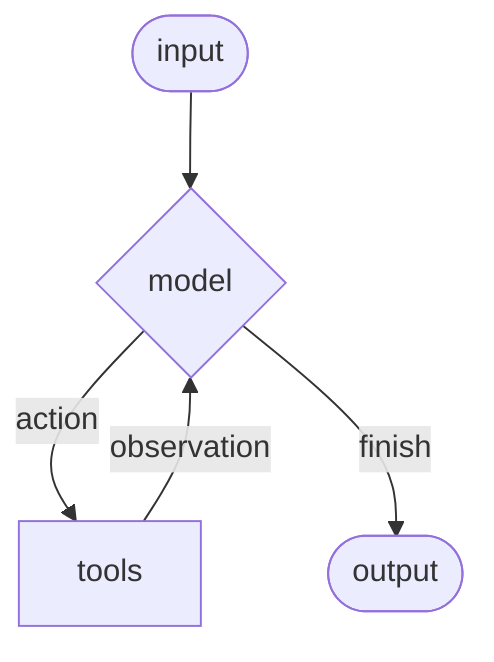

# Agent

Agent는 언어 모델을 [도구](/oss/python/langchain/tools)와 결합하여 작업에 대해 추론하고, 어떤 도구를 사용할지 결정하고, 반복적으로 해결책에 접근할 수 있는 시스템을 만듭니다.

[create_agent](https://reference.langchain.com/python/langchain/agents/#langchain.agents.create_agent)는 프로덕션 환경에서 사용 가능한 Agent 구현을 제공합니다.

[LLM Agent는 목표를 달성하기 위해 루프에서 도구를 실행합니다](https://simonwillison.net/2025/Sep/18/agents/). Agent는 중지 조건이 충족될 때까지 실행됩니다. 즉, 모델이 최종 출력을 내보내거나 반복 제한에 도달할 때까지 실행됩니다.



> [create_agent](https://reference.langchain.com/python/langchain/agents/#langchain.agents.create_agent)는 [LangGraph](/oss/python/langgraph/overview)를 사용하여 **그래프** 기반 Agent 런타임을 구축합니다. 그래프는 노드(단계)와 엣지(연결)로 구성되어 Agent가 정보를 어떻게 처리하는지 정의합니다. Agent는 이 그래프를 통해 이동하면서 모델 노드(모델을 호출하는 노드), 도구 노드(도구를 실행하는 노드) 또는 Middleware 같은 노드를 실행합니다.
>
> [그래프 API](/oss/python/langgraph/graph-api)에 대해 자세히 알아보세요.

## 핵심 구성 요소

### Model(모델)
[model](/oss/python/langchain/models)은 Agent의 추론 엔진입니다. 정적 및 동적 모델 선택을 모두 지원하는 여러 가지 방식으로 지정할 수 있습니다.

#### 정적 모델
정적 모델은 Agent를 만들 때 한 번 구성되고 실행 중에는 변경되지 않습니다. 이것이 가장 일반적이고 간단한 방식입니다.

모델 식별자 문자열에서 정적 모델을 초기화하려면:
```python
from langchain.agents import create_agent

agent = create_agent("openai:gpt-5", tools=tools)
```

> 모델 식별자 문자열은 자동 추론을 지원합니다(예: "gpt-5"는 "openai:gpt-5"로 자동으로 인식됩니다). 전체 모델 식별자 문자열 매핑 목록은 참조를 확인하세요.

모델 구성을 더 세밀하게 제어하려면 공급자 패키지를 사용하여 모델 인스턴스를 직접 초기화하세요. 이 예제에서는 `ChatOpenAI`를 사용합니다. 사용 가능한 다른 채팅 모델 클래스는 [채팅 모델](/oss/python/integrations/chat)을 참조하세요.

```python
from langchain.agents import create_agent
from langchain_openai import ChatOpenAI

model = ChatOpenAI(
    model="gpt-5",
    temperature=0.1,
    max_tokens=1000,
    timeout=30
    # ... (기타 params)
)
agent = create_agent(model, tools=tools)
```

모델 인스턴스는 구성에 대한 완전한 제어를 제공합니다. `temperature`, `max_tokens`, `timeouts`, `base_url` 및 기타 공급자별 설정과 같은 특정 매개변수를 설정해야 할 때 이를 사용하세요. 모델에서 사용 가능한 params과 메서드는 참조를 확인하세요.

#### 동적 모델
동적 모델은 현재 상태와 컨텍스트를 기반으로 런타임에 선택됩니다. 이를 통해 정교한 라우팅 로직과 비용 최적화가 가능해집니다.

동적 모델을 사용하려면 `@wrap_model_call` 데코레이터를 사용하여 요청에서 모델을 수정하는 Middleware를 만드세요:

```python
from langchain_openai import ChatOpenAI
from langchain.agents import create_agent
from langchain.agents.middleware import wrap_model_call, ModelRequest, ModelResponse


basic_model = ChatOpenAI(model="gpt-4o-mini")
advanced_model = ChatOpenAI(model="gpt-4o")

@wrap_model_call
def dynamic_model_selection(request: ModelRequest, handler) -> ModelResponse:
    """대화의 복잡도를 기반으로 모델을 선택합니다."""
    message_count = len(request.state["messages"])

    if message_count > 10:
        # 긴 대화의 경우 고급 모델을 사용합니다
        model = advanced_model
    else:
        model = basic_model

    return handler(request.override(model=model))

agent = create_agent(
    model=basic_model,  # 기본 모델
    tools=tools,
    middleware=[dynamic_model_selection]
)
```

> `bind_tools`가 이미 호출된 사전 바인딩된 모델은 구조화된 출력을 사용할 때 지원되지 않습니다. 구조화된 출력으로 동적 모델 선택이 필요한 경우 Middleware에 전달되는 모델이 사전 바인딩되지 않았는지 확인하세요.

> 모델 구성 세부 정보는 [모델](/oss/python/langchain/models)을 참조하세요. 동적 모델 선택 패턴은 [Middleware에서의 동적 모델](/oss/python/langchain/middleware#dynamic-model)을 참조하세요.

### Tool(도구)
Tool은 Agent에게 작업을 수행할 수 있는 능력을 제공합니다. Agent는 단순한 모델만 사용하는 도구 바인딩을 넘어 다음을 용이하게 합니다:
*   순차적인 여러 도구 호출(단일 프롬프트에서 트리거됨)
*   적절할 때 병렬 도구 호출
*   이전 결과를 기반으로 한 동적 도구 선택
*   도구 재시도 로직 및 오류 처리
*   도구 호출 전반에 걸친 상태 유지

자세한 내용은 [도구](/oss/python/langchain/tools)를 참조하세요.

#### 도구 정의
Agent에 도구 목록을 전달합니다.

> Tool은 순수 Python 함수 또는 코루틴으로 지정될 수 있습니다.
>
> [tool 데코레이터](/oss/python/langchain/tools#create-tools)를 사용하여 도구 이름, 설명, 인자 스키마 및 기타 속성을 사용자 정의할 수 있습니다.

```python
from langchain.tools import tool
from langchain.agents import create_agent


@tool
def search(query: str) -> str:
    """정보를 검색합니다."""
    return f"Results for: {query}"

@tool
def get_weather(location: str) -> str:
    """위치의 날씨 정보를 가져옵니다."""
    return f"Weather in {location}: Sunny, 72°F"

agent = create_agent(model, tools=[search, get_weather])
```

빈 도구 목록이 제공되면 Agent는 도구 호출 기능이 없는 단일 LLM 노드로 구성됩니다.

#### 도구 오류 처리
도구 오류 처리 방식을 사용자 정의하려면 `@wrap_tool_call` 데코레이터를 사용하여 Middleware를 만드세요:

```python
from langchain.agents import create_agent
from langchain.agents.middleware import wrap_tool_call
from langchain.messages import ToolMessage


@wrap_tool_call
def handle_tool_errors(request, handler):
    """도구 실행 오류를 사용자 정의 메시지로 처리합니다."""
    try:
        return handler(request)
    except Exception as e:
        # 모델에 사용자 정의 오류 메시지를 반환합니다
        return ToolMessage(
            content=f"Tool error: Please check your input and try again. ({str(e)})",
            tool_call_id=request.tool_call["id"]
        )

agent = create_agent(
    model="gpt-4o",
    tools=[search, get_weather],
    middleware=[handle_tool_errors]
)
```

Agent는 도구가 실패할 때 사용자 정의 오류 메시지와 함께 `ToolMessage`를 반환합니다:
```python
[
    ...
    ToolMessage(
        content="Tool error: Please check your input and try again. (division by zero)",
        tool_call_id="..."
    ),
    ...
]
```

#### ReAct 루프에서의 도구 사용
Agent는 ReAct("Reasoning + Acting") 패턴을 따르며, 목표한 도구 호출을 통한 짧은 추론 단계와 결과 관찰을 이후 결정에 피드백하는 것을 번갈아 가며 최종 답을 제시할 수 있을 때까지 진행합니다.

<details>
<summary>ReAct 루프 예제</summary>

**프롬프트**: 현재 가장 인기 있는 무선 헤드폰을 찾고 재고 가용성을 확인합니다.

```text
================================ Human Message =================================

Find the most popular wireless headphones right now and check if they're in stock
```

*   **추론**: "인기도는 시간에 민감하므로 제공된 검색 도구를 사용해야 합니다."
*   **행동**: `search_products("wireless headphones")` 호출

```text
================================== Ai Message ==================================
Tool Calls:
  search_products (call_abc123)
 Call ID: call_abc123
  Args:
    query: wireless headphones
```

```text
================================= Tool Message =================================

Found 5 products matching "wireless headphones". Top 5 results: WH-1000XM5, ...
```

*   **추론**: "답변하기 전에 상위 순위 항목의 가용성을 확인해야 합니다."
*   **행동**: `check_inventory("WH-1000XM5")` 호출

```text
================================== Ai Message ==================================
Tool Calls:
  check_inventory (call_def456)
 Call ID: call_def456
  Args:
    product_id: WH-1000XM5
```

```text
================================= Tool Message =================================

Product WH-1000XM5: 10 units in stock
```

*   **추론**: "가장 인기 있는 모델과 그 재고 상태를 알았습니다. 이제 사용자의 질문에 답할 수 있습니다."
*   **행동**: 최종 답변 생성

```text
================================== Ai Message ==================================

I found wireless headphones (model WH-1000XM5) with 10 units in stock...
```

</details>

> 도구에 대해 자세히 알아보려면 [도구](/oss/python/langchain/tools)를 참조하세요.

### 시스템 프롬프트
프롬프트를 제공하여 Agent가 작업에 접근하는 방식을 형성할 수 있습니다. `system_prompt` 매개변수는 문자열로 제공될 수 있습니다:

```python
agent = create_agent(
    model,
    tools,
    system_prompt="You are a helpful assistant. Be concise and accurate."
)
```

`system_prompt`가 제공되지 않으면 Agent는 메시지에서 직접 작업을 추론합니다.

`system_prompt` 매개변수는 `str` 또는 `SystemMessage`를 받습니다. `SystemMessage`를 사용하면 프롬프트 구조에 대한 더 많은 제어가 가능하며, [Anthropic의 프롬프트 캐싱](/oss/python/integrations/chat/anthropic#prompt-caching) 같은 공급자별 기능에 유용합니다:

```python
from langchain.agents import create_agent
from langchain.messages import SystemMessage, HumanMessage

literary_agent = create_agent(
    model="anthropic:claude-sonnet-4-5",
    system_prompt=SystemMessage(
        content=[
            {
                "type": "text",
                "text": "You are an AI assistant tasked with analyzing literary works.",
            },
            {
                "type": "text",
                "text": "<the entire contents of 'Pride and Prejudice'>",
                "cache_control": {"type": "ephemeral"}
            }
        ]
    )
)

result = literary_agent.invoke(
    {"messages": [HumanMessage("Analyze the major themes in 'Pride and Prejudice'.")]}
)
```

`cache_control` 필드와 함께 `{"type": "ephemeral"}`를 사용하면 Anthropic에 해당 콘텐츠 블록을 캐시하도록 지시하여 같은 시스템 프롬프트를 사용하는 반복 요청의 지연 시간과 비용을 줄입니다.

#### 동적 시스템 프롬프트
런타임 컨텍스트 또는 Agent 상태에 기반하여 시스템 프롬프트를 수정해야 하는 더 고급 사용 사례의 경우 [Middleware](/oss/python/langchain/middleware)를 사용할 수 있습니다.

`@dynamic_prompt` 데코레이터는 모델 요청을 기반으로 시스템 프롬프트를 생성하는 Middleware를 만듭니다:

```python
from typing import TypedDict

from langchain.agents import create_agent
from langchain.agents.middleware import dynamic_prompt, ModelRequest


class Context(TypedDict):
    user_role: str

@dynamic_prompt
def user_role_prompt(request: ModelRequest) -> str:
    """사용자 역할을 기반으로 시스템 프롬프트를 생성합니다."""
    user_role = request.runtime.context.get("user_role", "user")
    base_prompt = "You are a helpful assistant."

    if user_role == "expert":
        return f"{base_prompt} Provide detailed technical responses."
    elif user_role == "beginner":
        return f"{base_prompt} Explain concepts simply and avoid jargon."

    return base_prompt

agent = create_agent(
    model="gpt-4o",
    tools=[web_search],
    middleware=[user_role_prompt],
    context_schema=Context
)

# 시스템 프롬프트는 컨텍스트에 기반하여 동적으로 설정됩니다
result = agent.invoke(
    {"messages": [{"role": "user", "content": "Explain machine learning"}]},
    context={"user_role": "expert"}
)
```

> 메시지 타입과 형식에 대한 자세한 내용은 [메시지](/oss/python/langchain/messages)를 참조하세요. 포괄적인 Middleware 문서는 [Middleware](/oss/python/langchain/middleware)를 참조하세요.

## 호출

Agent를 [상태](/oss/python/langgraph/graph-api#state)로 업데이트를 전달하여 호출할 수 있습니다. 모든 Agent는 상태에 [메시지 시퀀스](/oss/python/langgraph/use-graph-api#messagesstate)를 포함합니다. Agent를 호출하려면 새 메시지를 전달하세요:

```python
result = agent.invoke(
    {"messages": [{"role": "user", "content": "What's the weather in San Francisco?"}]}
)
```

Agent에서 [스트리밍](/oss/python/langchain/streaming) 단계 및/또는 토큰의 경우 스트리밍 가이드를 참조하세요.

그 외에는 Agent가 LangGraph [그래프 API](/oss/python/langgraph/use-graph-api)를 따르며 `stream` 및 `invoke` 같은 관련 메서드를 모두 지원합니다.

## 고급 개념

### 구조화된 출력
경우에 따라 Agent가 특정 형식의 출력을 반환하도록 할 수 있습니다. LangChain은 `response_format` 매개변수를 통해 구조화된 출력 전략을 제공합니다.

#### ToolStrategy
`ToolStrategy`는 인공적인 도구 호출을 사용하여 구조화된 출력을 생성합니다. 이는 도구 호출을 지원하는 모든 모델과 함께 작동합니다. `ToolStrategy`는 공급자 네이티브 구조화된 출력(`ProviderStrategy`를 통함)이 사용 불가능하거나 신뢰할 수 없을 때 사용해야 합니다.

```python
from pydantic import BaseModel
from langchain.agents import create_agent
from langchain.agents.structured_output import ToolStrategy


class ContactInfo(BaseModel):
    name: str
    email: str
    phone: str

agent = create_agent(
    model="gpt-4o-mini",
    tools=[search_tool],
    response_format=ToolStrategy(ContactInfo)
)

result = agent.invoke({
    "messages": [{"role": "user", "content": "Extract contact info from: John Doe, john@example.com, (555) 123-4567"}]
})

result["structured_response"]
# ContactInfo(name='John Doe', email='john@example.com', phone='(555) 123-4567')
```

#### ProviderStrategy
`ProviderStrategy`는 모델 공급자의 네이티브 구조화된 출력 생성을 사용합니다. 이는 더 신뢰할 수 있지만 네이티브 구조화된 출력을 지원하는 공급자에서만 작동합니다:

```python
from langchain.agents.structured_output import ProviderStrategy

agent = create_agent(
    model="gpt-4o",
    response_format=ProviderStrategy(ContactInfo)
)
```

> langchain 1.0 기준으로 단순히 스키마를 전달하는 것(`response_format=ContactInfo`)은 더 이상 지원되지 않습니다. 명시적으로 `ToolStrategy` 또는 `ProviderStrategy`를 사용해야 합니다.
>
> 구조화된 출력에 대해 알아보려면 [구조화된 출력](/oss/python/langchain/structured-output)을 참조하세요.

### Memory(메모리)
Agent는 메시지 상태를 통해 대화 이력을 자동으로 유지합니다. 또한 대화 중에 추가 정보를 기억하는 사용자 정의 상태 스키마를 사용하도록 Agent를 구성할 수 있습니다.

상태에 저장된 정보는 Agent의 [단기 메모리](/oss/python/langchain/short-term-memory)로 생각할 수 있습니다:

사용자 정의 상태 스키마는 `TypedDict`로 [AgentState](https://reference.langchain.com/python/langchain/agents/#langchain.agents.AgentState)를 확장해야 합니다.

사용자 정의 상태를 정의하는 두 가지 방법이 있습니다:
1. [Middleware](/oss/python/langchain/middleware)를 통함 (권장)
2. `create_agent`의 `state_schema`를 통함

#### Middleware를 통한 상태 정의
사용자 정의 상태가 특정 Middleware 훅과 해당 Middleware에 연결된 도구로 접근해야 하는 경우 Middleware를 사용하여 사용자 정의 상태를 정의하세요.

```python
from langchain.agents import AgentState
from langchain.agents.middleware import AgentMiddleware
from typing import Any


class CustomState(AgentState):
    user_preferences: dict

class CustomMiddleware(AgentMiddleware):
    state_schema = CustomState
    tools = [tool1, tool2]

    def before_model(self, state: CustomState, runtime) -> dict[str, Any] | None:
        ...

agent = create_agent(
    model,
    tools=tools,
    middleware=[CustomMiddleware()]
)

# Agent는 이제 메시지 이상의 추가 상태를 추적할 수 있습니다
result = agent.invoke({
    "messages": [{"role": "user", "content": "I prefer technical explanations"}],
    "user_preferences": {"style": "technical", "verbosity": "detailed"},
})
```

#### state_schema를 통한 상태 정의
`state_schema` 매개변수를 단축키로 사용하여 도구에서만 사용되는 사용자 정의 상태를 정의하세요.

```python
from langchain.agents import AgentState


class CustomState(AgentState):
    user_preferences: dict

agent = create_agent(
    model,
    tools=[tool1, tool2],
    state_schema=CustomState
)
# Agent는 이제 메시지 이상의 추가 상태를 추적할 수 있습니다
result = agent.invoke({
    "messages": [{"role": "user", "content": "I prefer technical explanations"}],
    "user_preferences": {"style": "technical", "verbosity": "detailed"},
})
```

> langchain 1.0 기준으로 사용자 정의 상태 스키마는 `TypedDict` 타입이어야 합니다. Pydantic 모델과 데이터 클래스는 더 이상 지원되지 않습니다. [v1 마이그레이션 가이드](/oss/python/migrate/langchain-v1#state-type-restrictions)에서 자세한 내용을 확인하세요.

> Middleware를 통해 사용자 정의 상태를 정의하는 것이 `create_agent`의 `state_schema`를 통해 정의하는 것보다 권장됩니다. 왜냐하면 상태 확장을 관련 Middleware와 도구로 개념적으로 범위를 좁힐 수 있기 때문입니다. `state_schema`는 `create_agent`의 이전 버전과의 호환성을 위해 여전히 지원됩니다.

> 메모리에 대해 자세히 알아보려면 [메모리](/oss/python/concepts/memory)를 참조하세요. 세션을 넘어 지속되는 장기 메모리 구현에 대한 정보는 [장기 메모리](/oss/python/langchain/long-term-memory)를 참조하세요.

### Streaming(스트리밍)
Agent를 `invoke`로 호출하여 최종 응답을 얻는 방법을 살펴봤습니다. Agent가 여러 단계를 실행하면 시간이 걸릴 수 있습니다. 중간 진행 상황을 표시하려면 발생할 때 메시지를 스트리밍으로 반환할 수 있습니다.

```python
for chunk in agent.stream({
    "messages": [{"role": "user", "content": "Search for AI news and summarize the findings"}]
}, stream_mode="values"):
    # 각 청크에는 해당 지점의 전체 상태가 포함됩니다
    latest_message = chunk["messages"][-1]
    if latest_message.content:
        print(f"Agent: {latest_message.content}")
    elif latest_message.tool_calls:
        print(f"Calling tools: {[tc['name'] for tc in latest_message.tool_calls]}")
```

> 스트리밍에 대한 자세한 내용은 [스트리밍](/oss/python/langchain/streaming)을 참조하세요.

### Middleware
[Middleware](/oss/python/langchain/middleware)는 실행의 다양한 단계에서 Agent 동작을 사용자 정의하기 위한 강력한 확장성을 제공합니다. Middleware를 사용하여:
*   모델을 호출하기 전에 상태를 처리(예: 메시지 트리밍, 컨텍스트 주입)
*   모델의 응답을 수정하거나 검증(예: 가드레일, 콘텐츠 필터링)
*   도구 실행 오류를 사용자 정의 로직으로 처리
*   상태 또는 컨텍스트를 기반으로 동적 모델 선택 구현
*   사용자 정의 로깅, 모니터링 또는 분석 추가

Middleware는 Agent의 실행에 완벽하게 통합되어 핵심 Agent 로직을 변경하지 않고도 주요 지점에서 데이터 흐름을 가로채고 수정할 수 있습니다.

> `@before_model`, `@after_model`, `@wrap_tool_call` 같은 데코레이터를 포함한 포괄적인 Middleware 문서는 [Middleware](/oss/python/langchain/middleware)를 참조하세요.
