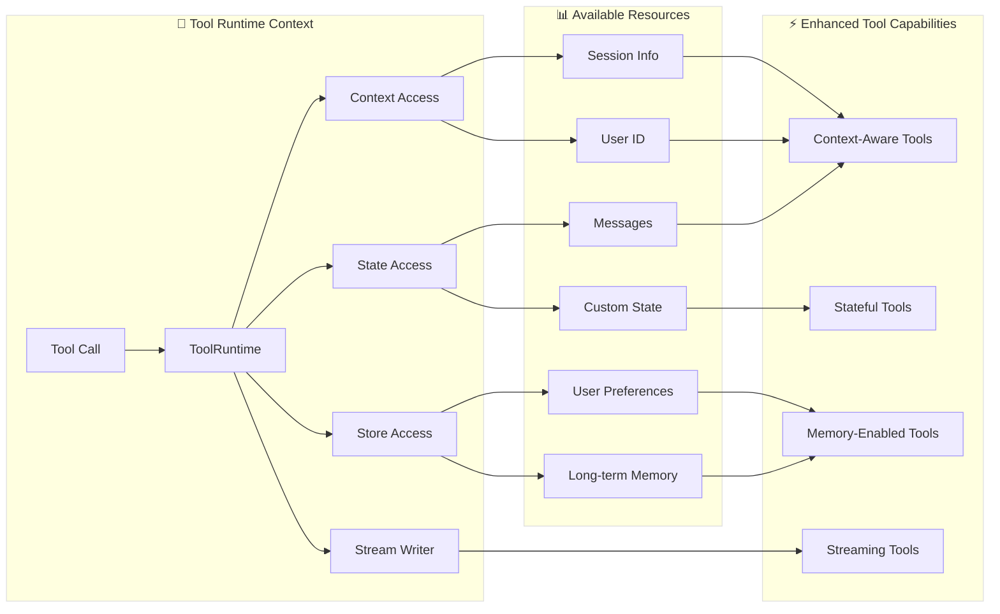

# Tool

Tool은 Agent가 할 수 있는 것을 확장합니다. 실시간 데이터를 가져오고, 코드를 실행하고, 외부 데이터베이스를 쿼리하고, 세상에 영향을 미치는 작업을 수행할 수 있게 합니다.

내부적으로 Tool은 잘 정의된 입력과 출력이 있는 호출 가능한 함수로, 채팅 모델에 전달됩니다. 모델은 대화 컨텍스트를 기반으로 Tool을 호출할 시기와 제공할 입력 인수를 결정합니다.

> **팁**: 모델이 Tool 호출을 처리하는 방식에 대한 자세한 내용은 Tool 호출을 참조하세요.

## Tool 생성

### 기본 Tool 정의

Tool을 만드는 가장 간단한 방법은 `@tool` 데코레이터를 사용하는 것입니다. 기본적으로 함수의 docstring은 모델이 언제 사용할지 이해하는 데 도움이 되는 Tool의 설명이 됩니다:

```python
from langchain.tools import tool

@tool
def search_database(query: str, limit: int = 10) -> str:
    """고객 데이터베이스에서 쿼리와 일치하는 레코드를 검색합니다.

    Args:
        query: 검색할 용어
        limit: 반환할 최대 결과 수
    """
    return f"Found {limit} results for '{query}'"
```

타입 힌트는 **필수**이며, Tool의 입력 스키마를 정의합니다. docstring은 모델이 Tool의 목적을 이해하는 데 도움이 되도록 정보를 담고 간결해야 합니다.

> **참고**: 서버 측 Tool 사용: 일부 채팅 모델(예: OpenAI, Anthropic, Gemini)은 웹 검색 및 코드 인터프리터와 같은 기본 제공 Tool이 서버 측에서 실행됩니다. 특정 채팅 모델로 이러한 Tool에 접근하는 방법을 알아보려면 제공자 개요를 참조하세요.

### Tool 속성 커스터마이징

#### 커스텀 Tool 이름

기본적으로 Tool 이름은 함수 이름에서 나옵니다. 더 설명적인 이름이 필요한 경우 재정의합니다:

```python
@tool("web_search")  # 커스텀 이름
def search(query: str) -> str:
    """웹에서 정보를 검색합니다."""
    return f"Results for: {query}"

print(search.name)  # web_search
```

#### 커스텀 Tool 설명

자동 생성된 Tool 설명을 재정의하여 더 명확한 모델 가이드를 제공합니다:

```python
@tool("calculator", description="산술 계산을 수행합니다. 모든 수학 문제에 사용합니다.")
def calc(expression: str) -> str:
    """수학식을 평가합니다."""
    return str(eval(expression))
```

### 고급 스키마 정의

Pydantic 모델 또는 JSON 스키마를 사용하여 복잡한 입력을 정의합니다:

#### Pydantic 모델

```python
from pydantic import BaseModel, Field
from typing import Literal

class WeatherInput(BaseModel):
    """날씨 쿼리용 입력입니다."""
    location: str = Field(description="도시 이름 또는 좌표")
    units: Literal["celsius", "fahrenheit"] = Field(
        default="celsius",
        description="온도 단위 선호도"
    )
    include_forecast: bool = Field(
        default=False,
        description="5일 예보 포함"
    )

@tool(args_schema=WeatherInput)
def get_weather(location: str, units: str = "celsius", include_forecast: bool = False) -> str:
    """현재 날씨 및 선택적 예보를 가져옵니다."""
    temp = 22 if units == "celsius" else 72
    result = f"Current weather in {location}: {temp} degrees {units[0].upper()}"
    if include_forecast:
        result += "\nNext 5 days: Sunny"
    return result
```

#### JSON 스키마

```python
weather_schema = {
    "type": "object",
    "properties": {
        "location": {"type": "string"},
        "units": {"type": "string"},
        "include_forecast": {"type": "boolean"}
    },
    "required": ["location", "units", "include_forecast"]
}

@tool(args_schema=weather_schema)
def get_weather(location: str, units: str = "celsius", include_forecast: bool = False) -> str:
    """현재 날씨 및 선택적 예보를 가져옵니다."""
    temp = 22 if units == "celsius" else 72
    result = f"Current weather in {location}: {temp} degrees {units[0].upper()}"
    if include_forecast:
        result += "\nNext 5 days: Sunny"
    return result
```

### 예약된 인수 이름

다음 파라미터 이름은 예약되어 있으며 Tool 인수로 사용할 수 없습니다. 이 이름을 사용하면 런타임 오류가 발생합니다.

| 파라미터 이름 | 목적 |
| --- | --- |
| `config` | Tool 내부로 `RunnableConfig`를 전달하기 위해 예약됨 |
| `runtime` | `ToolRuntime` 파라미터를 위해 예약됨 (상태, 컨텍스트, 스토어에 접근) |

런타임 정보에 접근하려면 `config` 또는 `runtime`이라는 자신의 인수 이름을 지정하는 대신 `ToolRuntime` 파라미터를 사용합니다.

## 컨텍스트 접근

> **정보**: 이것이 중요한 이유: Tool은 Agent 상태, 런타임 컨텍스트, 장기 메모리에 접근할 수 있을 때 가장 강력합니다. 이를 통해 Tool은 컨텍스트 인식 결정을 내리고, 응답을 개인화하고, 대화 간 정보를 유지할 수 있습니다. 런타임 컨텍스트는 런타임에 Tool에 종속성(데이터베이스 연결, 사용자 ID, 구성 등)을 주입하는 방법을 제공하므로 Tool을 더 테스트 가능하고 재사용 가능하게 만듭니다.

Tool은 `ToolRuntime` 파라미터를 통해 런타임 정보에 접근할 수 있으며, 이는 다음을 제공합니다:

*   **상태** - 실행을 통해 흐르는 변경 가능한 데이터(예: 메시지, 카운터, 커스텀 필드)
*   **컨텍스트** - 사용자 ID, 세션 세부 정보, 애플리케이션 특정 구성 같은 불변 구성
*   **스토어** - 대화 간 영구적인 장기 메모리
*   **스트림 라이터** - Tool 실행 중 커스텀 업데이트 스트림
*   **구성** - 실행을 위한 `RunnableConfig`
*   **Tool 호출 ID** - 현재 Tool 호출의 ID

### 향상된 Tool 기능



### ToolRuntime

`ToolRuntime`을 사용하여 하나의 파라미터로 모든 런타임 정보에 접근합니다. Tool 서명에 `runtime: ToolRuntime`을 추가하면 LLM에 노출되지 않고 자동으로 주입됩니다.

> **정보**: ToolRuntime: 상태, 컨텍스트, 스토어, 스트리밍, 구성 및 Tool 호출 ID에 접근할 수 있는 통합 파라미터입니다. 이는 별도의 InjectedState, InjectedStore, get_runtime, InjectedToolCallId 주석을 사용하는 기존 패턴을 대체합니다. 런타임은 명시적으로 전달하거나 전역 상태를 사용하지 않고도 이러한 기능을 Tool 함수에 자동으로 제공합니다.

**상태 접근:**

Tool은 `ToolRuntime`을 사용하여 현재 그래프 상태에 접근할 수 있습니다:

```python
from langchain.tools import tool, ToolRuntime

# 현재 대화 상태에 접근합니다
@tool
def summarize_conversation(
    runtime: ToolRuntime
) -> str:
    """지금까지의 대화를 요약합니다."""
    messages = runtime.state["messages"]

    human_msgs = sum(1 for m in messages if m.__class__.__name__ == "HumanMessage")
    ai_msgs = sum(1 for m in messages if m.__class__.__name__ == "AIMessage")
    tool_msgs = sum(1 for m in messages if m.__class__.__name__ == "ToolMessage")

    return f"Conversation has {human_msgs} user messages, {ai_msgs} AI responses, and {tool_msgs} tool results"

# 커스텀 상태 필드에 접근합니다
@tool
def get_user_preference(
    pref_name: str,
    runtime: ToolRuntime  # ToolRuntime 파라미터는 모델에 보이지 않습니다
) -> str:
    """사용자 선호도 값을 가져옵니다."""
    preferences = runtime.state.get("user_preferences", {})
    return preferences.get(pref_name, "Not set")
```

> **경고**: `runtime` 파라미터는 모델에서 숨겨집니다. 위 예제의 경우 모델은 Tool 스키마에서 `pref_name`만 봅니다. `runtime`은 요청에 포함되지 않습니다.

**상태 업데이트:**

`Command`를 사용하여 Agent의 상태를 업데이트하거나 그래프의 실행 흐름을 제어합니다:

```python
from langgraph.types import Command
from langchain.messages import RemoveMessage
from langgraph.graph.message import REMOVE_ALL_MESSAGES
from langchain.tools import tool, ToolRuntime

# 모든 메시지를 제거하여 대화 기록을 업데이트합니다
@tool
def clear_conversation() -> Command:
    """대화 기록을 지웁니다."""

    return Command(
        update={
            "messages": [RemoveMessage(id=REMOVE_ALL_MESSAGES)],
        }
    )

# Agent 상태에서 user_name을 업데이트합니다
@tool
def update_user_name(
    new_name: str,
    runtime: ToolRuntime
) -> Command:
    """사용자의 이름을 업데이트합니다."""
    return Command(update={"user_name": new_name})
```

#### 컨텍스트

`runtime.context`를 통해 사용자 ID, 세션 세부 정보, 애플리케이션 특정 구성과 같은 불변 구성과 컨텍스트 데이터에 접근합니다.

Tool은 `ToolRuntime`을 통해 런타임 컨텍스트에 접근할 수 있습니다:

```python
from dataclasses import dataclass
from langchain_openai import ChatOpenAI
from langchain.agents import create_agent
from langchain.tools import tool, ToolRuntime

USER_DATABASE = {
    "user123": {
        "name": "Alice Johnson",
        "account_type": "Premium",
        "balance": 5000,
        "email": "alice@example.com"
    },
    "user456": {
        "name": "Bob Smith",
        "account_type": "Standard",
        "balance": 1200,
        "email": "bob@example.com"
    }
}

@dataclass
class UserContext:
    user_id: str

@tool
def get_account_info(runtime: ToolRuntime[UserContext]) -> str:
    """현재 사용자의 계좌 정보를 가져옵니다."""
    user_id = runtime.context.user_id

    if user_id in USER_DATABASE:
        user = USER_DATABASE[user_id]
        return f"Account holder: {user['name']}\nType: {user['account_type']}\nBalance: ${user['balance']}"
    return "User not found"

model = ChatOpenAI(model="gpt-4o")
agent = create_agent(
    model,
    tools=[get_account_info],
    context_schema=UserContext,
    system_prompt="You are a financial assistant."
)

result = agent.invoke(
    {"messages": [{"role": "user", "content": "What's my current balance?"}]},
    context=UserContext(user_id="user123")
)
```

#### 메모리 (스토어)

스토어를 사용하여 대화 간 영구적인 데이터에 접근합니다. 스토어는 `runtime.store`를 통해 접근되며 사용자별 또는 애플리케이션별 데이터를 저장하고 검색할 수 있습니다.

Tool은 `ToolRuntime`을 통해 스토어에 접근하고 업데이트할 수 있습니다:

```python
from typing import Any
from langgraph.store.memory import InMemoryStore
from langchain.agents import create_agent
from langchain.tools import tool, ToolRuntime

# 메모리에 접근합니다
@tool
def get_user_info(user_id: str, runtime: ToolRuntime) -> str:
    """사용자 정보를 조회합니다."""
    store = runtime.store
    user_info = store.get(("users",), user_id)
    return str(user_info.value) if user_info else "Unknown user"

# 메모리를 업데이트합니다
@tool
def save_user_info(user_id: str, user_info: dict[str, Any], runtime: ToolRuntime) -> str:
    """사용자 정보를 저장합니다."""
    store = runtime.store
    store.put(("users",), user_id, user_info)
    return "Successfully saved user info."

store = InMemoryStore()
agent = create_agent(
    model,
    tools=[get_user_info, save_user_info],
    store=store
)

# 첫 번째 세션: 사용자 정보 저장
agent.invoke({
    "messages": [{"role": "user", "content": "Save the following user: userid: abc123, name: Foo, age: 25, email: foo@langchain.dev"}]
})

# 두 번째 세션: 사용자 정보 가져오기
agent.invoke({
    "messages": [{"role": "user", "content": "Get user info for user with id 'abc123'"}]
})
# 사용자 ID "abc123"에 대한 사용자 정보입니다:
# - Name: Foo
# - Age: 25
# - Email: foo@langchain.dev
```

#### 스트림 라이터

`runtime.stream_writer`를 사용하여 Tool 실행 중 커스텀 업데이트를 스트림합니다. 이는 Tool이 무엇을 하고 있는지에 대한 실시간 피드백을 사용자에게 제공하는 데 유용합니다.

```python
from langchain.tools import tool, ToolRuntime

@tool
def get_weather(city: str, runtime: ToolRuntime) -> str:
    """주어진 도시의 날씨를 가져옵니다."""
    writer = runtime.stream_writer

    # Tool이 실행되는 동안 커스텀 업데이트를 스트림합니다
    writer(f"Looking up data for city: {city}")
    writer(f"Acquired data for city: {city}")

    return f"It's always sunny in {city}!"
```

> **참고**: `runtime.stream_writer`를 Tool 내부에서 사용하면 Tool은 LangGraph 실행 컨텍스트 내에서 호출되어야 합니다. 스트리밍에 대한 자세한 내용은 스트리밍을 참조하세요.
