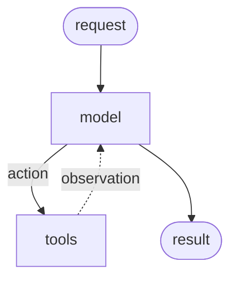
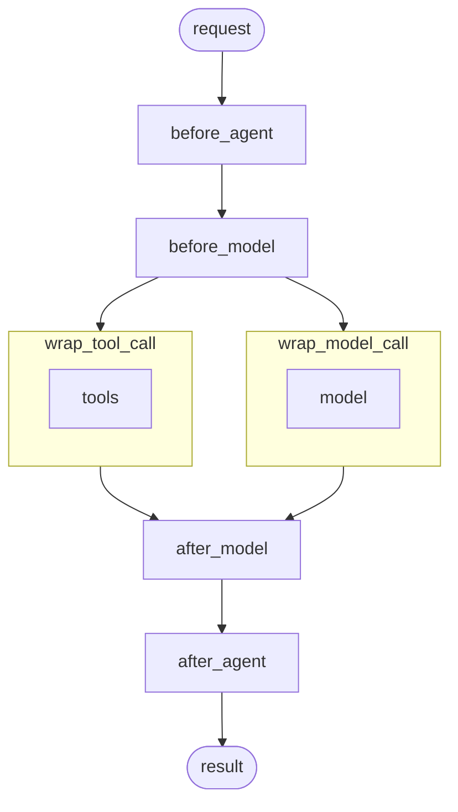

# Middleware

## Overview

Control and customize agent execution at every step

Middleware provides a way to more tightly control what happens inside the agent. Middleware is useful for the following:

- Tracking agent behavior with logging, analytics, and debugging.
- Transforming prompts, [tool selection](/oss/python/langchain/middleware/built-in#llm-tool-selector), and output formatting.
- Adding [retries](/oss/python/langchain/middleware/built-in#tool-retry), [fallbacks](/oss/python/langchain/middleware/built-in#model-fallback), and early termination logic.
- Applying [rate limits](/oss/python/langchain/middleware/built-in#model-call-limit), guardrails, and [PII detection](/oss/python/langchain/middleware/built-in#pii-detection).

Add middleware by passing them to `create_agent`:

```python
from langchain.agents import create_agent
from langchain.agents.middleware import SummarizationMiddleware, HumanInTheLoopMiddleware

agent = create_agent(
    model="gpt-4.1",
    tools=[...],
    middleware=[
        SummarizationMiddleware(...),
        HumanInTheLoopMiddleware(...)
    ],
)
```

---

## The agent loop

The core agent loop involves calling a model, letting it choose tools to execute, and then finishing when it calls no more tools:



Middleware exposes hooks before and after each of those steps:



---

## Additional resources

| | |
|:--|:--|
| 📦 **[Built-in middleware](/oss/python/langchain/middleware/built-in)** | 🛠️ **[Custom middleware](/oss/python/langchain/middleware/custom)** |
| Explore built-in middleware for common use cases. | Build your own middleware with hooks and decorators. |
| 📖 **[Middleware API reference](https://reference.langchain.com/python/langchain/middleware/)** ↗ | 🧪 **[Testing agents](/oss/python/langchain/test)** |
| Complete API reference for middleware. | Test your agents with LangSmith. |
