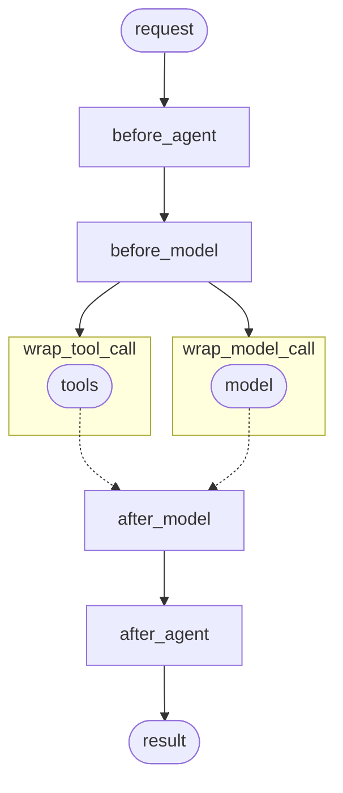

# 가드레일

Agent의 안전 검사 및 콘텐츠 필터링 구현

가드레일은 Agent의 실행에 있는 주요 지점에서 콘텐츠를 검증하고 필터링하여 안전하고 준수하는 AI 애플리케이션을 구축하는 데 도움을 줍니다. 민감한 정보를 감지하고, 콘텐츠 정책을 시행하고, 출력을 검증하고, 문제를 일으키기 전에 안전하지 않은 동작을 방지할 수 있습니다.

일반적인 사용 사례:

- PII 누출 방지
- 프롬프트 인젝션 공격 감지 및 차단
- 부적절하거나 해로운 콘텐츠 차단
- 비즈니스 규칙 및 준수 요구 사항 시행
- 출력 품질 및 정확성 검증

Agent의 실행을 가로채기 위해 [Middleware](/oss/python/langchain/middleware/overview)를 사용하여 가드레일을 구현할 수 있습니다 - Agent 시작 전, 완료 후, 또는 모델 및 도구 호출 주변에서.



가드레일은 두 가지 보완적인 방식으로 구현될 수 있습니다:

| 결정론적 가드레일 | 모델 기반 가드레일 |
|--------------------------|------------------------|
| 정규식 패턴, 키워드 일치 또는 명시적 검사 같은 규칙 기반 로직을 사용합니다. 빠르고 예측 가능하고 비용 효과적이지만 미묘한 위반을 놓칠 수 있습니다. | LLM 또는 분류기를 사용하여 의미론적 이해로 콘텐츠를 평가합니다. 규칙이 놓친 미묘한 문제를 포착하지만 느리고 더 비쌉니다. |

LangChain은 내장 가드레일(예: [PII 감지](#pii-detection), [인간 in the loop](#human-in-the-loop))과 두 접근 방식 중 하나를 사용하여 사용자 정의 가드레일을 구축하기 위한 유연한 Middleware 시스템을 제공합니다.

## 내장 가드레일

### PII 감지

LangChain은 대화에서 개인식별정보(PII)를 감지하고 처리하기 위한 내장 Middleware를 제공합니다. 이 Middleware는 이메일, 신용 카드, IP 주소 등과 같은 일반적인 PII 유형을 감지할 수 있습니다.

PII Middleware는 의료 및 금융 애플리케이션의 준수 요구 사항, 로그를 정제해야 하는 고객 서비스 Agent, 일반적으로 민감한 사용자 데이터를 처리하는 모든 애플리케이션 같은 경우에 유용합니다.

PII Middleware는 감지된 PII를 처리하기 위한 여러 전략을 지원합니다:

| 전략 | 설명 | 예제 |
|----------|-------------|---------|
| `redact` | `[REDACTED_{PII_TYPE}]`으로 교체 | `[REDACTED_EMAIL]` |
| `mask` | 부분 모호화(예: 마지막 4자리) | `****-****-****-1234` |
| `hash` | 결정론적 해시로 교체 | `a8f5f167...` |
| `block` | 감지 시 예외 발생 | 오류 발생 |

```python
from langchain.agents import create_agent
from langchain.agents.middleware import PIIMiddleware

agent = create_agent(
    model="gpt-4.1",
    tools=[customer_service_tool, email_tool],
    middleware=[
        # 모델로 보내기 전에 사용자 입력에서 이메일 교정
        PIIMiddleware(
            "email",
            strategy="redact",
            apply_to_input=True,
        ),
        # 사용자 입력에서 신용 카드 마스킹
        PIIMiddleware(
            "credit_card",
            strategy="mask",
            apply_to_input=True,
        ),
        # API 키 차단 - 감지되면 오류 발생
        PIIMiddleware(
            "api_key",
            detector=r"sk-[a-zA-Z0-9]{32}",
            strategy="block",
            apply_to_input=True,
        ),
    ],
)

# 사용자가 PII를 제공할 때 전략에 따라 처리됩니다
result = agent.invoke({
    "messages": [{"role": "user", "content": "My email is john.doe@example.com"}]
})
```

<details>
<summary>내장 PII 타입 및 구성</summary>

**내장 PII 타입:**

- `email` - 이메일 주소
- `credit_card` - 신용 카드 번호(Luhn 검증)
- `ip` - IP 주소
- `mac_address` - MAC 주소
- `url` - URL

**구성 옵션:**

| 매개변수 | 설명 | 기본값 |
|-----------|-------------|---------|
| `pii_type` | 감지할 PII 타입(내장 또는 사용자 정의) | 필수 |
| `strategy` | 감지된 PII 처리 방식(`"block"`, `"redact"`, `"mask"`, `"hash"`) | `"redact"` |
| `detector` | 사용자 정의 감지 함수 또는 정규식 패턴 | `None`(내장 사용) |
| `apply_to_input` | 모델 호출 전 사용자 메시지 확인 | `True` |
| `apply_to_output` | 모델 호출 후 AI 메시지 확인 | `False` |
| `apply_to_tool_results` | 실행 후 도구 결과 메시지 확인 | `False` |

</details>

PII 감지 기능의 전체 세부 사항은 [Middleware 문서](/oss/python/langchain/middleware/overview)를 참조하세요.

### 인간 In The Loop

LangChain은 민감한 작업을 실행하기 전에 인간의 승인을 요구하기 위한 내장 Middleware를 제공합니다. 이는 높은 수의 결정을 위한 가장 효과적인 가드레일 중 하나입니다.

인간 in the loop Middleware는 금융 거래 및 이체, 프로덕션 데이터 삭제 또는 수정, 외부 당사자로의 통신 전송, 상당한 비즈니스 영향을 가진 모든 작업 같은 경우에 유용합니다.

```python
from langchain.agents import create_agent
from langchain.agents.middleware import HumanInTheLoopMiddleware
from langgraph.checkpoint.memory import InMemorySaver
from langgraph.types import Command

agent = create_agent(
    model="gpt-4.1",
    tools=[search_tool, send_email_tool, delete_database_tool],
    middleware=[
        HumanInTheLoopMiddleware(
            interrupt_on={
                # 민감한 작업에 대한 승인 필요
                "send_email": True,
                "delete_database": True,
                # 안전한 작업 자동 승인
                "search": False,
            }
        ),
    ],
    # 중단 전반에 걸쳐 상태 유지
    checkpointer=InMemorySaver(),
)

# 인간 in the loop는 지속성을 위해 스레드 ID를 필요로 합니다
config = {"configurable": {"thread_id": "some_id"}}

# Agent는 민감한 도구를 실행하기 전에 일시 중지하고 승인을 기다립니다
result = agent.invoke(
    {"messages": [{"role": "user", "content": "Send an email to the team"}]},
    config=config
)

result = agent.invoke(
    Command(resume={"decisions": [{"type": "approve"}]}),
    config=config  # 일시 중지된 대화를 재개하려면 같은 스레드 ID를 사용합니다
)
```

> [!TIP]
> 승인 워크플로우 구현에 대한 전체 세부 사항은 [인간 in the loop 문서](/oss/python/langchain/human-in-the-loop)를 참조하세요.

## 사용자 정의 가드레일

더 정교한 가드레일의 경우 Agent 실행 전후에 실행되는 사용자 정의 Middleware를 만들 수 있습니다. 이는 검증 로직, 콘텐츠 필터링, 안전 검사에 대한 완전한 제어를 제공합니다.

### Agent 이전 가드레일

"Agent 이전" 훅을 사용하여 각 호출의 시작에서 요청을 한 번 검증합니다. 이는 인증, 비율 제한 또는 처리가 시작되기 전에 부적절한 요청을 차단 같은 세션 수준 검사에 유용합니다.

#### 클래스 구문

```python
from typing import Any

from langchain.agents.middleware import AgentMiddleware, AgentState, hook_config
from langgraph.runtime import Runtime

class ContentFilterMiddleware(AgentMiddleware):
    """결정론적 가드레일: 금지된 키워드가 포함된 요청 차단."""

    def __init__(self, banned_keywords: list[str]):
        super().__init__()
        self.banned_keywords = [kw.lower() for kw in banned_keywords]

    @hook_config(can_jump_to=["end"])
    def before_agent(self, state: AgentState, runtime: Runtime) -> dict[str, Any] | None:
        # 첫 번째 사용자 메시지 가져오기
        if not state["messages"]:
            return None

        first_message = state["messages"][0]
        if first_message.type != "human":
            return None

        content = first_message.content.lower()

        # 금지된 키워드 확인
        for keyword in self.banned_keywords:
            if keyword in content:
                # 처리 전에 실행 차단
                return {
                    "messages": [{
                        "role": "assistant",
                        "content": "I cannot process requests containing inappropriate content."
                    }],
                    "jump_to": "end"
                }

        return None

# 사용자 정의 가드레일 사용
from langchain.agents import create_agent

agent = create_agent(
    model="gpt-4.1",
    tools=[search_tool, calculator_tool],
    middleware=[
        ContentFilterMiddleware(
            banned_keywords=["hack", "exploit", "malware"]
        ),
    ],
)

# 이 요청은 처리 전에 차단됩니다
result = agent.invoke({
    "messages": [{"role": "user", "content": "How do I hack into a database?"}]
})
```

#### 데코레이터 구문

```python
from typing import Any

from langchain.agents.middleware import before_agent, AgentState, hook_config
from langgraph.runtime import Runtime

banned_keywords = ["hack", "exploit", "malware"]

@before_agent(can_jump_to=["end"])
def content_filter(state: AgentState, runtime: Runtime) -> dict[str, Any] | None:
    """결정론적 가드레일: 금지된 키워드가 포함된 요청 차단."""
    # 첫 번째 사용자 메시지 가져오기
    if not state["messages"]:
        return None

    first_message = state["messages"][0]
    if first_message.type != "human":
        return None

    content = first_message.content.lower()

    # 금지된 키워드 확인
    for keyword in banned_keywords:
        if keyword in content:
            # 처리 전에 실행 차단
            return {
                "messages": [{
                    "role": "assistant",
                    "content": "I cannot process requests containing inappropriate content."
                }],
                "jump_to": "end"
            }

    return None

# 사용자 정의 가드레일 사용
from langchain.agents import create_agent

agent = create_agent(
    model="gpt-4.1",
    tools=[search_tool, calculator_tool],
    middleware=[content_filter],
)

# 이 요청은 처리 전에 차단됩니다
result = agent.invoke({
    "messages": [{"role": "user", "content": "How do I hack into a database?"}]
})
```

### Agent 이후 가드레일

"Agent 이후" 훅을 사용하여 최종 출력을 한 번 검증한 후 사용자에게 반환합니다. 이는 모델 기반 안전 검사, 품질 검증 또는 완전한 Agent 응답에 대한 최종 준수 스캔에 유용합니다.

#### 클래스 구문

```python
from langchain.agents.middleware import AgentMiddleware, AgentState, hook_config
from langgraph.runtime import Runtime
from langchain.messages import AIMessage
from langchain.chat_models import init_chat_model
from typing import Any

class SafetyGuardrailMiddleware(AgentMiddleware):
    """모델 기반 가드레일: LLM을 사용하여 응답 안전성을 평가합니다."""

    def __init__(self):
        super().__init__()
        self.safety_model = init_chat_model("gpt-4.1-mini")

    @hook_config(can_jump_to=["end"])
    def after_agent(self, state: AgentState, runtime: Runtime) -> dict[str, Any] | None:
        # 최종 AI 응답 가져오기
        if not state["messages"]:
            return None

        last_message = state["messages"][-1]
        if not isinstance(last_message, AIMessage):
            return None

        # 모델을 사용하여 안전성을 평가합니다
        safety_prompt = f"""Evaluate if this response is safe and appropriate.
Respond with only 'SAFE' or 'UNSAFE'.

Response: {last_message.content}"""

        result = self.safety_model.invoke([{"role": "user", "content": safety_prompt}])

        if "UNSAFE" in result.content:
            last_message.content = "I cannot provide that response. Please rephrase your request."

        return None

# 안전 가드레일 사용
from langchain.agents import create_agent

agent = create_agent(
    model="gpt-4.1",
    tools=[search_tool, calculator_tool],
    middleware=[SafetyGuardrailMiddleware()],
)

result = agent.invoke({
    "messages": [{"role": "user", "content": "How do I make explosives?"}]
})
```

#### 데코레이터 구문

```python
from langchain.agents.middleware import after_agent, AgentState, hook_config
from langgraph.runtime import Runtime
from langchain.messages import AIMessage
from langchain.chat_models import init_chat_model
from typing import Any

safety_model = init_chat_model("gpt-4.1-mini")

@after_agent(can_jump_to=["end"])
def safety_guardrail(state: AgentState, runtime: Runtime) -> dict[str, Any] | None:
    """모델 기반 가드레일: LLM을 사용하여 응답 안전성을 평가합니다."""
    # 최종 AI 응답 가져오기
    if not state["messages"]:
        return None

    last_message = state["messages"][-1]
    if not isinstance(last_message, AIMessage):
        return None

    # 모델을 사용하여 안전성을 평가합니다
    safety_prompt = f"""Evaluate if this response is safe and appropriate.
Respond with only 'SAFE' or 'UNSAFE'.

Response: {last_message.content}"""

    result = safety_model.invoke([{"role": "user", "content": safety_prompt}])

    if "UNSAFE" in result.content:
        last_message.content = "I cannot provide that response. Please rephrase your request."

    return None

# 안전 가드레일 사용
from langchain.agents import create_agent

agent = create_agent(
    model="gpt-4.1",
    tools=[search_tool, calculator_tool],
    middleware=[safety_guardrail],
)

result = agent.invoke({
    "messages": [{"role": "user", "content": "How do I make explosives?"}]
})
```

### 여러 가드레일 결합

Middleware 배열에 추가하여 여러 가드레일을 스택할 수 있습니다. 순서대로 실행되어 계층화된 보호를 구축할 수 있습니다:

```python
from langchain.agents import create_agent
from langchain.agents.middleware import PIIMiddleware, HumanInTheLoopMiddleware

agent = create_agent(
    model="gpt-4.1",
    tools=[search_tool, send_email_tool],
    middleware=[
        # 계층 1: 결정론적 입력 필터(Agent 이전)
        ContentFilterMiddleware(banned_keywords=["hack", "exploit"]),

        # 계층 2: PII 보호(모델 이전 및 이후)
        PIIMiddleware("email", strategy="redact", apply_to_input=True),
        PIIMiddleware("email", strategy="redact", apply_to_output=True),

        # 계층 3: 민감한 도구에 대한 인간 승인
        HumanInTheLoopMiddleware(interrupt_on={"send_email": True}),

        # 계층 4: 모델 기반 안전 검사(Agent 이후)
        SafetyGuardrailMiddleware(),
    ],
)
```

## 추가 자료

- [Middleware 문서](/oss/python/langchain/middleware/overview) - 사용자 정의 Middleware에 대한 완전한 가이드
- [Middleware API 참조](/oss/python/langchain/middleware/api) - 사용자 정의 Middleware에 대한 완전한 가이드
- [인간 In The Loop](/oss/python/langchain/human-in-the-loop) - 민감한 작업에 대한 인간 검토 추가
- [Agent 테스트](/oss/python/langchain/test) - 안전 메커니즘 테스트 전략
