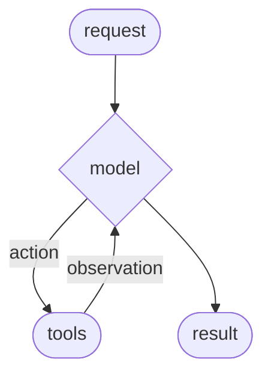
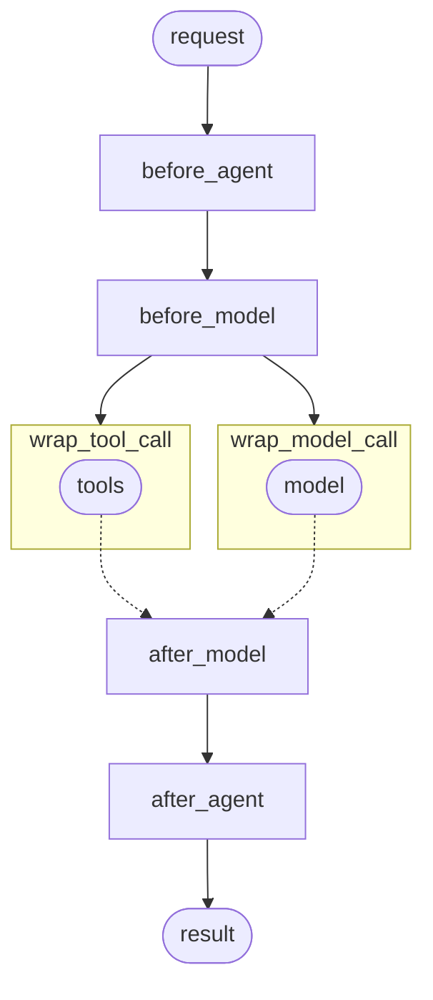

# Agent의 컨텍스트 엔지니어링

## 개요

Agent(또는 모든 LLM 응용 프로그램) 구축에서 어려운 부분은 충분히 신뢰할 수 있도록 만드는 것입니다. 프로토타입으로 작동할 수 있지만 실제 사용 사례에서는 종종 실패합니다.

## Agent가 실패하는 이유

Agent가 실패할 때, 일반적으로 Agent 내부의 LLM 호출이 잘못된 작업을 수행했거나 예상한 것을 하지 않았기 때문입니다. LLM은 두 가지 이유 중 하나로 실패합니다:

1. 기본 LLM이 충분히 능력이 없음
2. "올바른" 컨텍스트가 LLM으로 전달되지 않음

더 자주, 실제로 Agent를 신뢰할 수 없게 만드는 것은 두 번째 이유입니다.

**컨텍스트 엔지니어링**은 LLM이 작업을 완료할 수 있도록 올바른 형식으로 올바른 정보와 Tool을 제공하는 것입니다. 이것은 AI 엔지니어의 번호 1 업무입니다. 이 "올바른" 컨텍스트의 부족은 더 신뢰할 수 있는 Agent를 위한 가장 큰 차단제이며, LangChain의 Agent 추상화는 컨텍스트 엔지니어링을 용이하게 하도록 고유하게 설계되었습니다.

> [!TIP]
> 컨텍스트 엔지니어링을 처음 접하시나요? 다양한 컨텍스트 유형과 사용할 시기를 이해하려면 [개념적 개요](/learn/context-engineering)로 시작하세요.

## Agent 루프

일반적인 Agent 루프는 두 가지 주요 단계로 구성됩니다:

1. **모델 호출** - 프롬프트와 사용 가능한 Tool로 LLM을 호출하고, 응답 또는 Tool 실행 요청을 반환합니다.
2. **Tool 실행** - LLM이 요청한 Tool을 실행하고 Tool 결과를 반환합니다.



이 루프는 LLM이 완료하기로 결정할 때까지 계속됩니다.

## 제어할 수 있는 것

신뢰할 수 있는 Agent를 구축하려면 Agent 루프의 각 단계에서 무슨 일이 일어나는지, 그리고 단계 사이에 무슨 일이 일어나는지를 제어해야 합니다.

| 컨텍스트 유형 | 제어하는 것 | 일시적 또는 지속적 |
|--------------|------------------|-------------------------|
| 모델 컨텍스트 | 모델 호출에 들어가는 것(지침, 메시지 기록, Tool, 응답 형식) | 일시적 |
| Tool 컨텍스트 | Tool이 접근하고 생성할 수 있는 것(상태, 저장소, 런타임 컨텍스트 읽기/쓰기) | 지속적 |
| 라이프사이클 컨텍스트 | 모델과 Tool 호출 사이에서 일어나는 것(요약, 가드레일, 로깅 등) | 지속적 |

| 일시적 컨텍스트 | 지속적 컨텍스트 |
|-------------------|-------------------|
| 단일 호출을 위해 LLM이 보는 것입니다. 상태에 저장된 것을 변경하지 않고 메시지, Tool 또는 프롬프트를 수정할 수 있습니다. | 상태 전체에서 저장되는 것입니다. 라이프사이클 Hook 및 Tool 쓰기는 이를 영구적으로 수정합니다. |

## 데이터 소스

이 과정에서 Agent는 다양한 데이터 소스에 접근(읽기/쓰기)합니다:

| 데이터 소스 | 별칭 | 범위 | 예시 |
|-------------|---------------|-------|----------|
| 런타임 컨텍스트 | 정적 구성 | 대화 범위 | 사용자 ID, API 키, 데이터베이스 연결, 권한, 환경 설정 |
| 상태 | 단기 메모리 | 대화 범위 | 현재 메시지, 업로드된 파일, 인증 상태, Tool 결과 |
| 저장소 | 장기 메모리 | 대화 간 | 사용자 선호사항, 추출된 통찰력, 메모리, 과거 데이터 |

## 작동 방식

LangChain [Middleware](/oss/python/langchain/middleware/overview)는 LangChain을 사용하는 개발자들에게 컨텍스트 엔지니어링을 실용적으로 만드는 기본 메커니즘입니다.

Middleware를 사용하면 Agent 라이프사이클의 모든 단계에 연결할 수 있으며:

- 컨텍스트 업데이트
- Agent 라이프사이클의 다른 단계로 이동

이 가이드 전체에서 Middleware API의 빈번한 사용을 컨텍스트 엔지니어링의 수단으로 볼 수 있습니다.

## 모델 컨텍스트

각 모델 호출에 들어가는 것을 제어합니다 - 지침, 사용 가능한 Tool, 사용할 모델, 출력 형식입니다. 이러한 결정은 신뢰성과 비용에 직접 영향을 미칩니다.

| 시스템 프롬프트 | 메시지 |
|---------------|----------|
| 개발자에서 LLM으로의 기본 지침입니다. | LLM으로 전송되는 메시지의 전체 목록(대화 기록)입니다. |

| Tool | 모델 |
|-------|-------|
| Agent가 작업을 수행할 수 있도록 접근할 수 있는 유틸리티입니다. | 호출될 실제 모델(구성 포함)입니다. |

| 응답 형식 |
|-----------------|
| 모델의 최종 응답에 대한 스키마 사양입니다. |

이러한 모든 유형의 모델 컨텍스트는 **상태**(단기 메모리), **저장소**(장기 메모리), 또는 **런타임 컨텍스트**(정적 구성)에서 가져올 수 있습니다.

### 시스템 프롬프트

시스템 프롬프트는 LLM의 동작과 기능을 설정합니다. 다양한 사용자, 컨텍스트, 또는 대화 단계에는 다른 지침이 필요합니다. 성공적인 Agent는 메모리, 선호사항, 구성을 활용하여 대화의 현재 상태에 맞는 올바른 지침을 제공합니다.

#### 상태

상태에서 메시지 수 또는 대화 컨텍스트에 접근합니다:

```python
from langchain.agents import create_agent
from langchain.agents.middleware import dynamic_prompt, ModelRequest

@dynamic_prompt
def state_aware_prompt(request: ModelRequest) -> str:
    # request.messages는 request.state["messages"]의 바로가기입니다
    message_count = len(request.messages)

    base = "You are a helpful assistant."

    if message_count > 10:
        base += "\nThis is a long conversation - be extra concise."

    return base

agent = create_agent(
    model="gpt-4.1",
    tools=[...],
    middleware=[state_aware_prompt]
)
```

#### 저장소

장기 메모리에서 사용자 선호사항에 접근합니다:

```python
from dataclasses import dataclass

from langchain.agents import create_agent
from langchain.agents.middleware import dynamic_prompt, ModelRequest
from langgraph.store.memory import InMemoryStore

@dataclass
class Context:
    user_id: str

@dynamic_prompt
def store_aware_prompt(request: ModelRequest) -> str:
    user_id = request.runtime.context.user_id

    # 저장소에서 읽기: 사용자 선호사항 가져오기
    store = request.runtime.store
    user_prefs = store.get(("preferences",), user_id)

    base = "You are a helpful assistant."

    if user_prefs:
        style = user_prefs.value.get("communication_style", "balanced")
        base += f"\nUser prefers {style} responses."

    return base

agent = create_agent(
    model="gpt-4.1",
    tools=[...],
    middleware=[store_aware_prompt],
    context_schema=Context,
    store=InMemoryStore()
)
```

#### 런타임 컨텍스트

런타임 컨텍스트에서 사용자 ID 또는 구성에 접근합니다:

```python
from dataclasses import dataclass

from langchain.agents import create_agent
from langchain.agents.middleware import dynamic_prompt, ModelRequest

@dataclass
class Context:
    user_role: str
    deployment_env: str

@dynamic_prompt
def context_aware_prompt(request: ModelRequest) -> str:
    # 런타임 컨텍스트에서 읽기: 사용자 역할 및 환경
    user_role = request.runtime.context.user_role
    env = request.runtime.context.deployment_env

    base = "You are a helpful assistant."

    if user_role == "admin":
        base += "\nYou have admin access. You can perform all operations."
    elif user_role == "viewer":
        base += "\nYou have read-only access. Guide users to read operations only."

    if env == "production":
        base += "\nBe extra careful with any data modifications."

    return base

agent = create_agent(
    model="gpt-4.1",
    tools=[...],
    middleware=[context_aware_prompt],
    context_schema=Context
)
```

### 메시지

메시지는 LLM으로 전송되는 프롬프트를 구성합니다. LLM이 잘 응답할 수 있도록 올바른 정보를 가지도록 메시지의 콘텐츠를 관리하는 것이 중요합니다.

#### 상태

현재 쿼리와 관련될 때 상태에서 업로드된 파일 컨텍스트를 삽입합니다:

```python
from langchain.agents import create_agent
from langchain.agents.middleware import wrap_model_call, ModelRequest, ModelResponse
from typing import Callable

@wrap_model_call
def inject_file_context(
    request: ModelRequest,
    handler: Callable[[ModelRequest], ModelResponse]
) -> ModelResponse:
    """이 세션에서 사용자가 업로드한 파일에 대한 컨텍스트를 삽입합니다."""
    # 상태에서 읽기: 업로드된 파일 메타데이터 가져오기
    uploaded_files = request.state.get("uploaded_files", [])

    if uploaded_files:
        # 사용 가능한 파일에 대한 컨텍스트 빌드
        file_descriptions = []
        for file in uploaded_files:
            file_descriptions.append(
                f"- {file['name']} ({file['type']}): {file['summary']}"
            )

        file_context = f"""Files you have access to in this conversation:
{chr(10).join(file_descriptions)}

Reference these files when answering questions."""

        # 최근 메시지 전에 파일 컨텍스트 삽입
        messages = [
            *request.messages,
            {"role": "user", "content": file_context},
        ]
        request = request.override(messages=messages)

    return handler(request)

agent = create_agent(
    model="gpt-4.1",
    tools=[...],
    middleware=[inject_file_context]
)
```

#### 저장소

저장소에서 사용자의 이메일 작성 스타일을 삽입하여 초안 작성을 안내합니다:

```python
from dataclasses import dataclass

from langchain.agents import create_agent
from langchain.agents.middleware import wrap_model_call, ModelRequest, ModelResponse
from typing import Callable
from langgraph.store.memory import InMemoryStore

@dataclass
class Context:
    user_id: str

@wrap_model_call
def inject_writing_style(
    request: ModelRequest,
    handler: Callable[[ModelRequest], ModelResponse]
) -> ModelResponse:
    """저장소에서 사용자의 이메일 작성 스타일을 삽입합니다."""
    user_id = request.runtime.context.user_id

    # 저장소에서 읽기: 사용자의 작성 스타일 예시 가져오기
    store = request.runtime.store
    writing_style = store.get(("writing_style",), user_id)

    if writing_style:
        style = writing_style.value

        # 저장된 예시에서 스타일 가이드 빌드
        style_context = f"""Your writing style:
- Tone: {style.get('tone', 'professional')}
- Typical greeting: "{style.get('greeting', 'Hi')}"
- Typical sign-off: "{style.get('sign_off', 'Best')}"
- Example email you've written: {style.get('example_email', '')}"""

        # 끝에 추가 - 모델은 최종 메시지에 더 많은 주의를 기울입니다
        messages = [
            *request.messages,
            {"role": "user", "content": style_context}
        ]
        request = request.override(messages=messages)

    return handler(request)

agent = create_agent(
    model="gpt-4.1",
    tools=[...],
    middleware=[inject_writing_style],
    context_schema=Context,
    store=InMemoryStore()
)
```

#### 런타임 컨텍스트

사용자의 관할권을 기반으로 런타임 컨텍스트에서 규정 준수 규칙을 삽입합니다:

```python
from dataclasses import dataclass

from langchain.agents import create_agent
from langchain.agents.middleware import wrap_model_call, ModelRequest, ModelResponse
from typing import Callable

@dataclass
class Context:
    user_jurisdiction: str
    industry: str
    compliance_frameworks: list[str]

@wrap_model_call
def inject_compliance_rules(
    request: ModelRequest,
    handler: Callable[[ModelRequest], ModelResponse]
) -> ModelResponse:
    """런타임 컨텍스트에서 규정 준수 제약을 삽입합니다."""
    # 런타임 컨텍스트에서 읽기: 규정 준수 요구사항 가져오기
    jurisdiction = request.runtime.context.user_jurisdiction
    industry = request.runtime.context.industry
    frameworks = request.runtime.context.compliance_frameworks

    # 규정 준수 제약 빌드
    rules = []
    if "GDPR" in frameworks:
        rules.append("- Must obtain explicit consent before processing personal data")
        rules.append("- Users have right to data deletion")
    if "HIPAA" in frameworks:
        rules.append("- Cannot share patient health information without authorization")
        rules.append("- Must use secure, encrypted communication")
    if industry == "finance":
        rules.append("- Cannot provide financial advice without proper disclaimers")

    if rules:
        compliance_context = f"""Compliance requirements for {jurisdiction}:
{chr(10).join(rules)}"""

        # 끝에 추가 - 모델은 최종 메시지에 더 많은 주의를 기울입니다
        messages = [
            *request.messages,
            {"role": "user", "content": compliance_context}
        ]
        request = request.override(messages=messages)

    return handler(request)

agent = create_agent(
    model="gpt-4.1",
    tools=[...],
    middleware=[inject_compliance_rules],
    context_schema=Context
)
```

> [!INFO]
> **일시적 대 지속적 메시지 업데이트:**
>
> 위의 예시는 `wrap_model_call`을 사용하여 **일시적** 업데이트를 수행합니다 - 상태에 저장된 것을 변경하지 않고 단일 호출을 위해 모델로 전송되는 메시지를 수정합니다.
>
> 대화 기록을 영구적으로 업데이트하는 **지속적** 업데이트(예: [라이프사이클 컨텍스트](#life-cycle-context)의 요약 예시)의 경우, `before_model` 또는 `after_model` 같은 라이프사이클 Hook을 사용하여 대화 기록을 영구적으로 업데이트합니다. Middleware 문서를 참조하여 자세한 내용을 확인하세요.

### Tool

Tool은 모델이 데이터베이스, API, 외부 시스템과 상호작용할 수 있게 합니다. Tool을 정의하고 선택하는 방식은 모델이 작업을 효과적으로 완료할 수 있는지 여부에 직접 영향을 미칩니다.

#### Tool 정의

각 Tool에는 명확한 이름, 설명, 인수 이름, 인수 설명이 필요합니다. 이는 단순한 메타데이터가 아닙니다 - 모델이 Tool을 사용할 시기와 방법을 추론하는 데 안내합니다.

```python
from langchain.tools import tool

@tool(parse_docstring=True)
def search_orders(
    user_id: str,
    status: str,
    limit: int = 10
) -> str:
    """Search for user orders by status.

    Use this when the user asks about order history or wants to check
    order status. Always filter by the provided status.

    Args:
        user_id: Unique identifier for the user
        status: Order status: 'pending', 'shipped', or 'delivered'
        limit: Maximum number of results to return
    """
    # Implementation here
    pass
```

#### Tool 선택

모든 Tool이 모든 상황에 적절한 것은 아닙니다. 너무 많은 Tool은 모델에 부담을 줄 수 있으며(컨텍스트 오버로드) 오류가 증가합니다. 너무 적으면 기능이 제한됩니다. 동적 Tool 선택은 인증 상태, 사용자 권한, 기능 플래그, 대화 단계를 기반으로 사용 가능한 Tool 집합을 조정합니다.

##### 상태

특정 대화 단계 후 고급 Tool만 활성화합니다:

```python
from langchain.agents import create_agent
from langchain.agents.middleware import wrap_model_call, ModelRequest, ModelResponse
from typing import Callable

@wrap_model_call
def state_based_tools(
    request: ModelRequest,
    handler: Callable[[ModelRequest], ModelResponse]
) -> ModelResponse:
    """대화 상태를 기반으로 Tool을 필터링합니다."""
    # 상태에서 읽기: 사용자가 인증되었는지 확인
    state = request.state
    is_authenticated = state.get("authenticated", False)
    message_count = len(state["messages"])

    # 인증 후에만 민감한 Tool을 활성화
    if not is_authenticated:
        tools = [t for t in request.tools if t.name.startswith("public_")]
        request = request.override(tools=tools)
    elif message_count < 5:
        # 대화 초기에 Tool 제한
        tools = [t for t in request.tools if t.name != "advanced_search"]
        request = request.override(tools=tools)

    return handler(request)

agent = create_agent(
    model="gpt-4.1",
    tools=[public_search, private_search, advanced_search],
    middleware=[state_based_tools]
)
```

##### 저장소

저장소의 사용자 선호사항 또는 기능 플래그를 기반으로 Tool을 필터링합니다:

```python
from dataclasses import dataclass

from langchain.agents import create_agent
from langchain.agents.middleware import wrap_model_call, ModelRequest, ModelResponse
from typing import Callable
from langgraph.store.memory import InMemoryStore

@dataclass
class Context:
    user_id: str

@wrap_model_call
def store_based_tools(
    request: ModelRequest,
    handler: Callable[[ModelRequest], ModelResponse]
) -> ModelResponse:
    """저장소 선호사항을 기반으로 Tool을 필터링합니다."""
    user_id = request.runtime.context.user_id

    # 저장소에서 읽기: 사용자의 활성화된 기능 가져오기
    store = request.runtime.store
    feature_flags = store.get(("features",), user_id)

    if feature_flags:
        enabled_features = feature_flags.value.get("enabled_tools", [])
        # 이 사용자에 대해 활성화된 Tool만 포함
        tools = [t for t in request.tools if t.name in enabled_features]
        request = request.override(tools=tools)

    return handler(request)

agent = create_agent(
    model="gpt-4.1",
    tools=[search_tool, analysis_tool, export_tool],
    middleware=[store_based_tools],
    context_schema=Context,
    store=InMemoryStore()
)
```

##### 런타임 컨텍스트

런타임 컨텍스트의 사용자 권한을 기반으로 Tool을 필터링합니다:

```python
from dataclasses import dataclass

from langchain.agents import create_agent
from langchain.agents.middleware import wrap_model_call, ModelRequest, ModelResponse
from typing import Callable

@dataclass
class Context:
    user_role: str

@wrap_model_call
def context_based_tools(
    request: ModelRequest,
    handler: Callable[[ModelRequest], ModelResponse]
) -> ModelResponse:
    """런타임 컨텍스트 권한을 기반으로 Tool을 필터링합니다."""
    # 런타임 컨텍스트에서 읽기: 사용자 역할 가져오기
    user_role = request.runtime.context.user_role

    if user_role == "admin":
        # 관리자는 모든 Tool을 가져옵니다
        pass
    elif user_role == "editor":
        # 편집자는 삭제할 수 없음
        tools = [t for t in request.tools if t.name != "delete_data"]
        request = request.override(tools=tools)
    else:
        # 뷰어는 읽기 전용 Tool을 가져옵니다
        tools = [t for t in request.tools if t.name.startswith("read_")]
        request = request.override(tools=tools)

    return handler(request)

agent = create_agent(
    model="gpt-4.1",
    tools=[read_data, write_data, delete_data],
    middleware=[context_based_tools],
    context_schema=Context
)
```

[동적 Tool](/oss/python/langchain/tools#dynamic-tools)을 참조하여 사전 등록된 Tool을 필터링하고 런타임(예: MCP 서버)에서 Tool을 등록하는 방법을 확인하세요.

### 모델

다양한 모델은 다양한 강점, 비용, 컨텍스트 윈도우를 가지고 있습니다. 현재 작업에 적합한 모델을 선택하세요. 이는 Agent 실행 중에 변경될 수 있습니다.

#### 상태

상태에서 대화 길이를 기반으로 다양한 모델을 사용합니다:

```python
from langchain.agents import create_agent
from langchain.agents.middleware import wrap_model_call, ModelRequest, ModelResponse
from langchain.chat_models import init_chat_model
from typing import Callable

# Middleware 외부에서 한 번만 모델 초기화
large_model = init_chat_model("claude-sonnet-4-5-20250929")
standard_model = init_chat_model("gpt-4.1")
efficient_model = init_chat_model("gpt-4.1-mini")

@wrap_model_call
def state_based_model(
    request: ModelRequest,
    handler: Callable[[ModelRequest], ModelResponse]
) -> ModelResponse:
    """상태 대화 길이를 기반으로 모델을 선택합니다."""
    # request.messages는 request.state["messages"]의 바로가기입니다
    message_count = len(request.messages)

    if message_count > 20:
        # 긴 대화 - 더 큰 컨텍스트 윈도우가 있는 모델 사용
        model = large_model
    elif message_count > 10:
        # 중간 대화
        model = standard_model
    else:
        # 짧은 대화 - 효율적인 모델 사용
        model = efficient_model

    request = request.override(model=model)

    return handler(request)

agent = create_agent(
    model="gpt-4.1-mini",
    tools=[...],
    middleware=[state_based_model]
)
```

#### 저장소

저장소에서 사용자의 선호하는 모델을 사용합니다:

```python
from dataclasses import dataclass

from langchain.agents import create_agent
from langchain.agents.middleware import wrap_model_call, ModelRequest, ModelResponse
from langchain.chat_models import init_chat_model
from typing import Callable
from langgraph.store.memory import InMemoryStore

@dataclass
class Context:
    user_id: str

# 사용 가능한 모델을 한 번만 초기화
MODEL_MAP = {
    "gpt-4.1": init_chat_model("gpt-4.1"),
    "gpt-4.1-mini": init_chat_model("gpt-4.1-mini"),
    "claude-sonnet": init_chat_model("claude-sonnet-4-5-20250929"),
}

@wrap_model_call
def store_based_model(
    request: ModelRequest,
    handler: Callable[[ModelRequest], ModelResponse]
) -> ModelResponse:
    """저장소 선호사항을 기반으로 모델을 선택합니다."""
    user_id = request.runtime.context.user_id

    # 저장소에서 읽기: 사용자의 선호하는 모델 가져오기
    store = request.runtime.store
    user_prefs = store.get(("preferences",), user_id)

    if user_prefs:
        preferred_model = user_prefs.value.get("preferred_model")
        if preferred_model and preferred_model in MODEL_MAP:
            request = request.override(model=MODEL_MAP[preferred_model])

    return handler(request)

agent = create_agent(
    model="gpt-4.1",
    tools=[...],
    middleware=[store_based_model],
    context_schema=Context,
    store=InMemoryStore()
)
```

#### 런타임 컨텍스트

런타임 컨텍스트의 비용 제한 또는 환경을 기반으로 모델을 선택합니다:

```python
from dataclasses import dataclass

from langchain.agents import create_agent
from langchain.agents.middleware import wrap_model_call, ModelRequest, ModelResponse
from langchain.chat_models import init_chat_model
from typing import Callable

@dataclass
class Context:
    cost_tier: str
    environment: str

# Middleware 외부에서 한 번만 모델 초기화
premium_model = init_chat_model("claude-sonnet-4-5-20250929")
standard_model = init_chat_model("gpt-4.1")
budget_model = init_chat_model("gpt-4.1-mini")

@wrap_model_call
def context_based_model(
    request: ModelRequest,
    handler: Callable[[ModelRequest], ModelResponse]
) -> ModelResponse:
    """런타임 컨텍스트를 기반으로 모델을 선택합니다."""
    # 런타임 컨텍스트에서 읽기: 비용 계층 및 환경
    cost_tier = request.runtime.context.cost_tier
    environment = request.runtime.context.environment

    if environment == "production" and cost_tier == "premium":
        # 프로덕션 프리미엄 사용자는 최고의 모델을 가져옵니다
        model = premium_model
    elif cost_tier == "budget":
        # 예산 계층은 효율적인 모델을 가져옵니다
        model = budget_model
    else:
        # 표준 계층
        model = standard_model

    request = request.override(model=model)

    return handler(request)

agent = create_agent(
    model="gpt-4.1",
    tools=[...],
    middleware=[context_based_model],
    context_schema=Context
)
```

[동적 모델](/oss/python/langchain/models#dynamic-model)을 참조하여 더 많은 예시를 확인하세요.

### 응답 형식

구조화된 출력은 비구조화된 텍스트를 검증된 구조화된 데이터로 변환합니다. 특정 필드를 추출하거나 다운스트림 시스템에 대한 데이터를 반환할 때 자유 형식 텍스트로는 충분하지 않습니다.

**작동 방식:** 응답 형식으로 스키마를 제공하면 모델의 최종 응답이 해당 스키마를 준수하도록 보장됩니다. Agent는 모델이 Tool 호출을 마칠 때까지 모델/Tool 호출 루프를 실행한 후, 최종 응답이 제공된 형식으로 강제 변환됩니다.

#### 형식 정의

스키마 정의는 모델을 안내합니다. 필드 이름, 유형, 설명은 출력이 준수해야 하는 형식을 정확히 지정합니다.

```python
from pydantic import BaseModel, Field

class CustomerSupportTicket(BaseModel):
    """고객 메시지에서 추출된 구조화된 티켓 정보입니다."""

    category: str = Field(
        description="Issue category: 'billing', 'technical', 'account', or 'product'"
    )
    priority: str = Field(
        description="Urgency level: 'low', 'medium', 'high', or 'critical'"
    )
    summary: str = Field(
        description="고객의 문제에 대한 한 문장 요약"
    )
    customer_sentiment: str = Field(
        description="고객의 정서적 톤: 'frustrated', 'neutral', 또는 'satisfied'"
    )
```

#### 형식 선택

동적 응답 형식 선택은 사용자 선호사항, 대화 단계, 역할을 기반으로 스키마를 조정합니다 - 초기에는 간단한 형식을 반환하고 복잡성이 증가함에 따라 상세한 형식을 반환합니다.

##### 상태

대화 상태를 기반으로 구조화된 출력을 구성합니다:

```python
from langchain.agents import create_agent
from langchain.agents.middleware import wrap_model_call, ModelRequest, ModelResponse
from pydantic import BaseModel, Field
from typing import Callable

class SimpleResponse(BaseModel):
    """초기 대화를 위한 간단한 응답입니다."""
    answer: str = Field(description="간단한 답변")

class DetailedResponse(BaseModel):
    """확립된 대화를 위한 상세한 응답입니다."""
    answer: str = Field(description="상세한 답변")
    reasoning: str = Field(description="추론 설명")
    confidence: float = Field(description="확신도 점수 0-1")

@wrap_model_call
def state_based_output(
    request: ModelRequest,
    handler: Callable[[ModelRequest], ModelResponse]
) -> ModelResponse:
    """상태를 기반으로 출력 형식을 선택합니다."""
    # request.messages는 request.state["messages"]의 바로가기입니다
    message_count = len(request.messages)

    if message_count < 3:
        # 초기 대화 - 간단한 형식 사용
        request = request.override(response_format=SimpleResponse)
    else:
        # 확립된 대화 - 상세한 형식 사용
        request = request.override(response_format=DetailedResponse)

    return handler(request)

agent = create_agent(
    model="gpt-4.1",
    tools=[...],
    middleware=[state_based_output]
)
```

##### 저장소

저장소의 사용자 선호사항을 기반으로 출력 형식을 구성합니다:

```python
from dataclasses import dataclass

from langchain.agents import create_agent
from langchain.agents.middleware import wrap_model_call, ModelRequest, ModelResponse
from pydantic import BaseModel, Field
from typing import Callable
from langgraph.store.memory import InMemoryStore

@dataclass
class Context:
    user_id: str

class VerboseResponse(BaseModel):
    """세부 정보가 있는 상세한 응답입니다."""
    answer: str = Field(description="상세한 답변")
    sources: list[str] = Field(description="사용된 소스")

class ConciseResponse(BaseModel):
    """간결한 응답입니다."""
    answer: str = Field(description="간단한 답변")

@wrap_model_call
def store_based_output(
    request: ModelRequest,
    handler: Callable[[ModelRequest], ModelResponse]
) -> ModelResponse:
    """저장소 선호사항을 기반으로 출력 형식을 선택합니다."""
    user_id = request.runtime.context.user_id

    # 저장소에서 읽기: 사용자의 선호하는 응답 스타일 가져오기
    store = request.runtime.store
    user_prefs = store.get(("preferences",), user_id)

    if user_prefs:
        style = user_prefs.value.get("response_style", "concise")
        if style == "verbose":
            request = request.override(response_format=VerboseResponse)
        else:
            request = request.override(response_format=ConciseResponse)

    return handler(request)

agent = create_agent(
    model="gpt-4.1",
    tools=[...],
    middleware=[store_based_output],
    context_schema=Context,
    store=InMemoryStore()
)
```

##### 런타임 컨텍스트

사용자 역할 또는 환경 같은 런타임 컨텍스트를 기반으로 출력 형식을 구성합니다:

```python
from dataclasses import dataclass

from langchain.agents import create_agent
from langchain.agents.middleware import wrap_model_call, ModelRequest, ModelResponse
from pydantic import BaseModel, Field
from typing import Callable

@dataclass
class Context:
    user_role: str
    environment: str

class AdminResponse(BaseModel):
    """관리자를 위한 기술적 세부 정보가 있는 응답입니다."""
    answer: str = Field(description="답변")
    debug_info: dict = Field(description="디버그 정보")
    system_status: str = Field(description="시스템 상태")

class UserResponse(BaseModel):
    """일반 사용자를 위한 간단한 응답입니다."""
    answer: str = Field(description="답변")

@wrap_model_call
def context_based_output(
    request: ModelRequest,
    handler: Callable[[ModelRequest], ModelResponse]
) -> ModelResponse:
    """런타임 컨텍스트를 기반으로 출력 형식을 선택합니다."""
    # 런타임 컨텍스트에서 읽기: 사용자 역할 및 환경
    user_role = request.runtime.context.user_role
    environment = request.runtime.context.environment

    if user_role == "admin" and environment == "production":
        # 프로덕션의 관리자는 상세한 출력을 가져옵니다
        request = request.override(response_format=AdminResponse)
    else:
        # 일반 사용자는 간단한 출력을 가져옵니다
        request = request.override(response_format=UserResponse)

    return handler(request)

agent = create_agent(
    model="gpt-4.1",
    tools=[...],
    middleware=[context_based_output],
    context_schema=Context
)
```

## Tool 컨텍스트

Tool은 컨텍스트를 읽고 쓴다는 점에서 특별합니다.

가장 기본적인 경우 Tool이 실행될 때, LLM의 요청 매개변수를 받고 Tool 메시지를 반환합니다. Tool은 작업을 수행하고 결과를 생성합니다.

Tool은 모델이 작업을 수행하고 완료할 수 있게 해주는 중요한 정보를 가져올 수도 있습니다.

### 읽기

대부분의 실제 Tool에는 LLM의 매개변수보다 더 많은 것이 필요합니다. 데이터베이스 쿼리를 위한 사용자 ID, 외부 서비스를 위한 API 키, 결정을 내리기 위한 현재 세션 상태가 필요합니다. Tool은 상태, 저장소, 런타임 컨텍스트에서 읽어 이 정보에 접근합니다.

#### 상태

상태에서 읽어 현재 세션 정보를 확인합니다:

```python
from langchain.tools import tool, ToolRuntime
from langchain.agents import create_agent

@tool
def check_authentication(
    runtime: ToolRuntime
) -> str:
    """사용자가 인증되었는지 확인합니다."""
    # 상태에서 읽기: 현재 인증 상태 확인
    current_state = runtime.state
    is_authenticated = current_state.get("authenticated", False)

    if is_authenticated:
        return "User is authenticated"
    else:
        return "User is not authenticated"

agent = create_agent(
    model="gpt-4.1",
    tools=[check_authentication]
)
```

#### 저장소

저장소에서 읽어 유지된 사용자 선호사항에 접근합니다:

```python
from dataclasses import dataclass

from langchain.tools import tool, ToolRuntime
from langchain.agents import create_agent
from langgraph.store.memory import InMemoryStore

@dataclass
class Context:
    user_id: str

@tool
def get_preference(
    preference_key: str,
    runtime: ToolRuntime[Context]
) -> str:
    """저장소에서 사용자 선호사항을 가져옵니다."""
    user_id = runtime.context.user_id

    # 저장소에서 읽기: 기존 선호사항 가져오기
    store = runtime.store
    existing_prefs = store.get(("preferences",), user_id)

    if existing_prefs:
        value = existing_prefs.value.get(preference_key)
        return f"{preference_key}: {value}" if value else f"No preference set for {preference_key}"
    else:
        return "No preferences found"

agent = create_agent(
    model="gpt-4.1",
    tools=[get_preference],
    context_schema=Context,
    store=InMemoryStore()
)
```

#### 런타임 컨텍스트

API 키 및 사용자 ID 같은 구성을 위해 런타임 컨텍스트에서 읽습니다:

```python
from dataclasses import dataclass

from langchain.tools import tool, ToolRuntime
from langchain.agents import create_agent

@dataclass
class Context:
    user_id: str
    api_key: str
    db_connection: str

@tool
def fetch_user_data(
    query: str,
    runtime: ToolRuntime[Context]
) -> str:
    """런타임 컨텍스트 구성을 사용하여 데이터를 가져옵니다."""
    # 런타임 컨텍스트에서 읽기: API 키 및 DB 연결 가져오기
    user_id = runtime.context.user_id
    api_key = runtime.context.api_key
    db_connection = runtime.context.db_connection

    # 구성을 사용하여 데이터 가져오기
    results = perform_database_query(db_connection, query, api_key)

    return f"Found {len(results)} results for user {user_id}"

agent = create_agent(
    model="gpt-4.1",
    tools=[fetch_user_data],
    context_schema=Context
)

# 런타임 컨텍스트를 사용하여 호출
result = agent.invoke(
    {"messages": [{"role": "user", "content": "Get my data"}]},
    context=Context(
        user_id="user_123",
        api_key="sk-...",
        db_connection="postgresql://..."
    )
)
```

### 쓰기

Tool 결과는 Agent가 주어진 작업을 완료하도록 도와줍니다. Tool은 결과를 모델로 직접 반환하고 Agent의 메모리를 업데이트하여 중요한 컨텍스트를 향후 단계에서 사용할 수 있도록 합니다.

#### 상태

Command를 사용하여 상태에 세션별 정보를 기록합니다:

```python
from langchain.tools import tool, ToolRuntime
from langchain.agents import create_agent
from langgraph.types import Command

@tool
def authenticate_user(
    password: str,
    runtime: ToolRuntime
) -> Command:
    """사용자를 인증하고 상태를 업데이트합니다."""
    # 인증 수행(간소화됨)
    if password == "correct":
        # 상태에 기록: Command를 사용하여 인증됨으로 표시
        return Command(
            update={"authenticated": True},
        )
    else:
        return Command(update={"authenticated": False})

agent = create_agent(
    model="gpt-4.1",
    tools=[authenticate_user]
)
```

#### 저장소

세션을 통해 데이터를 유지하기 위해 저장소에 기록합니다:

```python
from dataclasses import dataclass

from langchain.tools import tool, ToolRuntime
from langchain.agents import create_agent
from langgraph.store.memory import InMemoryStore

@dataclass
class Context:
    user_id: str

@tool
def save_preference(
    preference_key: str,
    preference_value: str,
    runtime: ToolRuntime[Context]
) -> str:
    """저장소에 사용자 선호사항을 저장합니다."""
    user_id = runtime.context.user_id

    # 기존 선호사항 읽기
    store = runtime.store
    existing_prefs = store.get(("preferences",), user_id)

    # 새로운 선호사항과 병합
    prefs = existing_prefs.value if existing_prefs else {}
    prefs[preference_key] = preference_value

    # 저장소에 기록: 업데이트된 선호사항 저장
    store.put(("preferences",), user_id, prefs)

    return f"Saved preference: {preference_key} = {preference_value}"

agent = create_agent(
    model="gpt-4.1",
    tools=[save_preference],
    context_schema=Context,
    store=InMemoryStore()
)
```

Tool에서 상태, 저장소, 런타임 컨텍스트에 접근하는 포괄적인 예시는 [Tool](/oss/python/langchain/tools)을 참조하세요.

## 라이프사이클 컨텍스트

핵심 Agent 단계 **사이**에서 무슨 일이 일어나는지 제어합니다 - 요약, 가드레일, 로깅 같은 횡단 관심사를 구현하기 위해 데이터 흐름을 차단합니다.

[모델 컨텍스트](#model-context) 및 [Tool 컨텍스트](#tool-context)에서 봤듯이, [Middleware](/oss/python/langchain/middleware/overview)는 컨텍스트 엔지니어링을 실용적으로 만드는 메커니즘입니다. Middleware는 Agent 라이프사이클의 모든 단계에 연결할 수 있으며:

1. **컨텍스트 업데이트** - 상태 및 저장소를 수정하여 변경사항을 유지, 대화 기록 업데이트 또는 통찰력 저장
2. **라이프사이클에서 점프** - 컨텍스트를 기반으로 Agent 주기의 다른 단계로 이동(예: 조건을 만족하면 Tool 실행 건너뛰기, 수정된 컨텍스트로 모델 호출 반복)



### 예시: 요약

가장 일반적인 라이프사이클 패턴 중 하나는 너무 길어질 때 자동으로 대화 기록을 응축하는 것입니다. [모델 컨텍스트](#model-context)에 표시된 일시적 메시지 정리와 달리, 요약은 **상태를 영구적으로 업데이트합니다** - 모든 미래 턴에 대해 저장된 이전 메시지를 요약으로 영구적으로 바꿉니다.

LangChain은 이를 위한 기본 제공 Middleware를 제공합니다:

```python
from langchain.agents import create_agent
from langchain.agents.middleware import SummarizationMiddleware

agent = create_agent(
    model="gpt-4.1",
    tools=[...],
    middleware=[
        SummarizationMiddleware(
            model="gpt-4.1-mini",
            trigger={"tokens": 4000},
            keep={"messages": 20},
        ),
    ],
)
```

대화가 토큰 제한을 초과하면, `SummarizationMiddleware`는 자동으로:

1. 별도의 LLM 호출을 사용하여 이전 메시지 요약
2. 상태에서 요약 메시지로 바꾸기(영구적으로)
3. 컨텍스트를 위해 최근 메시지 그대로 유지

요약된 대화 기록은 영구적으로 업데이트됩니다 - 미래 턴은 원본 메시지 대신 요약을 볼 것입니다.

> [!TIP]
> 기본 제공 Middleware, 사용 가능한 Hook, 사용자 정의 Middleware를 만드는 방법의 전체 목록은 [Middleware 문서](/oss/python/langchain/middleware/overview)를 참조하세요.

## 최상의 관행

1. **간단하게 시작합니다** - 정적 프롬프트 및 Tool로 시작하여 필요할 때만 동적 기능을 추가합니다.
2. **점진적으로 테스트합니다** - 한 번에 하나의 컨텍스트 엔지니어링 기능을 추가합니다.
3. **성능을 모니터링합니다** - 모델 호출, 토큰 사용량, 지연 시간을 추적합니다.
4. **기본 제공 Middleware를 사용합니다** - `SummarizationMiddleware`, `LLMToolSelectorMiddleware` 등을 활용하세요.
5. **컨텍스트 전략을 문서화합니다** - 어떤 컨텍스트가 전달되고 있는지, 그리고 왜인지 명확하게 해주세요.
6. **일시적 대 지속적 이해하기**: 모델 컨텍스트 변경은 일시적(호출당)이지만 라이프사이클 컨텍스트 변경은 상태에 유지됩니다.

## 관련 리소스

- [컨텍스트 개념적 개요](/learn/context-engineering) - 컨텍스트 유형 및 사용 시기 이해
- [Middleware](/oss/python/langchain/middleware/overview) - 전체 Middleware 가이드
- [Tool](/oss/python/langchain/tools) - Tool 생성 및 컨텍스트 접근
- [메모리](/oss/python/langchain/short-term-memory) - 단기 및 장기 메모리 패턴
- [Agent](/oss/python/langchain/agents) - 핵심 Agent 개념
