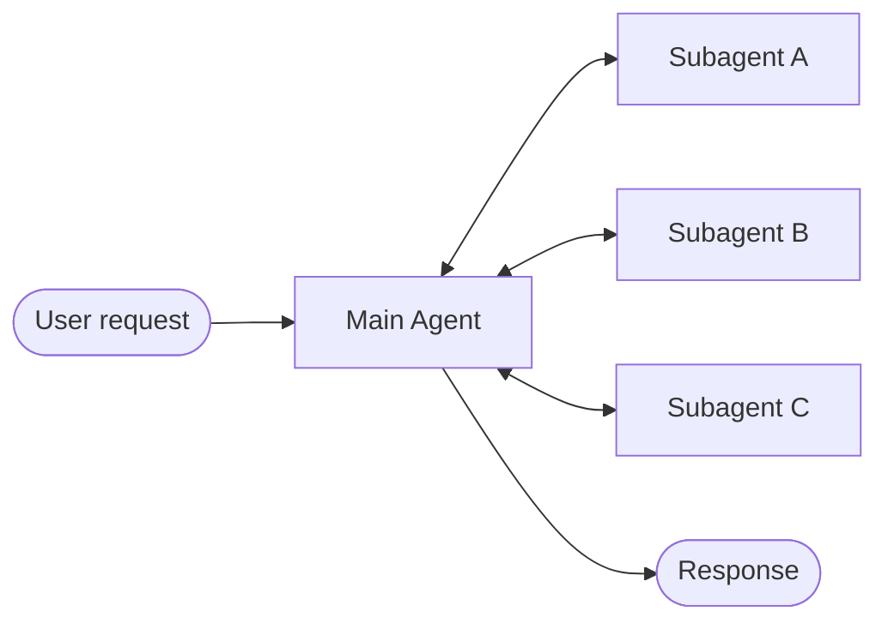
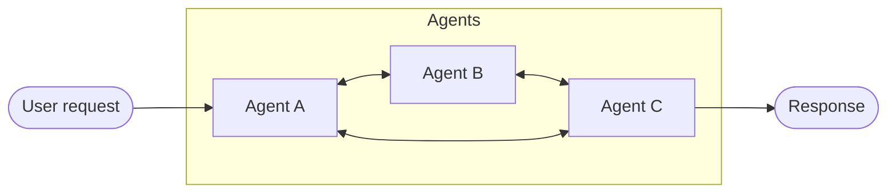
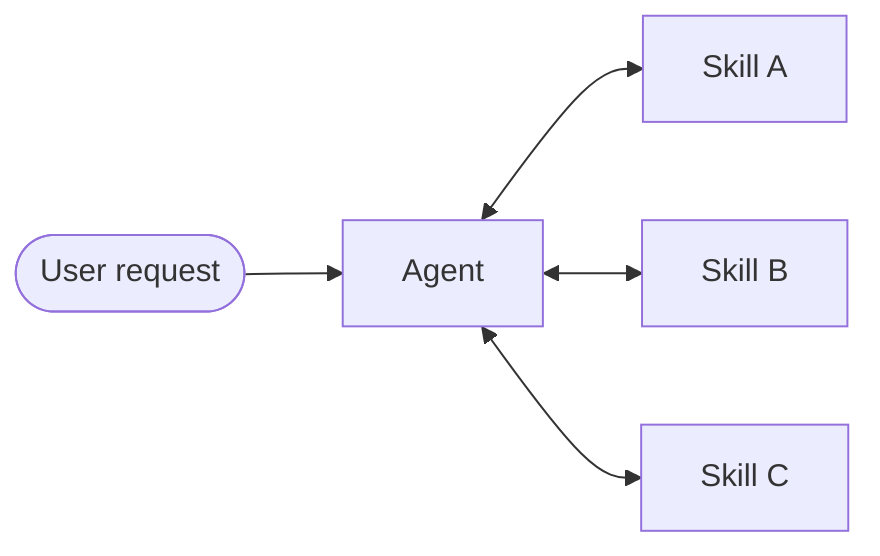
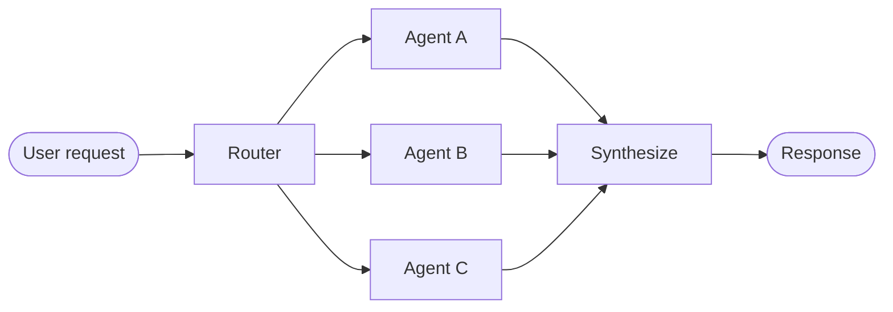

# Multi-agent

Multi-agent systems coordinate specialized components to tackle complex workflows. However, not every complex task requires this approach — a single agent with the right (sometimes dynamic) tools and prompt can often achieve similar results.

## Why multi-agent?

When developers say they need "multi-agent," they're usually looking for one or more of these capabilities:

- 🧠 **Context management**: Provide specialized knowledge without overwhelming the model's context window. If context were infinite and latency zero, you could dump all knowledge into a single prompt — but since it's not, you need patterns to selectively surface relevant information.

- 👥 **Distributed development**: Allow different teams to develop and maintain capabilities independently, composing them into a larger system with clear boundaries.

- 🔀 **Parallelization**: Spawn specialized workers for subtasks and execute them concurrently for faster results.

Multi-agent patterns are particularly valuable when a single agent has too many [**tools**](/oss/python/langchain/tools) and makes poor decisions about which to use, when tasks require specialized knowledge with extensive context (long prompts and domain-specific tools), or when you need to enforce sequential constraints that unlock capabilities only after certain conditions are met.

> [!TIP]
> At the center of multi-agent design is [**context engineering**](/oss/python/langchain/context-engineering)—deciding what information each agent sees. The quality of your system depends on ensuring each agent has access to the right data for its task.

## Patterns

Here are the main patterns for building multi-agent systems, each suited to different use cases:

| Pattern | How it works |
|---------|--------------|
| [Subagents](/oss/python/langchain/multi-agent/subagents) | A main agent coordinates subagents as tools. All routing passes through the main agent, which decides when and how to invoke each subagent. |
| [Handoffs](/oss/python/langchain/multi-agent/handoffs) | Behavior changes dynamically based on state. Tool calls update a state variable that triggers routing or configuration changes, switching agents or adjusting the current agent's tools and prompt. |
| [Skills](/oss/python/langchain/multi-agent/skills) | Specialized prompts and knowledge loaded on-demand. A single agent stays in control while loading context from skills as needed. |
| [Router](/oss/python/langchain/multi-agent/router) | A routing step classifies input and directs it to one or more specialized agents. Results are synthesized into a combined response. |
| [Custom workflow](/oss/python/langchain/multi-agent/custom-workflow) | Build bespoke execution flows with LangGraph, mixing deterministic logic and agentic behavior. Embed other patterns as nodes in your workflow. |

## Choosing a pattern

Use this table to match your requirements to the right pattern:

| Pattern | Distributed development | Parallelization | Multi-hop | Direct user interaction |
|---------|------------------------|-----------------|-----------|------------------------|
| Subagents | ⭐⭐⭐⭐⭐ | ⭐⭐⭐⭐ | ⭐⭐⭐⭐ | ⭐⭐⭐⭐ |
| Handoffs | — | — | ⭐⭐⭐ | ⭐⭐⭐⭐⭐ |
| Skills | ⭐⭐⭐⭐ | ⭐⭐⭐⭐ | ⭐⭐⭐⭐⭐ | ⭐⭐⭐⭐⭐ |
| Router | ⭐⭐⭐⭐ | ⭐⭐⭐⭐ | — | ⭐⭐⭐ |

- **Distributed development**: Can different teams maintain components independently?
- **Parallelization**: Can multiple agents execute concurrently?
- **Multi-hop**: Does the pattern support calling multiple subagents in series?
- **Direct user interaction**: Can subagents converse directly with the user?

> [!TIP]
> You can mix patterns! For example, a subagents architecture can invoke tools that invoke custom workflows or router agents. Subagents can even use the skills pattern to load context on-demand. The possibilities are endless!

## Visual overview

#### Subagents

A main agent coordinates subagents as tools. All routing passes through the main agent.

#### Handoffs

Agents transfer control to each other via tool calls. Each agent can hand off to others or respond directly to the user.

#### Skills

A single agent loads specialized prompts and knowledge on-demand while staying in control.

#### Router

A routing step classifies input and directs it to specialized agents. Results are synthesized.

## Performance comparison

Different patterns have different performance characteristics. Understanding these tradeoffs helps you choose the right pattern for your latency and cost requirements.

**Key metrics:**

- **Model calls**: Number of LLM invocations. More calls = higher latency (especially if sequential) and higher per-request API costs.
- **Tokens processed**: Total context window usage across all calls. More tokens = higher processing costs and potential context limits.

### One-shot request

**User: "Buy coffee"**

A specialized coffee agent/skill can call a `buy_coffee` tool.

| Pattern | Model calls | Best fit |
|---------|-------------|----------|
| Subagents | 4 | |
| Handoffs | 3 | ✅ |
| Skills | 3 | ✅ |
| Router | 3 | ✅ |

#### Subagents

4 model calls:

(Details about subagents flow)

#### Handoffs

3 model calls:

(Details about handoffs flow)

#### Skills

3 model calls:

(Details about skills flow)

#### Router

3 model calls:

(Details about router flow)

**Key insight**: Handoffs, Skills, and Router are most efficient for single tasks (3 calls each). Subagents adds one extra call because results flow back through the main agent—this overhead provides centralized control.

### Repeat request

**Turn 1: "Buy coffee"**
**Turn 2: "Buy coffee again"**

The user repeats the same request in the same conversation.

| Pattern | Turn 2 calls | Total (both turns) | Best fit |
|---------|--------------|-------------------|----------|
| Subagents | 4 | 8 | |
| Handoffs | 2 | 5 | ✅ |
| Skills | 2 | 5 | ✅ |
| Router | 3 | 6 | |

#### Subagents

4 calls again → 8 total

Subagents are stateless by design—each invocation follows the same flow. The main agent maintains conversation context, but subagents start fresh each time. This provides strong context isolation but repeats the full flow.

#### Handoffs

2 calls → 5 total

The coffee agent is still active from turn 1 (state persists). No handoff needed—agent directly calls `buy_coffee` tool (call 1). Agent responds to user (call 2). Saves 1 call by skipping the handoff.

#### Skills

2 calls → 5 total

The skill context is already loaded in conversation history. No need to reload—agent directly calls `buy_coffee` tool (call 1). Agent responds to user (call 2). Saves 1 call by reusing loaded skill.

#### Router

3 calls again → 6 total

Routers are stateless—each request requires an LLM routing call. Turn 2: Router LLM call (1) → Milk agent calls `buy_coffee` (2) → Milk agent responds (3). Can be optimized by wrapping as a tool in a stateful agent.

**Key insight**: Stateful patterns (Handoffs, Skills) save 40-50% of calls on repeat requests. Subagents maintain consistent cost per request—this stateless design provides strong context isolation but at the cost of repeated model calls.

### Multi-domain

**User: "Compare Python, JavaScript, and Rust for web development"**

Each language agent/skill contains ~2000 tokens of documentation. All patterns can make parallel tool calls.

| Pattern | Model calls | Total tokens | Best fit |
|---------|-------------|--------------|----------|
| Subagents | 5 | ~9K | ✅ |
| Handoffs | 7+ | ~14K+ | |
| Skills | 3 | ~15K | |
| Router | 5 | ~9K | ✅ |

#### Subagents

5 calls, ~9K tokens

Each subagent works in isolation with only its relevant context. Total: 9K tokens.

#### Handoffs

7+ calls, ~14K+ tokens

Handoffs executes sequentially—can't research all three languages in parallel. Growing conversation history adds overhead. Total: ~14K+ tokens.

#### Skills

3 calls, ~15K tokens

After loading, every subsequent call processes all 6K tokens of skill documentation. Subagents processes 67% fewer tokens overall due to context isolation. Total: 15K tokens.

#### Router

5 calls, ~9K tokens

Router uses an LLM for routing, then invokes agents in parallel. Similar to Subagents but with explicit routing step. Total: 9K tokens.

**Key insight**: For multi-domain tasks, patterns with parallel execution (Subagents, Router) are most efficient. Skills has fewer calls but high token usage due to context accumulation. Handoffs is inefficient here—it must execute sequentially and can't leverage parallel tool calling for consulting multiple domains simultaneously.

### Summary

Here's how patterns compare across all three scenarios:

| Pattern | One-shot | Repeat request | Multi-domain |
|---------|----------|----------------|--------------|
| Subagents | 4 calls | 8 calls (4+4) | 5 calls, 9K tokens |
| Handoffs | 3 calls | 5 calls (3+2) | 7+ calls, 14K+ tokens |
| Skills | 3 calls | 5 calls (3+2) | 3 calls, 15K tokens |
| Router | 3 calls | 6 calls (3+3) | 5 calls, 9K tokens |

**Choosing a pattern:**

| Optimize for | Subagents | Handoffs | Skills | Router |
|--------------|-----------|----------|--------|--------|
| Single requests | | ✅ | ✅ | ✅ |
| Repeat requests | | ✅ | ✅ | |
| Parallel execution | ✅ | | | ✅ |
| Large-context domains | ✅ | | | ✅ |
| Simple, focused tasks | | | ✅ | |
