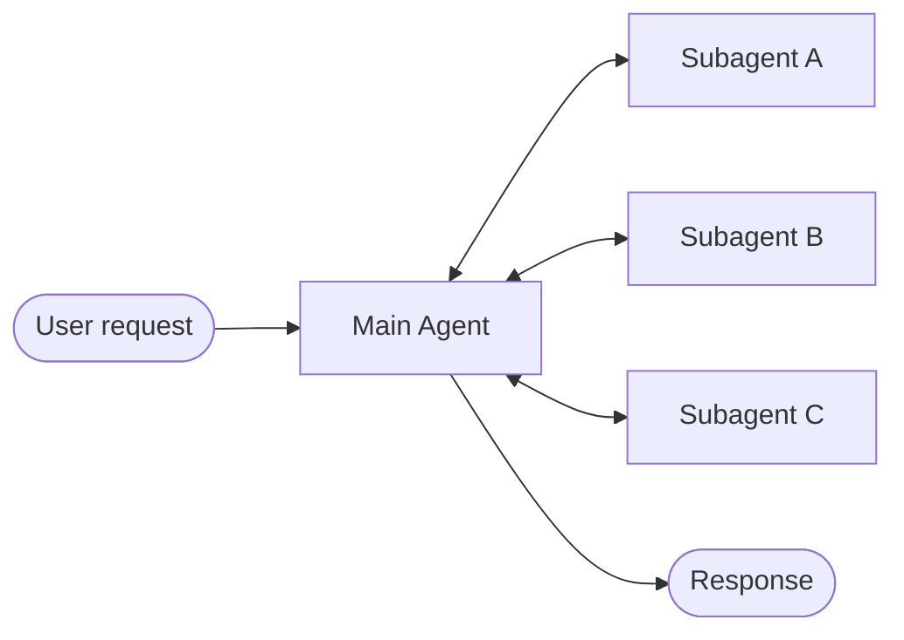
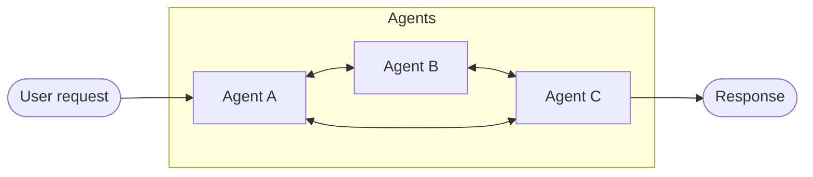
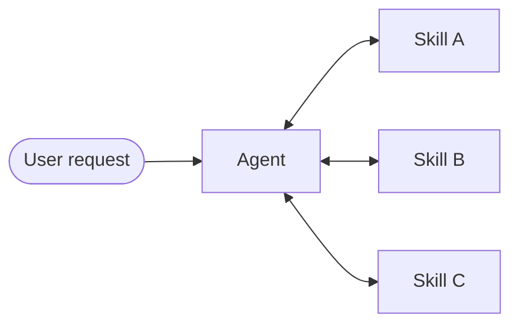
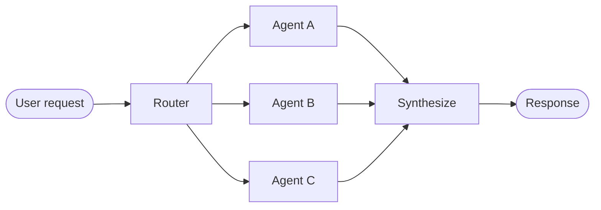

# 다중 Agent

다중 Agent 시스템은 특화된 구성 요소를 조정하여 복잡한 워크플로를 처리합니다. 그러나 모든 복잡한 작업이 이 접근 방식을 필요로 하지는 않습니다. 올바른 (때로는 동적) Tool과 프롬프트를 가진 단일 Agent가 종종 유사한 결과를 달성할 수 있습니다.

## 왜 다중 Agent인가?

개발자들이 "다중 Agent"가 필요하다고 말할 때, 보통 다음 기능 중 하나 이상을 찾고 있습니다:

- 🧠 **컨텍스트 관리**: 모델의 컨텍스트 윈도우를 압도하지 않으면서 특화된 지식을 제공합니다. 컨텍스트가 무한하고 지연 시간이 0이라면 모든 지식을 단일 프롬프트에 넣을 수 있지만, 그렇지 않으므로 관련 정보를 선택적으로 표시하는 패턴이 필요합니다.

- 👥 **분산 개발**: 다양한 팀이 명확한 경계를 가지고 기능을 독립적으로 개발하고 유지 관리하며 더 큰 시스템으로 구성할 수 있습니다.

- 🔀 **병렬화**: 하위 작업에 대해 특화된 작업자를 생성하고 더 빠른 결과를 위해 동시에 실행합니다.

다중 Agent 패턴은 단일 Agent가 너무 많은 [**Tool**](/oss/python/langchain/tools)을 가지고 있어서 어느 것을 사용할지 결정을 잘못할 때, 작업에 광범위한 컨텍스트가 있는 특화된 지식이 필요할 때 (긴 프롬프트와 도메인별 Tool), 또는 특정 조건이 충족된 후에만 기능을 잠금 해제하는 순차 제약 조건을 적용해야 할 때 특히 유용합니다.

> [!팁]
> 다중 Agent 설계의 중심은 [**컨텍스트 엔지니어링**](/oss/python/langchain/context-engineering)입니다. 각 Agent가 어떤 정보를 보는지 결정하는 것입니다. 시스템의 품질은 각 Agent가 자신의 작업에 적합한 데이터에 접근할 수 있도록 보장하는 데 달려 있습니다.

## 패턴

다양한 사용 사례에 적합한 다중 Agent 시스템 구축을 위한 주요 패턴은 다음과 같습니다:

| 패턴 | 작동 방식 |
|---------|--------------|
| [Subagent](/oss/python/langchain/multi-agent/subagents) | 메인 Agent가 subagent를 Tool로 조정합니다. 모든 라우팅은 메인 Agent를 통해 전달되며, 각 subagent를 언제 어떻게 호출할지 결정합니다. |
| [Handoff](/oss/python/langchain/multi-agent/handoffs) | 동작이 상태를 기반으로 동적으로 변경됩니다. Tool 호출이 상태 변수를 업데이트하여 라우팅이나 구성 변경을 트리거하고 Agent를 전환하거나 현재 Agent의 Tool과 프롬프트를 조정합니다. |
| [Skill](/oss/python/langchain/multi-agent/skills) | 특화된 프롬프트 및 온디맨드로 로드되는 지식입니다. 단일 Agent가 제어 상태를 유지하면서 필요에 따라 Skill의 컨텍스트를 로드합니다. |
| [Router](/oss/python/langchain/multi-agent/router) | 라우팅 단계가 입력을 분류하고 하나 이상의 특화된 Agent로 지시합니다. 결과는 결합된 응답으로 종합됩니다. |
| [Custom workflow](/oss/python/langchain/multi-agent/custom-workflow) | LangGraph로 맞춤형 실행 흐름을 구성하고, 결정적 논리와 Agent 동작을 혼합합니다. 워크플로의 노드로 다른 패턴을 포함합니다. |

## 패턴 선택

이 테이블을 사용하여 요구 사항을 올바른 패턴과 일치시킵니다:

| 패턴 | 분산 개발 | 병렬화 | 다중 홉 | 직접 사용자 상호작용 |
|---------|------------------------|-----------------|-----------|------------------------|
| Subagent | ⭐⭐⭐⭐⭐ | ⭐⭐⭐⭐ | ⭐⭐⭐⭐ | ⭐⭐⭐⭐ |
| Handoff | — | — | ⭐⭐⭐ | ⭐⭐⭐⭐⭐ |
| Skill | ⭐⭐⭐⭐ | ⭐⭐⭐⭐ | ⭐⭐⭐⭐⭐ | ⭐⭐⭐⭐⭐ |
| Router | ⭐⭐⭐⭐ | ⭐⭐⭐⭐ | — | ⭐⭐⭐ |

- **분산 개발**: 다양한 팀이 구성 요소를 독립적으로 유지 관리할 수 있습니까?
- **병렬화**: 여러 Agent가 동시에 실행할 수 있습니까?
- **다중 홉**: 패턴이 연속으로 여러 subagent를 호출하는 것을 지원합니까?
- **직접 사용자 상호작용**: Subagent가 사용자와 직접 대화할 수 있습니까?

> [!팁]
> 패턴을 혼합할 수 있습니다! 예를 들어, subagent 아키텍처는 커스텀 워크플로 또는 router Agent를 호출하는 Tool을 호출할 수 있습니다. Subagent는 Skill 패턴을 사용하여 온디맨드로 컨텍스트를 로드할 수도 있습니다. 가능성은 무한합니다!

## 시각적 개요

#### Subagent

메인 Agent가 subagent를 Tool로 조정합니다. 모든 라우팅은 메인 Agent를 통해 전달됩니다.

#### Handoff

Agent는 Tool 호출을 통해 제어권을 서로에게 이전합니다. 각 Agent는 다른 Agent에게 이양하거나 사용자에게 직접 응답할 수 있습니다.

#### Skill

단일 Agent가 제어 상태를 유지하면서 특화된 프롬프트와 지식을 온디맨드로 로드합니다.

#### Router

라우팅 단계가 입력을 분류하고 특화된 Agent로 지시합니다. 결과는 종합됩니다.

## 성능 비교

다양한 패턴은 서로 다른 성능 특성을 가집니다. 이러한 트레이드오프를 이해하면 지연 시간과 비용 요구 사항에 맞는 올바른 패턴을 선택할 수 있습니다.

**주요 지표:**

- **모델 호출**: LLM 호출 수입니다. 더 많은 호출 = 더 높은 지연 시간 (특히 순차적인 경우) 및 더 높은 요청당 API 비용.
- **처리된 토큰**: 모든 호출 간 총 컨텍스트 윈도우 사용량입니다. 더 많은 토큰 = 더 높은 처리 비용 및 잠재적 컨텍스트 제한.

### 일회성 요청

**사용자: "Buy coffee"**

특화된 커피 Agent/Skill이 `buy_coffee` Tool을 호출할 수 있습니다.

| 패턴 | 모델 호출 | 최적 적합 |
|---------|-------------|----------|
| Subagent | 4 | |
| Handoff | 3 | ✅ |
| Skill | 3 | ✅ |
| Router | 3 | ✅ |

#### Subagent

4 모델 호출:

(Subagent 흐름에 대한 세부 정보)

#### Handoff

3 모델 호출:

(Handoff 흐름에 대한 세부 정보)

#### Skill

3 모델 호출:

(Skill 흐름에 대한 세부 정보)

#### Router

3 모델 호출:

(Router 흐름에 대한 세부 정보)

**핵심 통찰력**: Handoff, Skill, Router는 단일 작업 (각각 3 호출)에 가장 효율적입니다. Subagent는 결과가 메인 Agent를 통해 다시 흐르기 때문에 한 가지 추가 호출을 추가합니다. 이 오버헤드는 중앙 집중식 제어를 제공합니다.

### 반복 요청

**턴 1: "Buy coffee"**
**턴 2: "Buy coffee again"**

사용자가 같은 대화에서 같은 요청을 반복합니다.

| 패턴 | 턴 2 호출 | 총 (양쪽 턴) | 최적 적합 |
|---------|--------------|-------------------|----------|
| Subagent | 4 | 8 | |
| Handoff | 2 | 5 | ✅ |
| Skill | 2 | 5 | ✅ |
| Router | 3 | 6 | |

#### Subagent

4 호출 다시 → 8 총계

Subagent는 설계상 상태 비저장입니다. 각 호출은 동일한 흐름을 따릅니다. 메인 Agent가 대화 컨텍스트를 유지하지만 subagent는 매번 새로 시작합니다. 이는 강력한 컨텍스트 격리를 제공하지만 전체 흐름을 반복합니다.

#### Handoff

2 호출 → 5 총계

커피 Agent는 여전히 턴 1에서 활성화되어 있습니다 (상태 지속). 이양이 필요하지 않습니다. Agent가 `buy_coffee` Tool을 직접 호출합니다 (호출 1). Agent가 사용자에게 응답합니다 (호출 2). 이양을 건너뜀으로써 1 호출을 절약합니다.

#### Skill

2 호출 → 5 총계

Skill 컨텍스트는 이미 대화 기록에 로드되어 있습니다. 재로드할 필요가 없습니다. Agent가 `buy_coffee` Tool을 직접 호출합니다 (호출 1). Agent가 사용자에게 응답합니다 (호출 2). 로드된 Skill을 재사용하여 1 호출을 절약합니다.

#### Router

3 호출 다시 → 6 총계

Router는 상태 비저장입니다. 각 요청은 LLM 라우팅 호출이 필요합니다. 턴 2: Router LLM 호출 (1) → Milk Agent가 `buy_coffee` 호출 (2) → Milk Agent 응답 (3). 상태 저장 Agent의 Tool로 래핑하여 최적화할 수 있습니다.

**핵심 통찰력**: 상태 저장 패턴 (Handoff, Skill)은 반복 요청에서 40-50%의 호출을 절약합니다. Subagent는 요청당 일관된 비용을 유지합니다. 이 상태 비저장 설계는 강력한 컨텍스트 격리를 제공하지만 반복되는 모델 호출의 비용이 듭니다.

### 다중 도메인

**사용자: "Compare Python, JavaScript, and Rust for web development"**

각 언어 Agent/Skill에는 ~2000개의 토큰 문서가 포함되어 있습니다. 모든 패턴이 병렬 Tool 호출을 수행할 수 있습니다.

| 패턴 | 모델 호출 | 총 토큰 | 최적 적합 |
|---------|-------------|--------------|----------|
| Subagent | 5 | ~9K | ✅ |
| Handoff | 7+ | ~14K+ | |
| Skill | 3 | ~15K | |
| Router | 5 | ~9K | ✅ |

#### Subagent

5 호출, ~9K 토큰

각 subagent는 관련 컨텍스트만 가지고 격리된 상태에서 작동합니다. 총: 9K 토큰.

#### Handoff

7+ 호출, ~14K+ 토큰

Handoff는 순차적으로 실행됩니다. 세 가지 언어를 모두 병렬로 연구할 수 없습니다. 증가하는 대화 기록이 오버헤드를 추가합니다. 총: ~14K+ 토큰.

#### Skill

3 호출, ~15K 토큰

로드 후 모든 후속 호출은 6K 토큰의 Skill 문서를 모두 처리합니다. Subagent는 컨텍스트 격리로 인해 전체적으로 67% 더 적은 토큰을 처리합니다. 총: 15K 토큰.

#### Router

5 호출, ~9K 토큰

Router는 라우팅을 위해 LLM을 사용한 다음 Agent를 병렬로 호출합니다. Subagent와 유사하지만 명시적 라우팅 단계가 있습니다. 총: 9K 토큰.

**핵심 통찰력**: 다중 도메인 작업의 경우 병렬 실행 패턴 (Subagent, Router)이 가장 효율적입니다. Skill은 호출이 더 적지만 컨텍스트 누적으로 인해 높은 토큰 사용량을 가집니다. Handoff는 여기에서 비효율적입니다. 순차적으로 실행해야 하며 여러 도메인을 동시에 참조하기 위해 병렬 Tool 호출을 활용할 수 없습니다.

### 요약

패턴이 세 가지 시나리오 모두에서 어떻게 비교되는지는 다음과 같습니다:

| 패턴 | 일회성 | 반복 요청 | 다중 도메인 |
|---------|----------|----------------|--------------|
| Subagent | 4 호출 | 8 호출 (4+4) | 5 호출, 9K 토큰 |
| Handoff | 3 호출 | 5 호출 (3+2) | 7+ 호출, 14K+ 토큰 |
| Skill | 3 호출 | 5 호출 (3+2) | 3 호출, 15K 토큰 |
| Router | 3 호출 | 6 호출 (3+3) | 5 호출, 9K 토큰 |

**패턴 선택:**

| 최적화 대상 | Subagent | Handoff | Skill | Router |
|--------------|-----------|----------|--------|--------|
| 단일 요청 | | ✅ | ✅ | ✅ |
| 반복 요청 | | ✅ | ✅ | |
| 병렬 실행 | ✅ | | | ✅ |
| 대규모 컨텍스트 도메인 | ✅ | | | ✅ |
| 단순하고 초점이 있는 작업 | | | ✅ | |
