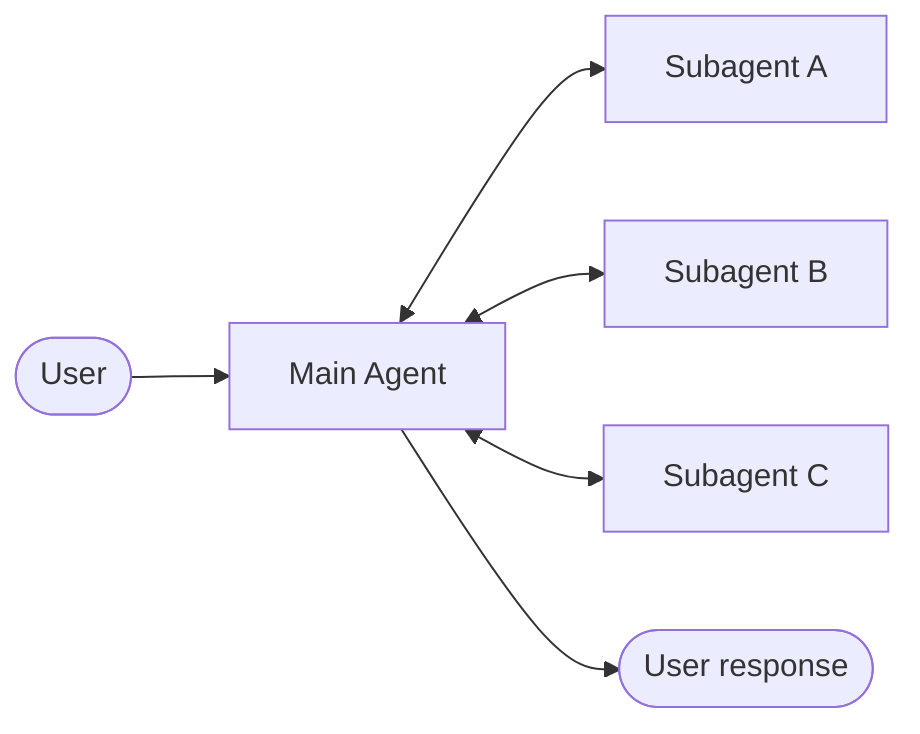
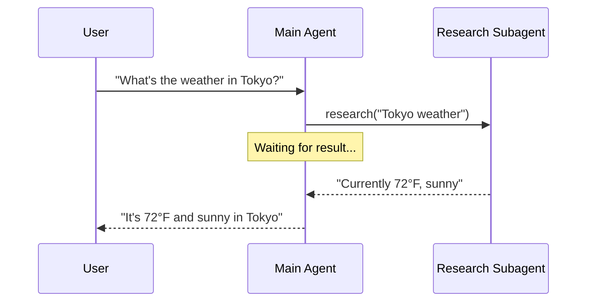
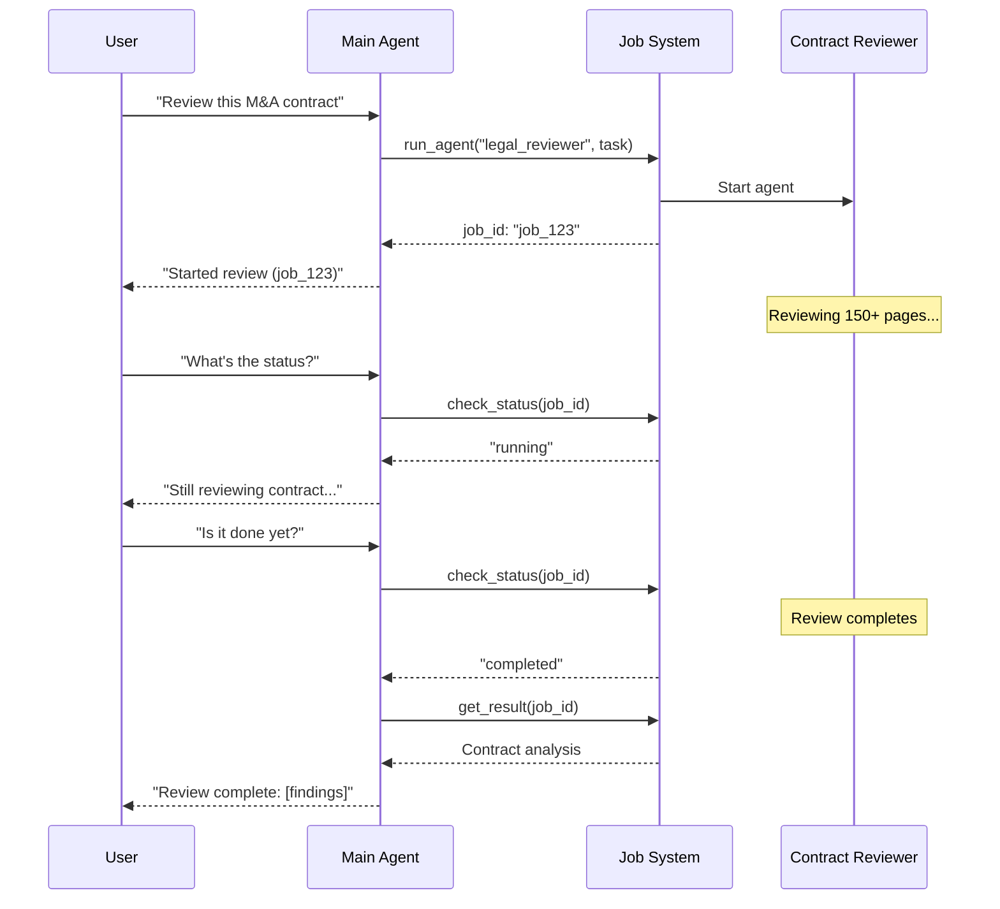
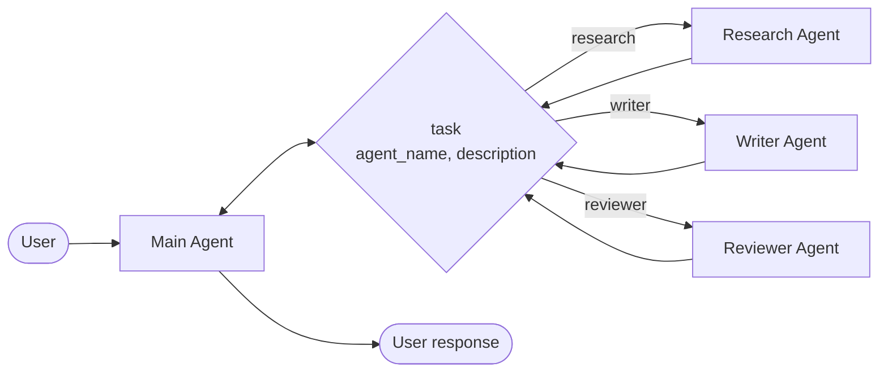

# Sub-Agent

**sub-agent** 아키텍처에서 중앙의 주 **Agent**(종종 **감시자**라고 불림)는 sub-agent를 **도구**로 호출하여 sub-agent를 조정합니다. 주 Agent는 어떤 sub-agent를 호출할지, 어떤 입력을 제공할지, 그리고 결과를 어떻게 결합할지 결정합니다. Sub-agent는 상태 비저장입니다. 즉, 과거 상호작용을 기억하지 않으며, 모든 대화 메모리는 주 Agent에서 유지됩니다. 이는 **컨텍스트** 격리를 제공합니다: 각 sub-agent 호출은 깨끗한 컨텍스트 윈도우에서 작동하여 주 대화에서 컨텍스트 비만을 방지합니다.



## 주요 특성

- **중앙 집중식 제어**: 모든 라우팅이 주 Agent를 통과합니다
- **직접 사용자 상호작용 없음**: Sub-agent가 사용자가 아닌 주 Agent에 결과를 반환합니다(다만 sub-agent 내에서 [중단](/oss/python/langchain/human-in-the-loop)을 사용하여 사용자 상호작용을 허용할 수 있습니다)
- **도구를 통한 Sub-agent**: Sub-agent는 도구를 통해 호출됩니다
- **병렬 실행**: 주 Agent는 단일 턴에서 여러 sub-agent를 호출할 수 있습니다

> [!INFO]
> **감시자 vs. 라우터**: 감시자 Agent(이 패턴)는 [라우터](/oss/python/langchain/multi-agent/router)와 다릅니다. 감시자는 대화 컨텍스트를 유지하고 여러 턴에 걸쳐 동적으로 어떤 sub-agent를 호출할지 결정하는 완전한 Agent입니다. 라우터는 일반적으로 진행 중인 대화 상태를 유지하지 않고 Agent에 발송하는 단일 분류 단계입니다.

## 언제 사용할지

여러 개의 분명히 구분되는 도메인(예: 달력, 이메일, CRM, 데이터베이스)이 있고, sub-agent가 사용자와 직접 대화할 필요가 없거나, 중앙 집중식 워크플로우 제어를 원할 때 sub-agent 패턴을 사용하세요. 몇 개의 **도구**만 있는 더 간단한 경우에는 단일 **Agent**를 사용하세요.

> [!TIP]
> **Sub-agent 내에서 사용자 상호작용이 필요하신가요?** Sub-agent는 일반적으로 사용자와 직접 대화하기보다 주 Agent에 결과를 반환하지만, sub-agent 내에서 [중단](/oss/python/langchain/human-in-the-loop)을 사용하여 실행을 일시 중지하고 사용자 입력을 수집할 수 있습니다. 이는 sub-agent가 진행하기 전에 명확성이나 승인이 필요할 때 유용합니다. 주 Agent는 조정자로 남지만, sub-agent는 작업 도중에 사용자로부터 정보를 수집할 수 있습니다.

## 기본 구현

핵심 메커니즘은 sub-agent를 주 Agent가 호출할 수 있는 도구로 래핑합니다:

```python
from langchain.tools import tool
from langchain.agents import create_agent

# Sub-agent 생성
subagent = create_agent(model="anthropic:claude-sonnet-4-20250514", tools=[...])

# 도구로 래핑
@tool("research", description="Research a topic and return findings")
def call_research_agent(query: str):
    result = subagent.invoke({"messages": [{"role": "user", "content": query}]})
    return result["messages"][-1].content

# Sub-agent를 도구로 포함하는 주 Agent
main_agent = create_agent(model="anthropic:claude-sonnet-4-20250514", tools=[call_research_agent])
```

> **튜토리얼: Sub-agent를 사용하여 개인 비서 구축**
>
> 중앙 주 Agent(감시자)가 특화된 작업 Agent를 조정하는 sub-agent 패턴을 사용하여 개인 비서를 구축하는 방법을 알아봅니다.
>
> [자세히 알아보기 →](https://docs.langchain.com/tutorials/subagents)

## 설계 결정

Sub-agent 패턴을 구현할 때 여러 주요 설계 선택을 해야 합니다. 이 표는 옵션을 요약합니다. 각 옵션은 아래의 섹션에서 자세히 다룹니다.

| 결정 | 옵션 |
|----------|---------|
| 동기 vs. 비동기 | 동기(블로킹) vs. 비동기(백그라운드) |
| 도구 패턴 | Agent당 도구 vs. 단일 발송 도구 |
| Sub-agent 사양 | 시스템 프롬프트 vs. 열거형 제약 vs. 도구 기반 발견(단일 발송 도구만) |
| Sub-agent 입력 | 쿼리만 vs. 전체 컨텍스트 |
| Sub-agent 출력 | Sub-agent 결과 vs. 전체 대화 이력 |

## 동기 vs. 비동기

Sub-agent 실행은 **동기**(블로킹) 또는 **비동기**(백그라운드)일 수 있습니다. 주 Agent가 결과를 필요로 하는지에 따라 선택합니다.

| 모드 | 주 Agent 동작 | 최적 용도 | 절충 |
|------|---------------------|----------|----------|
| 동기 | Sub-agent가 완료될 때까지 대기 | 주 Agent가 계속하기 위해 결과 필요 | 간단하지만 대화 블로킹 |
| 비동기 | Sub-agent가 백그라운드에서 실행되는 동안 계속 | 독립적인 작업, 사용자가 기다리면 안 됨 | 반응성 있지만 더 복잡 |

> [!TIP]
> Python의 `async` / `await`와 혼동하지 마세요. 여기서 "비동기"는 주 Agent가 백그라운드 작업(일반적으로 별도의 프로세스 또는 서비스)을 시작하고 블로킹 없이 계속한다는 의미입니다.

### 동기(기본값)

기본적으로 sub-agent 호출은 **동기**입니다. 주 Agent는 각 sub-agent가 완료될 때까지 대기합니다. 주 Agent의 다음 작업이 sub-agent의 결과에 의존할 때 동기를 사용하세요.



**동기 사용 시기:**

- 주 Agent가 sub-agent의 결과를 필요로 응답 구성
- 작업이 순서 의존성을 가짐(예: 데이터 가져오기 → 분석 → 응답)
- Sub-agent 실패가 주 Agent의 응답을 블로킹해야 함

**절충:**

- 간단한 구현 — 호출하고 대기
- 사용자가 모든 sub-agent가 완료될 때까지 응답을 보지 못함
- 장시간 실행 작업이 대화를 중단시킴

### 비동기

Sub-agent의 작업이 독립적일 때 **비동기 실행**을 사용하세요. 주 Agent가 결과를 필요로 하지 않고 사용자와 계속 대화할 수 있습니다. 주 Agent는 백그라운드 작업을 시작하고 반응성을 유지합니다.



**비동기 사용 시기:**

- Sub-agent 작업이 주 대화 흐름과 독립적임
- 사용자가 작업이 진행되는 동안 계속 채팅할 수 있어야 함
- 여러 독립적인 작업을 병렬로 실행하고 싶음

**3가지 도구 패턴:**

1. **작업 시작**: 백그라운드 작업을 시작하고 작업 ID 반환
2. **상태 확인**: 현재 상태(pending, running, completed, failed) 반환
3. **결과 가져오기**: 완료된 결과 검색

**작업 완료 처리:** 작업이 완료되면 애플리케이션이 사용자에게 알려야 합니다. 한 가지 접근 방식: "job_123을 확인하고 결과를 요약해"와 같은 `HumanMessage`를 보낼 때 클릭되는 알림을 표시합니다.

## 도구 패턴

Sub-agent를 도구로 노출하는 두 가지 주요 방법이 있습니다:

| 패턴 | 최적 용도 | 절충 |
|---------|----------|-----------|
| Agent당 도구 | 각 sub-agent의 입출력에 대한 미세한 제어 | 더 많은 설정이지만 더 많은 사용자 정의 |
| 단일 발송 도구 | 많은 Agent, 분산 팀, 관례 over 구성 | 더 간단한 구성이지만 Agent당 사용자 정의 감소 |

### Agent당 도구


핵심 아이디어는 sub-agent를 주 Agent가 호출할 수 있는 도구로 래핑하는 것입니다:

```python
from langchain.tools import tool
from langchain.agents import create_agent

# Sub-agent 생성
subagent = create_agent(model="...", tools=[...])

# 도구로 래핑
# @tool("subagent_name", description="subagent_description")
def call_subagent(query: str):
    result = subagent.invoke({"messages": [{"role": "user", "content": query}]})
    return result["messages"][-1].content

# Sub-agent를 도구로 포함하는 주 Agent
# main_agent = create_agent(model="...", tools=[call_subagent])
```

주 Agent는 작업이 sub-agent의 설명과 일치한다고 결정할 때 sub-agent 도구를 호출하고, 결과를 받으며, 조정을 계속합니다. 미세한 제어는 [컨텍스트 엔지니어링](#context-engineering)을 참조하세요.

### 단일 발송 도구

대안적 접근 방식은 단일 매개변수화된 도구를 사용하여 독립적인 작업에 대해 임시 sub-agent를 호출합니다. **Agent당 도구** 접근 방식(각 sub-agent가 별도의 도구로 래핑되는)과 달리, 단일 `task` 도구를 사용하는 관례 기반 접근 방식을 사용합니다: 작업 설명이 sub-agent에 인간 메시지로 전달되고, sub-agent의 최종 메시지가 도구 결과로 반환됩니다.

여러 팀 전반에 Agent 개발을 분산시키려 하거나, 복잡한 작업을 별도의 컨텍스트 윈도우로 격리시키려 하거나, 조정자를 수정하지 않고 새로운 Agent를 추가할 수 있는 확장 가능한 방법이 필요하거나, 사용자 정의보다 관례를 선호할 때 이 접근 방식을 사용하세요. 이 접근 방식은 컨텍스트 엔지니어링의 유연성을 Agent 구성과 강력한 컨텍스트 격리의 단순성으로 트레이드합니다.



**핵심 특성:**

- **단일 작업 도구**: 이름으로 등록된 sub-agent를 호출할 수 있는 하나의 매개변수화된 도구
- **관례 기반 호출**: 이름으로 선택한 Agent, 인간 메시지로 전달한 작업, 도구 결과로 반환한 최종 메시지
- **팀 분산**: 다양한 팀이 Agent를 독립적으로 개발하고 배포할 수 있습니다
- **Agent 발견**: Sub-agent는 시스템 프롬프트(사용 가능한 Agent 나열)를 통해 발견되거나 **점진적 공개**(도구를 통해 주문형으로 Agent 정보 로드)를 통해 발견될 수 있습니다

> [!TIP]
> 이 접근 방식의 흥미로운 측면은 sub-agent가 주 Agent와 정확히 같은 기능을 가질 수 있다는 것입니다. 이러한 경우 sub-agent를 호출하는 것은 실제로 **컨텍스트 격리**가 주된 이유입니다. 복잡한 다단계 작업이 주 Agent의 대화 이력을 부풀리지 않으면서 격리된 컨텍스트 윈도우에서 실행될 수 있습니다. Sub-agent는 자율적으로 작업을 완료하고 간단한 요약만 반환하여 주 스레드를 집중 있고 효율적으로 유지합니다.

<details>
<summary>작업 발송기를 포함한 Agent 레지스트리</summary>

```python
from langchain.tools import tool
from langchain.agents import create_agent

# 다양한 팀에서 개발한 Sub-agent
research_agent = create_agent(
    model="gpt-4.1",
    prompt="You are a research specialist..."
)

writer_agent = create_agent(
    model="gpt-4.1",
    prompt="You are a writing specialist..."
)

# 사용 가능한 sub-agent 레지스트리
SUBAGENTS = {
    "research": research_agent,
    "writer": writer_agent,
}

@tool
def task(
    agent_name: str,
    description: str
) -> str:
    """작업을 위해 임시 subagent를 시작합니다.

    사용 가능한 Agent:
    - research: 연구 및 사실 확인
    - writer: 콘텐츠 작성 및 편집
    """
    agent = SUBAGENTS[agent_name]
    result = agent.invoke({
        "messages": [
            {"role": "user", "content": description}
        ]
    })
    return result["messages"][-1].content

# 주 조정자 Agent
main_agent = create_agent(
    model="gpt-4.1",
    tools=[task],
    system_prompt=(
        "You coordinate specialized sub-agents. "
        "Available: research (fact-finding), "
        "writer (content creation). "
        "Use the task tool to delegate work."
    ),
)
```

</details>

## 컨텍스트 엔지니어링

주 Agent와 sub-agent 간의 컨텍스트 흐름을 제어합니다:

| 범주 | 목적 | 영향 |
|----------|---------|---------|
| Sub-agent 사양 | Sub-agent가 호출될 때 확인 | 주 Agent 라우팅 결정 |
| Sub-agent 입력 | Sub-agent가 최적화된 컨텍스트로 잘 실행될 수 있는지 확인 | Sub-agent 성능 |
| Sub-agent 출력 | 감시자가 sub-agent 결과에 대해 조치할 수 있는지 확인 | 주 Agent 성능 |

[Agent를 위한 컨텍스트 엔지니어링](/oss/python/langchain/context-engineering)에 대한 포괄적 가이드도 참조하세요.

## Sub-agent 사양

Sub-agent와 관련된 **이름**과 **설명**은 주 Agent가 어떤 sub-agent를 호출할지 알 수 있는 주요 방법입니다. 이는 프롬프팅 레버입니다. 신중하게 선택하세요.

- **이름**: 주 Agent가 sub-agent를 어떻게 부르는지. 명확하고 행동 지향적으로 유지하세요(예: `research_agent`, `code_reviewer`).
- **설명**: 주 Agent가 sub-agent의 기능에 대해 알고 있는 것. 어떤 작업을 처리하는지, 언제 사용할지 구체적으로 명시하세요.

**단일 발송 도구** 설계의 경우 호출할 수 있는 sub-agent에 대한 정보를 주 Agent에 추가로 제공해야 합니다. Agent의 개수와 레지스트리가 정적인지 동적인지에 따라 다양한 방식으로 이 정보를 제공할 수 있습니다:

| 방법 | 최적 용도 | 절충 |
|--------|----------|----------|
| 시스템 프롬프트 열거 | 작고 정적인 Agent 목록(< 10 Agent) | 간단하지만 Agent가 변경되면 프롬프트 업데이트 필요 |
| 열거형 제약 | 작고 정적인 Agent 목록(< 10 Agent) | 타입 안전하고 명시적이지만 Agent가 변경되면 코드 변경 필요 |
| 도구 기반 발견 | 크거나 동적인 Agent 레지스트리 | 유연하고 확장 가능하지만 복잡도 추가 |

### 시스템 프롬프트 열거

주 Agent의 시스템 프롬프트에 사용 가능한 Agent를 직접 나열합니다. 주 Agent는 지침의 일부로 Agent 목록과 설명을 봅니다.

**사용 시기:**

- 작고 고정된 Agent 세트가 있는 경우(< 10)
- Agent 레지스트리가 거의 변경되지 않음
- 가장 간단한 구현을 원함

**예제:**

```python
main_agent = create_agent(
    model="...",
    tools=[task],
    system_prompt=(
        "You coordinate specialized sub-agents. "
        "Available agents:\n"
        "- research: Research and fact-finding\n"
        "- writer: Content creation and editing\n"
        "- reviewer: Code and document review\n"
        "Use the task tool to delegate work."
    ),
)
```

### 발송 도구의 열거형 제약

발송 도구의 `agent_name` 매개변수에 열거형 제약을 추가합니다. 이는 타입 안전을 제공하고 사용 가능한 Agent를 도구 스키마에서 명시적으로 만듭니다.

**사용 시기:**

- 작고 고정된 Agent 세트가 있는 경우(< 10)
- 타입 안전을 원함
- 프롬프트 기반 가이드보다 스키마 기반 검증을 선호함

**예제:**

```python
from enum import Enum

class AgentName(str, Enum):
    RESEARCH = "research"
    WRITER = "writer"
    REVIEWER = "reviewer"

@tool
def task(
    agent_name: AgentName,  # 열거형 제약
    description: str
) -> str:
    """작업을 위해 임시 subagent를 시작합니다."""
    # ...
```

### 도구 기반 발견

주 Agent가 주문형으로 호출할 수 있는 별도의 도구(예: `list_agents` 또는 `search_agents`)를 제공합니다. 이는 점진적 공개를 활성화하고 동적 레지스트리를 지원합니다.

**사용 시기:**

- 많은 Agent(> 10)가 있거나 레지스트리가 증가하고 있는 경우
- Agent 레지스트리가 자주 변경되거나 동적임
- 프롬프트 크기와 토큰 사용을 줄이고 싶음
- 다양한 팀이 독립적으로 다양한 Agent를 관리함

**예제:**

```python
@tool
def list_agents(query: str = "") -> str:
    """사용 가능한 subagent를 선택적으로 쿼리로 필터링하여 나열합니다."""
    agents = search_agent_registry(query)
    return format_agent_list(agents)

@tool
def task(agent_name: str, description: str) -> str:
    """작업을 위해 임시 subagent를 시작합니다."""
    # ...

main_agent = create_agent(
    model="...",
    tools=[task, list_agents],
    system_prompt="Use list_agents to discover available subagents, then use task to invoke them."
)
```

## Sub-agent 입력

Sub-agent가 작업을 실행하기 위해 받는 컨텍스트를 사용자 정의합니다. 정적 프롬프트에서 캡처하기는 실용적이지 않은 입력(전체 메시지 이력, 이전 결과 또는 작업 메타데이터)을 Agent의 상태에서 가져옴으로써 추가합니다.

<details>
<summary>Sub-agent 입력 예제</summary>

```python
from langchain.agents import AgentState
from langchain.tools import tool, ToolRuntime

class CustomState(AgentState):
    example_state_key: str

@tool(
    "subagent1_name",
    description="subagent1_description"
)
def call_subagent1(query: str, runtime: ToolRuntime[None, CustomState]):
    # 메시지를 적절한 입력으로 변환하기 위해 필요한 로직 적용
    subagent_input = some_logic(query, runtime.state["messages"])

    result = subagent1.invoke({
        "messages": subagent_input,
        # 필요에 따라 여기에 다른 상태 키를 전달할 수도 있습니다.
        # 주 Agent와 sub-agent의 상태 스키마에서 모두 정의하세요.
        "example_state_key": runtime.state["example_state_key"]
    })
    return result["messages"][-1].content
```

</details>

## Sub-agent 출력

주 Agent가 받는 내용을 사용자 정의하여 좋은 결정을 내릴 수 있도록 합니다. 두 가지 전략:

1. **Sub-agent에 프롬프트**: 정확히 반환되어야 할 것을 지정합니다. 일반적인 실패 모드는 sub-agent가 도구 호출이나 추론을 수행하지만 최종 메시지에 결과를 포함하지 않는 것입니다. 감시자가 최종 출력만 본다는 것을 상기시켜주세요.

2. **코드에서 형식화**: 반환하기 전에 응답을 조정하거나 강화합니다. 예를 들어 `Command`를 사용하여 최종 텍스트 외에 특정 상태 키를 다시 전달합니다.

<details>
<summary>Sub-agent 출력 예제</summary>

```python
from typing import Annotated
from langchain.agents import AgentState
from langchain.tools import InjectedToolCallId
from langgraph.types import Command

@tool(
    "subagent1_name",
    description="subagent1_description"
)
def call_subagent1(
    query: str,
    tool_call_id: Annotated[str, InjectedToolCallId],
) -> Command:
    result = subagent1.invoke({
        "messages": [{"role": "user", "content": query}]
    })

    return Command(update={
        # Sub-agent에서 추가 상태 반환
        "example_state_key": result["example_state_key"],
        "messages": [
            ToolMessage(
                content=result["messages"][-1].content,
                tool_call_id=tool_call_id
            )
        ]
    })
```

</details>
