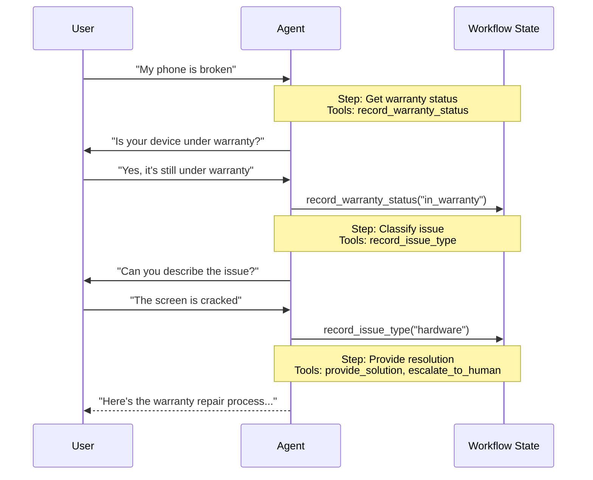

# 인계

**인계** 아키텍처에서 동작은 상태에 기반하여 동적으로 변경됩니다. 핵심 메커니즘은: **도구**가 턴 간에 지속되는 상태 변수(예: `current_step` 또는 `active_agent`)를 업데이트하고, 시스템이 이 변수를 읽어 동작을 조정합니다(서로 다른 구성(시스템 프롬프트, 도구) 적용 또는 다른 **Agent**로 라우팅). 이 패턴은 개별 Agent 간 인계와 단일 Agent 내의 동적 구성 변경 모두를 지원합니다.

> [!TIP]
> **인계** 용어는 [OpenAI](https://openai.com)에 의해 도구 호출(예: `transfer_to_sales_agent`)을 사용하여 Agent 또는 상태 간 제어를 전송하기 위해 만들어졌습니다.



## 주요 특성

- **상태 기반 동작**: 동작이 상태 변수(예: `current_step` 또는 `active_agent`)를 기반으로 변경됨
- **도구 기반 전환**: 도구가 상태 변수를 업데이트하여 상태 간 이동
- **직접 사용자 상호작용**: 각 상태의 구성이 사용자 메시지를 직접 처리
- **지속되는 상태**: 상태가 대화 턴 전반에 걸쳐 지속됨

## 언제 사용할지

순차적 제약을 적용해야 하는 경우(전제 조건이 충족된 후에만 기능 잠금 해제), Agent가 다양한 상태에서 사용자와 직접 대화해야 하거나, 다단계 대화 흐름을 구축하는 경우 인계 패턴을 사용하세요. 이 패턴은 특히 특정 순서로 정보를 수집해야 하는 고객 지원 시나리오에서 중요합니다. 예를 들어, 환불을 처리하기 전에 보증 ID를 수집하는 경우입니다.

## 기본 구현

핵심 메커니즘은 상태를 업데이트하여 새 단계 또는 Agent로 전환을 트리거하는 `Command`를 반환하는 도구입니다:

```python
from langchain.tools import tool
from langchain.messages import ToolMessage
from langgraph.types import Command

@tool
def transfer_to_specialist(runtime) -> Command:
    """전문가 Agent로 전송합니다."""
    return Command(
        update={
            "messages": [
                ToolMessage(
                    content="Transferred to specialist",
                    tool_call_id=runtime.tool_call_id
                )
            ],
            "current_step": "specialist"  # 동작 변경을 트리거
        }
    )
```

> [!TIP]
> **ToolMessage를 포함하는 이유는?** LLM이 도구를 호출하면 응답을 기대합니다. 일치하는 `tool_call_id`를 가진 `ToolMessage`는 이 요청-응답 사이클을 완료합니다. 인계 도구가 메시지를 업데이트할 때마다 필요합니다.

완전한 구현은 아래 튜토리얼을 참조하세요.

> **튜토리얼: 인계를 사용하여 고객 지원 구축**
>
> 단일 Agent가 다양한 구성 간 전환하는 인계 패턴을 사용하여 고객 지원 Agent를 구축하는 방법을 알아봅니다.
>
> [자세히 알아보기 →](https://docs.langchain.com/tutorials/handoffs)

## 구현 접근 방식

인계를 구현하는 두 가지 방법이 있습니다: **Middleware를 포함한 단일 Agent**(동적 구성이 있는 하나의 Agent) 또는 **여러 Agent subgraph**(그래프 노드로서의 개별 Agent).

### Middleware를 포함한 단일 Agent

단일 Agent가 상태를 기반으로 동작을 변경합니다. Middleware는 각 모델 호출을 가로채고 동적으로 시스템 프롬프트와 사용 가능한 도구를 조정합니다. 도구는 상태 변수를 업데이트하여 전환을 트리거합니다:

```python
from langchain.tools import ToolRuntime, tool
from langchain.messages import ToolMessage
from langgraph.types import Command

@tool
def record_warranty_status(
    status: str,
    runtime: ToolRuntime[None, SupportState]
) -> Command:
    """보증 상태를 기록하고 다음 단계로 전환합니다."""
    return Command(
        update={
            "messages": [
                ToolMessage(
                    content=f"Warranty status recorded: {status}",
                    tool_call_id=runtime.tool_call_id
                )
            ],
            "warranty_status": status,
            "current_step": "specialist"  # 전환을 트리거하기 위해 상태 업데이트
        }
    )
```

<details>
<summary>완전한 예제: Middleware를 사용한 고객 지원</summary>

```python
from langchain.agents import AgentState, create_agent
from langchain.agents.middleware import wrap_model_call, ModelRequest, ModelResponse
from langchain.tools import tool, ToolRuntime
from langchain.messages import ToolMessage
from langgraph.types import Command
from typing import Callable

# 1. 현재 단계 추적기로 상태 정의
class SupportState(AgentState):
    """현재 어느 단계가 활성화되는지 추적합니다."""
    current_step: str = "triage"
    warranty_status: str | None = None

# 2. 도구가 Command를 통해 current_step을 업데이트
@tool
def record_warranty_status(
    status: str,
    runtime: ToolRuntime[None, SupportState]
) -> Command:
    """보증 상태를 기록하고 다음 단계로 전환합니다."""
    return Command(update={
        "messages": [
            ToolMessage(
                content=f"Warranty status recorded: {status}",
                tool_call_id=runtime.tool_call_id
            )
        ],
        "warranty_status": status,
        # 다음 단계로 전환
        "current_step": "specialist"
    })

# 3. Middleware는 current_step을 기반으로 동적 구성 적용
@wrap_model_call
def apply_step_config(
    request: ModelRequest,
    handler: Callable[[ModelRequest], ModelResponse]
) -> ModelResponse:
    """current_step을 기반으로 Agent 동작을 구성합니다."""
    step = request.state.get("current_step", "triage")

    # 단계를 해당 구성으로 매핑
    configs = {
        "triage": {
            "prompt": "Collect warranty information...",
            "tools": [record_warranty_status]
        },
        "specialist": {
            "prompt": "Provide solutions based on warranty: {warranty_status}",
            "tools": [provide_solution, escalate]
        }
    }

    config = configs[step]
    request = request.override(
        system_prompt=config["prompt"].format(**request.state),
        tools=config["tools"]
    )
    return handler(request)

# 4. Middleware로 Agent 생성
agent = create_agent(
    model,
    tools=[record_warranty_status, provide_solution, escalate],
    state_schema=SupportState,
    middleware=[apply_step_config],
    checkpointer=InMemorySaver()  # 턴 간 상태 유지
)
```

</details>

### 여러 Agent subgraph

여러 개의 개별 Agent가 그래프의 별도의 노드로 존재합니다. 인계 도구는 `Command.PARENT`를 사용하여 다음에 실행할 노드를 지정하여 Agent 노드 간 이동합니다.

Subgraph 인계는 신중한 **컨텍스트 엔지니어링**이 필요합니다. 단일 Agent Middleware(메시지 이력이 자연스럽게 흐르는)와 달리, Agent 간에 전달되는 메시지를 명시적으로 결정해야 합니다. 이를 잘못하면 Agent가 형식 없는 대화 이력이나 부풀려진 컨텍스트를 받습니다. [컨텍스트 엔지니어링](#context-engineering) 아래를 참조하세요.

```python
from langchain.messages import AIMessage, ToolMessage
from langchain.tools import tool, ToolRuntime
from langgraph.types import Command

@tool
def transfer_to_sales(
    runtime: ToolRuntime,
) -> Command:
    """영업 Agent로 전송합니다."""
    last_ai_message = next(
        msg for msg in reversed(runtime.state["messages"])
        if isinstance(msg, AIMessage)
    )
    transfer_message = ToolMessage(
        content="Transferred to sales agent",
        tool_call_id=runtime.tool_call_id,
    )
    return Command(
        goto="sales_agent",
        update={
            "active_agent": "sales_agent",
            "messages": [last_ai_message, transfer_message],
        },
        graph=Command.PARENT
    )
```

<details>
<summary>완전한 예제: 인계를 사용한 영업 및 지원</summary>

이 예제는 별도의 영업 및 지원 Agent를 가진 다중 Agent 시스템을 보여줍니다. 각 Agent는 별도의 그래프 노드이고, 인계 도구를 사용하면 Agent가 서로 대화를 전송할 수 있습니다.

```python
from typing import Literal

from langchain.agents import AgentState, create_agent
from langchain.messages import AIMessage, ToolMessage
from langchain.tools import tool, ToolRuntime
from langgraph.graph import StateGraph, START, END
from langgraph.types import Command
from typing_extensions import NotRequired

# 1. active_agent 추적기로 상태 정의
class MultiAgentState(AgentState):
    active_agent: NotRequired[str]

# 2. 인계 도구 생성
@tool
def transfer_to_sales(
    runtime: ToolRuntime,
) -> Command:
    """영업 Agent로 전송합니다."""
    last_ai_message = next(
        msg for msg in reversed(runtime.state["messages"])
        if isinstance(msg, AIMessage)
    )
    transfer_message = ToolMessage(
        content="Transferred to sales agent from support agent",
        tool_call_id=runtime.tool_call_id,
    )
    return Command(
        goto="sales_agent",
        update={
            "active_agent": "sales_agent",
            "messages": [last_ai_message, transfer_message],
        },
        graph=Command.PARENT,
    )

@tool
def transfer_to_support(
    runtime: ToolRuntime,
) -> Command:
    """지원 Agent로 전송합니다."""
    last_ai_message = next(
        msg for msg in reversed(runtime.state["messages"])
        if isinstance(msg, AIMessage)
    )
    transfer_message = ToolMessage(
        content="Transferred to support agent from sales agent",
        tool_call_id=runtime.tool_call_id,
    )
    return Command(
        goto="support_agent",
        update={
            "active_agent": "support_agent",
            "messages": [last_ai_message, transfer_message],
        },
        graph=Command.PARENT,
    )

# 3. 인계 도구로 Agent 생성
sales_agent = create_agent(
    model="anthropic:claude-sonnet-4-20250514",
    tools=[transfer_to_support],
    system_prompt="You are a sales agent. Help with sales inquiries. If asked about technical issues or support, transfer to the support agent.",
)

support_agent = create_agent(
    model="anthropic:claude-sonnet-4-20250514",
    tools=[transfer_to_sales],
    system_prompt="You are a support agent. Help with technical issues. If asked about pricing or purchasing, transfer to the sales agent.",
)

# 4. Agent를 호출하는 Agent 노드 생성
def call_sales_agent(state: MultiAgentState) -> Command:
    """영업 Agent를 호출하는 노드입니다."""
    response = sales_agent.invoke(state)
    return response

def call_support_agent(state: MultiAgentState) -> Command:
    """지원 Agent를 호출하는 노드입니다."""
    response = support_agent.invoke(state)
    return response

# 5. 종료할지 계속할지 확인하는 라우터 생성
def route_after_agent(
    state: MultiAgentState,
) -> Literal["sales_agent", "support_agent", "__end__"]:
    """활성 Agent를 기반으로 라우트하거나 Agent가 인계 없이 완료되면 END합니다."""
    messages = state.get("messages", [])

    # 마지막 메시지 확인 - AIMessage이고 도구 호출이 없으면 완료
    if messages:
        last_msg = messages[-1]
        if isinstance(last_msg, AIMessage) and not last_msg.tool_calls:
            return "__end__"

    # 그렇지 않으면 활성 Agent로 라우트
    active = state.get("active_agent", "sales_agent")
    return active if active else "sales_agent"

def route_initial(
    state: MultiAgentState,
) -> Literal["sales_agent", "support_agent"]:
    """상태를 기반으로 활성 Agent로 라우트하고, 기본값은 영업 Agent입니다."""
    return state.get("active_agent") or "sales_agent"

# 6. 그래프 구축
builder = StateGraph(MultiAgentState)
builder.add_node("sales_agent", call_sales_agent)
builder.add_node("support_agent", call_support_agent)

# 초기 활성 Agent를 기반으로 조건부 라우팅으로 시작
builder.add_conditional_edges(START, route_initial, ["sales_agent", "support_agent"])

# 각 Agent 후에 종료할지 다른 Agent로 라우트할지 확인
builder.add_conditional_edges(
    "sales_agent",
    route_after_agent,
    ["sales_agent", "support_agent", END]
)
builder.add_conditional_edges(
    "support_agent",
    route_after_agent,
    ["sales_agent", "support_agent", END]
)

graph = builder.compile()

result = graph.invoke(
    {
        "messages": [
            {
                "role": "user",
                "content": "Hi, I'm having trouble with my account login. Can you help?",
            }
        ]
    }
)

for msg in result["messages"]:
    msg.pretty_print()
```

</details>

> [!TIP]
> 대부분의 인계 사용 사례에 **Middleware를 포함한 단일 Agent**를 사용하세요. 더 간단합니다. **여러 Agent subgraph**는 맞춤형 Agent 구현(예: 자체적으로 반영 또는 검색 단계가 있는 복잡한 그래프인 노드)이 필요할 때만 사용하세요.

## 컨텍스트 엔지니어링

Subgraph 인계를 사용하여 Agent 간에 어떤 메시지가 흐르는지 정확히 제어합니다. 이 정확성은 유효한 대화 이력을 유지하고 다운스트림 Agent를 혼동시킬 수 있는 컨텍스트 비만을 방지하는 데 필수적입니다. 이 항목에 대한 자세한 내용은 [컨텍스트 엔지니어링](/oss/python/langchain/context-engineering)을 참조하세요.

### 인계 중 컨텍스트 처리

Agent 간에 인계할 때 대화 이력이 유효하게 유지되는지 확인해야 합니다. LLM은 도구 호출이 응답과 쌍을 이루기를 기대하므로, `Command.PARENT`를 사용하여 다른 Agent로 인계할 때 다음을 포함해야 합니다:

- 인계를 트리거한 도구 호출을 포함하는 `AIMessage`
- 인계를 인정하는 `ToolMessage`(해당 도구 호출에 대한 인공 응답)

이 쌍 없이는 수신 Agent가 완전하지 않은 대화를 보게 되고 오류나 예상치 못한 동작을 생성할 수 있습니다. 아래 예제는 인계 도구만 호출된 경우를 가정합니다(병렬 도구 호출 없음):

```python
@tool
def transfer_to_sales(runtime: ToolRuntime) -> Command:
    # 이 인계를 트리거한 AI 메시지를 가져옵니다
    last_ai_message = runtime.state["messages"][-1]

    # 쌍을 완료하기 위해 인공 도구 응답을 생성합니다
    transfer_message = ToolMessage(
        content="Transferred to sales agent",
        tool_call_id=runtime.tool_call_id,
    )

    return Command(
        goto="sales_agent",
        update={
            "active_agent": "sales_agent",
            # 전체 subagent 이력이 아닌 이 두 메시지만 전달
            "messages": [last_ai_message, transfer_message],
        },
        graph=Command.PARENT,
    )
```

> [!TIP]
> **모든 subagent 메시지를 전달하지 않는 이유는?** 전체 subagent 대화를 인계에 포함할 수 있지만 이는 종종 문제를 일으킵니다. 수신 Agent가 무관한 내부 추론으로 혼동될 수 있고, 토큰 비용이 불필요하게 증가합니다. 인계 쌍만 전달함으로써 부모 그래프의 컨텍스트를 높은 수준의 조정에 중점을 두도록 유지합니다. 수신 Agent에 추가 컨텍스트가 필요하면 원시 메시지 이력을 전달하는 대신 `ToolMessage` 콘텐츠에서 subagent의 작업을 요약하는 것을 고려하세요.

### 사용자에게 제어권 반환

사용자에게 제어권을 반환할 때(Agent의 턴 종료), 최종 메시지가 `AIMessage`인지 확인하세요. 이는 유효한 대화 이력을 유지하고 사용자 인터페이스에 Agent가 작업을 완료했음을 신호합니다.

## 구현 고려 사항

다중 Agent 시스템을 설계할 때 다음을 고려하세요:

- **컨텍스트 필터링 전략**: 각 Agent가 전체 대화 이력, 필터링된 부분 또는 요약을 받을 것입니까? 서로 다른 Agent는 그들의 역할에 따라 다양한 컨텍스트를 필요로 할 수 있습니다.
- **도구 의미론**: 인계 도구가 라우팅 상태만 업데이트하는지 또는 부수 효과도 수행하는지 명확히 합니다. 예를 들어 `transfer_to_sales()`도 지원 티켓을 생성해야 합니까, 아니면 별도의 작업이어야 합니까?
- **토큰 효율성**: 컨텍스트 완성도를 토큰 비용과 균형을 맞춥니다. 요약 및 선택적 컨텍스트 전달은 대화가 더 길어질수록 더 중요해집니다.
