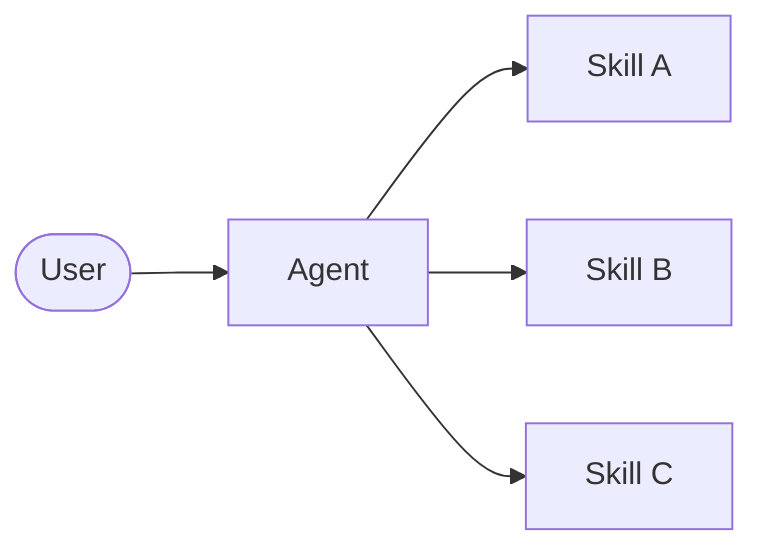

# Skills

In the **skills** architecture, specialized capabilities are packaged as invokable "skills" that augment an **agent's** behavior. Skills are primarily prompt-driven specializations that an agent can invoke on-demand. For built-in skill support, see [Deep Agents](/oss/python/langchain/deep-agents).

> [!TIP]
> This pattern is conceptually identical to [llms.txt](https://llmstxt.org/) (introduced by Jeremy Howard), which uses tool calling for progressive disclosure of documentation. The skills pattern applies the same approach to specialized prompts and domain knowledge rather than just documentation pages.



## Key characteristics

- **Prompt-driven specialization**: Skills are primarily defined by specialized prompts
- **Progressive disclosure**: Skills become available based on context or user needs
- **Team distribution**: Different teams can develop and maintain skills independently
- **Lightweight composition**: Skills are simpler than full sub-agents

## When to use

Use the skills pattern when you want a single **agent** with many possible specializations, you don't need to enforce specific constraints between skills, or different teams need to develop capabilities independently. Common examples include coding assistants (skills for different languages or tasks), knowledge bases (skills for different domains), and creative assistants (skills for different formats).

## Basic implementation

```python
from langchain.tools import tool
from langchain.agents import create_agent

@tool
def load_skill(skill_name: str) -> str:
    """Load a specialized skill prompt.

    Available skills:
    - write_sql: SQL query writing expert
    - review_legal_doc: Legal document reviewer

    Returns the skill's prompt and context.
    """
    # Load skill content from file/database
    ...

agent = create_agent(
    model="gpt-4.1",
    tools=[load_skill],
    system_prompt=(
        "You are a helpful assistant. "
        "You have access to two skills: "
        "write_sql and review_legal_doc. "
        "Use load_skill to access them."
    ),
)
```

For a complete implementation, see the tutorial below.

> **Tutorial: Build a SQL assistant with on-demand skills**
>
> Learn how to implement skills with progressive disclosure, where the agent loads specialized prompts and schemas on-demand rather than upfront.
>
> [Learn more →](https://docs.langchain.com/tutorials/skills)

## Extending the pattern

When writing custom implementations, you can extend the basic skills pattern in several ways:

**Dynamic tool registration**: Combine progressive disclosure with state management to register new tools as skills load. For example, loading a "database_admin" skill could both add specialized context and register database-specific tools (backup, restore, migrate). This uses the same tool-and-state mechanisms used across multi-agent patterns—tools updating state to dynamically change agent capabilities.

**Hierarchical skills**: Skills can define other skills in a tree structure, creating nested specializations. For instance, loading a "data_science" skill might make available sub-skills like "pandas_expert", "visualization", and "statistical_analysis". Each sub-skill can be loaded independently as needed, allowing for fine-grained progressive disclosure of domain knowledge. This hierarchical approach helps manage large knowledge bases by organizing capabilities into logical groupings that can be discovered and loaded on-demand.
