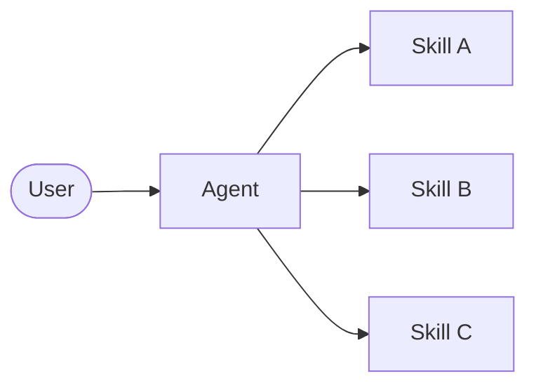

# Skill

**Skill** 아키텍처에서 특화된 기능은 **Agent**의 동작을 강화하는 호출 가능한 "Skill"로 패키징됩니다. Skill은 주로 Agent가 필요에 따라 호출할 수 있는 프롬프트 기반 특화입니다. 기본 제공 Skill 지원에 대해서는 [Deep Agent](/oss/python/langchain/deep-agents)를 참조합니다.

> [!TIP]
> 이 패턴은 개념적으로 Tool 호출을 통한 점진적 문서 공개를 사용하는 [llms.txt](https://llmstxt.org/)(Jeremy Howard가 소개)와 동일합니다. Skill 패턴은 단순한 문서 페이지가 아닌 특화된 프롬프트와 도메인 지식에 동일한 접근 방식을 적용합니다.



## 주요 특성

- **프롬프트 기반 특화**: Skill은 주로 특화된 프롬프트로 정의됩니다
- **점진적 공개**: Skill은 Context 또는 사용자 요구에 기반하여 사용 가능해집니다
- **팀 배분**: 다른 팀은 Skill을 독립적으로 개발하고 유지할 수 있습니다
- **경량 구성**: Skill은 전체 sub-Agent보다 더 간단합니다

## 사용 시기

많은 가능한 특화를 가진 단일 **Agent**가 필요하고, Skill 간에 특정 제약을 적용할 필요가 없거나, 다른 팀이 기능을 독립적으로 개발해야 할 때 Skill 패턴을 사용합니다. 일반적인 예는 코딩 Assistant(다양한 언어 또는 작업을 위한 Skill), 기술 자료(다양한 도메인을 위한 Skill) 및 창의적 Assistant(다양한 형식을 위한 Skill)입니다.

## 기본 구현

```python
from langchain.tools import tool
from langchain.agents import create_agent

@tool
def load_skill(skill_name: str) -> str:
    """특화된 Skill 프롬프트를 로드합니다.

    사용 가능한 Skill:
    - write_sql: SQL 쿼리 작성 전문가
    - review_legal_doc: 법률 문서 검토자

    Skill의 프롬프트와 Context를 반환합니다.
    """
    # 파일/데이터베이스에서 Skill 콘텐츠 로드
    ...

agent = create_agent(
    model="gpt-4.1",
    tools=[load_skill],
    system_prompt=(
        "You are a helpful assistant. "
        "You have access to two skills: "
        "write_sql and review_legal_doc. "
        "Use load_skill to access them."
    ),
)
```

완전한 구현은 아래 튜토리얼을 참조합니다.

> **튜토리얼: 온디맨드 Skill로 SQL Assistant 구축하기**
>
> Agent가 선행적으로 특화된 프롬프트와 스키마를 로드하는 점진적 공개와 함께 Skill을 구현하는 방법을 알아봅니다.
>
> [자세히 알아보기 →](https://docs.langchain.com/tutorials/skills)

## 패턴 확장

사용자 정의 구현을 작성할 때 기본 Skill 패턴을 여러 가지 방식으로 확장할 수 있습니다:

**동적 Tool 등록**: 점진적 공개와 상태 관리를 결합하여 Skill이 로드될 때 새로운 Tool을 등록합니다. 예를 들어 "database_admin" Skill을 로드하면 특화된 Context를 추가하고 데이터베이스 특정 Tool(백업, 복원, 마이그레이션)을 등록할 수 있습니다. 이는 다중 Agent 패턴에 사용되는 동일한 Tool 및 상태 메커니즘을 사용합니다 - Tool이 Agent 기능을 동적으로 변경하도록 상태를 업데이트합니다.

**계층 구조 Skill**: Skill은 트리 구조의 다른 Skill을 정의할 수 있으므로 중첩된 특화를 만듭니다. 예를 들어 "data_science" Skill을 로드하면 "pandas_expert", "visualization" 및 "statistical_analysis"와 같은 sub-Skill을 사용할 수 있습니다. 각 sub-Skill은 필요에 따라 독립적으로 로드될 수 있으므로 도메인 지식의 미세한 점진적 공개가 가능합니다. 이 계층 구조 접근 방식은 기능을 논리적 그룹화로 조직하고 온디맨드로 검색 및 로드할 수 있도록 함으로써 대규모 기술 자료를 관리하는 데 도움이 됩니다.
