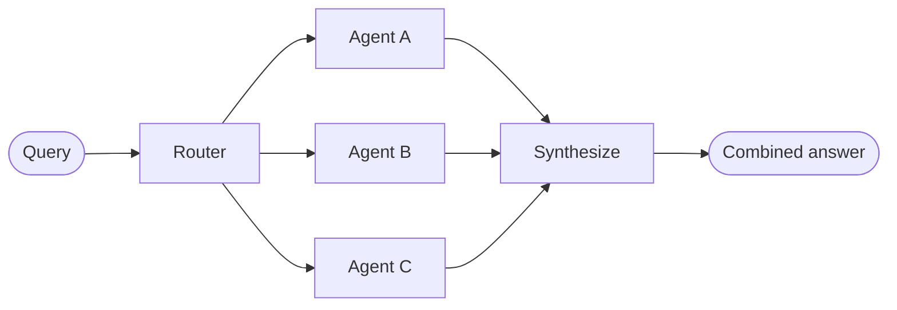

# Router

In the **router** architecture, a routing step classifies input and directs it to specialized **agents**. This is useful when you have distinct **verticals**—separate knowledge domains that each require their own agent.



## Key characteristics

- Router decomposes the query
- Zero or more specialized agents are invoked in parallel
- Results are synthesized into a coherent response

## When to use

Use the router pattern when you have distinct verticals (separate knowledge domains that each require their own agent), need to query multiple sources in parallel, and want to synthesize results into a combined response.

## Basic implementation

The router classifies the query and directs it to the appropriate agent(s). Use `Command` for single-agent routing or `Send` for parallel fan-out to multiple agents.

#### Single agent

Use `Command` to route to a single specialized agent:

```python
from langgraph.types import Command

def classify_query(query: str) -> str:
    """Use LLM to classify query and determine the appropriate agent."""
    # Classification logic here
    ...

def route_query(state: State) -> Command:
    """Route to the appropriate agent based on query classification."""
    active_agent = classify_query(state["query"])

    # Route to the selected agent
    return Command(goto=active_agent)
```

#### Multiple agents (parallel)

Use `Send` to fan out to multiple specialized agents in parallel:

```python
from typing import TypedDict
from langgraph.types import Send

class ClassificationResult(TypedDict):
    query: str
    agent: str

def classify_query(query: str) -> list[ClassificationResult]:
    """Use LLM to classify query and determine which agents to invoke."""
    # Classification logic here
    ...

def route_query(state: State):
    """Route to relevant agents based on query classification."""
    classifications = classify_query(state["query"])

    # Fan out to selected agents in parallel
    return [
        Send(c["agent"], {"query": c["query"]})
        for c in classifications
    ]
```

For a complete implementation, see the tutorial below.

> **Tutorial: Build a multi-source knowledge base with routing**
>
> Build a router that queries GitHub, Notion, and Slack in parallel, then synthesizes results into a coherent answer. Covers state definition, specialized agents, parallel execution with Send, and result synthesis.

## Stateless vs. stateful

Two approaches:

- **Stateless** routers address each request independently
- **Stateful** routers maintain conversation history across requests

### Stateless

Each request is routed independently—no memory between calls. For multi-turn conversations, see [Stateful](#stateful) routers.

> [!INFO]
> **Router vs. Subagents**: Both patterns can dispatch work to multiple agents, but they differ in how routing decisions are made:
>
> - **Router**: A dedicated routing step (often a single LLM call or rule-based logic) that classifies the input and dispatches to agents. The router itself typically doesn't maintain conversation history or perform multi-turn orchestration—it's a preprocessing step.
> - **Subagents**: An main supervisor agent dynamically decides which subagents to call as part of an ongoing conversation. The main agent maintains context, can call multiple subagents across turns, and orchestrates complex multi-step workflows.
>
> Use a router when you have clear input categories and want deterministic or lightweight classification. Use a supervisor when you need flexible, conversation-aware orchestration where the LLM decides what to do next based on evolving context.

### Stateful

For multi-turn conversations, you need to maintain context across invocations.

#### Tool wrapper

The simplest approach: wrap the stateless router as a tool that a conversational agent can call. The conversational agent handles memory and context; the router stays stateless. This avoids the complexity of managing conversation history across multiple parallel agents.

```python
@tool
def search_docs(query: str) -> str:
    """Search across multiple documentation sources."""
    result = workflow.invoke({"query": query})
    return result["final_answer"]

# Conversational agent uses the router as a tool
conversational_agent = create_agent(
    model,
    tools=[search_docs],
    prompt="You are a helpful assistant. Use search_docs to answer questions."
)
```

#### Full persistence

If you need the router itself to maintain state, use persistence to store message history. When routing to an agent, fetch previous messages from state and selectively include them in the agent's context—this is a lever for [context engineering](/oss/python/langchain/context-engineering).

> [!TIP]
> **Stateful routers require custom history management.** If the router switches between agents across turns, conversations may not feel fluid to end users when agents have different tones or prompts. With parallel invocation, you'll need to maintain history at the router level (inputs and synthesized outputs) and leverage this history in routing logic. Consider the [handoffs](/oss/python/langchain/multi-agent/handoffs) pattern or [subagents](/oss/python/langchain/multi-agent/subagents) pattern instead—both provide clearer semantics for multi-turn conversations.
