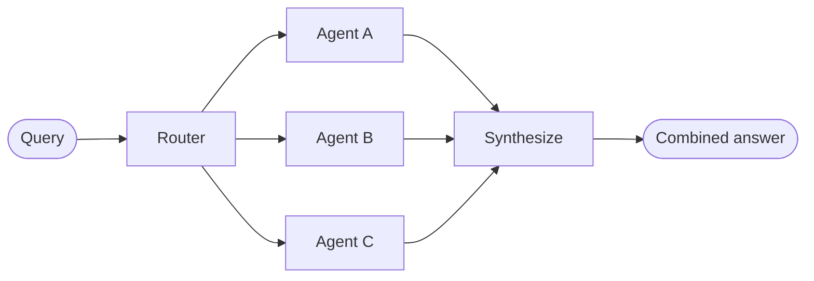

# Router

**router** 아키텍처에서 라우팅 단계는 입력을 분류하고 특화된 **Agent**로 지시합니다. 이는 각각 자신의 Agent가 필요한 서로 다른 **수직선**을 가지고 있을 때 유용합니다.



## 주요 특성

- Router가 쿼리를 분해합니다
- 0개 이상의 특화된 Agent가 병렬로 호출됩니다
- 결과는 일관된 응답으로 종합됩니다

## 언제 사용할 것인가

서로 다른 수직선 (각각 자신의 Agent가 필요한 별도의 지식 도메인)이 있을 때, 여러 소스를 병렬로 쿼리해야 할 때, 결과를 결합된 응답으로 종합하고 싶을 때 Router 패턴을 사용합니다.

## 기본 구현

Router는 쿼리를 분류하고 적절한 Agent로 지시합니다. 단일 Agent 라우팅의 경우 `Command`를 사용하거나 여러 Agent로의 병렬 전파의 경우 `Send`를 사용합니다.

#### 단일 Agent

`Command`를 사용하여 단일 특화된 Agent로 라우팅합니다:

```python
from langgraph.types import Command

def classify_query(query: str) -> str:
    """LLM을 사용하여 쿼리를 분류하고 적절한 Agent를 결정합니다."""
    # 분류 로직은 여기입니다
    ...

def route_query(state: State) -> Command:
    """쿼리 분류를 기반으로 적절한 Agent로 라우팅합니다."""
    active_agent = classify_query(state["query"])

    # 선택된 Agent로 라우팅합니다
    return Command(goto=active_agent)
```

#### 다중 Agent (병렬)

`Send`를 사용하여 여러 특화된 Agent로 병렬 전파합니다:

```python
from typing import TypedDict
from langgraph.types import Send

class ClassificationResult(TypedDict):
    query: str
    agent: str

def classify_query(query: str) -> list[ClassificationResult]:
    """LLM을 사용하여 쿼리를 분류하고 호출할 Agent를 결정합니다."""
    # 분류 로직은 여기입니다
    ...

def route_query(state: State):
    """쿼리 분류를 기반으로 관련 Agent로 라우팅합니다."""
    classifications = classify_query(state["query"])

    # 선택된 Agent로 병렬 전파합니다
    return [
        Send(c["agent"], {"query": c["query"]})
        for c in classifications
    ]
```

완전한 구현은 아래 자습서를 참조하세요.

> **자습서: 라우팅을 사용하는 다중 소스 지식 기반 구성**
>
> GitHub, Notion, Slack을 병렬로 쿼리하고 결과를 일관된 답변으로 종합하는 Router를 구성합니다. 상태 정의, 특화된 Agent, Send를 사용한 병렬 실행, 결과 종합을 다룹니다.

## 상태 비저장 대 상태 저장

두 가지 접근 방식이 있습니다:

- **상태 비저장** Router는 각 요청을 독립적으로 처리합니다
- **상태 저장** Router는 요청 간 대화 기록을 유지합니다

### 상태 비저장

각 요청은 독립적으로 라우팅됩니다. 호출 간 메모리가 없습니다. 다중 턴 대화의 경우 [상태 저장](#상태-저장) Router를 참조하세요.

> [!정보]
> **Router 대 Subagent**: 두 패턴 모두 여러 Agent로 작업을 분배할 수 있지만, 라우팅 결정이 어떻게 이루어지는지가 다릅니다:
>
> - **Router**: 입력을 분류하고 Agent로 전파하는 전용 라우팅 단계 (종종 단일 LLM 호출 또는 규칙 기반 논리). Router 자체는 일반적으로 대화 기록을 유지하거나 다중 턴 오케스트레이션을 수행하지 않습니다. 이는 전처리 단계입니다.
> - **Subagent**: 메인 감독자 Agent가 진행 중인 대화의 일부로 호출할 subagent를 동적으로 결정합니다. 메인 Agent는 컨텍스트를 유지하고, 턴 간에 여러 subagent를 호출할 수 있으며, 복잡한 다단계 워크플로를 오케스트레이션합니다.
>
> 명확한 입력 범주가 있고 결정론적이거나 경량 분류를 원할 때 Router를 사용합니다. 유연한 대화 인식 오케스트레이션이 필요하고 LLM이 진화하는 컨텍스트를 기반으로 다음 작업을 결정해야 할 때는 감독자를 사용합니다.

### 상태 저장

다중 턴 대화의 경우 호출 간 컨텍스트를 유지해야 합니다.

#### Tool 래퍼

가장 간단한 접근 방식: 상태 비저장 Router를 대화형 Agent가 호출할 수 있는 Tool로 래핑합니다. 대화형 Agent가 메모리와 컨텍스트를 처리합니다. Router는 상태 비저장 상태를 유지합니다. 이렇게 하면 여러 병렬 Agent 간에 대화 기록을 관리하는 복잡성을 피할 수 있습니다.

```python
@tool
def search_docs(query: str) -> str:
    """여러 문서 소스에서 검색합니다."""
    result = workflow.invoke({"query": query})
    return result["final_answer"]

# 대화형 Agent가 Router를 Tool로 사용합니다
conversational_agent = create_agent(
    model,
    tools=[search_docs],
    prompt="You are a helpful assistant. Use search_docs to answer questions."
)
```

#### 전체 영속성

Router 자체가 상태를 유지해야 하는 경우 영속성을 사용하여 메시지 기록을 저장합니다. Agent로 라우팅할 때 상태에서 이전 메시지를 가져오고 선택적으로 Agent의 컨텍스트에 포함합니다. 이것은 [컨텍스트 엔지니어링](/oss/python/langchain/context-engineering)의 레버입니다.

> [!팁]
> **상태 저장 Router는 커스텀 기록 관리가 필요합니다.** Router가 턴 간에 Agent 간에 전환하면 Agent가 다른 톤이나 프롬프트를 가질 때 대화가 최종 사용자에게 유동적이지 않을 수 있습니다. 병렬 호출의 경우 Router 수준에서 기록을 유지하고 (입력 및 종합된 출력) 라우팅 논리에서 이 기록을 활용해야 합니다. 대신 [handoff](/oss/python/langchain/multi-agent/handoffs) 패턴이나 [subagent](/oss/python/langchain/multi-agent/subagents) 패턴을 고려하세요. 둘 다 다중 턴 대화에 대해 명확한 의미를 제공합니다.
