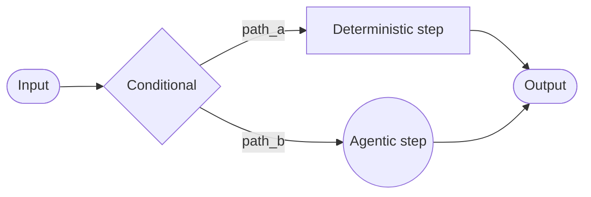
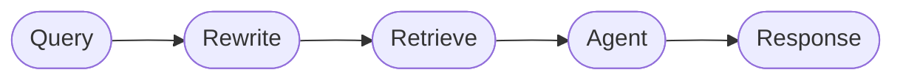

# 커스텀 워크플로

**커스텀 워크플로** 아키텍처에서 LangGraph를 사용하여 자신의 맞춤형 실행 흐름을 정의합니다. 그래프 구조에 완전히 제어할 수 있습니다. 순차 단계, 조건부 분기, 루프, 병렬 실행을 포함합니다.



## 주요 특성

- 그래프 구조에 완전히 제어
- 결정론적 논리와 Agent 동작을 혼합
- 순차 단계, 조건부 분기, 루프, 병렬 실행 지원
- 워크플로의 노드로 다른 패턴을 포함

## 언제 사용할 것인가

표준 패턴 (subagent, Skill 등)이 요구 사항에 맞지 않을 때, 결정론적 논리와 Agent 동작을 혼합해야 할 때, 또는 복잡한 라우팅이나 다단계 처리가 필요할 때 커스텀 워크플로를 사용합니다.

워크플로의 각 노드는 간단한 함수, LLM 호출, 또는 **Tool**을 가진 전체 **Agent**가 될 수 있습니다. 또한 커스텀 워크플로 내에서 다른 아키텍처를 구성할 수 있습니다. 예를 들어, 다중 Agent 시스템을 단일 노드로 포함할 수 있습니다.

완전한 커스텀 워크플로 예제는 아래 자습서를 참조하세요.

> **자습서: 라우팅을 사용하는 다중 소스 지식 기반 구성**
>
> Router 패턴은 커스텀 워크플로의 예제입니다. 이 자습서는 GitHub, Notion, Slack을 병렬로 쿼리하고 결과를 종합하는 Router를 구성하는 과정을 설명합니다.
>
> [자세히 알아보기 →](https://docs.langchain.com/tutorials/router)

## 기본 구현

핵심 통찰력은 LangChain Agent를 LangGraph 노드 내에서 직접 호출할 수 있다는 것입니다. 커스텀 워크플로의 유연성과 미리 구축된 Agent의 편의를 결합합니다:

```python
from langchain.agents import create_agent
from langgraph.graph import StateGraph, START, END

agent = create_agent(model="openai:gpt-4.1", tools=[...])

def agent_node(state: State) -> dict:
    """LangChain Agent를 호출하는 LangGraph 노드입니다."""
    result = agent.invoke({
        "messages": [{"role": "user", "content": state["query"]}]
    })
    return {"answer": result["messages"][-1].content}

# 간단한 워크플로 구성
workflow = (
    StateGraph(State)
    .add_node("agent", agent_node)
    .add_edge(START, "agent")
    .add_edge("agent", END)
    .compile()
)
```

## 예제: RAG 파이프라인

일반적인 사용 사례는 검색을 Agent와 결합하는 것입니다. 이 예제는 지식 기반에서 검색하고 라이브 뉴스를 가져올 수 있는 WNBA 통계 어시스턴트를 구축합니다.

<details>
<summary>커스텀 RAG 워크플로</summary>

워크플로는 세 가지 유형의 노드를 보여줍니다:

- **모델 노드 (Rewrite)**: 구조화된 출력을 사용하여 더 나은 검색을 위해 사용자 쿼리를 다시 작성합니다.
- **결정론적 노드 (Retrieve)**: 벡터 유사성 검색을 수행합니다. LLM이 포함되지 않습니다.
- **Agent 노드 (Agent)**: 검색된 컨텍스트를 추론하고 Tool을 통해 추가 정보를 가져올 수 있습니다.



LangGraph 상태를 사용하여 워크플로 단계 간에 정보를 전달할 수 있습니다. 이렇게 하면 워크플로의 각 부분이 구조화된 필드를 읽고 업데이트할 수 있으므로 노드 간에 데이터와 컨텍스트를 쉽게 공유할 수 있습니다.

```python
from typing import TypedDict
from pydantic import BaseModel
from langgraph.graph import StateGraph, START, END
from langchain.agents import create_agent
from langchain.tools import tool
from langchain_openai import ChatOpenAI, OpenAIEmbeddings
from langchain_core.vectorstores import InMemoryVectorStore

class State(TypedDict):
    question: str
    rewritten_query: str
    documents: list[str]
    answer: str

# 로스터, 경기 결과, 선수 통계를 포함한 WNBA 지식 기반
embeddings = OpenAIEmbeddings()
vector_store = InMemoryVectorStore(embeddings)
vector_store.add_texts([
    # 로스터
    "New York Liberty 2024 roster: Breanna Stewart, Sabrina Ionescu, Jonquel Jones, Courtney Vandersloot.",
    "Las Vegas Aces 2024 roster: A'ja Wilson, Kelsey Plum, Jackie Young, Chelsea Gray.",
    "Indiana Fever 2024 roster: Caitlin Clark, Aliyah Boston, Kelsey Mitchell, NaLyssa Smith.",
    # 경기 결과
    "2024 WNBA Finals: New York Liberty defeated Minnesota Lynx 3-2 to win the championship.",
    "June 15, 2024: Indiana Fever 85, Chicago Sky 79. Caitlin Clark had 23 points and 8 assists.",
    "August 20, 2024: Las Vegas Aces 92, Phoenix Mercury 84. A'ja Wilson scored 35 points.",
    # 선수 통계
    "A'ja Wilson 2024 season stats: 26.9 PPG, 11.9 RPG, 2.6 BPG. Won MVP award.",
    "Caitlin Clark 2024 rookie stats: 19.2 PPG, 8.4 APG, 5.7 RPG. Won Rookie of the Year.",
    "Breanna Stewart 2024 stats: 20.4 PPG, 8.5 RPG, 3.5 APG.",
])

retriever = vector_store.as_retriever(search_kwargs={"k": 5})

@tool
def get_latest_news(query: str) -> str:
    """WNBA의 최신 뉴스 및 업데이트를 가져옵니다."""
    # 뉴스 API는 여기입니다
    return "Latest: The WNBA announced expanded playoff format for 2025..."

agent = create_agent(
    model="openai:gpt-4.1",
    tools=[get_latest_news],
)

model = ChatOpenAI(model="gpt-4.1")

class RewrittenQuery(BaseModel):
    query: str

def rewrite_query(state: State) -> dict:
    """더 나은 검색을 위해 사용자 쿼리를 다시 작성합니다."""
    system_prompt = """이 쿼리를 다시 작성하여 관련 WNBA 정보를 검색합니다.
지식 기반에는 다음이 포함됩니다: 팀 로스터, 스코어가 있는 경기 결과, 선수 통계 (PPG, RPG, APG).
언급된 특정 선수 이름, 팀 이름, 또는 통계 범주에 초점을 맞춥니다."""

    response = model.with_structured_output(RewrittenQuery).invoke([
        {"role": "system", "content": system_prompt},
        {"role": "user", "content": state["question"]}
    ])
    return {"rewritten_query": response.query}

def retrieve(state: State) -> dict:
    """다시 작성된 쿼리를 기반으로 문서를 검색합니다."""
    docs = retriever.invoke(state["rewritten_query"])
    return {"documents": [doc.page_content for doc in docs]}

def call_agent(state: State) -> dict:
    """검색된 컨텍스트를 사용하여 답변을 생성합니다."""
    context = "\n\n".join(state["documents"])
    prompt = f"Context:\n{context}\n\nQuestion: {state['question']}"
    response = agent.invoke({"messages": [{"role": "user", "content": prompt}]})
    return {"answer": response["messages"][-1].content_blocks}

workflow = (
    StateGraph(State)
    .add_node("rewrite", rewrite_query)
    .add_node("retrieve", retrieve)
    .add_node("agent", call_agent)
    .add_edge(START, "rewrite")
    .add_edge("rewrite", "retrieve")
    .add_edge("retrieve", "agent")
    .add_edge("agent", END)
    .compile()
)

result = workflow.invoke({"question": "Who won the 2024 WNBA Championship?"})
print(result["answer"])
```

</details>
