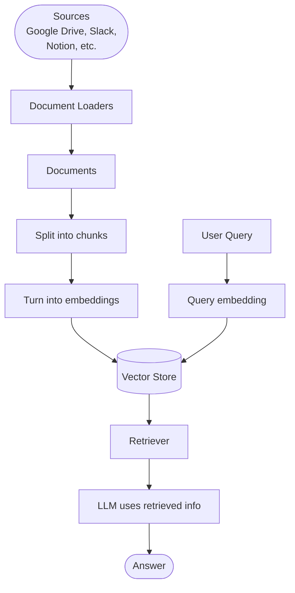
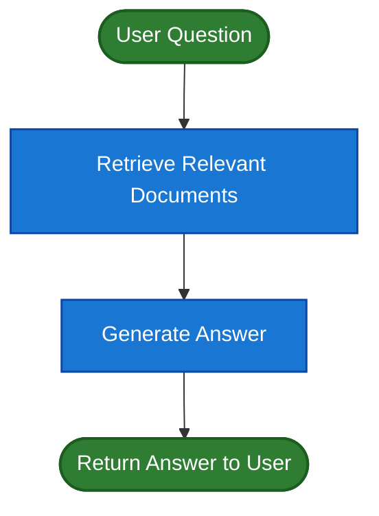
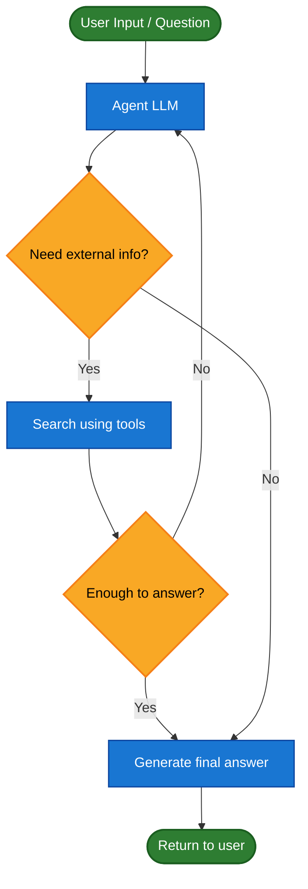
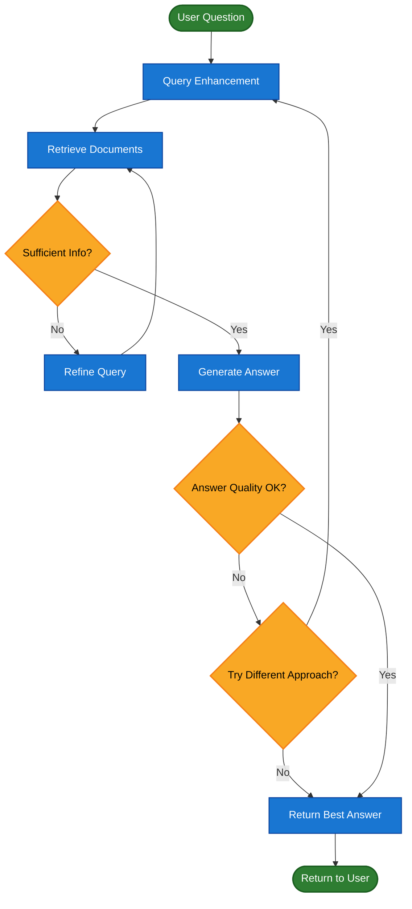

# Retrieval

Large Language Models (LLMs) are powerful, but they have two key limitations:

- **Finite context** — they can't ingest entire corpora at once.
- **Static knowledge** — their training data is frozen at a point in time.

Retrieval addresses these problems by fetching relevant external knowledge at query time. This is the foundation of **Retrieval-Augmented Generation (RAG)**: enhancing an LLM's answers with context-specific information.

## Building a knowledge base

A **knowledge base** is a repository of documents or structured data used during retrieval.

If you need a custom knowledge base, you can use LangChain's [document loaders](https://python.langchain.com/docs/concepts/document_loaders/) and [vector stores](https://python.langchain.com/docs/concepts/vectorstores/) to build one from your own data.

> [!INFO]
> If you already have a knowledge base (e.g., a SQL database, CRM, or internal documentation system), you do **not** need to rebuild it. You can:
> - Connect it as a **tool** for an agent in [Agentic RAG](#agentic-rag).
> - Query it and supply the retrieved content as context to the LLM ([2-Step RAG](#2-step-rag)).

See the following tutorial to build a searchable knowledge base and minimal RAG workflow:

> **Tutorial: Semantic search**
>
> Learn how to create a searchable knowledge base from your own data using LangChain's document loaders, embeddings, and vector stores. In this tutorial, you'll build a search engine over a PDF, enabling retrieval of passages relevant to a query. You'll also implement a minimal RAG workflow on top of this engine to see how external knowledge can be integrated into LLM reasoning.
>
> [Learn more](https://python.langchain.com/docs/tutorials/retrievers/)

## From retrieval to RAG

Retrieval allows LLMs to access relevant context at runtime. But most real-world applications go one step further: they integrate retrieval with generation to produce grounded, context-aware answers.

This is the core idea behind **Retrieval-Augmented Generation (RAG)**. The retrieval pipeline becomes a foundation for a broader system that combines search with generation.

### Retrieval pipeline

A typical retrieval workflow looks like this:



Each component is modular: you can swap loaders, splitters, embeddings, or vector stores without rewriting the app's logic.

### Building blocks

| Component | Description | Learn more |
|-----------|-------------|------------|
| **Document loaders** | Ingest data from external sources (Google Drive, Slack, Notion, etc.), returning standardized `Document` objects. | [Learn more](https://python.langchain.com/docs/concepts/document_loaders/) |
| **Text splitters** | Break large docs into smaller chunks that will be retrievable individually and fit within a model's context window. | [Learn more](https://python.langchain.com/docs/concepts/text_splitters/) |
| **Embedding models** | An embedding model turns text into a vector of numbers so that texts with similar meaning land close together in that vector space. | [Learn more](https://python.langchain.com/docs/concepts/embedding_models/) |
| **Vector stores** | Specialized databases for storing and searching embeddings. | [Learn more](https://python.langchain.com/docs/concepts/vectorstores/) |
| **Retrievers** | A retriever is an interface that returns documents given an unstructured query. | [Learn more](https://python.langchain.com/docs/concepts/retrievers/) |

## RAG architectures

RAG can be implemented in multiple ways, depending on your system's needs. We outline each type in the sections below.

| Architecture | Description | Control | Flexibility | Latency | Example Use Case |
|--------------|-------------|---------|-------------|---------|------------------|
| 2-Step RAG | Retrieval always happens before generation. Simple and predictable | ✅ High | ❌ Low | ⚡ Fast | FAQs, documentation bots |
| Agentic RAG | An LLM-powered agent decides when and how to retrieve during reasoning | ❌ Low | ✅ High | ⏳ Variable | Research assistants with access to multiple tools |
| Hybrid | Combines characteristics of both approaches with validation steps | ⚖️ Medium | ⚖️ Medium | ⏳ Variable | Domain-specific Q&A with quality validation |

> [!INFO]
> **Latency**: Latency is generally more predictable in 2-Step RAG, as the maximum number of LLM calls is known and capped. This predictability assumes that LLM inference time is the dominant factor. However, real-world latency may also be affected by the performance of retrieval steps—such as API response times, network delays, or database queries—which can vary based on the tools and infrastructure in use.

### 2-step RAG

In 2-Step RAG, the retrieval step is always executed before the generation step. This architecture is straightforward and predictable, making it suitable for many applications where the retrieval of relevant documents is a clear prerequisite for generating an answer.



> **Tutorial: Retrieval-Augmented Generation (RAG)**
>
> See how to build a Q&A chatbot that can answer questions grounded in your data using Retrieval-Augmented Generation. This tutorial walks through two approaches: A RAG agent that runs searches with a flexible tool—great for general-purpose use. A 2-step RAG chain that requires just one LLM call per query—fast and efficient for simpler tasks.
>
> [Learn more](https://python.langchain.com/docs/tutorials/rag/)

### Agentic RAG

Agentic Retrieval-Augmented Generation (RAG) combines the strengths of Retrieval-Augmented Generation with agent-based reasoning. Instead of retrieving documents before answering, an agent (powered by an LLM) reasons step-by-step and decides when and how to retrieve information during the interaction.

The only thing an agent needs to enable RAG behavior is access to one or more tools that can fetch external knowledge — such as documentation loaders, web APIs, or database queries.



```python
import requests
from langchain.tools import tool
from langchain.chat_models import init_chat_model
from langchain.agents import create_agent

@tool
def fetch_url(url: str) -> str:
    """Fetch text content from a URL"""
    response = requests.get(url, timeout=10.0)
    response.raise_for_status()
    return response.text

system_prompt = """\
Use fetch_url when you need to fetch information from a web-page; quote relevant snippets.
"""

agent = create_agent(
    model="claude-sonnet-4-5-20250929",
    tools=[fetch_url],  # A tool for retrieval
    system_prompt=system_prompt,
)
```

<details>
<summary>Show Extended example: Agentic RAG for LangGraph's llms.txt</summary>

This example implements an Agentic RAG system to assist users in querying LangGraph documentation. The agent begins by loading llms.txt, which lists available documentation URLs, and can then dynamically use a fetch_documentation tool to retrieve and process the relevant content based on the user's question.

```python
import requests
from langchain.agents import create_agent
from langchain.messages import HumanMessage
from langchain.tools import tool
from markdownify import markdownify

ALLOWED_DOMAINS = ["https://langchain-ai.github.io/"]
LLMS_TXT = 'https://langchain-ai.github.io/langgraph/llms.txt'

@tool
def fetch_documentation(url: str) -> str:
    """Fetch and convert documentation from a URL"""
    if not any(url.startswith(domain) for domain in ALLOWED_DOMAINS):
        return (
            "Error: URL not allowed. "
            f"Must start with one of: {', '.join(ALLOWED_DOMAINS)}"
        )
    response = requests.get(url, timeout=10.0)
    response.raise_for_status()
    return markdownify(response.text)

# We will fetch the content of llms.txt, so this can
# be done ahead of time without requiring an LLM request.
llms_txt_content = requests.get(LLMS_TXT).text

# System prompt for the agent
system_prompt = f"""
You are an expert Python developer and technical assistant.
Your primary role is to help users with questions about LangGraph and related tools.

Instructions:
1. If a user asks a question you're unsure about — or one that likely involves API usage,
   behavior, or configuration — you MUST use the `fetch_documentation` tool to consult
   the relevant docs.
2. When citing documentation, summarize clearly and include relevant context from the content.
3. Do not use any URLs outside of the allowed domain.
4. If a documentation fetch fails, tell the user and proceed with your best expert understanding.

You can access official documentation from the following approved sources:

{llms_txt_content}

You MUST consult the documentation to get up to date documentation before answering a user's
question about LangGraph.

Your answers should be clear, concise, and technically accurate.
"""

tools = [fetch_documentation]

model = init_chat_model("claude-sonnet-4-0", max_tokens=32_000)

agent = create_agent(
    model=model,
    tools=tools,
    system_prompt=system_prompt,
    name="Agentic RAG",
)

response = agent.invoke({
    'messages': [
        HumanMessage(content=(
            "Write a short example of a langgraph agent using the "
            "prebuilt create react agent. the agent should be able "
            "to look up stock pricing information."
        ))
    ]
})

print(response['messages'][-1].content)
```

</details>

> **Tutorial: Retrieval-Augmented Generation (RAG)**
>
> See how to build a Q&A chatbot that can answer questions grounded in your data using Retrieval-Augmented Generation. This tutorial walks through two approaches: A RAG agent that runs searches with a flexible tool—great for general-purpose use. A 2-step RAG chain that requires just one LLM call per query—fast and efficient for simpler tasks.
>
> [Learn more](https://python.langchain.com/docs/tutorials/rag/)

### Hybrid RAG

Hybrid RAG combines characteristics of both 2-Step and Agentic RAG. It introduces intermediate steps such as query preprocessing, retrieval validation, and post-generation checks. These systems offer more flexibility than fixed pipelines while maintaining some control over execution.

Typical components include:

- **Query enhancement**: Modify the input question to improve retrieval quality. This can involve rewriting unclear queries, generating multiple variations, or expanding queries with additional context.
- **Retrieval validation**: Evaluate whether retrieved documents are relevant and sufficient. If not, the system may refine the query and retrieve again.
- **Answer validation**: Check the generated answer for accuracy, completeness, and alignment with source content. If needed, the system can regenerate or revise the answer.

The architecture often supports multiple iterations between these steps:



This architecture is suitable for:

- Applications with ambiguous or underspecified queries
- Systems that require validation or quality control steps
- Workflows involving multiple sources or iterative refinement

> **Tutorial: Agentic RAG with Self-Correction**
>
> An example of Hybrid RAG that combines agentic reasoning with retrieval and self-correction.
>
> [Learn more](https://langchain-ai.github.io/langgraph/tutorials/rag/langgraph_agentic_rag/)
