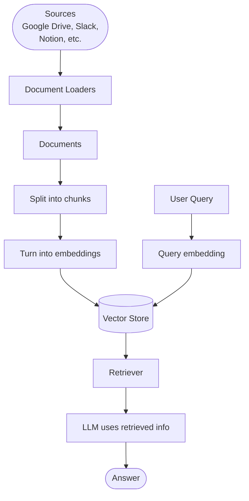
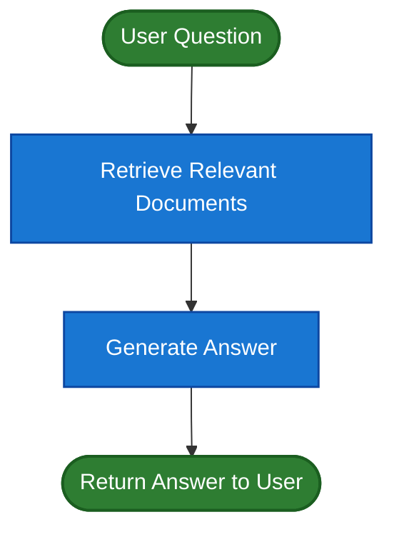
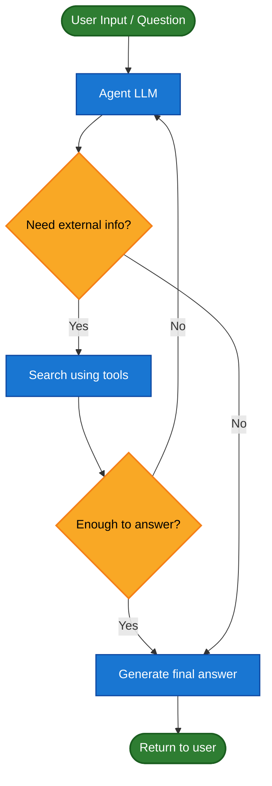
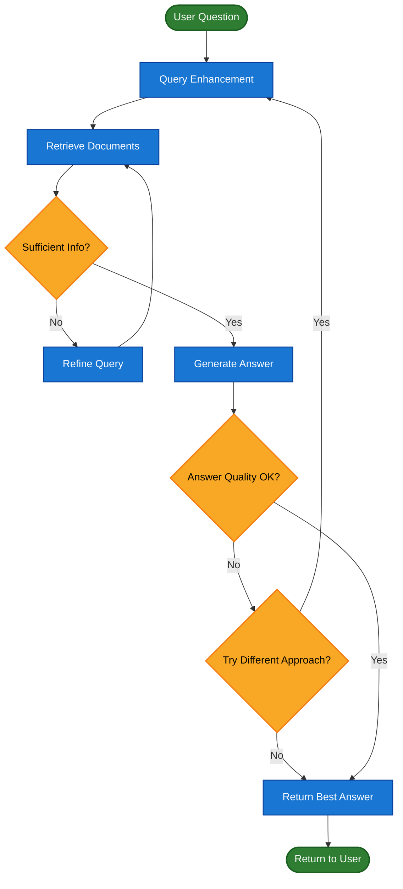

# 검색

큰 언어 모델 (LLM)은 강력하지만 두 가지 주요 제한이 있습니다:

- **유한한 컨텍스트** — 전체 말뭉치를 한 번에 수집할 수 없습니다.
- **정적 지식** — 훈련 데이터는 특정 시점에서 고정되어 있습니다.

검색은 쿼리 시간에 관련 외부 지식을 가져와 이 문제를 해결합니다. 이것은 **검색 증강 생성 (RAG)**의 기초입니다: LLM의 답변을 컨텍스트별 정보로 강화합니다.

## 지식 기반 구축

**지식 기반**은 검색 중에 사용되는 문서 또는 구조화된 데이터의 저장소입니다.

커스텀 지식 기반이 필요한 경우 LangChain의 [문서 로더](https://python.langchain.com/docs/concepts/document_loaders/)와 [벡터 스토어](https://python.langchain.com/docs/concepts/vectorstores/)를 사용하여 자신의 데이터로 구축할 수 있습니다.

> [!정보]
> 이미 지식 기반이 있는 경우 (예: SQL 데이터베이스, CRM, 또는 내부 문서 시스템) [재구축할 필요가 없습니다]. 다음을 수행할 수 있습니다:
> - [Agentic RAG](#agentic-rag)에서 Agent의 **Tool**로 연결합니다.
> - 쿼리하고 검색된 컨텐츠를 LLM에 대한 컨텍스트로 제공합니다 ([2단계 RAG](#2단계-rag)).

검색 가능한 지식 기반과 최소 RAG 워크플로를 구축하려면 다음 자습서를 참조하세요:

> **자습서: 의미론적 검색**
>
> LangChain의 문서 로더, 임베딩, 벡터 스토어를 사용하여 자신의 데이터로 검색 가능한 지식 기반을 만드는 방법을 알아봅니다. 이 자습서에서는 PDF에 대한 검색 엔진을 구축하여 쿼리와 관련된 구절을 검색할 수 있도록 합니다. 또한 이 엔진 위에 최소 RAG 워크플로를 구현하여 외부 지식이 LLM 추론에 어떻게 통합되는지 확인합니다.
>
> [자세히 알아보기](https://python.langchain.com/docs/tutorials/retrievers/)

## 검색에서 RAG로

검색을 통해 LLM은 런타임에 관련 컨텍스트에 접근할 수 있습니다. 하지만 대부분의 실제 애플리케이션은 한 단계 더 나아갑니다: 검색과 생성을 통합하여 근거 있고 컨텍스트 인식 답변을 생성합니다.

이것이 **검색 증강 생성 (RAG)**의 핵심 아이디어입니다. 검색 파이프라인은 검색과 생성을 결합하는 더 큰 시스템의 기초가 됩니다.

### 검색 파이프라인

일반적인 검색 워크플로는 다음과 같습니다:



각 구성 요소는 모듈식입니다: 앱의 논리를 다시 작성하지 않고 로더, 스플리터, 임베딩 또는 벡터 스토어를 바꿀 수 있습니다.

### 구성 요소

| 구성 요소 | 설명 | 자세히 알아보기 |
|-----------|-------------|------------|
| **문서 로더** | 외부 소스 (Google Drive, Slack, Notion 등)에서 데이터를 수집하여 표준화된 `Document` 객체를 반환합니다. | [자세히 알아보기](https://python.langchain.com/docs/concepts/document_loaders/) |
| **텍스트 스플리터** | 큰 문서를 개별적으로 검색 가능하고 모델의 컨텍스트 윈도우에 맞는 더 작은 청크로 나눕니다. | [자세히 알아보기](https://python.langchain.com/docs/concepts/text_splitters/) |
| **임베딩 모델** | 임베딩 모델은 텍스트를 숫자 벡터로 변환하여 의미가 유사한 텍스트가 벡터 공간에서 가까이 위치하도록 합니다. | [자세히 알아보기](https://python.langchain.com/docs/concepts/embedding_models/) |
| **벡터 스토어** | 임베딩을 저장하고 검색하기 위한 특화된 데이터베이스입니다. | [자세히 알아보기](https://python.langchain.com/docs/concepts/vectorstores/) |
| **Retriever** | Retriever는 구조화되지 않은 쿼리가 주어질 때 문서를 반환하는 인터페이스입니다. | [자세히 알아보기](https://python.langchain.com/docs/concepts/retrievers/) |

## RAG 아키텍처

RAG는 시스템의 요구 사항에 따라 여러 방식으로 구현할 수 있습니다. 각 유형을 아래 섹션에서 설명합니다.

| 아키텍처 | 설명 | 제어 | 유연성 | 지연 시간 | 사용 사례 예 |
|--------------|-------------|---------|-------------|---------|------------------|
| 2단계 RAG | 검색은 항상 생성 전에 수행됩니다. 간단하고 예측 가능합니다 | ✅ 높음 | ❌ 낮음 | ⚡ 빠름 | FAQ, 문서 봇 |
| Agentic RAG | LLM 기반 Agent가 추론 중에 언제 어떻게 검색할지 결정합니다 | ❌ 낮음 | ✅ 높음 | ⏳ 변동 | 여러 Tool에 접근할 수 있는 연구 어시스턴트 |
| 하이브리드 | 검증 단계와 함께 두 접근 방식의 특성을 결합합니다 | ⚖️ 중간 | ⚖️ 중간 | ⏳ 변동 | 품질 검증이 있는 도메인별 Q&A |

> [!정보]
> **지연 시간**: 지연 시간은 일반적으로 2단계 RAG에서 더 예측 가능합니다. LLM 호출의 최대 수가 알려져 있고 제한되어 있기 때문입니다. 이 예측 가능성은 LLM 추론 시간이 지배적인 요소라고 가정합니다. 그러나 실제 지연 시간은 API 응답 시간, 네트워크 지연, 데이터베이스 쿼리 등 사용 중인 Tool 및 인프라에 따라 달라질 수 있는 검색 단계의 성능에도 영향을 받을 수 있습니다.

### 2단계 RAG

2단계 RAG에서 검색 단계는 항상 생성 단계 전에 실행됩니다. 이 아키텍처는 간단하고 예측 가능하여 관련 문서를 검색하는 것이 답변 생성을 위한 명확한 전제 조건인 많은 애플리케이션에 적합합니다.



> **자습서: 검색 증강 생성 (RAG)**
>
> 검색 증강 생성을 사용하여 데이터에 기반한 질문에 답할 수 있는 Q&A 챗봇을 구축하는 방법을 알아봅니다. 이 자습서는 두 가지 접근 방식을 설명합니다: 유연한 Tool로 검색을 실행하는 RAG Agent (일반적인 용도에 적합). 쿼리당 단 하나의 LLM 호출만 필요로 하는 2단계 RAG 체인 (더 간단한 작업에 빠르고 효율적).
>
> [자세히 알아보기](https://python.langchain.com/docs/tutorials/rag/)

### Agentic RAG

Agentic 검색 증강 생성 (RAG)은 검색 증강 생성의 장점을 Agent 기반 추론과 결합합니다. 답변 전에 문서를 검색하는 대신, Agent (LLM으로 구동)가 단계별로 추론하고 상호작용 중에 정보를 언제 어떻게 검색할지 결정합니다.

Agent가 RAG 동작을 활성화하기 위해 필요한 것은 문서 로더, 웹 API, 데이터베이스 쿼리 등 외부 지식을 가져올 수 있는 하나 이상의 Tool에 대한 접근입니다.



```python
import requests
from langchain.tools import tool
from langchain.chat_models import init_chat_model
from langchain.agents import create_agent

@tool
def fetch_url(url: str) -> str:
    """URL에서 텍스트 컨텐츠를 가져옵니다"""
    response = requests.get(url, timeout=10.0)
    response.raise_for_status()
    return response.text

system_prompt = """\
웹 페이지에서 정보를 가져와야 할 때 fetch_url을 사용하세요. 관련 부분을 인용하세요.
"""

agent = create_agent(
    model="claude-sonnet-4-5-20250929",
    tools=[fetch_url],  # 검색을 위한 Tool
    system_prompt=system_prompt,
)
```

<details>
<summary>확장 예제 보기: LangGraph의 llms.txt에 대한 Agentic RAG</summary>

이 예제는 사용자가 LangGraph 문서를 쿼리하는 데 도움이 되는 Agentic RAG 시스템을 구현합니다. Agent는 사용 가능한 문서 URL을 나열하는 llms.txt를 로드하여 시작한 후 fetch_documentation Tool을 동적으로 사용하여 사용자의 질문에 따라 관련 컨텐츠를 검색하고 처리할 수 있습니다.

```python
import requests
from langchain.agents import create_agent
from langchain.messages import HumanMessage
from langchain.tools import tool
from markdownify import markdownify

ALLOWED_DOMAINS = ["https://langchain-ai.github.io/"]
LLMS_TXT = 'https://langchain-ai.github.io/langgraph/llms.txt'

@tool
def fetch_documentation(url: str) -> str:
    """URL에서 문서를 가져와 변환합니다"""
    if not any(url.startswith(domain) for domain in ALLOWED_DOMAINS):
        return (
            "Error: URL not allowed. "
            f"Must start with one of: {', '.join(ALLOWED_DOMAINS)}"
        )
    response = requests.get(url, timeout=10.0)
    response.raise_for_status()
    return markdownify(response.text)

# llms.txt의 컨텐츠를 가져옵니다. 따라서 이는
# LLM 요청을 요구하지 않고 미리 수행할 수 있습니다.
llms_txt_content = requests.get(LLMS_TXT).text

# Agent의 시스템 프롬프트
system_prompt = f"""
You are an expert Python developer and technical assistant.
Your primary role is to help users with questions about LangGraph and related tools.

Instructions:
1. If a user asks a question you're unsure about — or one that likely involves API usage,
   behavior, or configuration — you MUST use the `fetch_documentation` tool to consult
   the relevant docs.
2. When citing documentation, summarize clearly and include relevant context from the content.
3. Do not use any URLs outside of the allowed domain.
4. If a documentation fetch fails, tell the user and proceed with your best expert understanding.

You can access official documentation from the following approved sources:

{llms_txt_content}

You MUST consult the documentation to get up to date documentation before answering a user's
question about LangGraph.

Your answers should be clear, concise, and technically accurate.
"""

tools = [fetch_documentation]

model = init_chat_model("claude-sonnet-4-0", max_tokens=32_000)

agent = create_agent(
    model=model,
    tools=tools,
    system_prompt=system_prompt,
    name="Agentic RAG",
)

response = agent.invoke({
    'messages': [
        HumanMessage(content=(
            "Write a short example of a langgraph agent using the "
            "prebuilt create react agent. the agent should be able "
            "to look up stock pricing information."
        ))
    ]
})

print(response['messages'][-1].content)
```

</details>

> **자습서: 검색 증강 생성 (RAG)**
>
> 검색 증강 생성을 사용하여 데이터에 기반한 질문에 답할 수 있는 Q&A 챗봇을 구축하는 방법을 알아봅니다. 이 자습서는 두 가지 접근 방식을 설명합니다: 유연한 Tool로 검색을 실행하는 RAG Agent (일반적인 용도에 적합). 쿼리당 단 하나의 LLM 호출만 필요로 하는 2단계 RAG 체인 (더 간단한 작업에 빠르고 효율적).
>
> [자세히 알아보기](https://python.langchain.com/docs/tutorials/rag/)

### 하이브리드 RAG

하이브리드 RAG는 2단계 RAG와 Agentic RAG의 특성을 결합합니다. 쿼리 전처리, 검색 검증, 생성 후 확인 등 중간 단계를 도입합니다. 이 시스템은 고정 파이프라인보다 더 유연하면서 실행에 대한 어느 정도의 제어를 유지합니다.

일반적인 구성 요소는 다음과 같습니다:

- **쿼리 향상**: 입력 질문을 수정하여 검색 품질을 개선합니다. 여기에는 불명확한 쿼리 다시 작성, 여러 변형 생성, 또는 추가 컨텍스트로 쿼리 확장이 포함될 수 있습니다.
- **검색 검증**: 검색된 문서가 관련성이 있고 충분한지 평가합니다. 그렇지 않으면 시스템이 쿼리를 개선하고 다시 검색할 수 있습니다.
- **답변 검증**: 생성된 답변의 정확성, 완전성, 소스 컨텐츠와의 정렬을 확인합니다. 필요한 경우 시스템이 답변을 다시 생성하거나 수정할 수 있습니다.

아키텍처는 종종 이 단계들 간의 여러 반복을 지원합니다:



이 아키텍처는 다음에 적합합니다:

- 모호하거나 불충분하게 지정된 쿼리가 있는 애플리케이션
- 검증이나 품질 제어 단계가 필요한 시스템
- 여러 소스 또는 반복적인 개선을 포함하는 워크플로

> **자습서: 자체 수정이 있는 Agentic RAG**
>
> 검색 및 자체 수정과 함께 Agent 추론을 결합하는 하이브리드 RAG의 예입니다.
>
> [자세히 알아보기](https://langchain-ai.github.io/langgraph/tutorials/rag/langgraph_agentic_rag/)
