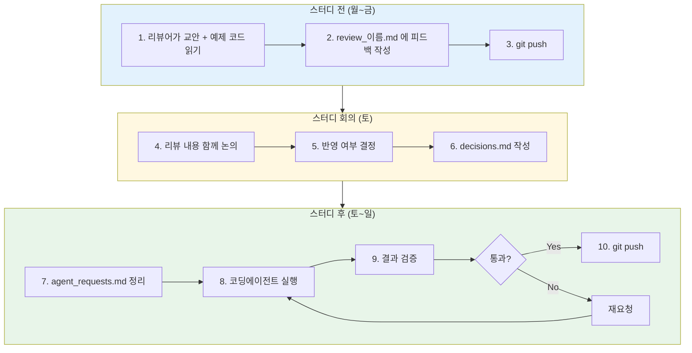
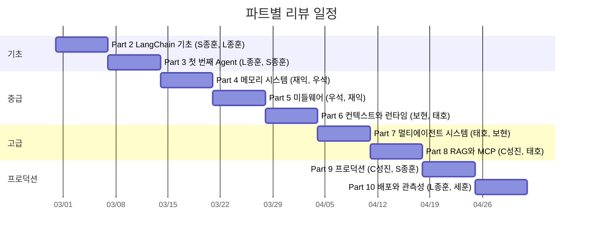
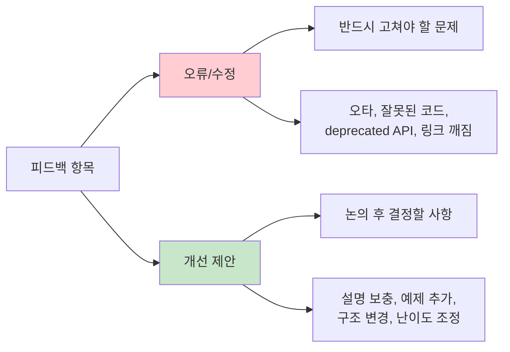
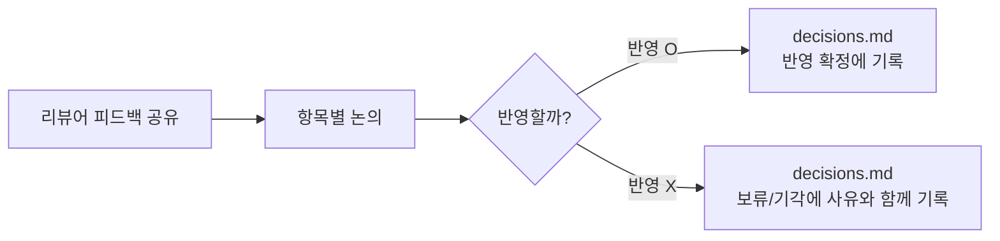
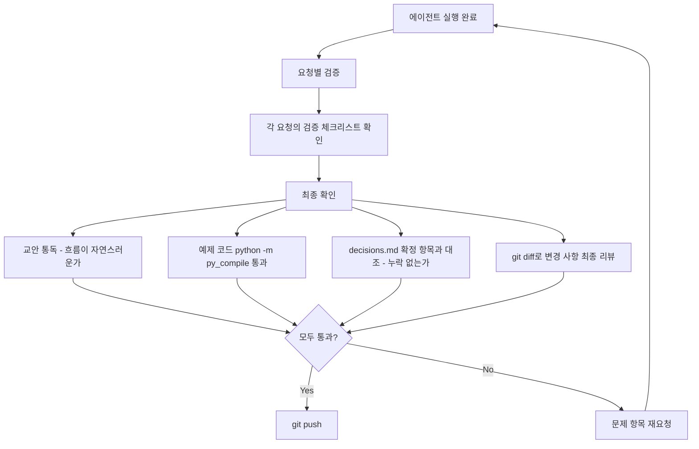

# 교재 리뷰 가이드

> LangChain AI Agent 마스터 교안의 품질을 함께 높이기 위한 리뷰 프로세스입니다.

---

## 한눈에 보는 전체 프로세스



---

## 역할

| 역할 | 누가 | 하는 일 |
|------|------|---------|
| **리뷰어** | 배정된 스터디원 (파트당 1~2명) | 교안과 예제 코드를 읽고 피드백 작성 |
| **편집자** | 교재 관리자 | 피드백을 취합하고, 코딩에이전트로 교재에 반영 |

---

## 리뷰 일정

주 1파트씩, 2026년 2월 28일(토)부터 매주 토요일 진행합니다. 총 9주.



| 주차 | 파트 | 리뷰어 | 리뷰 대상 |
|------|------|--------|-----------|
| 1주 | Part 2: LangChain 기초 | S종훈, L종훈 | [docs/part02_fundamentals.md](../docs/part02_fundamentals.md) + [src/part02_fundamentals/](../src/part02_fundamentals/) |
| 2주 | Part 3: 첫 번째 Agent | L종훈, S종훈 | [docs/part03_first_agent.md](../docs/part03_first_agent.md) + [src/part03_first_agent/](../src/part03_first_agent/) |
| 3주 | Part 4: 메모리 시스템 | 재익, 우석 | [docs/part04_memory.md](../docs/part04_memory.md) + [src/part04_memory/](../src/part04_memory/) |
| 4주 | Part 5: 미들웨어 | 우석, 재익 | [docs/part05_middleware.md](../docs/part05_middleware.md) + [src/part05_middleware/](../src/part05_middleware/) |
| 5주 | Part 6: 컨텍스트와 런타임 | 보현, 태호 | [docs/part06_context.md](../docs/part06_context.md) + [src/part06_context/](../src/part06_context/) |
| 6주 | Part 7: 멀티에이전트 시스템 | 태호, 보현 | [docs/part07_multi_agent.md](../docs/part07_multi_agent.md) + [src/part07_multi_agent/](../src/part07_multi_agent/) |
| 7주 | Part 8: RAG와 MCP | C성진, 태호 | [docs/part08_rag_mcp.md](../docs/part08_rag_mcp.md) + [src/part08_rag_mcp/](../src/part08_rag_mcp/) |
| 8주 | Part 9: 프로덕션 | C성진, S종훈 | [docs/part09_production.md](../docs/part09_production.md) + [src/part09_production/](../src/part09_production/) |
| 9주 | Part 10: 배포와 관측성 | L종훈, 세훈 | [docs/part10_deployment.md](../docs/part10_deployment.md) + [src/part10_deployment/](../src/part10_deployment/) |

---

## 리뷰어가 할 일

### Step 1. 리뷰 대상 읽기

자신이 배정된 파트의 **교안**과 **예제 코드** 두 가지를 읽습니다.

| 리뷰 대상 | 경로 | 설명 |
|-----------|------|------|
| 교안 | `docs/partXX_*.md` | 개념 설명, 코드 해설, 실습 과제가 담긴 마크다운 문서 |
| 예제 코드 | `src/partXX_*/` | 교안에서 다루는 실행 가능한 Python 파일들 |

### Step 2. 피드백 작성

각 파트 폴더에 **본인 이름으로 된 리뷰 파일이 이미 준비되어 있습니다.** 별도로 파일을 만들 필요 없이, 해당 파일을 열어 작성하면 됩니다.

```
reviews/part02_fundamentals/
├── review_S종훈.md      <-- S종훈이 여기에 작성
├── review_L종훈.md      <-- L종훈이 여기에 작성
├── decisions.md          (스터디 회의 후 편집자가 작성)
└── agent_requests.md     (편집자가 작성)
```

피드백은 **두 가지로 분류**하여 작성합니다:



### Step 3. 피드백 작성 예시

리뷰 파일을 열면 아래와 같은 구조가 이미 준비되어 있습니다. 각 섹션 아래에 피드백을 추가하세요.

**교안 오류/수정 예시:**

```markdown
### 오류/수정

- [ ] L42: `init_chat_model` 파라미터명이 최신 API와 다름 -> `model_provider` 추가 필요
- [ ] L130: 코드 블록에 오타 `mesage` -> `message`
- [ ] 섹션 2.3: 코드 실행 결과가 실제 출력과 다름
```

**교안 개선 제안 예시:**

```markdown
### 개선 제안

- [ ] 섹션 1.1: 모델별 비용 비교 정보 추가하면 좋겠음
- [ ] 섹션 3.2: Tool 정의 부분에 실제 에러 발생 시 디버깅 팁 추가 요청
```

**예제 코드 오류/수정 예시:**

```markdown
### 오류/수정

- [ ] `01_chat_models.py` L25: deprecated된 `model.predict()` 사용 -> `model.invoke()` 로 변경
- [ ] `03_tools_basic.py` L10: import 경로가 잘못됨 -> `from langchain_core.tools import tool`
```

#### 피드백 작성 팁

- 수정이 필요한 위치를 **라인 번호(L42)** 또는 **섹션 번호(섹션 2.3)** 로 명시해 주세요
- 코드 수정의 경우 **현재 코드**와 **제안 코드**를 함께 적어 주시면 반영이 빠릅니다
- 큰 변경이 필요한 경우 이유와 함께 구체적인 방향을 적어 주세요
- 잘 된 부분도 "기타 의견"에 적어주시면 편집자에게 도움이 됩니다

### Step 4. git push

피드백 작성이 끝나면 **스터디 전까지** push합니다.

```bash
# 1. 최신 코드 받기
git pull

# 2. 리뷰 파일 스테이징
git add reviews/part02_fundamentals/review_S종훈.md

# 3. 커밋
git commit -m "Part 2 리뷰: S종훈"

# 4. push
git push
```

---

## 스터디 회의에서 할 일

모여서 리뷰어들의 피드백을 함께 읽고 논의합니다.



`decisions.md`에 논의 결과를 기록합니다:

```markdown
# Part 2 리뷰 결정사항

> 스터디 일자: 2026-03-07

## 반영 확정

1. L42 파라미터 설명 업데이트 (S종훈)
2. L130 오타 수정 (S종훈)
3. 01_chat_models.py L25 deprecated 메서드 교체 (L종훈)
4. 섹션 3.2에 디버깅 팁 추가 (L종훈)

## 보류/기각

- 비용 비교표 추가: 금액이 자주 바뀌므로 공식 가격 페이지 링크로 대체
```

---

## 편집자가 할 일 (스터디 후)

### Step 1. agent_requests.md 작성

`decisions.md`의 확정 항목을 바탕으로, 각 파트 폴더의 `agent_requests.md`에 코딩에이전트가 실행할 수 있는 형태로 정리합니다.

각 요청에는 다음을 포함합니다:

| 항목 | 설명 | 예시 |
|------|------|------|
| **파일** | 수정 대상 파일의 상대 경로 | `docs/part02_fundamentals.md` |
| **위치** | 라인 번호 또는 섹션 | L42, 섹션 1.1 |
| **현재** | 지금 코드/내용 | `init_chat_model(model="gpt-4o")` |
| **변경** | 바꿀 코드/내용 | `model_provider` 파라미터 설명 추가 |
| **검증** | 이 요청이 제대로 반영되었는지 확인하는 방법 | 문법 확인, 전후 문맥 확인 |

### Step 2. 코딩에이전트 실행

`agent_requests.md`를 코딩에이전트에게 전달하여 교재를 수정합니다.

### Step 3. 결과 검증

에이전트가 수정한 결과를 두 단계로 검증합니다:



---

## 폴더 구조

```
langchain/reviews/
├── README.md                        # 이 문서 (리뷰 프로세스 가이드)
├── TEMPLATE.md                      # 리뷰 작성 템플릿 (참고용)
├── AGENT_REQUESTS_TEMPLATE.md       # 에이전트 요청 템플릿 (참고용)
│
├── part02_fundamentals/             # Part 2 리뷰 폴더
│   ├── review_S종훈.md              #   리뷰어 S종훈의 피드백
│   ├── review_L종훈.md              #   리뷰어 L종훈의 피드백
│   ├── decisions.md                 #   스터디 회의 결정사항
│   └── agent_requests.md            #   에이전트 요청 + 검증 체크리스트
│
├── part03_first_agent/              # Part 3 리뷰 폴더
│   ├── review_L종훈.md
│   ├── review_S종훈.md
│   ├── decisions.md
│   └── agent_requests.md
│
├── ...                              # Part 4~9 동일 구조
│
└── part10_deployment/               # Part 10 리뷰 폴더
    ├── review_L종훈.md
    ├── decisions.md
    └── agent_requests.md
```

---

## 자주 묻는 질문

**Q. 리뷰 파일을 어디서 찾나요?**
각 파트 폴더에 본인 이름으로 된 파일이 이미 있습니다. `reviews/partXX_*/review_이름.md`를 열면 됩니다.

**Q. 교안만 봐도 되나요? 코드도 꼭 봐야 하나요?**
교안과 예제 코드 모두 리뷰 대상입니다. 코드가 실제로 실행되는지, 교안의 설명과 일치하는지 확인해 주세요.

**Q. 피드백 항목이 적어도 괜찮나요?**
괜찮습니다. "문제 없음"도 중요한 피드백입니다. 기타 의견에 잘 된 점을 적어주셔도 좋습니다.

**Q. 다른 사람의 리뷰 파일을 수정해도 되나요?**
본인 파일만 수정해 주세요. 다른 리뷰어의 의견에 대한 논의는 스터디 회의에서 합니다.

**Q. push 전에 충돌이 나면 어떻게 하나요?**
`git pull` 후 다시 push하면 됩니다. 각자 다른 파일을 수정하므로 충돌이 거의 발생하지 않습니다.
