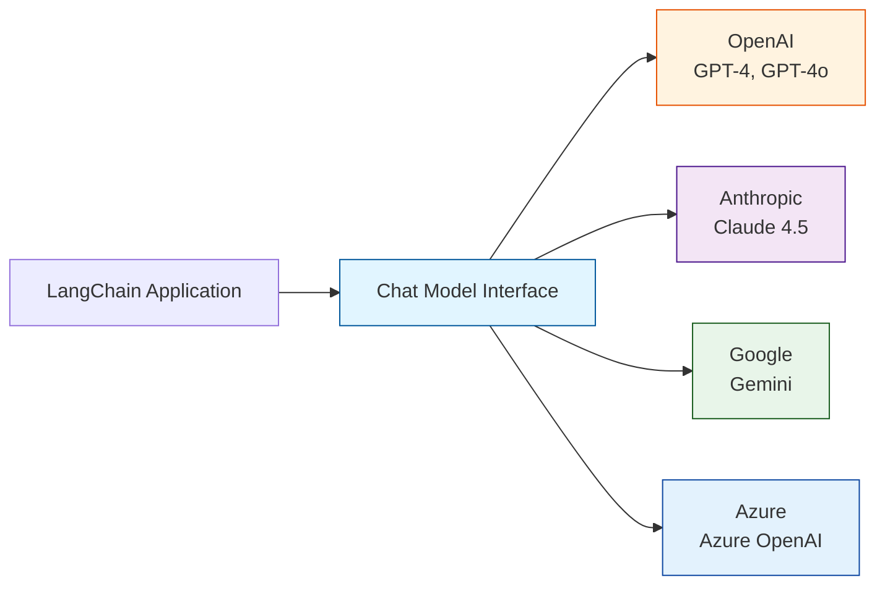
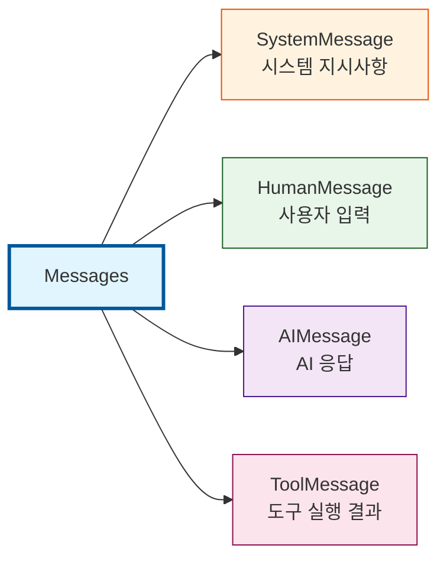
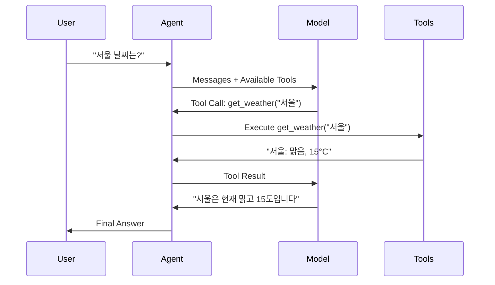
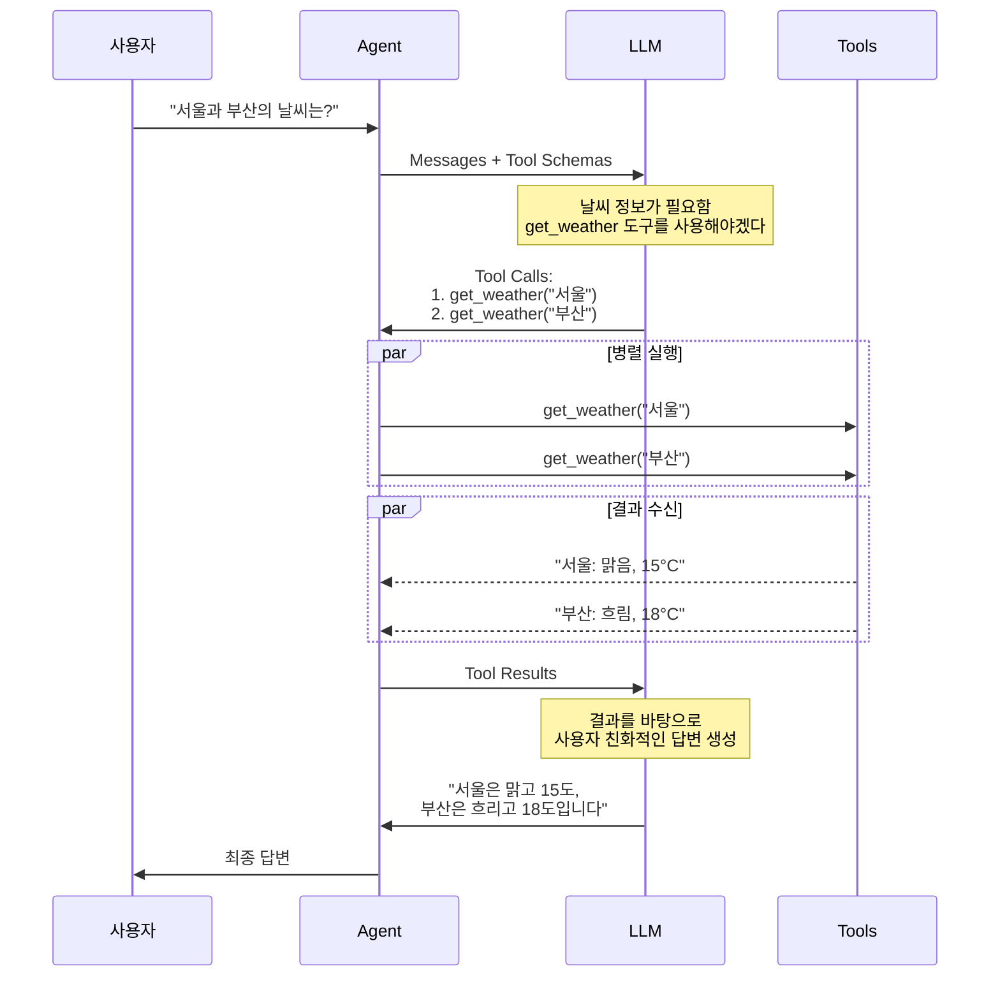

# Part 2: LangChain 핵심 구성 요소

> 📚 **학습 시간**: 약 3-4시간
>
> 🎯 **난이도**: ⭐⭐☆☆☆ (초급)
>
> 🛠️ **환경 설정**: [SETUP_GUIDE.md](../SETUP_GUIDE.md) — API 키 설정, 패키지 설치, 실행 환경 구성
>
> 📖 **공식 문서**: [07-models.md](../official/07-models_ko.md), [08-messages.md](../official/08-messages_ko.md), [09-tools.md](../official/09-tools_ko.md)
>
> 💻 **예제 코드**: [part02_fundamentals 디렉토리](../src/part02_fundamentals/)

---

## 📋 학습 목표

이 파트를 완료하면 다음을 할 수 있습니다:

- [ ] `init_chat_model()`을 사용하여 다양한 LLM 프로바이더의 모델을 초기화할 수 있다
- [ ] SystemMessage, HumanMessage, AIMessage의 역할과 사용법을 이해한다
- [ ] `@tool` 데코레이터를 사용하여 기본 도구를 만들 수 있다
- [ ] Pydantic 스키마를 활용하여 복잡한 입력을 받는 도구를 정의할 수 있다
- [ ] ToolRuntime을 통해 Agent 상태와 컨텍스트에 접근하는 방법을 이해한다
- [ ] Tool Calling의 동작 원리와 모델이 도구를 선택하는 과정을 이해한다

---

## 📚 개요

이 파트에서는 **LangChain Agent를 구성하는 핵심 요소**인 Chat Models, Messages, Tools를 학습합니다. 이 세 가지 구성 요소는 모든 LangChain 애플리케이션의 기초가 됩니다.

### 왜 중요한가?

- **모델의 표준화**: 다양한 LLM 프로바이더(OpenAI, Anthropic, Google 등)를 동일한 인터페이스로 사용할 수 있습니다
- **대화의 구조화**: Messages를 통해 대화 흐름을 명확하게 관리하고 추적할 수 있습니다
- **능력의 확장**: Tools를 통해 LLM이 외부 데이터를 조회하고 실제 작업을 수행할 수 있습니다
- **프로덕션 준비**: 실무에서 바로 사용할 수 있는 패턴과 베스트 프랙티스를 익힙니다

### 실무 활용 사례

- **멀티 모델 전략**: 비용 절감을 위해 간단한 작업은 GPT-4o-mini, 복잡한 작업은 Claude 사용
- **대화형 AI 서비스**: 고객 질문을 이해하고 맥락을 유지하며 답변하는 챗봇
- **데이터 조회 Agent**: 사용자 요청에 따라 데이터베이스를 검색하고 결과를 자연어로 설명
- **자동화 워크플로우**: API 호출, 파일 처리, 이메일 발송 등의 작업을 자동으로 수행

---

## 1. Chat Models 이해하기

### 1.1 Chat Models란?

**Chat Models**은 LLM(Large Language Model)을 LangChain에서 사용할 수 있도록 표준화된 인터페이스를 제공하는 래퍼입니다. 이를 통해 다양한 프로바이더의 모델을 동일한 방식으로 사용할 수 있습니다.



> 📖 **공식 문서**: [07-models.md](../official/07-models_ko.md#기본-사용법)

#### 핵심 특징

1. **표준화된 인터페이스**
   - 모든 프로바이더가 동일한 메서드 제공: `invoke()`, `stream()`, `batch()`
   - 벤더 종속성(lock-in) 방지

2. **다양한 프로바이더 지원**
   - OpenAI, Anthropic, Google, Azure, AWS Bedrock, HuggingFace 등
   - 로컬 모델(Ollama)도 지원

3. **풍부한 기능**
   - Tool calling (함수 호출)
   - Structured output (구조화된 출력)
   - Multimodal (이미지, 오디오, 비디오)
   - Reasoning (추론 과정 노출)

### 1.2 init_chat_model() 사용법

`init_chat_model()`은 Chat Model을 초기화하는 가장 간단한 방법입니다. 모델 이름만 전달하면 LangChain이 자동으로 적절한 프로바이더를 선택합니다.

#### 기본 사용법

```python
from langchain.chat_models import init_chat_model

# 가장 간단한 방법
model = init_chat_model("gpt-4o-mini")

# 모델 호출
response = model.invoke("안녕하세요! LangChain이 무엇인가요?")
print(response.content)
```

**💡 실행 결과**:
```
LangChain은 LLM(Large Language Model) 기반 애플리케이션을 쉽게 개발할 수 있도록
돕는 오픈소스 프레임워크입니다...
```

> 💻 **예제 코드**: [01_chat_models.py](../src/part02_fundamentals/01_chat_models.py) 라인 39-55

#### 프로바이더 명시적 지정

```python
# 프로바이더를 명시적으로 지정
model = init_chat_model(
    model="gpt-4o-mini",
    model_provider="openai"
)

# 또는 "프로바이더:모델" 형식 사용
model = init_chat_model("openai:gpt-4o-mini")
```

### 1.3 프로바이더별 설정

각 프로바이더마다 고유한 설정 방법이 있습니다. 환경 변수로 API 키를 설정하는 것이 일반적입니다.

#### OpenAI 설정

```python
import os
from langchain.chat_models import init_chat_model

# 환경 변수 설정
os.environ["OPENAI_API_KEY"] = "sk-..."

# 모델 초기화
model = init_chat_model("gpt-4o-mini")

# 또는 직접 클래스 사용
from langchain_openai import ChatOpenAI
model = ChatOpenAI(model="gpt-4o-mini")
```

**주요 모델**:
- `gpt-4o`: 최신 플래그십 모델 (2024-11)
- `gpt-4o-mini`: 비용 효율적인 소형 모델
- `gpt-4-turbo`: 이전 세대 고성능 모델

#### Anthropic (Claude) 설정

```python
import os
from langchain.chat_models import init_chat_model

# 환경 변수 설정
os.environ["ANTHROPIC_API_KEY"] = "sk-ant-..."

# 모델 초기화
model = init_chat_model("claude-sonnet-4-5-20250929")

# 또는 직접 클래스 사용
from langchain_anthropic import ChatAnthropic
model = ChatAnthropic(model="claude-sonnet-4-5-20250929")
```

**주요 모델**:
- `claude-opus-4-5-20251101`: 최고 성능 모델
- `claude-sonnet-4-5-20250929`: 균형잡힌 성능
- `claude-haiku-4-5-20251001`: 빠르고 저렴한 모델

> 📖 **공식 문서**: [07-models.md](../official/07-models_ko.md#anthropic)

#### Google Gemini 설정

```python
import os
from langchain.chat_models import init_chat_model

# 환경 변수 설정
os.environ["GOOGLE_API_KEY"] = "..."

# 모델 초기화
model = init_chat_model("google_genai:gemini-2.5-flash-lite")

# 또는 직접 클래스 사용
from langchain_google_genai import ChatGoogleGenerativeAI
model = ChatGoogleGenerativeAI(model="gemini-2.5-flash-lite")
```

#### Azure OpenAI 설정

```python
import os
from langchain.chat_models import init_chat_model

# 환경 변수 설정
os.environ["AZURE_OPENAI_API_KEY"] = "..."
os.environ["AZURE_OPENAI_ENDPOINT"] = "https://your-resource.openai.azure.com"
os.environ["OPENAI_API_VERSION"] = "2025-03-01-preview"

# 모델 초기화
model = init_chat_model(
    "azure_openai:gpt-4.1",
    azure_deployment="your-deployment-name"
)
```

> 💻 **예제 코드**: [01_chat_models.py](../src/part02_fundamentals/01_chat_models.py) 라인 129-158

### 1.4 Temperature와 주요 파라미터

Chat Model의 동작을 제어하는 주요 파라미터들을 이해하는 것이 중요합니다.

#### Temperature (온도)

**Temperature**는 모델 출력의 무작위성을 제어합니다. 0에 가까울수록 결정론적이고, 1에 가까울수록 창의적입니다.

```python
# 낮은 temperature (0~0.3): 일관되고 예측 가능한 출력
deterministic_model = init_chat_model(
    "gpt-4o-mini",
    temperature=0.0
)

# 중간 temperature (0.5~0.7): 균형잡힌 출력 (기본값)
balanced_model = init_chat_model(
    "gpt-4o-mini",
    temperature=0.7
)

# 높은 temperature (0.8~1.0): 창의적이고 다양한 출력
creative_model = init_chat_model(
    "gpt-4o-mini",
    temperature=1.0
)
```

**사용 가이드**:
- **Temperature 0.0**: 데이터 추출, 분류, 번역 등 정확성이 중요한 작업
- **Temperature 0.7**: 일반적인 대화, 질의응답 (대부분의 경우)
- **Temperature 1.0**: 창의적 글쓰기, 브레인스토밍, 아이디어 생성

#### 기타 주요 파라미터

```python
model = init_chat_model(
    "gpt-4o-mini",
    # 출력 길이 제한
    max_tokens=1000,

    # 요청 타임아웃 (초)
    timeout=30,

    # 재시도 횟수
    max_retries=3,

    # Temperature (무작위성)
    temperature=0.7,
)
```

**파라미터 설명**:

| 파라미터 | 타입 | 설명 | 기본값 |
|---------|------|------|-------|
| `model` | `str` | 모델 이름 (필수) | - |
| `temperature` | `float` | 출력의 무작위성 (0.0~1.0) | 0.7 |
| `max_tokens` | `int` | 최대 출력 토큰 수 | 제한 없음 |
| `timeout` | `int` | 요청 타임아웃 (초) | 60 |
| `max_retries` | `int` | 재시도 횟수 | 2 |

> 💻 **예제 코드**: [01_chat_models.py](../src/part02_fundamentals/01_chat_models.py) 라인 81-101

### 1.5 Model Profiles & Capabilities Detection

**Model Profiles**는 모델의 지원 기능과 제약사항을 확인할 수 있는 메타데이터입니다.

#### Model Profile이란?

각 Chat Model은 `.profile` 속성을 통해 자신의 capabilities를 노출합니다:

```python
from langchain.chat_models import init_chat_model

model = init_chat_model("gpt-4o")

# Model profile 확인
print(model.profile)
# {
#   "max_input_tokens": 128000,
#   "image_inputs": True,
#   "audio_inputs": False,
#   "video_inputs": False,
#   "tool_calling": True,
#   "structured_output": True,
# }
```

#### 주요 Profile 필드

| 필드 | 타입 | 설명 |
|------|------|------|
| `max_input_tokens` | `int` | 최대 입력 토큰 수 (context window) |
| `max_output_tokens` | `int` | 최대 출력 토큰 수 |
| `image_inputs` | `bool` | 이미지 입력 지원 여부 |
| `audio_inputs` | `bool` | 오디오 입력 지원 여부 |
| `video_inputs` | `bool` | 비디오 입력 지원 여부 |
| `tool_calling` | `bool` | Tool calling 지원 여부 |
| `structured_output` | `bool` | Structured output 지원 여부 |

#### 실전 활용 사례

**1. Context Window 기반 동적 처리**

```python
def process_with_context_awareness(model, messages):
    """모델의 context window에 맞게 메시지 처리"""
    max_tokens = model.profile.get("max_input_tokens", 4096)

    # 토큰 수 계산 (간단한 추정)
    total_tokens = sum(len(m.content.split()) * 1.3 for m in messages)

    if total_tokens > max_tokens * 0.8:  # 80% 이상 사용 시
        print(f"⚠️ Context window 근접: {total_tokens}/{max_tokens}")
        # 요약 또는 메시지 trimming 필요
        return trigger_summarization(messages)

    return model.invoke(messages)
```

**2. Multimodal Capability 체크**

```python
def send_image_if_supported(model, image_url, prompt):
    """모델이 이미지를 지원하는 경우만 전송"""
    if model.profile.get("image_inputs", False):
        # 이미지 포함 메시지 전송
        return model.invoke([
            {
                "role": "user",
                "content": [
                    {"type": "text", "text": prompt},
                    {"type": "image_url", "image_url": {"url": image_url}}
                ]
            }
        ])
    else:
        # 텍스트만 전송
        print("⚠️ 이 모델은 이미지를 지원하지 않습니다.")
        return model.invoke(prompt)
```

**3. Tool Calling 지원 확인**

```python
from langchain.tools import tool

@tool
def get_weather(city: str) -> str:
    """도시의 날씨를 조회합니다."""
    return f"{city}: 맑음, 22도"

def create_agent_with_fallback(model_name):
    """Tool calling 지원 여부에 따라 Agent 생성"""
    model = init_chat_model(model_name)

    if model.profile.get("tool_calling", False):
        # Tool calling 지원 → Agent 생성
        from langgraph.prebuilt import create_react_agent
        return create_react_agent(model=model, tools=[get_weather])
    else:
        # Tool calling 미지원 → 프롬프트 기반 fallback
        print(f"⚠️ {model_name}은 tool calling을 지원하지 않습니다.")
        return create_prompt_based_agent(model)
```

#### Profile Data 출처

Model profile 데이터는 [models.dev](https://models.dev/) 프로젝트에서 제공됩니다:
- 오픈소스 모델 capability 데이터베이스
- LangChain integration packages에서 augmentation 추가
- 커뮤니티 기여로 지속 업데이트

#### Custom Profile 설정

Model profile이 잘못되었거나 누락된 경우 직접 지정할 수 있습니다:

```python
# Option 1: 초기화 시 지정
custom_profile = {
    "max_input_tokens": 100_000,
    "tool_calling": True,
    "structured_output": True,
    "image_inputs": False,
}

model = init_chat_model(
    "custom-model",
    profile=custom_profile
)

# Option 2: 기존 profile 업데이트
from copy import copy

new_profile = model.profile | {"max_output_tokens": 4096}
model = model.model_copy(update={"profile": new_profile})
```

#### 주의사항

**1. Profile은 Beta 기능**:
- Profile 형식은 변경될 수 있음
- 항상 최신 LangChain 버전 사용 권장 (`langchain>=1.1`)

**2. 모든 모델이 완전한 Profile을 제공하지는 않음**:
```python
# Profile 데이터 없을 때 대비
max_tokens = model.profile.get("max_input_tokens")
if max_tokens is None:
    print("⚠️ Profile 데이터 없음 - 기본값 사용")
    max_tokens = 4096  # Fallback
```

**3. Profile vs 실제 동작**:
- Profile은 **선언적 메타데이터**일 뿐
- 실제 API 응답이 다를 수 있음 (버전, 설정에 따라)
- 중요한 기능은 항상 실제 테스트 권장

> 💡 **핵심 포인트**:
> - Model profile로 모델의 capabilities를 프로그래밍 방식으로 확인
> - Context window, multimodal 지원, tool calling 등 체크
> - 동적 처리 로직 구현 가능 (summarization, input gating)
> - models.dev 데이터 기반으로 지속 업데이트

---

## 2. Messages 다루기

### 2.1 Messages 개요

**Messages**는 LangChain에서 대화의 기본 단위입니다. 각 메시지는 역할(role)과 내용(content)을 가지며, 대화의 맥락을 구성합니다.



**Message의 구성 요소**:
- **Role (역할)**: 메시지 발신자 (system, user, assistant, tool)
- **Content (내용)**: 실제 메시지 내용 (텍스트, 이미지, 오디오 등)
- **Metadata (메타데이터)**: ID, 토큰 사용량, 응답 정보 등

> 📖 **공식 문서**: [08-messages.md](../official/08-messages_ko.md#메시지-유형)
> 💻 **예제 코드**: [02_messages.py](../src/part02_fundamentals/02_messages.py)

### 2.2 SystemMessage - 시스템 지시사항

`SystemMessage`는 모델의 행동 방식과 역할을 정의하는 초기 지시사항입니다. 대화의 맨 앞에 위치하며 모델의 "성격"을 결정합니다.

#### 기본 사용법

```python
from langchain.messages import SystemMessage, HumanMessage

# 간단한 시스템 메시지
system_msg = SystemMessage("당신은 친절한 Python 코딩 어시스턴트입니다.")

messages = [
    system_msg,
    HumanMessage("FastAPI로 REST API를 만드는 방법을 알려주세요")
]

response = model.invoke(messages)
print(response.content)
```

#### 상세한 페르소나 정의

```python
system_msg = SystemMessage("""
당신은 10년 경력의 시니어 Python 개발자입니다.

**역할**:
- 웹 프레임워크(Django, FastAPI) 전문가
- 항상 코드 예제와 함께 설명을 제공합니다
- 간결하지만 충분히 자세한 설명을 제공합니다

**응답 스타일**:
- 핵심 개념을 먼저 설명
- 실행 가능한 코드 예제 제공
- 주의사항과 베스트 프랙티스 포함
""")

messages = [
    system_msg,
    HumanMessage("FastAPI에서 의존성 주입을 구현하는 방법은?")
]

response = model.invoke(messages)
```

**💡 실습 포인트**:
1. 시스템 메시지를 변경하면서 응답이 어떻게 달라지는지 관찰하세요
2. 너무 긴 시스템 메시지는 토큰을 낭비할 수 있습니다
3. 명확하고 구체적인 지시가 더 좋은 결과를 만듭니다

> 📖 **공식 문서**: [08-messages.md](../official/08-messages_ko.md#system-메시지)

### 2.3 HumanMessage - 사용자 입력

`HumanMessage`는 사용자의 입력을 나타냅니다. 텍스트뿐만 아니라 이미지, 오디오, 파일 등 다양한 형태의 콘텐츠를 포함할 수 있습니다.

#### 텍스트 메시지

```python
from langchain.messages import HumanMessage

# Message 객체 사용
human_msg = HumanMessage("머신러닝이란 무엇인가요?")
response = model.invoke([human_msg])

# 문자열 축약형 (단일 메시지인 경우)
response = model.invoke("머신러닝이란 무엇인가요?")
```

#### 메타데이터 추가

```python
human_msg = HumanMessage(
    content="안녕하세요!",
    name="alice",  # 사용자 식별 (선택)
    id="msg_123",  # 고유 ID (선택, 추적용)
)
```

> ⚠️ **주의**: `name` 필드의 동작은 프로바이더마다 다를 수 있습니다. 일부는 사용자 식별에 사용하고, 일부는 무시합니다.

#### 멀티모달 입력

```python
# 이미지와 텍스트 함께 전송
human_msg = HumanMessage(content=[
    {"type": "text", "text": "이 이미지에 무엇이 있나요?"},
    {"type": "image", "url": "https://example.com/image.jpg"}
])

response = model.invoke([human_msg])
```

> 📖 **공식 문서**: [08-messages.md](../official/08-messages_ko.md#human-메시지)

### 2.4 AIMessage - AI 응답

`AIMessage`는 모델이 생성한 응답을 나타냅니다. `invoke()` 메서드는 항상 `AIMessage` 객체를 반환합니다.

#### 기본 사용법

```python
# 모델 호출
response = model.invoke("AI에 대해 설명해주세요")

# AIMessage 객체 확인
print(type(response))  # <class 'langchain.messages.AIMessage'>
print(response.content)  # 응답 텍스트
```

#### AIMessage의 주요 속성

```python
from langchain.messages import HumanMessage

response = model.invoke([HumanMessage("안녕하세요!")])

# 텍스트 내용
print(response.text)
print(response.content)  # 동일

# 고유 ID
print(response.id)  # "msg_abc123"

# 토큰 사용량
print(response.usage_metadata)
# {
#     'input_tokens': 8,
#     'output_tokens': 304,
#     'total_tokens': 312,
#     'input_token_details': {'audio': 0, 'cache_read': 0},
#     'output_token_details': {'audio': 0, 'reasoning': 256}
# }

# 응답 메타데이터
print(response.response_metadata)
# 모델 이름, 완료 이유 등
```

#### 수동으로 AIMessage 생성

대화 기록을 재구성하거나 테스트할 때 유용합니다:

```python
from langchain.messages import AIMessage, SystemMessage, HumanMessage

# 대화 기록 재구성
messages = [
    SystemMessage("당신은 도움이 되는 어시스턴트입니다"),
    HumanMessage("도와줄 수 있나요?"),
    AIMessage("물론입니다! 무엇을 도와드릴까요?"),  # 수동 생성
    HumanMessage("2+2는?")
]

response = model.invoke(messages)
print(response.content)  # "2+2는 4입니다."
```

> 📖 **공식 문서**: [08-messages.md](../official/08-messages_ko.md#ai-메시지)

### 2.5 ToolMessage - 도구 실행 결과

`ToolMessage`는 Tool Calling에서 도구 실행 결과를 모델에 전달할 때 사용됩니다. (Tool Calling은 섹션 6에서 자세히 다룹니다)

#### 기본 구조

```python
from langchain.messages import AIMessage, ToolMessage

# 1. 모델이 도구 호출을 요청 (AIMessage)
ai_message = AIMessage(
    content="",
    tool_calls=[{
        "name": "get_weather",
        "args": {"location": "San Francisco"},
        "id": "call_123"
    }]
)

# 2. 도구 실행 결과 (ToolMessage)
tool_message = ToolMessage(
    content="Sunny, 72°F",
    tool_call_id="call_123",  # 반드시 일치해야 함
    name="get_weather"
)

# 3. 모델에 결과 전달
messages = [
    HumanMessage("샌프란시스코 날씨는?"),
    ai_message,
    tool_message
]

response = model.invoke(messages)
print(response.content)
# "샌프란시스코는 현재 화창하고 72도입니다."
```

**ToolMessage의 필수 속성**:
- `content`: 도구 실행 결과 (문자열)
- `tool_call_id`: AIMessage의 tool_call ID와 일치해야 함
- `name`: 호출된 도구 이름

> 📖 **공식 문서**: [08-messages.md](../official/08-messages_ko.md#tool-메시지)

### 2.6 Dictionary 포맷 사용하기

LangChain은 OpenAI의 채팅 완료 형식(dictionary)도 지원합니다. 간단한 경우에는 이 형식이 더 편리할 수 있습니다.

#### Dictionary 형식

```python
# Dictionary 형식의 메시지
messages = [
    {"role": "system", "content": "당신은 번역 전문가입니다"},
    {"role": "user", "content": "I love programming을 프랑스어로 번역하세요"},
    {"role": "assistant", "content": "J'adore la programmation."},
    {"role": "user", "content": "I love building applications도 번역하세요"}
]

response = model.invoke(messages)
print(response.content)
# "J'adore créer des applications."
```

#### Message 객체 vs Dictionary

```python
# Message 객체 (권장)
from langchain.messages import SystemMessage, HumanMessage

messages = [
    SystemMessage("당신은 번역 전문가입니다"),
    HumanMessage("Hello를 한국어로 번역하세요")
]

# Dictionary 형식 (간단한 경우)
messages = [
    {"role": "system", "content": "당신은 번역 전문가입니다"},
    {"role": "user", "content": "Hello를 한국어로 번역하세요"}
]
```

**언제 어떤 형식을 사용할까?**
- **Message 객체**: 타입 안정성, IDE 자동완성, 멀티모달, 메타데이터 필요 시
- **Dictionary**: 간단한 프로토타입, 외부 API 연동, JSON 직렬화 필요 시

> 📖 **공식 문서**: [08-messages.md](../official/08-messages_ko.md#딕셔너리-형식)

### 2.7 Multimodal Content Handling

**Multimodal**은 텍스트 외에 이미지, 오디오, 비디오, 파일 등 다양한 형태의 데이터를 처리하는 능력입니다.

#### Multimodal 지원 모델

먼저 모델이 multimodal을 지원하는지 확인하세요:

```python
from langchain.chat_models import init_chat_model

model = init_chat_model("gpt-4o")

# Multimodal 지원 여부 확인
if model.profile.get("image_inputs"):
    print("✅ 이미지 입력 지원")
if model.profile.get("audio_inputs"):
    print("✅ 오디오 입력 지원")
if model.profile.get("video_inputs"):
    print("✅ 비디오 입력 지원")
```

**주요 multimodal 모델**:
- GPT-4o, GPT-4o-mini (OpenAI) - 이미지, 오디오
- Claude 4.5 Sonnet (Anthropic) - 이미지, PDF
- Gemini 2.5 Pro/Flash (Google) - 이미지, 오디오, 비디오

#### 1. 이미지 입력 (Image Input)

이미지를 모델에 전달하는 3가지 방법:

**방법 1: URL**

```python
message = {
    "role": "user",
    "content": [
        {"type": "text", "text": "이 이미지에 무엇이 있나요?"},
        {"type": "image", "url": "https://example.com/cat.jpg"}
    ]
}

response = model.invoke([message])
```

**방법 2: Base64 인코딩**

```python
import base64

# 이미지 파일을 base64로 인코딩
with open("local_image.jpg", "rb") as image_file:
    base64_image = base64.b64encode(image_file.read()).decode("utf-8")

message = {
    "role": "user",
    "content": [
        {"type": "text", "text": "이 이미지를 분석해주세요."},
        {
            "type": "image",
            "base64": base64_image,
            "mime_type": "image/jpeg"
        }
    ]
}

response = model.invoke([message])
```

**방법 3: File ID (Provider-managed)**

일부 provider는 파일을 미리 업로드하고 ID로 참조할 수 있습니다:

```python
# 예: OpenAI File API
# 1. 파일 업로드
# uploaded_file = openai.files.create(...)
# file_id = uploaded_file.id

message = {
    "role": "user",
    "content": [
        {"type": "text", "text": "이 이미지를 설명해주세요."},
        {"type": "image", "file_id": "file-abc123"}
    ]
}

response = model.invoke([message])
```

#### 주의사항

- **파일 크기**: 이미지는 일반적으로 10MB 이하를 권장합니다. 큰 이미지는 리사이즈 후 전송하세요.
- **지원 포맷**: PNG, JPEG, GIF, WebP가 대부분의 모델에서 지원됩니다.
- **Base64 vs URL**: 로컬 파일은 Base64, 이미 호스팅된 파일은 URL이 효율적입니다.
- **비용**: 이미지 입력은 텍스트보다 토큰 소비가 큽니다. 해상도를 낮추면 비용을 절감할 수 있습니다.

> 💡 **핵심 포인트**:
> - 여기서는 이미지 입력(URL, Base64)만 다룹니다
> - PDF, 오디오, 비디오 등 추가 멀티모달 입력은 [공식 문서](../official/08-messages_ko.md)를 참조하세요

---

## 3. Tools 기초

### 3.1 Tools 개요

**Tools**는 Agent가 외부 세계와 상호작용할 수 있게 해주는 함수입니다. LLM은 텍스트 생성에 뛰어나지만, 실제 데이터 조회나 작업 수행은 Tools를 통해 이루어집니다.



**Tools의 구성 요소**:
1. **스키마 (Schema)**: 도구 이름, 설명, 파라미터 정의
2. **함수 (Function)**: 실제 실행할 Python 함수 또는 코루틴

> 📖 **공식 문서**: [09-tools.md](../official/09-tools_ko.md#tool-생성)

### 3.2 @tool 데코레이터로 도구 만들기

`@tool` 데코레이터는 일반 Python 함수를 LangChain Tool로 변환하는 가장 간단한 방법입니다.

#### 기본 사용법

```python
from langchain.tools import tool

@tool
def search_database(query: str, limit: int = 10) -> str:
    """고객 데이터베이스에서 쿼리와 일치하는 레코드를 검색합니다.

    Args:
        query: 검색할 용어
        limit: 반환할 최대 결과 수
    """
    # 실제 구현
    return f"'{query}'에 대한 {limit}개의 결과를 찾았습니다"

# Tool 속성 확인
print(search_database.name)  # "search_database"
print(search_database.description)  # 도구 설명 (docstring)
print(search_database.args)  # 파라미터 스키마
```

**💡 핵심 요구사항**:
1. **Type hints 필수**: 모든 파라미터와 반환 타입에 타입 힌트가 있어야 합니다
2. **Docstring 권장**: 모델이 도구를 언제 사용할지 이해하는데 필수적입니다
3. **반환 타입**: 일반적으로 `str`을 반환하지만, 다른 타입도 가능합니다

> 💻 **예제 코드**: [03_tools_basic.py](../src/part02_fundamentals/03_tools_basic.py) 라인 32-51

#### 실용적인 예제

```python
@tool
def get_current_time(timezone: str = "UTC") -> str:
    """현재 시간을 반환합니다.

    Args:
        timezone: 시간대 (예: "UTC", "Asia/Seoul", "America/New_York")
    """
    from datetime import datetime
    import pytz

    tz = pytz.timezone(timezone)
    current_time = datetime.now(tz)
    return current_time.strftime("%Y-%m-%d %H:%M:%S %Z")

# 도구 직접 호출 (테스트)
result = get_current_time.invoke({"timezone": "Asia/Seoul"})
print(result)  # "2025-02-05 10:30:45 KST"
```

### 3.3 Tool 설명(Docstring)의 중요성

Docstring은 모델이 **언제** 이 도구를 사용해야 하는지 판단하는 핵심 정보입니다. 명확하고 구체적인 설명이 필수적입니다.

#### 좋은 예 vs 나쁜 예

```python
# ❌ 나쁜 예: 설명이 부족함
@tool
def get_data(id: str) -> str:
    """데이터를 가져옵니다."""
    return f"Data for {id}"

# ✅ 좋은 예: 명확하고 구체적
@tool
def get_customer_data(customer_id: str) -> str:
    """고객 ID로 고객 정보를 조회합니다.

    이 도구는 다음 정보를 반환합니다:
    - 고객 이름, 이메일, 전화번호
    - 가입일, 최근 구매 이력

    Args:
        customer_id: 조회할 고객의 고유 ID (예: "CUST-12345")

    Returns:
        고객 정보를 JSON 형식의 문자열로 반환
    """
    return f"Customer data for {customer_id}"
```

**효과적인 Docstring 작성 팁**:
1. **목적 명확히**: 도구가 무엇을 하는지 첫 문장에 명확히 설명
2. **사용 시기**: 어떤 상황에서 이 도구를 사용해야 하는지 명시
3. **파라미터 설명**: 각 파라미터의 의미와 예시 제공
4. **반환값 설명**: 어떤 형식으로 무엇을 반환하는지 명시

> 📖 **공식 문서**: [09-tools.md](../official/09-tools_ko.md#기본-tool-정의)

### 3.4 Type Hints의 역할

Type hints는 단순한 주석이 아닙니다. LangChain이 도구의 입력 스키마를 자동으로 생성하는데 사용됩니다.

#### 기본 타입

```python
from typing import Optional, List

@tool
def process_order(
    order_id: str,          # 필수 파라미터
    quantity: int,          # 정수
    price: float,           # 실수
    urgent: bool = False,   # 불린 (기본값)
    notes: Optional[str] = None  # 선택적 파라미터
) -> str:
    """주문을 처리합니다."""
    return f"Order {order_id} processed"
```

#### 복잡한 타입

```python
from typing import List, Dict, Literal

@tool
def search_products(
    categories: List[str],                    # 문자열 리스트
    price_range: Dict[str, float],           # 딕셔너리
    sort_by: Literal["price", "rating", "name"] = "rating"  # 제한된 선택지
) -> str:
    """상품을 검색합니다.

    Args:
        categories: 검색할 카테고리 목록 (예: ["electronics", "books"])
        price_range: 가격 범위 (예: {"min": 10.0, "max": 100.0})
        sort_by: 정렬 기준 ("price", "rating", "name" 중 하나)
    """
    return f"Found products in {categories}"
```

**지원되는 타입**:
- 기본: `str`, `int`, `float`, `bool`
- 컨테이너: `List[T]`, `Dict[K, V]`, `Tuple[T, ...]`
- 선택적: `Optional[T]`, `Union[T1, T2]`
- 제한: `Literal["a", "b", "c"]`

> 💻 **예제 코드**: [03_tools_basic.py](../src/part02_fundamentals/03_tools_basic.py) 라인 58-84

---

## 4. ToolRuntime - 고급 Tool 기능

### 4.1 ToolRuntime이란?

**ToolRuntime**은 Tool 실행 시 Agent의 상태, 컨텍스트, 메모리에 접근하는 인터페이스입니다.

일반적인 Tool은 독립적으로 동작하지만, 때로는 **Agent의 현재 상태나 사용자 정보**에 접근해야 하는 경우가 있습니다. ToolRuntime이 이를 가능하게 합니다.

**기본 사용법**:

```python
from langchain.tools import tool, ToolRuntime

@tool
def get_user_preference(
    category: str,
    runtime: ToolRuntime
) -> str:
    """사용자 설정을 조회합니다."""
    # Runtime을 통해 다양한 정보 접근
    user_id = runtime.context["user_id"]
    messages = runtime.state["messages"]

    return f"User {user_id}의 {category} 설정: ..."
```

### 4.2 Runtime 속성 요약

ToolRuntime은 5가지 주요 속성을 제공합니다:

| 속성 | 용도 | 설명 |
|------|------|------|
| `runtime.state` | Agent 상태 접근 | 메시지 기록 등 현재 상태 조회 |
| `runtime.context` | 요청 컨텍스트 | 사용자 ID, 언어 등 요청별 정보 |
| `runtime.store` | 장기 메모리 | 사용자 선호도 등 영속 데이터 접근 |
| `runtime.stream_writer` | 실시간 이벤트 | 진행률 등 중간 결과 스트리밍 |
| `runtime.tool_call_id` | Tool Call ID | 현재 호출의 고유 식별자 |

> 💡 ToolRuntime의 상세 활용법은 Agent/MCP를 다루는 후속 파트에서 실습합니다.

---

## 5. Tools 고급 — Pydantic 스키마

> 💻 **예제 코드**: [04_tool_advanced.py](../src/part02_fundamentals/04_tool_advanced.py)

### 5.1 Pydantic 스키마로 복잡한 입력 정의

복잡한 입력 구조가 필요한 경우 Pydantic 모델을 사용하면 더 명확하고 안전합니다.

#### 기본 Pydantic 스키마

```python
from pydantic import BaseModel, Field
from langchain.tools import tool

class WeatherInput(BaseModel):
    """날씨 조회를 위한 입력 스키마"""
    location: str = Field(description="도시 이름 또는 좌표")
    units: str = Field(
        default="celsius",
        description="온도 단위 ('celsius' 또는 'fahrenheit')"
    )
    include_forecast: bool = Field(
        default=False,
        description="5일 예보 포함 여부"
    )

@tool(args_schema=WeatherInput)
def get_weather(location: str, units: str = "celsius", include_forecast: bool = False) -> str:
    """현재 날씨와 선택적으로 예보를 가져옵니다."""
    temp = 22 if units == "celsius" else 72
    result = f"현재 {location}의 날씨: {temp}도 {units}"
    if include_forecast:
        result += "\n향후 5일: 맑음"
    return result
```

> 💻 **예제 코드**: [04_tool_advanced.py](../src/part02_fundamentals/04_tool_advanced.py) 라인 44-61

각 필드에 `Field(description=...)`를 사용하면 LLM이 각 파라미터의 용도를 더 정확히 이해합니다. 위 `WeatherInput` 예제처럼 `description`, `default`, `ge`/`le` 등의 옵션을 활용할 수 있습니다.

> 💡 독스트링과 타입힌트만으로도 대부분의 Tool은 잘 동작합니다. Pydantic 스키마는 복잡한 입력 검증이 필요할 때 사용하세요.

---

## 6. Tool Calling 이해하기

> 💻 **예제 코드**: [04_tool_advanced.py](../src/part02_fundamentals/04_tool_advanced.py)

### 6.1 Tool Calling이란?

**Tool Calling**은 LLM이 대화 중 필요한 정보를 얻기 위해 외부 도구를 호출하는 기능입니다. 모델은 도구의 스키마를 보고 언제, 어떤 도구를, 어떤 인자로 호출할지 자율적으로 결정합니다.



> 📖 **공식 문서**: [07-models.md](../official/07-models_ko.md#tool-호출)

### 6.2 모델이 도구를 선택하는 과정

모델은 다음 정보를 바탕으로 도구 사용 여부와 방법을 결정합니다:

1. **사용자 질문 분석**: "서울 날씨는?" → 날씨 정보가 필요
2. **사용 가능한 도구 확인**: `get_weather`, `search_database`, `calculate` 등
3. **적절한 도구 선택**: `get_weather`가 가장 적합
4. **파라미터 추출**: 질문에서 "서울"을 location 파라미터로 추출
5. **Tool Call 생성**: `{"name": "get_weather", "args": {"location": "서울"}}`

#### 실제 예제

```python
from langchain.tools import tool
from langchain.chat_models import init_chat_model

@tool
def get_weather(location: str) -> str:
    """특정 지역의 날씨를 조회합니다.

    Args:
        location: 도시 이름 (예: "서울", "부산")
    """
    # 실제로는 API 호출
    return f"{location}은 항상 화창합니다!"

# 모델에 도구 바인딩
model = init_chat_model("gpt-4o-mini")
model_with_tools = model.bind_tools([get_weather])

# 도구 호출이 필요한 질문
response = model_with_tools.invoke("보스턴 날씨는 어때?")

# Tool calls 확인
for tool_call in response.tool_calls:
    print(f"Tool: {tool_call['name']}")
    print(f"Args: {tool_call['args']}")
    print(f"ID: {tool_call['id']}")
```

**출력**:
```
Tool: get_weather
Args: {'location': '보스턴'}
ID: call_abc123
```

### 6.3 Tool Call 파싱과 실행 루프

Tool calling의 전체 흐름은 다음과 같습니다:

```python
from langchain.tools import tool
from langchain.messages import HumanMessage, ToolMessage

@tool
def get_weather(location: str) -> str:
    """날씨 정보를 가져옵니다."""
    return f"{location}: 맑음, 20°C"

# 1단계: 모델에 도구 바인딩
model_with_tools = model.bind_tools([get_weather])

# 2단계: 초기 메시지로 모델 호출
messages = [HumanMessage("보스턴 날씨는?")]
ai_msg = model_with_tools.invoke(messages)
messages.append(ai_msg)

print("Model response:", ai_msg.tool_calls)
# [{'name': 'get_weather', 'args': {'location': '보스턴'}, 'id': 'call_123'}]

# 3단계: 도구 실행
for tool_call in ai_msg.tool_calls:
    # 도구 실행
    result = get_weather.invoke(tool_call)

    # ToolMessage 생성
    tool_message = ToolMessage(
        content=result,
        tool_call_id=tool_call['id'],
        name=tool_call['name']
    )
    messages.append(tool_message)

print("Tool result:", messages[-1].content)
# "보스턴: 맑음, 20°C"

# 4단계: 도구 결과를 포함하여 모델 재호출
final_response = model_with_tools.invoke(messages)
print("Final answer:", final_response.content)
# "보스턴의 현재 날씨는 맑고 20도입니다."
```

**실행 흐름 요약**:
1. **도구 바인딩**: `bind_tools()`로 사용 가능한 도구를 모델에 알림
2. **Tool Call 생성**: 모델이 필요한 도구와 인자를 결정
3. **도구 실행**: Agent가 실제 도구를 실행하고 결과 획득
4. **결과 전달**: ToolMessage로 결과를 모델에 다시 전달
5. **최종 답변**: 모델이 도구 결과를 바탕으로 사용자 친화적인 답변 생성

> ⚠️ **중요**: LangGraph의 Agent (예: `create_react_agent()`)를 사용하면 이 전체 루프가 자동으로 처리됩니다. 수동으로 구현하는 것은 이해를 돕기 위한 것입니다.

#### 병렬 Tool Calls

많은 모델이 여러 도구를 동시에 호출할 수 있습니다:

```python
# 여러 도시의 날씨를 동시에 조회
response = model_with_tools.invoke("서울과 부산의 날씨는?")

print(response.tool_calls)
# [
#   {'name': 'get_weather', 'args': {'location': '서울'}, 'id': 'call_1'},
#   {'name': 'get_weather', 'args': {'location': '부산'}, 'id': 'call_2'}
# ]

# 병렬 실행 (비동기로 더 효율적)
results = []
for tool_call in response.tool_calls:
    result = get_weather.invoke(tool_call)
    results.append(result)
```

> 📖 **공식 문서**: [07-models.md](../official/07-models_ko.md#tool-호출)

---

## 🎓 실습 과제

### 과제 1: 다중 프로바이더 Chat Model (⭐⭐☆)

**목표**: 동일한 질문을 여러 프로바이더의 모델로 실행하고 결과를 비교해보세요.

**요구사항**:
1. OpenAI GPT-4o-mini와 Anthropic Claude 모델 초기화
2. "AI Agent가 무엇이며 어떻게 활용되는지 3문장으로 설명하세요" 질문 실행
3. 두 모델의 응답을 출력하고 차이점 분석

**힌트**:
```python
from langchain.chat_models import init_chat_model

gpt_model = init_chat_model("gpt-4o-mini")
claude_model = init_chat_model("claude-sonnet-4-5-20250929")

question = "AI Agent가 무엇이며 어떻게 활용되는지 3문장으로 설명하세요"

# TODO: 각 모델로 질문 실행하고 결과 비교
```

**평가 기준**:
- [ ] 두 모델이 모두 정상적으로 응답하는가?
- [ ] 응답 스타일의 차이를 관찰했는가?
- [ ] Temperature를 변경하면 결과가 어떻게 달라지는가?

**해답**: [여기](../src/part02_fundamentals/solutions/exercise_01.py)

---

### 과제 2: 대화 기록 관리 (⭐⭐☆)

**목표**: SystemMessage, HumanMessage, AIMessage를 사용하여 다중 턴 대화를 구현하세요.

**요구사항**:
1. 시스템 메시지로 "당신은 Python 튜터입니다" 설정
2. 3턴의 대화 구현:
   - 턴1: "변수란 무엇인가요?"
   - 턴2: "예제를 보여주세요"
   - 턴3: "그럼 상수는요?"
3. 각 턴마다 대화 기록을 누적하여 전달

**힌트**:
```python
from langchain.messages import SystemMessage, HumanMessage, AIMessage

messages = [
    SystemMessage("당신은 친절한 Python 튜터입니다")
]

# 턴 1
messages.append(HumanMessage("변수란 무엇인가요?"))
response = model.invoke(messages)
messages.append(response)

# TODO: 턴 2, 3 구현
```

**평가 기준**:
- [ ] 대화 맥락이 유지되는가?
- [ ] 모델이 이전 대화를 참조하는가?
- [ ] SystemMessage가 모든 응답에 영향을 미치는가?

**해답**: [여기](../src/part02_fundamentals/solutions/exercise_02.py)

---

### 과제 3: 실용적인 Tool 만들기 (⭐⭐⭐)

**목표**: Pydantic 스키마를 사용하여 복잡한 입력을 받는 도구를 만들어보세요.

**요구사항**:
1. 식당 예약을 위한 `ReservationInput` Pydantic 스키마 정의:
   - `restaurant_name`: 식당 이름
   - `date`: 예약 날짜 (YYYY-MM-DD 형식)
   - `time`: 예약 시간 (HH:MM 형식)
   - `party_size`: 인원 수 (1-20명)
   - `special_requests`: 특별 요청사항 (선택)
2. `@tool` 데코레이터로 `make_reservation` 도구 구현
3. 도구를 직접 호출하여 테스트

**힌트**:
```python
from pydantic import BaseModel, Field
from langchain.tools import tool
from typing import Optional

class ReservationInput(BaseModel):
    """식당 예약을 위한 입력 스키마"""
    restaurant_name: str = Field(description="예약할 식당 이름")
    # TODO: 나머지 필드 정의

@tool(args_schema=ReservationInput)
def make_reservation(restaurant_name: str, date: str, time: str,
                    party_size: int, special_requests: Optional[str] = None) -> str:
    """식당 예약을 생성합니다."""
    # TODO: 구현
    pass
```

**평가 기준**:
- [ ] Pydantic 스키마가 올바르게 정의되었는가?
- [ ] Field descriptions가 명확한가?
- [ ] 도구가 정상적으로 실행되는가?
- [ ] 검증 (party_size 범위 등)이 작동하는가?

**해답**: [여기](../src/part02_fundamentals/solutions/exercise_03.py)

---

## 💡 실전 팁

### Tip 1: 프로바이더 선택 가이드

**상황별 추천 모델**:

| 용도 | 추천 모델 | 이유 |
|-----|---------|------|
| 프로토타입/개발 | `gpt-4o-mini` | 저렴하고 빠름 |
| 프로덕션 (고품질) | `claude-sonnet-4-5` | 정확하고 안정적 |
| 프로덕션 (저비용) | `gpt-4o-mini` | 비용 효율적 |
| 복잡한 추론 | `claude-opus-4-5` | 최고 성능 |
| 로컬 테스트 | Ollama (llama3.1) | 무료, 오프라인 |

### Tip 2: Temperature 설정 전략

```python
# 정확성이 중요한 작업: temperature=0
extraction_model = init_chat_model("gpt-4o-mini", temperature=0.0)
result = extraction_model.invoke("다음 JSON에서 이름을 추출하세요: {...}")

# 일반 대화: temperature=0.7 (기본값)
chat_model = init_chat_model("gpt-4o-mini", temperature=0.7)

# 창의적 작업: temperature=0.9~1.0
creative_model = init_chat_model("gpt-4o-mini", temperature=1.0)
story = creative_model.invoke("SF 단편 소설을 써주세요")
```

### Tip 3: 효과적인 System Message 작성

```python
# ✅ 좋은 예: 구체적이고 명확
system_msg = SystemMessage("""
당신은 Python 코딩 어시스턴트입니다.

**역할**:
- 초보자가 이해하기 쉽게 설명합니다
- 항상 실행 가능한 코드 예제를 제공합니다
- 에러가 발생할 수 있는 부분은 미리 경고합니다

**응답 형식**:
1. 개념 설명 (2-3문장)
2. 코드 예제
3. 주의사항 또는 베스트 프랙티스
""")

# ❌ 나쁜 예: 너무 모호함
system_msg = SystemMessage("당신은 도움이 되는 어시스턴트입니다.")
```

### Tip 4: Tool 디버깅

```python
from langchain.tools import tool

@tool
def my_tool(param: str) -> str:
    """도구 설명"""
    print(f"Tool called with: {param}")  # 디버깅 출력
    result = f"Result for {param}"
    print(f"Tool returning: {result}")   # 디버깅 출력
    return result

# 도구를 직접 호출하여 테스트
result = my_tool.invoke({"param": "test"})
print(result)

# 스키마 확인
print(my_tool.name)
print(my_tool.description)
print(my_tool.args)
```

### Tip 5: 비용 최적화

```python
# 전략 1: 간단한 작업은 작은 모델 사용
simple_model = init_chat_model("gpt-4o-mini")  # 저렴
complex_model = init_chat_model("gpt-4o")      # 비쌈

# 전략 2: max_tokens로 출력 길이 제한
model = init_chat_model("gpt-4o-mini", max_tokens=500)

# 전략 3: 캐싱 활용 (동일한 입력 반복 시)
# OpenAI와 Gemini는 자동 캐싱
# Anthropic은 명시적 캐싱 필요

# 전략 4: Batch API 사용 (대량 처리 시 50% 할인)
responses = model.batch([
    "질문 1",
    "질문 2",
    "질문 3"
])
```

---

## ❓ 자주 묻는 질문

<details>
<summary>Q1: init_chat_model()과 ChatOpenAI() 중 무엇을 사용해야 하나요?</summary>

**A**: 일반적으로 `init_chat_model()`을 권장합니다.

**init_chat_model() 장점**:
- 프로바이더를 쉽게 교체 가능
- 런타임에 모델 변경 가능 (configurable model)
- 더 간결한 코드

**직접 클래스 사용이 나은 경우**:
- 프로바이더별 고유 기능 사용 시 (예: OpenAI의 `use_responses_api`)
- 타입 체킹이 중요한 대규모 프로젝트
- IDE 자동완성 지원이 필요한 경우

```python
# 대부분의 경우 이것으로 충분
model = init_chat_model("gpt-4o-mini")

# 고급 기능이 필요한 경우
from langchain_openai import ChatOpenAI
model = ChatOpenAI(model="gpt-4o-mini", use_responses_api=True)
```

📖 [07-models.md](../official/07-models_ko.md#모델-초기화)
</details>

<details>
<summary>Q2: Tool의 docstring을 꼭 작성해야 하나요?</summary>

**A**: 네, 매우 중요합니다. Docstring은 모델이 도구를 언제 사용할지 결정하는 핵심 정보입니다.

**좋은 docstring의 요소**:
1. **명확한 목적**: 첫 문장에 도구가 무엇을 하는지 명시
2. **사용 시기**: 어떤 상황에서 이 도구를 사용해야 하는지
3. **파라미터 설명**: 각 파라미터의 의미와 예시
4. **반환값 설명**: 어떤 형식으로 무엇을 반환하는지

```python
@tool
def search_database(query: str, limit: int = 10) -> str:
    """고객 데이터베이스에서 레코드를 검색합니다.

    사용자가 고객 정보를 요청할 때 이 도구를 사용하세요.

    Args:
        query: 검색할 키워드 (고객 이름, 이메일, ID 등)
        limit: 반환할 최대 결과 수 (기본 10개)

    Returns:
        JSON 형식의 고객 정보 목록
    """
    return f"Results for {query}"
```

📖 [09-tools.md](../official/09-tools_ko.md#기본-tool-정의)
</details>

<details>
<summary>Q3: AIMessage의 usage_metadata가 None인 경우가 있어요</summary>

**A**: 모든 프로바이더가 토큰 사용량을 반환하는 것은 아닙니다.

**토큰 사용량 지원 여부**:
- ✅ 지원: OpenAI, Anthropic, Google Gemini, Azure OpenAI
- ❌ 미지원: 일부 로컬 모델, 커스텀 프로바이더

**스트리밍 시 주의사항**:
- OpenAI와 Azure는 스트리밍에서 토큰 사용량을 받으려면 명시적으로 요청해야 함
- `stream_options={"include_usage": True}` 설정 필요

```python
# 스트리밍에서 토큰 사용량 받기 (OpenAI)
from langchain_openai import ChatOpenAI

model = ChatOpenAI(model="gpt-4o-mini")
for chunk in model.stream(
    "Hello",
    stream_options={"include_usage": True}
):
    if chunk.usage_metadata:
        print(chunk.usage_metadata)
```

📖 [07-models.md](../official/07-models_ko.md#토큰-사용량)
</details>

<details>
<summary>Q4: Dictionary 형식과 Message 객체 중 어떤 것을 사용해야 하나요?</summary>

**A**: 프로젝트 규모와 요구사항에 따라 다릅니다.

**Dictionary 형식이 적합한 경우**:
- 간단한 프로토타입
- 외부 API와 직접 연동 (OpenAI API 형식)
- JSON 직렬화가 자주 필요한 경우

**Message 객체가 적합한 경우**:
- 타입 안정성이 중요한 프로젝트
- 멀티모달 콘텐츠 (이미지, 오디오 등) 사용
- 메타데이터 (ID, 토큰 사용량 등) 접근 필요
- IDE 자동완성 지원 필요

```python
# Dictionary: 간단하지만 타입 체크 없음
messages = [
    {"role": "user", "content": "Hello"}
]

# Message 객체: 타입 안전, 자동완성, 메타데이터
from langchain.messages import HumanMessage
messages = [
    HumanMessage("Hello")
]
```

**추천**: 실무에서는 Message 객체 사용을 권장합니다.

📖 [08-messages.md](../official/08-messages_ko.md#딕셔너리-형식)
</details>

<details>
<summary>Q5: Tool에서 에러가 발생하면 어떻게 되나요?</summary>

**A**: Tool 실행 중 에러가 발생하면 Agent가 에러를 처리하거나 사용자에게 전달합니다.

**에러 처리 전략**:

```python
@tool
def risky_operation(param: str) -> str:
    """에러가 발생할 수 있는 작업"""
    try:
        # 위험한 작업
        result = perform_operation(param)
        return f"Success: {result}"
    except ValueError as e:
        # 명확한 에러 메시지 반환
        return f"Error: Invalid parameter '{param}'. {str(e)}"
    except Exception as e:
        # 일반 에러
        return f"Error: Operation failed. {str(e)}"
```

**모델에게 에러 정보 전달**:
- Tool이 에러 메시지를 반환하면 모델이 이를 읽고 사용자에게 설명
- 또는 다른 방법으로 재시도 가능

📖 [09-tools.md](../official/09-tools_ko.md)
</details>

---

## 🔗 심화 학습

이 파트의 기초를 마스터했다면 다음 단계로 나아가세요:

### 1. 공식 문서 심화

- [07-models.md - 고급 기능](../official/07-models_ko.md#고급-주제)
  - Structured Output (구조화된 출력)
  - Multimodal (멀티모달)
  - Rate Limiting (속도 제한)
  - Prompt Caching (프롬프트 캐싱)

- [08-messages.md - Content Blocks](../official/08-messages_ko.md#콘텐츠-블록-참조)
  - 표준 콘텐츠 블록
  - 멀티모달 콘텐츠
  - 스트리밍과 청크

- [09-tools.md - Runtime Context](../official/09-tools_ko.md#컨텍스트-접근)
  - ToolRuntime으로 State 접근
  - Context와 Store 사용
  - Stream Writer

### 2. 실전 예제

- **멀티모달 Chat Model**: 이미지, 오디오를 입력으로 받는 모델
- **Structured Output**: JSON 스키마로 출력 형식 제어
- **Async Tools**: 비동기 도구로 성능 최적화
- **Tool Streaming**: 도구 실행 과정을 실시간으로 스트리밍

### 3. 관련 기술

- **LangSmith**: 모델 호출과 도구 실행을 시각화하고 디버깅
- **LangGraph**: 복잡한 Agent 워크플로우 구축
- **LCEL (LangChain Expression Language)**: 체인 구성의 고급 패턴

### 4. 다음 단계

- [Part 3: 첫 번째 Agent 만들기](./part03_first_agent.md) (⭐⭐☆)
  - `create_react_agent()`로 완전한 Agent 구축
  - Tool Calling 자동 루프
  - System Prompt 설계

- [Part 4: Memory와 대화 관리](./part04_memory.md) (⭐⭐⭐)
  - 대화 기록 관리
  - Context Window 관리
  - 요약과 트리밍

---

## ✅ 체크리스트

Part 2를 완료하기 전에 다음을 확인하세요:

- [ ] `init_chat_model()`로 OpenAI와 Anthropic 모델을 초기화할 수 있다
- [ ] Temperature 파라미터의 의미와 용도를 이해한다
- [ ] SystemMessage, HumanMessage, AIMessage를 사용하여 대화를 구성할 수 있다
- [ ] Dictionary 형식과 Message 객체의 차이를 이해한다
- [ ] `@tool` 데코레이터로 기본 도구를 만들 수 있다
- [ ] Type hints와 docstring이 왜 중요한지 이해한다
- [ ] Pydantic 스키마로 복잡한 입력을 정의할 수 있다
- [ ] Tool Calling의 전체 흐름을 설명할 수 있다
- [ ] 모든 실습 과제를 완료했다
- [ ] 예제 코드를 직접 실행하고 수정해봤다

---

## 다음 단계

✅ Part 2 완료!
➡️ [Part 3: 첫 번째 Agent 만들기](./part03_first_agent.md)

이제 Chat Models, Messages, Tools의 기본을 이해했습니다. 다음 파트에서는 이 구성 요소들을 결합하여 실제로 동작하는 Agent를 만들어보겠습니다!

---

**학습 진도**: ▓▓░░░░░░░░ 20% (Part 2/10 완료)

*마지막 업데이트: 2026-03-01*
