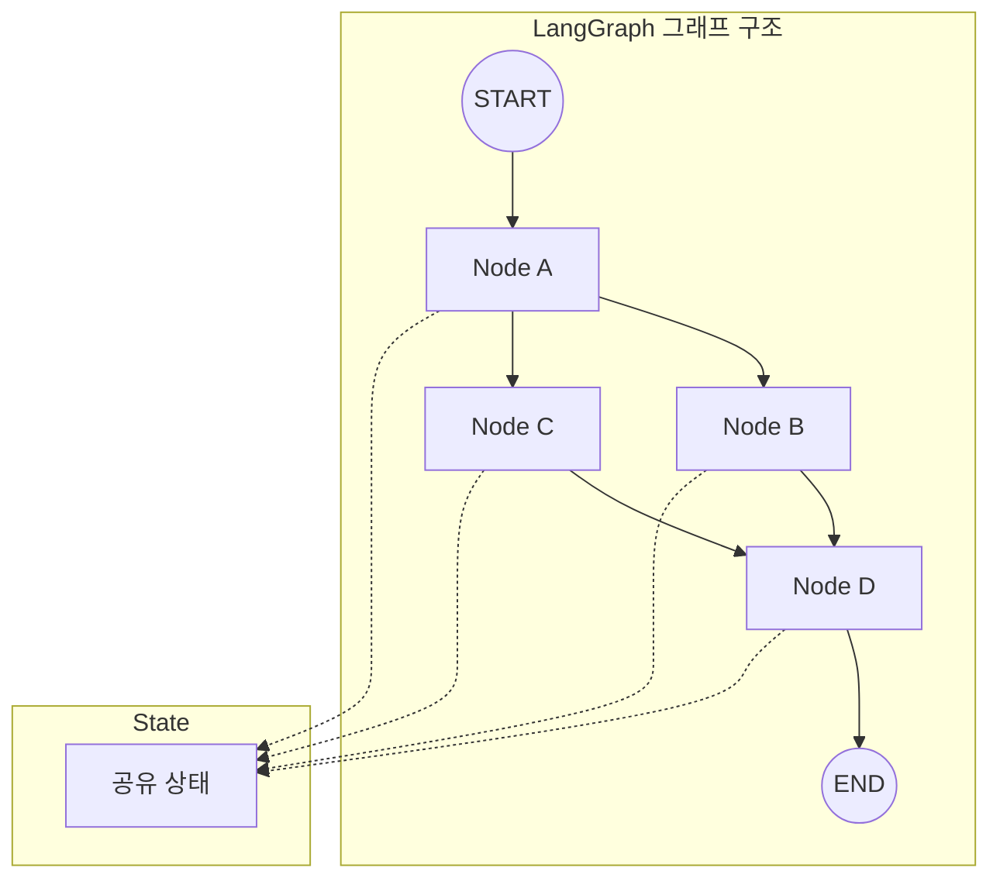
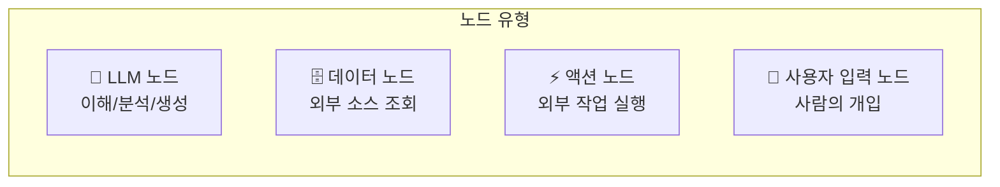
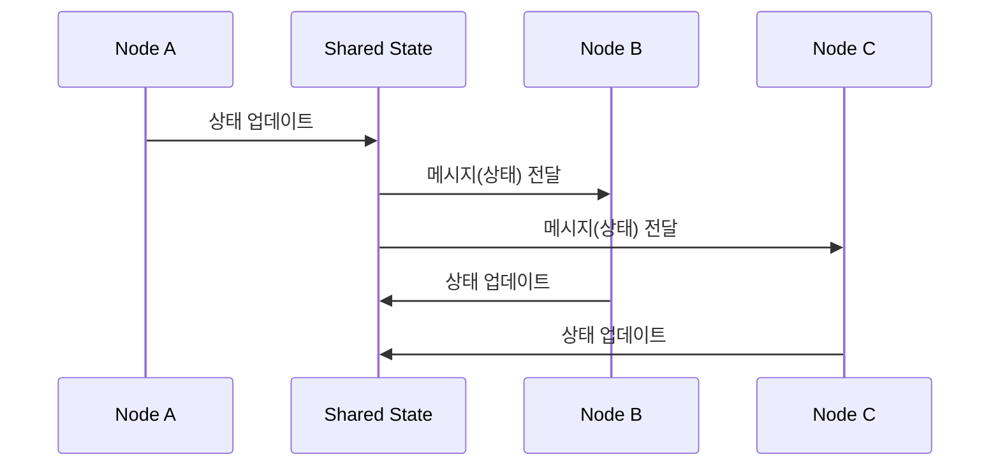
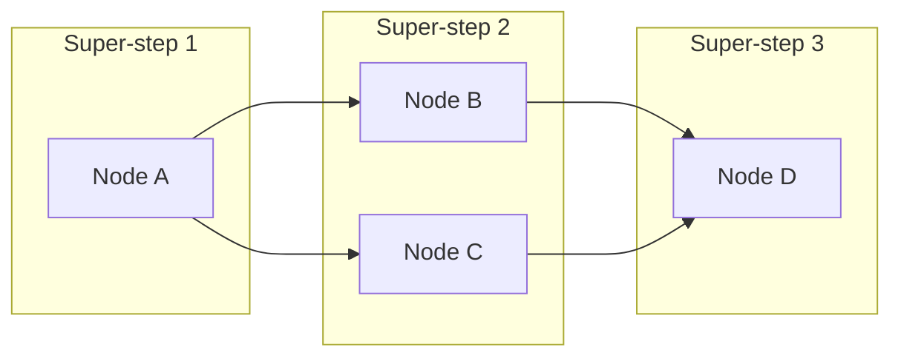
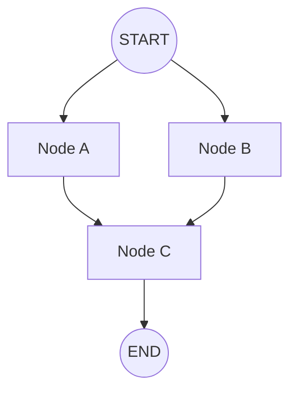

# Chapter 2: 핵심 개념 이해

> 📌 **학습 목표**: 이 장을 마치면 LangGraph의 그래프 구조(State, Node, Edge)를 이해하고, Message Passing과 Super-step 개념을 설명할 수 있습니다.

## 개요

LangGraph는 에이전트 워크플로우를 **그래프**로 모델링합니다. 이 그래프는 세 가지 핵심 구성요소로 이루어집니다:

1. **State(상태)**: 애플리케이션의 현재 스냅샷을 나타내는 공유 데이터 구조
2. **Node(노드)**: 에이전트 로직을 인코딩하는 함수. 현재 상태를 받아 작업을 수행하고 업데이트된 상태를 반환
3. **Edge(엣지)**: 현재 상태에 따라 다음에 실행할 노드를 결정하는 함수

> 💡 **핵심 원칙**: *노드는 작업을 수행하고, 엣지는 다음에 무엇을 할지 결정합니다.*

## 핵심 개념

### 1. 그래프 구조

LangGraph의 그래프는 방향성 있는 구조로, 데이터가 노드를 거치며 흐릅니다.



### 2. State (상태)

State는 그래프의 **공유 메모리**입니다. 모든 노드가 접근할 수 있으며, 에이전트가 작업을 진행하면서 학습하고 결정한 모든 것을 추적합니다.

```python
from typing import TypedDict

class AgentState(TypedDict):
    """에이전트 상태 정의"""
    user_input: str       # 사용자 입력
    classification: str   # 분류 결과
    response: str         # 최종 응답
```

#### State에 포함할 것과 포함하지 않을 것

| ✅ State에 포함 | ❌ State에 포함하지 않음 |
|----------------|------------------------|
| 여러 단계에 걸쳐 유지해야 하는 데이터 | 다른 데이터에서 파생 가능한 값 |
| 재구성할 수 없는 원본 데이터 | 포맷팅된 프롬프트 텍스트 |
| 다운스트림 노드에서 필요한 결과 | 임시 계산 결과 |

### 3. Node (노드)

노드는 단순히 **Python 함수**입니다. LLM 호출, 일반 코드, 외부 API 호출 등 무엇이든 될 수 있습니다.

```python
def my_node(state: AgentState) -> dict:
    """
    노드 함수의 기본 구조

    Args:
        state: 현재 그래프 상태

    Returns:
        상태 업데이트 딕셔너리 (전체 상태가 아닌 업데이트만)
    """
    # 작업 수행
    result = process_something(state["user_input"])

    # 상태 업데이트 반환 (필요한 키만)
    return {"classification": result}
```

#### 노드의 종류



### 4. Edge (엣지)

엣지는 노드 간의 연결을 정의합니다. 두 가지 유형이 있습니다:

#### 일반 엣지 (Normal Edge)
항상 고정된 다음 노드로 이동합니다.

```python
graph.add_edge("node_a", "node_b")  # A -> B (항상)
```

#### 조건부 엣지 (Conditional Edge)
조건에 따라 다른 노드로 이동합니다.

```python
def route_decision(state: AgentState) -> str:
    """라우팅 함수: 다음 노드 결정"""
    if state["classification"] == "urgent":
        return "urgent_handler"
    return "normal_handler"

graph.add_conditional_edges("classifier", route_decision)
```

### 5. Message Passing 아키텍처

LangGraph의 내부 알고리즘은 **메시지 전달(Message Passing)** 방식을 사용합니다. Google의 [Pregel](https://research.google/pubs/pregel-a-system-for-large-scale-graph-processing/) 시스템에서 영감을 받았습니다.



노드가 작업을 완료하면, 하나 이상의 엣지를 통해 다른 노드에 **메시지(상태)**를 전송합니다. 수신 노드는 메시지를 받으면 활성화되어 자신의 함수를 실행합니다.

### 6. Super-step 개념

프로그램은 이산적인 **"슈퍼 스텝(Super-step)"** 단위로 진행됩니다.



- **같은 슈퍼 스텝**: 병렬로 실행되는 노드들 (B와 C)
- **다른 슈퍼 스텝**: 순차적으로 실행되는 노드들

#### 슈퍼 스텝 실행 과정

1. 그래프 시작 시 모든 노드는 **inactive** 상태
2. 노드가 메시지(상태)를 받으면 **active** 상태로 전환
3. 활성 노드가 함수를 실행하고 업데이트 반환
4. 슈퍼 스텝 끝에서 메시지가 없는 노드는 **halt** 투표
5. 모든 노드가 inactive이고 전송 중인 메시지가 없으면 종료

## 실습: 핵심 개념 확인

### 단계 1: State 정의

```python
# 📁 src/part1_foundation/02_state_basics.py
from typing import TypedDict, Annotated
from operator import add

class SimpleState(TypedDict):
    """기본 상태 - 덮어쓰기 방식"""
    value: str
    count: int

class AccumulatingState(TypedDict):
    """누적 상태 - Reducer 사용"""
    value: str
    history: Annotated[list[str], add]  # 리스트 누적
```

> 💡 **전체 코드**: [src/part1_foundation/02_state_basics.py](../../src/part1_foundation/02_state_basics.py)

### 단계 2: Node 함수 작성

```python
def node_a(state: SimpleState) -> dict:
    """Node A: 값을 처리하고 카운트 증가"""
    print(f"Node A 실행: {state}")
    return {
        "value": state["value"].upper(),
        "count": state["count"] + 1
    }

def node_b(state: SimpleState) -> dict:
    """Node B: 느낌표 추가"""
    print(f"Node B 실행: {state}")
    return {
        "value": state["value"] + "!",
        "count": state["count"] + 1
    }
```

### 단계 3: Graph 구성

```python
from langgraph.graph import StateGraph, START, END

# 그래프 생성
graph = StateGraph(SimpleState)

# 노드 추가
graph.add_node("node_a", node_a)
graph.add_node("node_b", node_b)

# 엣지 추가
graph.add_edge(START, "node_a")
graph.add_edge("node_a", "node_b")
graph.add_edge("node_b", END)

# 컴파일
app = graph.compile()
```

### 단계 4: 실행 및 결과 확인

```python
# 실행
result = app.invoke({"value": "hello", "count": 0})
print(f"최종 결과: {result}")
# 출력:
# Node A 실행: {'value': 'hello', 'count': 0}
# Node B 실행: {'value': 'HELLO', 'count': 1}
# 최종 결과: {'value': 'HELLO!', 'count': 2}
```

## 심화 학습

### StateGraph 클래스

`StateGraph`는 LangGraph의 핵심 클래스입니다:

```python
from langgraph.graph import StateGraph

# 기본 사용
graph = StateGraph(MyState)

# Input/Output 스키마 분리
graph = StateGraph(
    OverallState,
    input_schema=InputState,
    output_schema=OutputState
)
```

### 병렬 실행

여러 엣지가 같은 노드에서 출발하면 병렬로 실행됩니다:

```python
graph.add_edge(START, "node_a")
graph.add_edge(START, "node_b")  # node_a와 node_b가 병렬 실행
graph.add_edge("node_a", "node_c")
graph.add_edge("node_b", "node_c")  # 둘 다 완료 후 node_c 실행
```



### 특수 노드: START와 END

- **START**: 사용자 입력을 그래프에 전달하는 가상 노드
- **END**: 그래프 실행을 종료하는 가상 노드

```python
from langgraph.graph import START, END

graph.add_edge(START, "first_node")  # 시작점 정의
graph.add_edge("last_node", END)     # 종료점 정의
```

## 요약

- **State**: 모든 노드가 공유하는 메모리, 원시 데이터를 저장
- **Node**: Python 함수, 상태를 받아 업데이트 반환
- **Edge**: 노드 간 연결, 일반/조건부 엣지 지원
- **Message Passing**: 노드가 메시지(상태)를 전달하며 실행
- **Super-step**: 병렬 노드는 같은 슈퍼 스텝, 순차 노드는 다른 슈퍼 스텝
- **StateGraph**: 그래프 정의를 위한 핵심 클래스

## 다음 단계

다음 장에서는 실제로 그래프를 만들어봅니다. 다양한 타입의 엣지와 조건부 라우팅을 학습합니다.

👉 [Chapter 3: 첫 번째 그래프 만들기](./03-first-graph.md)

---

## 📚 참고 자료

### 공식 문서
- [Thinking in LangGraph (공식 온라인)](https://docs.langchain.com/oss/python/langgraph/thinking-in-langgraph) - 사고 방식 가이드
- [Graph API (공식 온라인)](https://docs.langchain.com/oss/python/langgraph/graph-api) - Graph API 개요
- [Thinking in LangGraph (로컬 문서)](../../official_docs/06-thinking-in-langgraph.md) - 로컬 참조용
- [Graph API (로컬 문서)](../../official_docs/22-graph-api.md) - 로컬 참조용

### 실습 코드
- [전체 소스](../../src/part1_foundation/02_state_basics.py) - 실행 가능한 전체 코드
- [유틸리티 함수](../../src/utils/) - 공통 헬퍼 함수

### 관련 챕터
- [이전: Chapter 1 - LangGraph 소개](./01-introduction.md)
- [다음: Chapter 3 - 첫 번째 그래프 만들기](./03-first-graph.md)
