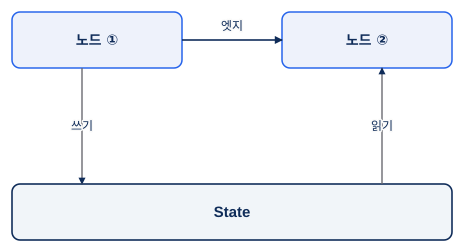
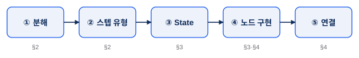
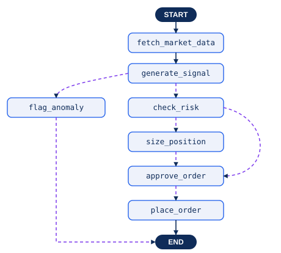
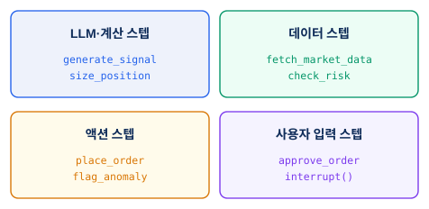
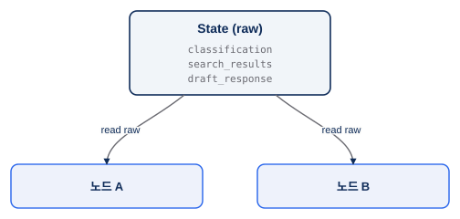
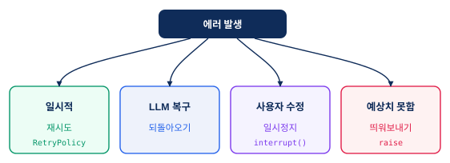
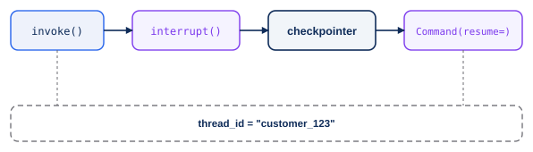
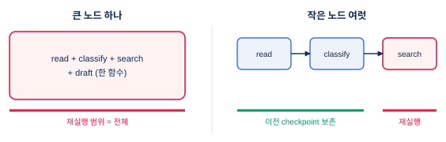
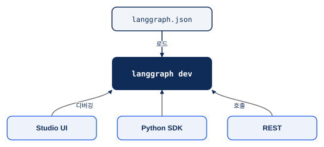

<!-- slide: variant=cover -->
# LangGraph 로 사고하기

> 노드·엣지·State 로 에이전트를 짜는 법 — Thinking · Local Server · Changelog

<!-- slide: tag="Intro" -->
# 깔개였던 엔진을 연다

> DeepAgent 4주 내내 "LangGraph 위에 얹혀 있다"던 그 LangGraph 를 오늘 직접 본다

| 핵심 주제 | 출처 |
|---|---|
| ① 왜 그래프인가 — 노드·엣지·State | Thinking |
| ② 에이전트 설계 5단계 | Thinking |
| ③ State 설계 & 에러 | Thinking |
| ④ 사람 개입 & 내구성 | Thinking |
| ⑤ 로컬 실행 & 근황 | Local Server · Changelog |

> 한 문장 — LangGraph 는 에이전트를 **노드·엣지·State 의 그래프** 로 모델링하는 런타임이다.

<!-- slide: variant=section, num=01 -->
# 섹션 01. 왜 그래프인가

> 노드는 작업, 엣지는 다음 결정, State 는 공유 메모리

<!-- slide: tag="§1 · Why" -->
# 한 번의 LLM 호출로는 부족한 순간

> 다단계·분기·외부 호출·사람 개입이 얽히면, 함수 하나로는 무너진다

| 함수 하나에 몰면 | 그래프로 쪼개면 |
|---|---|
| 중간 상태를 볼 수 없다 | 노드 사이에서 State 를 들여다본다 |
| 실패 시 처음부터 다시 | checkpointer 로 멈춘 노드부터 재개 |
| "사람 승인 대기" 표현 불가 | `interrupt()` 로 일시정지 |

> 쪼개는 비용을 치르고 **스트리밍 · 재개 · 단계별 디버깅** 을 얻는다.

<!-- slide: tag="§1 · Why" -->
# 세 부품 — 노드·엣지·State

> 로직(노드)과 제어 흐름(엣지)을 분리하고, State 로 잇는다

> "노드는 작업을 수행하고, 엣지는 다음에 무엇을 할지 알려준다."

<!-- slide: variant=section, num=02 -->
# 섹션 02. 에이전트 설계 5단계

> 분해 → 스텝 유형 → State → 노드 → 연결

<!-- slide: tag="§2 · Design" -->
# 설계는 다섯 단계로 좁힌다

> 하나의 업무 — 평균회귀 트레이딩 에이전트 — 를 다섯 단계로 옮긴다

> ①② 분해와 유형, ③ State, ④ 노드 구현, ⑤ 연결 — 이후 섹션이 이 순서를 따른다.

<!-- slide: tag="§2 · Design" -->
# Step 1 — 업무를 노드로 분해

> 실선 = 늘 같은 다음 노드, 보라 점선 = 노드 내부 `Command(goto=...)` 분기

> 라우팅을 노드 안에 두니 엣지는 최소 — 흐름이 명시적이고 추적 가능하다. (`approve_order` 가 두 번 보이는 건 같은 노드의 레이아웃 단순화 · 교육용 dry-run)

<!-- slide: tag="§2 · Design" -->
# Step 2 — 스텝 유형 식별

> 같은 "노드" 라도 유형마다 재시도·캐싱·에러 정책이 다르다

> 유형을 먼저 나눠 두면, 노드별 정책을 따로 줄 근거가 생긴다.

<!-- slide: variant=section, num=03 -->
# 섹션 03. State 설계 & 에러

> raw 로 저장하고, 에러는 흐름의 일부로 다룬다

<!-- slide: tag="§3 · State" -->
# Step 3 — State 는 raw 로

> 포맷된 문자열이 아니라 원시 데이터를 저장, 프롬프트는 노드에서 온디맨드

> 같은 raw 를 노드마다 다르게 포맷 — 프롬프트만 바꿔도 State 스키마는 그대로.

<!-- slide: tag="§3 · Errors" -->
# 에러도 흐름의 일부

> 모든 에러를 try/except 로 삼키지 않는다 — "누가 고치나" 로 전략이 갈린다

> 일시적 = 재시도, LLM 복구 = 되돌아오기, 사용자 = 일시정지, 예상 밖 = 띄워보내기.

<!-- slide: variant=section, num=04 -->
# 섹션 04. 사람 개입 & 내구성

> `interrupt()` 로 멈추고, checkpointer 로 재개한다

<!-- slide: tag="§4 · HITL" -->
# 사람 입력은 1급 시민

> `interrupt()` 가 State 를 저장하고 멈춘다 — checkpoint 가 남아 있으면 같은 `thread_id` + `Command(resume=...)` 로 재개

- `interrupt()` 는 **비멱등 side effect 보다 앞에** — 재개 시 그 앞의 순수 코드는 재실행된다
- `thread_id` 는 식별 키, 보존은 checkpointer (`MemorySaver` 는 인메모리 데모)

<!-- slide: tag="§4 · Durable" -->
# 노드를 작게 쪼갤수록

> 내구성 있는 실행 — 노드/슈퍼스텝 경계에서 체크포인트

> 작은 노드 = 실패 시 재실행 범위가 작다. 기본 **async durability** 는 checkpoint write 를 매번 기다리지 않는다 — 단, 의미 있는 경계로 쪼갠다.

<!-- slide: variant=section, num=05 -->
# 섹션 05. 로컬 실행 & 근황

> `langgraph dev` 로 띄우고 Studio 로 디버깅

<!-- slide: tag="§5 · Local" -->
# langgraph dev — 한 줄로 띄운다

> `langgraph.json` 에 등록된 그래프를 인메모리 서버(:2024)로

- `langgraph dev` → 포트 2024 인메모리(개발용), 운영은 **LangSmith Deployment**
- Studio 로 시각화·단계 디버깅, Python SDK / REST 로 호출

<!-- slide: tag="§5 · Changelog" -->
# 생태계는 빠르게 움직인다

> 공식 changelog (docs.langchain.com) · 2026-05 기준 — v1 정식 이후에도 분기마다 변화

| 시점 | 핵심 |
|---|---|
| 2025-10 | `langchain` · `langgraph` **v1.0 정식** |
| 2025-11 | model profiles · 요약/재시도/검열 **미들웨어** |
| 2025-12 | `create_agent` extras (`langchain` v1.2) · Google GenAI SDK 통합 |
| 2026-03 | `langgraph` v1.1 — 타입 세이프 스트리밍·invoke (`v2`) |
| 2026-05 | `langgraph` v1.2 — **노드별 에러 핸들러**·per-node 타임아웃 |

> v1.2 의 노드별 에러 핸들러 = §3·§4 "에러를 흐름의 일부로" 가 프레임워크 1급 기능으로 (해석).

<!-- slide: tag="§6 · 다음으로" -->
# 오늘은 지도, 다음은 깊이

> 노드·엣지·State 로 "사고"하는 법을 봤다 — 다음은 그 사고를 떠받치는 메커니즘이다.

- **Graph API** — 조건부 엣지 · 리듀서(`add_messages`) · 병렬 분기
- **Persistence · Memory** — Postgres/Redis checkpointer · 스레드 간 Store · 시맨틱 검색
- **Streaming** — `values`/`updates`/`messages` 스트림 모드로 실시간 진행 노출
- **Subgraphs** — 복잡한 다단계 작업을 하위 그래프로 캡슐화
- **Time Travel** — 과거 체크포인트로 돌아가 분기(fork) 실행

<!-- slide: variant=closing -->
# 한 문장으로

> LangGraph = 노드·엣지·State 의 그래프 런타임 — 분해하고, raw State 로 잇고, 에러·사람 개입을 흐름에 담고, `langgraph dev` 로 띄운다.

  
Q1 · 연결
DeepAgent 의 4대 능력은 이 노드·엣지·State 위에서 어떻게 도는가?

  
Q2 · 설계
내 에이전트에서 <code>interrupt()</code> 는 어디에 둘까 — 주문 전송 같은 비멱등 호출 앞에?

  
Q3 · 트레이드오프
노드를 얼마나 잘게 쪼갤까 — 회복력 vs 관찰가능성?

  

    <strong>발표자</strong>
    태영 · 노드·엣지·State 편
  

  

    <strong>다룬 주제</strong>
    왜 그래프 · 5단계 · State/에러 사람 개입 · 로컬 실행
  

  

    <strong>출처</strong>
    LangChain 공식 문서 Thinking · Local server · Changelog
  

